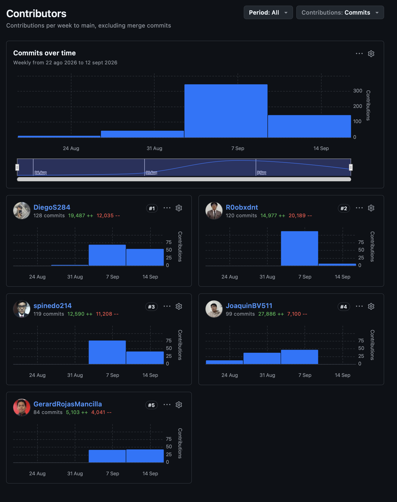
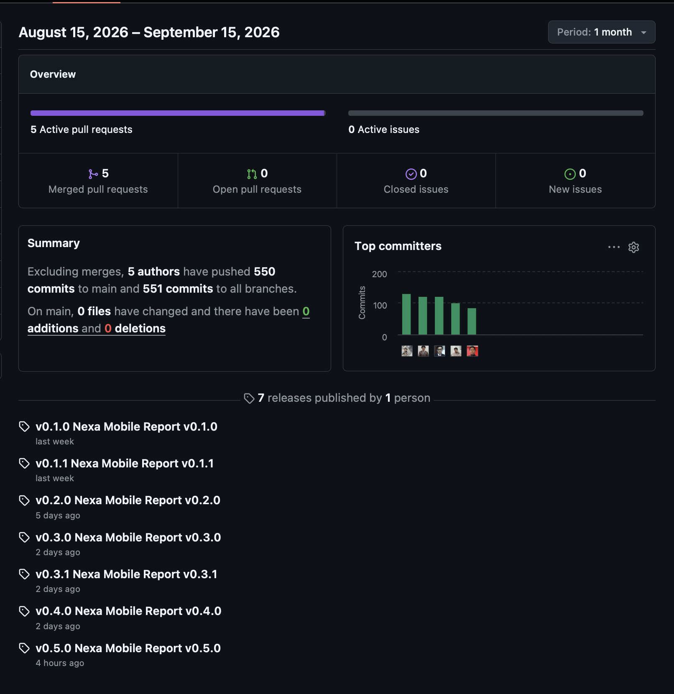
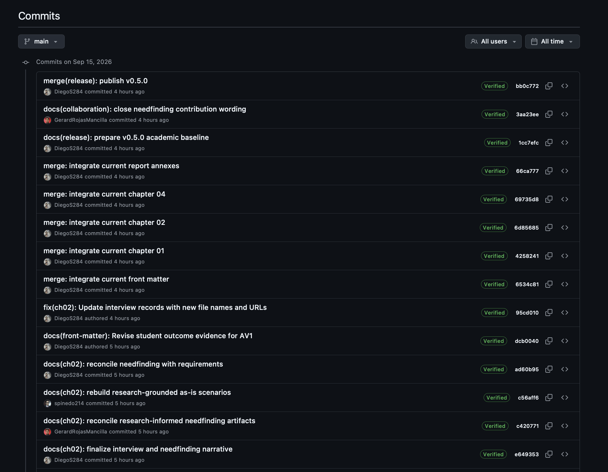
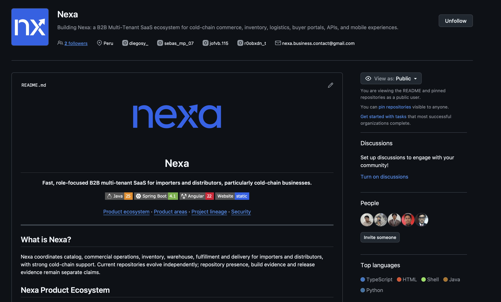
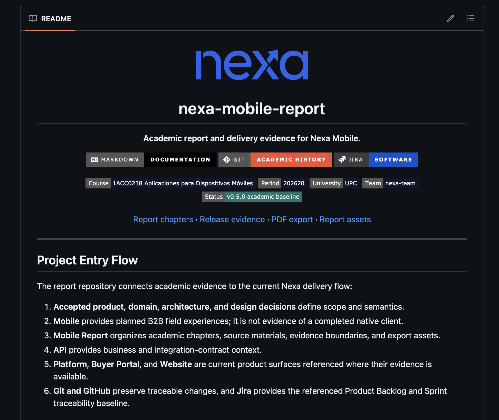

# Project Report Collaboration Insights

Esta sección documenta la colaboración verificable del **Project Report de
Nexa**. El repositorio público conserva la trazabilidad de los cambios mediante
historial Git, perfiles de autoría y estados de firma visibles cuando GitHub los
publica. Esta evidencia describe el trabajo documental del equipo; no sustituye
evidencia de implementación, validación de producto o despliegue.

## Repositorio y fuentes públicas

*Fuentes públicas consultables del Project Report.*

| Recurso | Enlace |
| --- | --- |
| Project Report | [nexa-suite/mobile-report](https://github.com/nexa-suite/mobile-report) |
| Contributors | [GitHub Contributors](https://github.com/nexa-suite/mobile-report/graphs/contributors?all=1) |
| Pulse | [GitHub Pulse](https://github.com/nexa-suite/mobile-report/pulse) |
| Commits | [Historial de commits](https://github.com/nexa-suite/mobile-report/commits/main/) |
| Releases | [Releases del Project Report](https://github.com/nexa-suite/mobile-report/releases) |

## Forma de colaboración

El equipo trabajó con documentación versionada, ramas de trabajo e integración
del informe. El enfoque **Docs-as-Code** permitió revisar los cambios mediante
diffs, conservar enlaces relativos y aplicar validaciones del repositorio antes
de integrar modificaciones. Los mensajes Conventional Commits hacen legible la
intención de cada cambio, mientras que el historial público conserva la
atribución individual y el registro de integración.

*Prácticas de colaboración verificables en el Project Report.*

| Práctica | Aplicación en el Project Report |
| --- | --- |
| Repositorio público | Historial, ramas, releases y cambios enlazables por commit. |
| Docs-as-Code | Fuentes Markdown modulares, revisión por diff y enlaces relativos. |
| Responsabilidad por área | Cambios académicos preparados en ramas de trabajo e integrados con trazabilidad. |
| Integridad de autoría | La contribución se atribuye al perfil Git del integrante y a los estados de firma visibles en el historial. |
| Revisión de evidencia | Los cambios se contrastan con fuentes del informe y con los límites de evidencia declarados. |

## Analítica pública y trazabilidad de cambios

*Analíticos de contribución del Project Report durante AV1*

*Nota.* La vista reúne contribuciones Git acumuladas de los cinco integrantes.
Sus conteos describen actividad registrada; no son una medida directa del valor
académico de cada aporte.

*Actividad del Project Report durante el periodo de AV1*

*Nota.* Pulse presenta la actividad pública del repositorio, incluidos autores,
commits y releases del periodo mostrado; se interpreta junto con los commits
específicos y no como evidencia de resultados de producto.

*Historial de commits verificados durante el cierre de AV1*

*Nota.* El historial aporta trazabilidad pública de cambios e integración, con
los estados de verificación visibles en GitHub. No acredita por sí solo
implementación ni aceptación de producto.

## Aportes verificables por integrante

*Cambios representativos del Project Report por integrante.*

| Integrante | Perfil GitHub | Aportes documentales representativos | Commits enlazados |
| --- | --- | --- | --- |
| Pinedo Sanchez, Sebastián Martín | [spinedo214](https://github.com/spinedo214) | Escenarios As-Is orientados por investigación, caracterización de segmentos y estructura de evidencia de Sprint 1. | [As-Is](https://github.com/nexa-suite/mobile-report/commit/c56aff62207f09ebde22a768ec36f1e84bd41c49), [segmentos](https://github.com/nexa-suite/mobile-report/commit/35937038bb943cded3e2f611bd3601e0a41bedc7), [Sprint 1](https://github.com/nexa-suite/mobile-report/commit/8624628ba99ef3e74cd86bd4a60c8ca251697534) |
| Rojas Mancilla, Gerard Gianpier | [GerardRojasMancilla](https://github.com/GerardRojasMancilla) | Reconciliación de artefactos de Needfinding, evidencia C4 en Structurizr y trazabilidad Jira del Product Backlog. | [Needfinding](https://github.com/nexa-suite/mobile-report/commit/c42077198b99e02830b41bab31089a259760c856), [C4](https://github.com/nexa-suite/mobile-report/commit/cfbd7756df987b4e4fe3f132e4830cc0ff53fb39), [Jira](https://github.com/nexa-suite/mobile-report/commit/2e6e43595e10c7e3bb4f01a64d721082c27e05df) |
| Torrejón De Los Santos, Gino Rodrigo | [R0obxdnt](https://github.com/R0obxdnt) | Cierre documental de registros y análisis de entrevistas, planificación del Product Backlog y verificación técnica de Sprint 1. | [entrevistas](https://github.com/nexa-suite/mobile-report/commit/d7d1ab59b44ed52cb0bb31b34a366e9b3cf8bca0), [backlog](https://github.com/nexa-suite/mobile-report/commit/0fd5960aff9823d76f57ca68b785a976c6017f8f), [Sprint 1](https://github.com/nexa-suite/mobile-report/commit/79a87d331e058f8c5af374bd0ca857c566d1c1e0) |
| Verde Bueno, Joaquín Francisco | [JoaquinBV511](https://github.com/JoaquinBV511) | Matriz de liderazgo de Sprint, claridad de evidencia visual y saneamiento de lenguaje público del informe. | [liderazgo](https://github.com/nexa-suite/mobile-report/commit/22cfc4411d645c62868d2a5bfccec39151bac271), [evidencia visual](https://github.com/nexa-suite/mobile-report/commit/db718c6c26889fd66e17e40dde918ea8f905ad29), [lenguaje público](https://github.com/nexa-suite/mobile-report/commit/ed791d93de223aa04aaec93e3d1291a35adac26d) |
| Yucra Sandoval, Diego Sebastián | [DiegoS284](https://github.com/DiegoS284) | Evidencia de Student Outcome, integración de la identidad de release y reconciliación de modelos de dominio y datos. | [Student Outcome](https://github.com/nexa-suite/mobile-report/commit/dcb0040e067cab263304c4f072ad5612388a13ac), [release](https://github.com/nexa-suite/mobile-report/commit/1cc7efcc9d8f01cad78cab6674d5293d9e8f275e), [DDD y datos](https://github.com/nexa-suite/mobile-report/commit/e9fde9a52ec460859cf90ff6672a1d6bb81203c2) |

La tabla selecciona cambios sustantivos de distintas áreas del informe. No
establece un ranking: la contribución se interpreta por responsabilidad,
contenido y evidencia específica de cada commit.

## Presencia pública y consistencia del repositorio

La colaboración también produjo una superficie pública coherente para el
ecosistema Nexa y para este Project Report. Las siguientes capturas son evidencia
complementaria de presentación y navegabilidad pública; no se presentan como
analítica de colaboración.

*Presencia pública del ecosistema Nexa en GitHub*

*Nota.* La organización reúne repositorios y perfiles del equipo en una
presentación pública consistente.

*Presentación pública del Nexa Mobile Report*

*Nota.* El README muestra una entrada pública navegable al informe, sus fuentes
y su trazabilidad de entrega.

En conjunto, el repositorio, la actividad pública, los commits enlazados y la
presentación del informe permiten revisar la participación de los cinco
integrantes de forma trazable y coherente con el Registro de Versiones.
