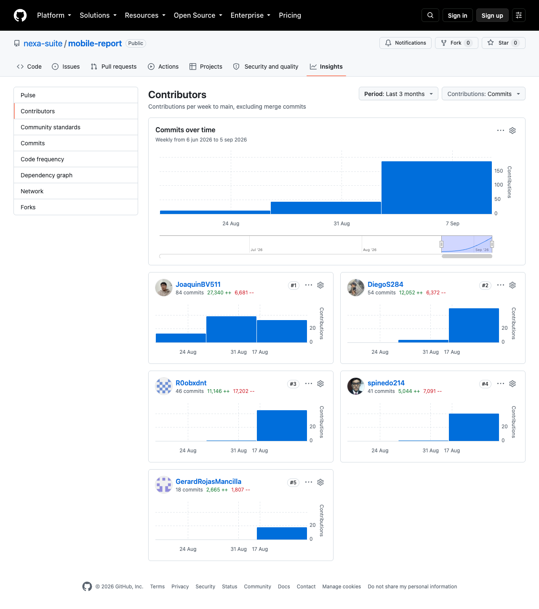
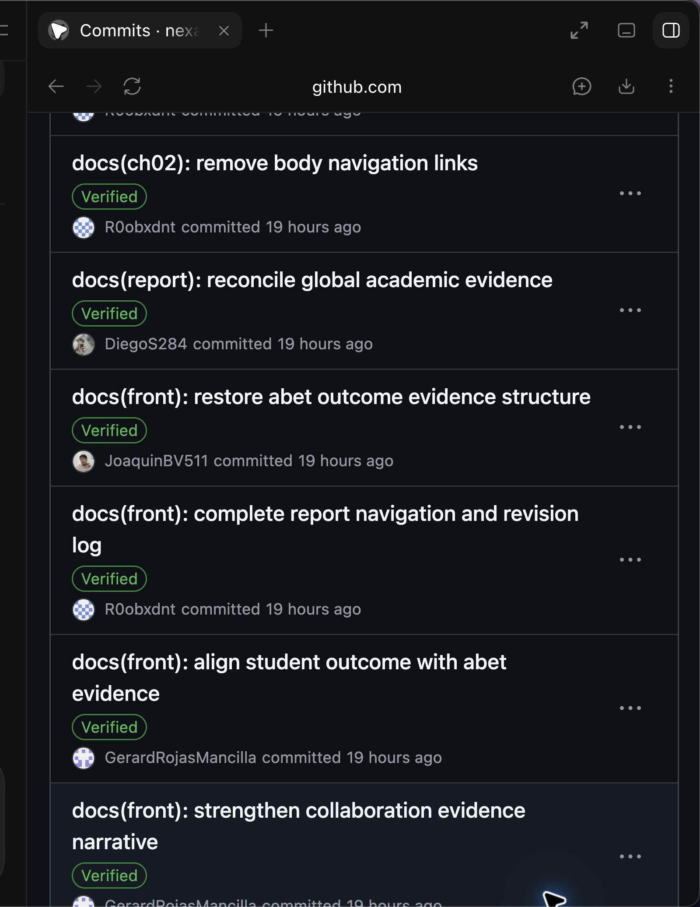

# Project Report Collaboration Insights

Esta sección presenta la colaboración verificable para la entrega AV1 del
**Project Report de Nexa**, mantenido en el repositorio público
[`nexa-suite/mobile-report`](https://github.com/nexa-suite/mobile-report). La
autoría de los cambios se interpreta a partir del historial Git y de sus firmas
cuando estén disponibles; la documentación no se presenta como evidencia de
implementación, validación de producto o despliegue.

## Repositorio y práctica de colaboración

*Prácticas de colaboración verificables para el Project Report.*

| Práctica | Aplicación verificable en el Project Report |
| --- | --- |
| Repositorio público | [`nexa-suite/mobile-report`](https://github.com/nexa-suite/mobile-report), con historial revisable por commit y rama. |
| Docs-as-Code | Informe Markdown modular, revisable mediante diff, enlaces relativos y validadores del repositorio. |
| Flujo de ramas | El repositorio usa `main`, `develop`, ramas de front matter, capítulos y una rama de integración para organizar cambios documentales. |
| Convenciones | Mensajes Conventional Commits para expresar intención documental y de mantenimiento. |
| Integridad de autoría | Los cambios materiales se atribuyen al perfil Git del integrante; las firmas se verifican desde el historial, no por texto del informe. |
| Revisión e integración | Los cambios por capítulo se aíslan antes de integrarse y se contrastan con el alcance documentado del proyecto. |

*Nota.* La práctica de repositorio demuestra trazabilidad de cambios de informe;
no sustituye evidencia de comportamiento, validación o despliegue de producto.

> *Nota.* Captura histórica de [GitHub Insights — Contributors](https://github.com/nexa-suite/mobile-report/graphs/contributors), consultada el 9 de septiembre de 2026. La vista pública representa contribuciones a `main` y no cuantifica las revisiones por rama; los commits enlazados a continuación son la evidencia específica de cambios documentales.

> *Nota.* Captura de [GitHub — historial de commits de `main`](https://github.com/nexa-suite/mobile-report/commits/main/), tomada el 11 de septiembre de 2026. La vista muestra commits públicos con firmas visibles de R0obxdnt, DiegoS284, JoaquinBV511 y GerardRojasMancilla. Es evidencia externa de colaboración documental publicada; no acredita implementación ni aceptación de producto.

## Aportes documentados

*Aportes documentales representativos por integrante para la entrega académica.*

| Integrante | Perfil GitHub | Aportes personales representativos | Evidencia |
| --- | --- | --- | --- |
| Pinedo Sanchez, Sebastián Martín | [spinedo214](https://github.com/spinedo214) | Recompuso el Lean UX Canvas, preparó los artefactos preliminares de Needfinding y alineó los incrementos académicos de Sprint. | [Lean UX Canvas](https://github.com/nexa-suite/mobile-report/commit/6ec00a42b7b18ec24bdedb716207af7852fc9491), [Needfinding source](https://github.com/nexa-suite/mobile-report/commit/b777bf7c87ce1c847ad66fbd23c491f68da546e), [Sprint planning evidence](https://github.com/nexa-suite/mobile-report/commit/1a9c889f58ed6857495b118984dec48aa004f631) |
| Rojas Mancilla, Gerard Gianpier | [GerardRojasMancilla](https://github.com/GerardRojasMancilla) | Migró evidencia C4 a Structurizr y preparó tareas y liderazgo trazables para Sprint 1. | [C4/DDD refinement](https://github.com/nexa-suite/mobile-report/commit/cfbd7756df987b4e4fe3f132e4830cc0ff53fb39), [Sprint 1 leadership](https://github.com/nexa-suite/mobile-report/commit/427ebe541327fa971a7f43e23a7bc2a62c5b0c12), [Sprint 4 planning](https://github.com/nexa-suite/mobile-report/commit/56a1420c4b5936e10a66dfa5d3dd058c45145271) |
| Torrejón De Los Santos, Gino Rodrigo | [R0obxdnt](https://github.com/R0obxdnt) | Redujo la proyección académica, normalizó la presentación de UI/UX y alineó el alcance Buyer/hardening de Sprint 4. | [Sprint planning evidence](https://github.com/nexa-suite/mobile-report/commit/d5d5daf79e460adda6c4927230205d77ded4012a), [UI/UX evidence boundaries](https://github.com/nexa-suite/mobile-report/commit/68cdb880e67414fea1c29ddf52c495b3b10e4a1b), [Buyer/hardening scope](https://github.com/nexa-suite/mobile-report/commit/b29744804819d1403c578d16d580e47209515ff7) |
| Verde Bueno, Joaquín Francisco | [JoaquinBV511](https://github.com/JoaquinBV511) | Precisó los límites de evidencia de diseño futuro y la postura de Figma/prototipado sin generar artefactos ficticios. | [UI/UX evidence boundaries](https://github.com/nexa-suite/mobile-report/commit/d2d8cb2909c62ce0193ef2fc948a2deaf33f9584) |
| Yucra Sandoval, Diego Sebastián | [DiegoS284](https://github.com/DiegoS284) | Anotó los límites de evidencia C4 y reconcilió Sprint y evidencia futura del Capítulo IV. | [Documentación del Capítulo IV](https://github.com/nexa-suite/mobile-report/commit/6b19b261c9668585a55b6688a249cfd66abdc744), [Sprint and evidence semantics](https://github.com/nexa-suite/mobile-report/commit/e818e76abe76ab55d0404256cdccfa1f42afedfb) |

*Nota.* Los commits muestran contribuciones documentales reales en ramas
propietarias. No se usan para inferir implementación, entrevistas, UXPressia,
Jira, despliegue ni aceptación de producto.

La distribución se interpreta por responsabilidad y contenido de los cambios,
no por un conteo mecánico de commits. La entrega académica conserva sólo
actividades realmente registradas; no anticipa actividades posteriores.
