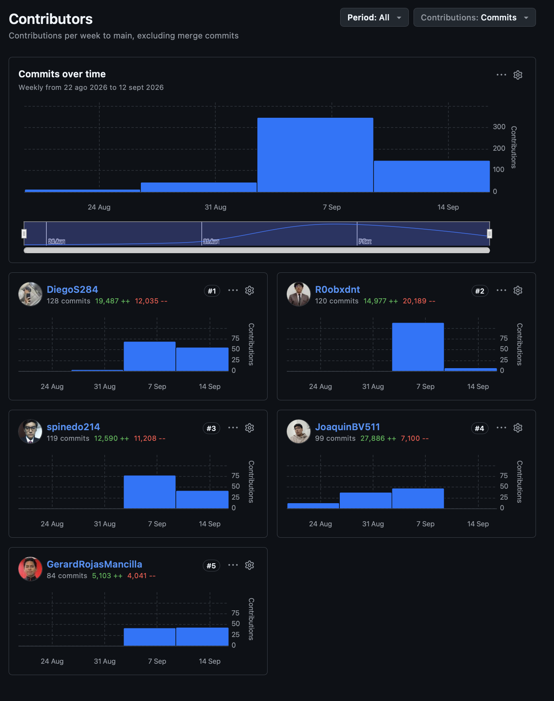
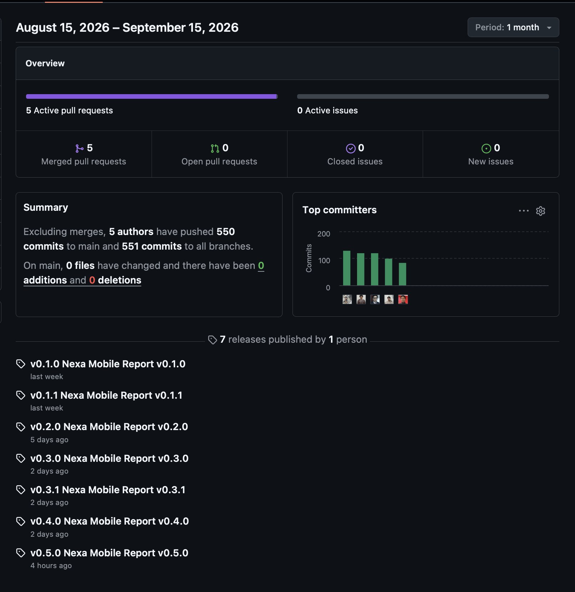
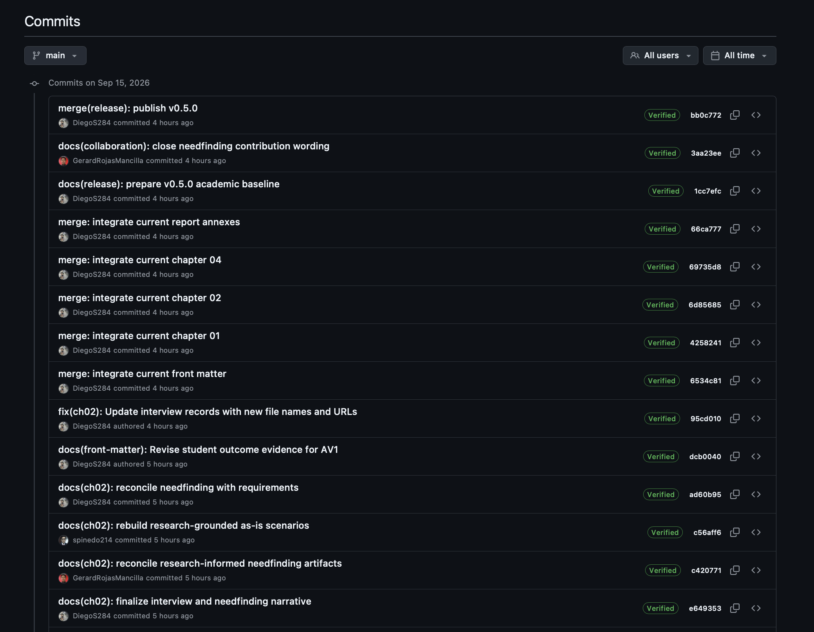

# Project Report Collaboration Insights

Los cinco integrantes participaron en la elaboración del informe mediante investigación, análisis, modelado, planificación y revisión. El trabajo se organizó por áreas y se contrastó con las fuentes disponibles antes de integrar los cambios.

La actividad de GitHub permite relacionar cambios documentales con sus autores. Los conteos de actividad se interpretan junto con el contenido de cada aporte y no como una medida directa de calidad o aprendizaje.

*Aportes documentales representativos por integrante.*

| Integrante | Perfil GitHub | Aportes documentales representativos | Commits enlazados |
| --- | --- | --- | --- |
| Pinedo Sanchez, Sebastián Martín | [spinedo214](https://github.com/spinedo214) | Escenarios As-Is orientados por investigación, caracterización de segmentos y estructura de evidencia de Sprint 1. | [As-Is](https://github.com/nexa-suite/mobile-report/commit/c56aff62207f09ebde22a768ec36f1e84bd41c49), [segmentos](https://github.com/nexa-suite/mobile-report/commit/35937038bb943cded3e2f611bd3601e0a41bedc7), [Sprint 1](https://github.com/nexa-suite/mobile-report/commit/8624628ba99ef3e74cd86bd4a60c8ca251697534) |
| Rojas Mancilla, Gerard Gianpier | [GerardRojasMancilla](https://github.com/GerardRojasMancilla) | Reconciliación de artefactos de Needfinding, evidencia C4 en Structurizr y trazabilidad Jira del Product Backlog. | [Needfinding](https://github.com/nexa-suite/mobile-report/commit/c42077198b99e02830b41bab31089a259760c856), [C4](https://github.com/nexa-suite/mobile-report/commit/cfbd7756df987b4e4fe3f132e4830cc0ff53fb39), [Jira](https://github.com/nexa-suite/mobile-report/commit/2e6e43595e10c7e3bb4f01a64d721082c27e05df) |
| Torrejón De Los Santos, Gino Rodrigo | [R0obxdnt](https://github.com/R0obxdnt) | Cierre documental de registros y análisis de entrevistas, planificación del Product Backlog y verificación técnica de Sprint 1. | [entrevistas](https://github.com/nexa-suite/mobile-report/commit/d7d1ab59b44ed52cb0bb31b34a366e9b3cf8bca0), [backlog](https://github.com/nexa-suite/mobile-report/commit/0fd5960aff9823d76f57ca68b785a976c6017f8f), [Sprint 1](https://github.com/nexa-suite/mobile-report/commit/79a87d331e058f8c5af374bd0ca857c566d1c1e0) |
| Verde Bueno, Joaquín Francisco | [JoaquinBV511](https://github.com/JoaquinBV511) | Matriz de liderazgo de Sprint, claridad de evidencia visual y saneamiento de lenguaje público del informe. | [liderazgo](https://github.com/nexa-suite/mobile-report/commit/22cfc4411d645c62868d2a5bfccec39151bac271), [evidencia visual](https://github.com/nexa-suite/mobile-report/commit/db718c6c26889fd66e17e40dde918ea8f905ad29), [lenguaje público](https://github.com/nexa-suite/mobile-report/commit/ed791d93de223aa04aaec93e3d1291a35adac26d) |
| Yucra Sandoval, Diego Sebastián | [DiegoS284](https://github.com/DiegoS284) | Evidencia de Student Outcome, integración de la identidad de release y reconciliación de modelos de dominio y datos. | [Student Outcome](https://github.com/nexa-suite/mobile-report/commit/dcb0040e067cab263304c4f072ad5612388a13ac), [release](https://github.com/nexa-suite/mobile-report/commit/1cc7efcc9d8f01cad78cab6674d5293d9e8f275e), [DDD y datos](https://github.com/nexa-suite/mobile-report/commit/e9fde9a52ec460859cf90ff6672a1d6bb81203c2) |

*Actividad registrada durante la primera entrega.*

Las figuras muestran contribuciones acumuladas, actividad del periodo e historial de cambios. Sustentan la participación documental; los resultados de implementación y validación se presentan en las secciones del Sprint correspondiente.
