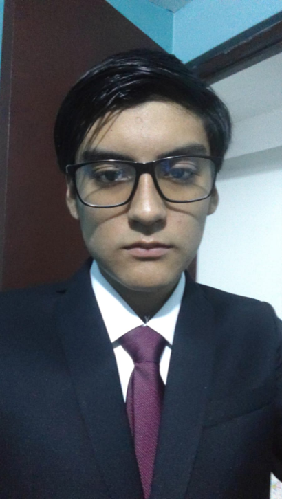

# 1.1.2 Team Member Profiles

Para la correcta ejecución de este proyecto, se requiere un equipo de trabajo con perfiles complementarios que posean habilidades en análisis de sistemas, modelado de datos, programación, documentación técnica, diseño de experiencia de usuario y gestión del trabajo colaborativo. En esta sección, cada integrante aporta fortalezas diferenciadas que permiten cubrir la investigación, la estructuración del informe, el diseño de la solución, la implementación técnica y la coordinación general del proyecto.

**Tabla 2**

*Perfiles de los integrantes del equipo de Nexa-team*

| Código y fotografía | Nombre completo | Rol | Descripción |
| :--- | :--- | :--- | :--- |
|  U202414345 | Pinedo Sanchez, Sebastián Martín | Team Member | Sebastián es estudiante de Ingeniería de Software con interés en el desarrollo de software, el análisis de requerimientos, el diseño de soluciones y la documentación técnica. Dentro del equipo, aporta capacidad para transformar información del proyecto en entregables claros, estructurados y orientados a la implementación. También puede colaborar en la definición de funcionalidades, la ejecución de pruebas y la integración de los distintos artefactos del sistema.  **Fortalezas técnicas y de aporte al proyecto:**<ul><li>Capacidad para analizar requerimientos y relacionarlos con soluciones implementables;</li><li>Apoyo en la redacción, depuración y organización del contenido del informe;</li><li>Interés por el diseño de soluciones y la estructuración lógica de funcionalidades;</li><li>Participación en implementación, ejecución de pruebas y documentación técnica;</li><li>Disposición para el trabajo en equipo, la revisión cruzada y la integración de entregables.</li></ul> |
|  U202413142 | Rojas Mancilla, Gerard Gianpier | Team Member | Gerard es estudiante de Ingeniería de Software con interés en el análisis técnico, la comunicación de ideas y la comprensión del negocio detrás de una solución digital. Su perfil combina responsabilidad operativa con una orientación clara hacia la arquitectura, la estructuración lógica de componentes y la articulación entre decisiones técnicas y objetivos del producto. Dentro del equipo, puede contribuir tanto en la definición de modelos y diagramas como en la sustentación argumentada de decisiones de diseño e implementación.  **Fortalezas técnicas y de aporte al proyecto:**<ul><li>Pensamiento analítico para modelar procesos y relaciones entre componentes;</li><li>Facilidad para comunicar decisiones técnicas con claridad;</li><li>Criterio para alinear la solución con el valor de negocio esperado;</li><li>Capacidad de coordinación y liderazgo en tareas de arquitectura y documentación.</li></ul> |
|  U202416289 | Torrejón De Los Santos, Gino Rodrigo | Team Member | Gino es estudiante de quinto ciclo de Ingeniería de Software y tiene una inclinación marcada por la programación, el trabajo con entornos de desarrollo y la construcción técnica de soluciones. Se siente cómodo implementando en herramientas como Visual Studio Code, organizando lógica de código y aterrizando modelos conceptuales en estructuras más cercanas a la ejecución. Su perfil resulta valioso para conectar análisis, diseño e implementación, especialmente en tareas relacionadas con programación orientada a objetos, estructuras de datos y análisis de sistemas.  **Fortalezas técnicas y de aporte al proyecto:**<ul><li>Afinidad por la programación y el desarrollo en entornos como Visual Studio Code;</li><li>Conocimientos de programación orientada a objetos, estructuras de datos y análisis de sistemas;</li><li>Capacidad para traducir requisitos en lógica técnica y componentes implementables;</li><li>Aporte en tareas de resolución de problemas y trabajo colaborativo durante la construcción del producto.</li></ul> |
|  U20241A054 | Verde Bueno, Joaquín Francisco | Team Member | Joaquín es estudiante de Ingeniería de Software con especial interés por la calidad del producto, el detalle en la ejecución y la mejora continua de entregables. Su perfil combina responsabilidad con una orientación fuerte a revisar, pulir y elevar el nivel de lo que el equipo produce, lo cual resulta útil tanto en artefactos de diseño como en validación de consistencia entre secciones del informe y decisiones de solución. Su manera de trabajar favorece la revisión cuidadosa y la búsqueda de precisión en los resultados.  **Fortalezas técnicas y de aporte al proyecto:**<ul><li>Atención al detalle en revisión de contenido y consistencia de entregables;</li><li>Enfoque en calidad y mejora progresiva del producto documental y técnico;</li><li>Disposición para apoyar tareas de validación, ajuste y refinamiento;</li><li>Compromiso con estándares altos de presentación y coherencia interna.</li></ul> |
|  U202323040 | Yucra Sandoval, Diego Sebastián | Team Leader | Diego es estudiante de Ingeniería de Software en quinto ciclo y asume un perfil integral orientado a la organización, la coordinación del trabajo y la supervisión transversal del proyecto. Le interesa mantener ordenados los procesos, distribuir responsabilidades con claridad y asegurar que el avance técnico, documental y de validación conserve coherencia entre sí. Su principal aporte al equipo es funcionar como un perfil todo terreno: puede intervenir en planificación, revisión, integración de artefactos y seguimiento del cumplimiento general, cuidando que el proyecto no pierda estructura ni trazabilidad.  **Fortalezas técnicas y de aporte al proyecto:**<ul><li>Organización y seguimiento global del proyecto desde una lógica de control y orden;</li><li>Capacidad para articular trabajo técnico, documental y de coordinación en una misma línea de avance;</li><li>Perfil versátil para apoyar distintas áreas cuando el equipo lo requiere;</li><li>Liderazgo operativo enfocado en cumplimiento, consistencia y cierre de entregables.</li></ul> |

> *Nota.* Se presentan los perfiles de los miembros del equipo, destacando sus habilidades y el rol que desempeñan dentro del proyecto para contextualizar las contribuciones individuales. Elaboración propia.
