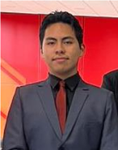
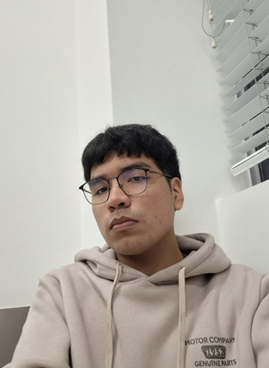

# 1.1.2 Team Member Profiles

Los integrantes se presentan en orden alfabético por apellido. Cada perfil
resume la carrera, el rol y las capacidades que el estudiante aporta al
proyecto. La información de Sebastián Pinedo queda como plantilla para que él
mismo la complete antes de la entrega académica.

| Integrante | Código | Carrera | Rol y perfil |
| --- | --- | --- | --- |
| **Sebastián Pinedo** Foto: `[Pendiente de agregar]` | `[Pendiente de completar por Sebastián]` | `[Pendiente de completar por Sebastián]` | **Rol:** `[Pendiente de definir]`  **Perfil:** `[Sebastián completará aquí sus conocimientos, habilidades y aporte al equipo.]` |
|  | U202413142 | Ingeniería de Software | **Team Member.** Gerard aporta análisis técnico, comunicación de decisiones y estructuración lógica de componentes. Puede colaborar en arquitectura, modelado, documentación y articulación entre los objetivos del producto y las decisiones de diseño e implementación. |
|  | U202416289 | Ingeniería de Software | **Team Member.** Gino aporta afinidad por la programación, los entornos de desarrollo, la programación orientada a objetos y la resolución de problemas. Puede traducir requisitos y modelos conceptuales en componentes implementables. |
|  | U20241A054 | Ingeniería de Software | **Team Member.** Joaquín aporta atención al detalle, revisión de calidad y mejora continua. Puede apoyar la validación de consistencia entre artefactos, decisiones técnicas y documentación del proyecto. |
|  | U202323040 | Ingeniería de Software | **Team Leader.** Diego aporta organización, coordinación y supervisión transversal del proyecto. Puede articular el trabajo técnico, documental y de validación, manteniendo trazabilidad y cumplimiento de los entregables. |

> **Pendiente:** Sebastián debe completar su código, carrera, rol, fotografía y
> descripción personal. No se debe inferir esa información desde otros
> documentos.
