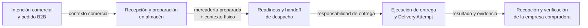
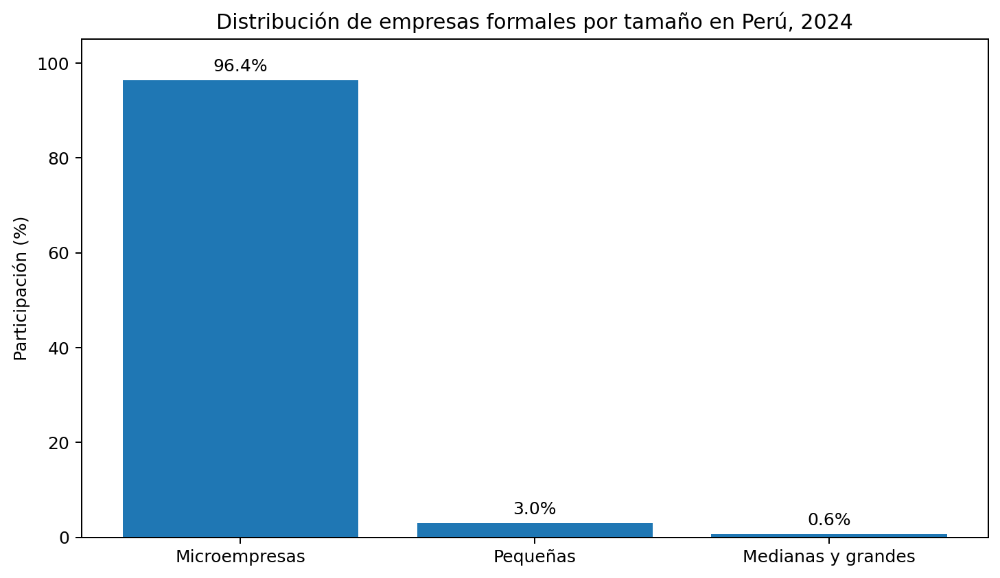
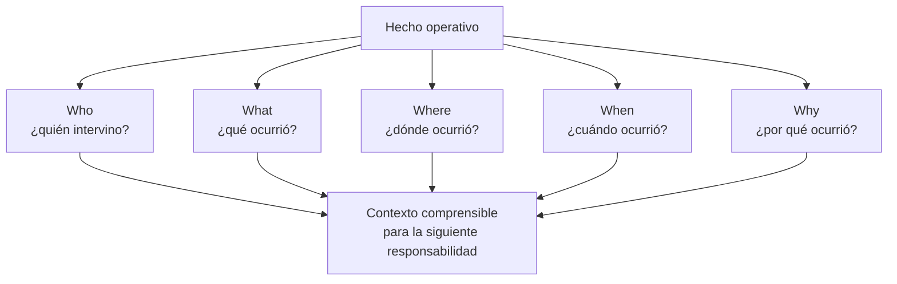
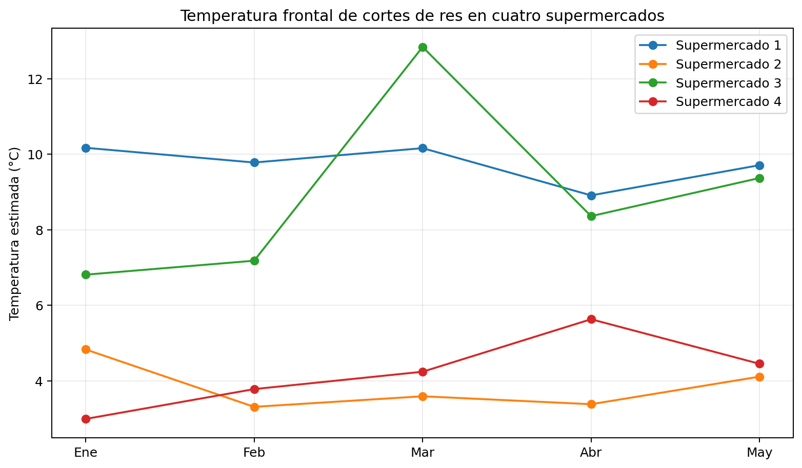
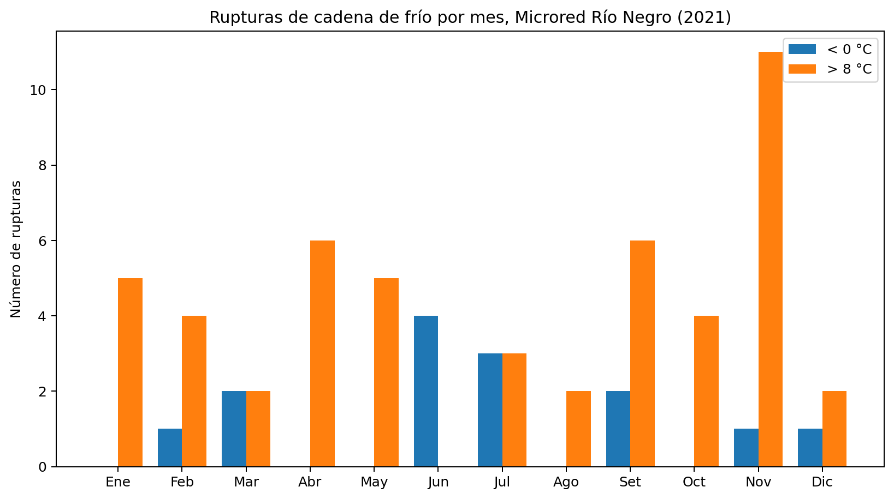
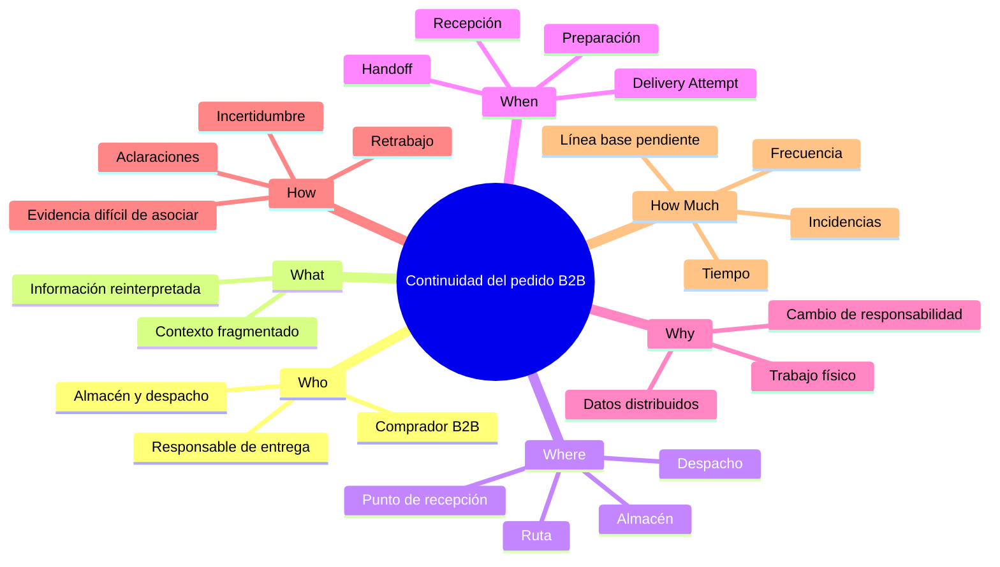
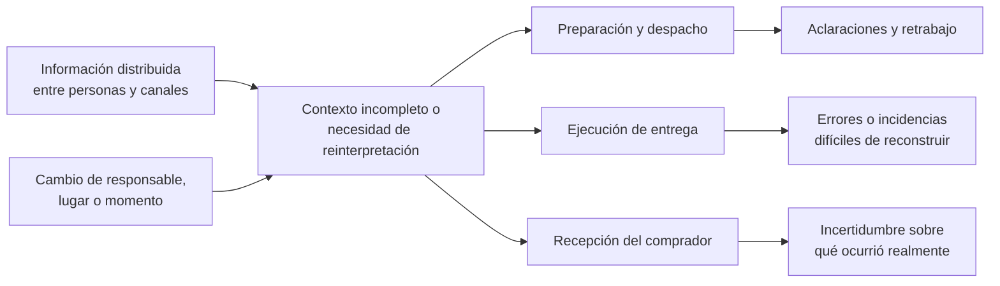

## 1.2. Solution Profile

Esta sección presenta el contexto en el que surge Nexa, delimita la problemática
que orienta el proyecto y establece la base sobre la cual se desarrollará el
Lean UX Process. El análisis distingue entre **evidencia secundaria**, que ayuda
a comprender el mercado y el dominio, y **supuestos del equipo**, que todavía
deben contrastarse mediante investigación primaria.

La primera parte desarrolla los antecedentes, aplica la técnica 5W2H para ordenar
la problemática y define los puntos principales que debe abordar la propuesta,
sus objetivos y restricciones. La segunda parte utiliza Lean UX para transformar
ese entendimiento preliminar en Problem Statements, Assumptions, Hypothesis
Statements y un Lean UX Canvas. La segmentación objetivo se formaliza
posteriormente en la sección 1.3.

### 1.2.1. Antecedentes y problemática

#### Antecedentes

Las empresas importadoras, distribuidoras y mayoristas necesitan coordinar
información comercial y operativa para transformar una necesidad de compra en
mercadería preparada, despachada, entregada y finalmente recibida. A lo largo de
ese recorrido intervienen personas con responsabilidades diferentes y el pedido
cambia varias veces de contexto: comienza como una intención comercial, pasa a
una actividad de almacén, continúa mediante coordinación de despacho y entrega,
y termina siendo recibido y verificado por la empresa compradora.

La dificultad potencial no surge únicamente de que falte información. También
puede aparecer cuando la información necesaria para continuar una tarea se
encuentra distribuida entre personas, sistemas, documentos, hojas de cálculo,
llamadas o mensajería, o cuando quien recibe la responsabilidad debe reconstruir
qué ocurrió en una etapa anterior. En consecuencia, la continuidad del pedido
depende de que cada participante comprenda qué ocurrió, qué acción le corresponde
y qué hechos o evidencias deben conservarse para la siguiente etapa.

**Figura**

*Recorrido preliminar del pedido B2B y principales cambios de responsabilidad*

> *Nota.* La figura representa el recorrido que se utiliza para estudiar dónde
> puede perderse continuidad de información. No implica que todas las empresas
> ejecuten exactamente el mismo flujo ni que las fricciones mostradas hayan sido
> validadas mediante investigación primaria. Elaboración propia.

##### Contexto empresarial peruano

El Instituto Nacional de Estadística e Informática registró **3 302 973 empresas
formales en 2024**. Del total, el **96,4 %** correspondió a microempresas, el
**3,0 %** a pequeñas empresas y el **0,6 %** a medianas y grandes empresas. Por
actividad económica, el **43,5 %** perteneció a comercio y reparación de
vehículos automotores y motocicletas, mientras que el **5,8 %** correspondió a
transporte y almacenamiento. Lima concentró el **45,7 %** de las empresas
registradas (INEI, 2025a).

Estos datos no permiten determinar cuántas empresas utilizarían Nexa ni cuántas
experimentan el problema planteado. Sí muestran que la investigación se sitúa en
un entorno empresarial heterogéneo, donde no resulta apropiado asumir una misma
estructura de roles, procesos, herramientas o nivel de especialización para todas
las organizaciones.

**Tabla**

*Indicadores del contexto empresarial relevante para Nexa*

| Dimensión | Evidencia | Lectura para el proyecto | Límite de interpretación |
| --- | ---: | --- | --- |
| Empresas formales registradas | 3 302 973 | Existe un tejido empresarial amplio sobre el cual se desarrollan actividades B2B. | No representa el mercado directamente capturable por Nexa. |
| Microempresas | 96,4 % | La escala organizacional puede variar significativamente entre empresas. | No significa que Nexa se oriente exclusivamente a microempresas. |
| Comercio | 43,5 % | El comercio posee una participación importante en la estructura empresarial formal. | No todas las empresas comerciales son importadoras, distribuidoras o mayoristas compatibles con Nexa. |
| Transporte y almacenamiento | 5,8 % | Existe actividad empresarial vinculada con movimiento y custodia de bienes. | No describe la operación logística interna de los futuros clientes. |
| Empresas ubicadas en Lima | 45,7 % | Lima resulta un entorno pertinente para una primera investigación de campo. | Nexa no se define como un producto exclusivo de Lima. |

> *Nota.* Elaboración propia a partir de *Perú: Estructura Empresarial, 2024*
> (INEI, 2025a).

**Figura**

*Distribución de empresas formales por tamaño en Perú, 2024*

> *Nota.* Elaboración propia a partir de INEI (2025a). La figura describe la
> estructura empresarial nacional y no la composición esperada de clientes de
> Nexa.

El *Logistics Performance Index 2023* del Banco Mundial constituye un antecedente
complementario sobre el entorno logístico nacional. Para Perú registra una
puntuación general de **3,0 sobre 5** y considera dimensiones como
infraestructura, competencia logística, seguimiento y trazabilidad y
cumplimiento de tiempos (World Bank, 2023). Su utilidad para Nexa es contextual:
no mide la operación de un almacén, distribuidor o transportista particular ni
permite inferir directamente la calidad logística de los futuros clientes.

##### Adopción digital y coexistencia de canales

El *Estudio de digitalización del giro bodegas 2022*, elaborado por Xplora de
Grupo Lucky, reportó un nivel promedio de digitalización de **12 %** entre las
bodegas estudiadas y señaló que el **28 %** utilizaba algún aplicativo para
gestionar el negocio, principalmente para ventas y pedidos. La misma fuente
describe el uso de herramientas como WhatsApp y Facebook para coordinar con
proveedores y ofrecer productos (Grupo Lucky, 2022).

**Tabla**

*Indicadores de digitalización observados en el estudio de bodegas*

| Indicador | Resultado reportado | Uso responsable en Nexa |
| --- | ---: | --- |
| Nivel promedio de digitalización | 12 % | Evidencia que la adopción digital puede ser limitada incluso cuando existen herramientas disponibles. |
| Uso de algún aplicativo de gestión | 28 % | Muestra que aplicaciones y canales cotidianos pueden convivir dentro de un mismo negocio. |
| Uso de Facebook y WhatsApp | Cualitativamente reportado | Orienta preguntas sobre coordinación con proveedores y clientes, sin asumir que los futuros usuarios de Nexa utilizan los mismos canales de la misma forma. |

> *Nota.* El estudio corresponde a bodegas y no puede generalizarse directamente
> a importadores, distribuidores o mayoristas. Se utiliza únicamente como
> antecedente de coexistencia entre herramientas digitales y canales de
> coordinación (Grupo Lucky, 2022).

Para Nexa, esta evidencia resulta útil porque evita reducir el problema a una
oposición entre “digital” y “manual”. Una empresa puede utilizar ERP, hojas de
cálculo, aplicaciones, documentos y mensajería y aun así necesitar reconstruir
información cuando una responsabilidad pasa de una persona o entorno a otro.

##### Trazabilidad y continuidad de información

El **GS1 Global Traceability Standard** organiza la trazabilidad mediante
*Critical Tracking Events* (CTE) y *Key Data Elements* (KDE). Los CTE representan
eventos relevantes dentro del recorrido de un objeto, mientras que los KDE
proporcionan los datos necesarios para comprender cada evento. El estándar
utiliza dimensiones como **Who, What, Where, When y Why** para conservar contexto
a lo largo de una cadena (GS1, n.d.).

Para Nexa, la relevancia de esta referencia está en la idea de que la trazabilidad
no depende únicamente de mostrar un estado final. También requiere relacionar
correctamente el objeto, el momento, el lugar, el responsable y el hecho
registrado. Esto es especialmente importante cuando se producen cambios de
responsabilidad durante preparación, despacho, entrega y recepción.

**Figura**

*Continuidad de contexto entre hechos del pedido*

> *Nota.* Elaboración propia a partir de las dimensiones de contexto empleadas
> por GS1 en su estándar de trazabilidad. La figura no implica que Nexa deba
> implementar todos los estándares o identificadores GS1.

##### Cadena de frío como especialización del dominio

La cadena de frío constituye una especialización relevante cuando una empresa
trabaja con productos sensibles a temperatura, vencimiento, lote o condiciones
particulares de conservación. En estos casos, una pérdida de continuidad puede
tener consecuencias adicionales sobre calidad, inocuidad, merma y capacidad de
reconstruir lo ocurrido. Sin embargo, **la cadena de frío no define por sí sola
el mercado de Nexa**.

UNEP y FAO (2022) señalan que la falta de refrigeración efectiva contribuyó a la
pérdida de aproximadamente **12 % de la producción mundial de alimentos en
2017**. Por su parte, Mustafa et al. (2024), en una revisión de **114
publicaciones** sobre logística y gestión de cadena de frío alimentaria,
identifican un campo interdisciplinario donde convergen sostenibilidad,
tecnología, gestión y factores humanos. Zhou et al. (2025) también describe
oportunidades de digitalización y desafíos relacionados con transmisión e
interpretación de datos, privacidad, aceptación y regulación.

Estas referencias respaldan la relevancia de investigar continuidad y
trazabilidad en operaciones sensibles, pero no demuestran que Nexa deba adoptar
sensores, IoT, seguimiento continuo u otra tecnología concreta.

###### Evidencia empírica: temperaturas en supermercados

Arriaga-Lorenzo et al. (2023) evaluaron la cadena de frío de cortes de res
comercializados en cuatro supermercados del Estado de México. Durante cinco
meses registraron la temperatura superficial de productos ubicados en posiciones
frontal, media y posterior de refrigeradores abiertos. En la posición frontal,
los supermercados 1 y 3 presentaron temperaturas superiores al límite de
**4 °C** utilizado por los autores como referencia para los productos
refrigerados estudiados.

**Tabla**

*Temperaturas estimadas en la posición frontal de refrigeradores abiertos (°C)*

| Supermercado | Enero | Febrero | Marzo | Abril | Mayo | Media |
| --- | ---: | ---: | ---: | ---: | ---: | ---: |
| **1** | 10.17 | 9.78 | 10.16 | 8.91 | 9.71 | **9.75** |
| **2** | 4.83 | 3.31 | 3.59 | 3.38 | 4.11 | **3.84** |
| **3** | 6.81 | 7.18 | 12.84 | 8.36 | 9.37 | **8.91** |
| **4** | 2.99 | 3.78 | 4.24 | 5.63 | 4.45 | **4.22** |

> *Nota.* Adaptado del Cuadro 1 de Arriaga-Lorenzo et al. (2023). Los autores
> compararon estas temperaturas con la referencia de no más de 4 °C empleada en
> el estudio. El caso corresponde a supermercados en México y no representa una
> medición de clientes o usuarios de Nexa.

**Figura**

*Evolución mensual de temperatura en la posición frontal de los supermercados estudiados*

> *Nota.* Elaboración propia a partir de los valores publicados por
> Arriaga-Lorenzo et al. (2023), Cuadro 1. La gráfica se utiliza como evidencia
> contextual de que una condición física relevante puede variar de forma
> persistente a lo largo de la operación; no establece reglas de aceptación para
> Nexa.

El valor de este antecedente para Nexa no consiste en trasladar el límite de
temperatura del estudio al producto. Su aporte es mostrar que, cuando una
operación depende de conservación, la información asociada a la condición física
del producto puede requerir seguimiento y contexto suficiente para comprender
dónde y cuándo se produjo una desviación.

###### Evidencia peruana: rupturas de cadena de frío

Bravo De la Cruz, Orihuela De Santana y Huaman Huaman (2025) analizaron las
rupturas de cadena de frío registradas durante 2021 en establecimientos de salud
de la Microred Río Negro. El estudio reportó **64 rupturas**: 50 asociadas a
incrementos de temperatura y 14 a disminuciones.

**Tabla**

*Rupturas de cadena de frío por mes en la Microred Río Negro, 2021*

| Mes | < 0 °C | > 8 °C | Total |
| --- | ---: | ---: | ---: |
| Enero | 0 | 5 | 5 |
| Febrero | 1 | 4 | 5 |
| Marzo | 2 | 2 | 4 |
| Abril | 0 | 6 | 6 |
| Mayo | 0 | 5 | 5 |
| Junio | 4 | 0 | 4 |
| Julio | 3 | 3 | 6 |
| Agosto | 0 | 2 | 2 |
| Setiembre | 2 | 6 | 8 |
| Octubre | 0 | 4 | 4 |
| Noviembre | 1 | 11 | 12 |
| Diciembre | 1 | 2 | 3 |
| **Total** | **14** | **50** | **64** |

> *Nota.* Adaptado de Bravo De la Cruz et al. (2025). El estudio pertenece al
> dominio sanitario y no equivale a la distribución comercial atendida por Nexa.
> Se utiliza únicamente como evidencia peruana de que las desviaciones térmicas
> pueden aparecer repetidamente cuando una operación depende de cadena de frío.

**Figura**

*Rupturas mensuales de cadena de frío registradas en la Microred Río Negro*

> *Nota.* Elaboración propia a partir de Bravo De la Cruz et al. (2025). La
> figura contextualiza la recurrencia de desviaciones térmicas; no representa
> frecuencia esperada en empresas objetivo de Nexa.

##### Condiciones del trabajo físico

Parte del recorrido que Nexa busca estudiar ocurre mientras las personas
manipulan mercadería, se desplazan o coordinan una actividad física. De Lombaert
et al. (2024) realizaron un experimento con **164 participantes** para estudiar
la exigencia física percibida durante tareas de *order picking*. Los resultados
muestran que la altura de recogida, el peso del producto y la cantidad de
unidades influyen en la exigencia percibida.

El estudio no evalúa una aplicación móvil ni participantes de Nexa. Su aporte
consiste en recordar que una tarea de almacén no puede analizarse como si fuera
una tarea de escritorio. Durante recepción, picking, staging, despacho o entrega,
la atención de la persona se reparte entre el entorno físico y la información
necesaria para completar la operación.

**Tabla**

*Implicancias de contexto físico para la investigación de Nexa Mobile*

| Condición observada en el dominio | Pregunta para la investigación |
| --- | --- |
| Manipulación simultánea de mercadería | ¿En qué momentos resulta viable consultar o registrar información sin interrumpir innecesariamente la tarea física? |
| Peso, cantidad y altura de picking | ¿Qué nivel de atención puede dedicar la persona a una pantalla mientras ejecuta la tarea? |
| Movimiento entre zonas de trabajo | ¿Qué información debe permanecer disponible al cambiar de recepción, picking, staging o despacho? |
| Interrupciones e incidencias | ¿Cómo recupera la persona el contexto después de una interrupción? |
| Conectividad variable | ¿Cómo afecta la disponibilidad de conexión a la confianza y continuidad del trabajo? |

> *Nota.* Las preguntas son orientaciones de investigación derivadas del contexto
> físico. No constituyen resultados ni requisitos de interfaz.

##### Síntesis de la evidencia disponible

La evidencia secundaria permite justificar que el problema merece investigación,
pero no sustituye el trabajo con representantes actuales de los usuarios. Para
evitar extrapolaciones, la siguiente matriz diferencia expresamente qué aporta
cada fuente y qué no permite afirmar.

**Tabla**

*Matriz de evidencia, aporte y límite de interpretación*

| Evidencia | Hallazgo relevante | Qué permite sostener | Qué no permite afirmar |
| --- | --- | --- | --- |
| **INEI (2025a)** | 3 302 973 empresas formales; 96,4 % microempresas; 43,5 % comercio; 5,8 % transporte y almacenamiento. | Nexa se plantea en un entorno empresarial amplio y heterogéneo. | Que todas esas empresas sean clientes potenciales o presenten las mismas fricciones. |
| **World Bank (2023)** | El LPI considera infraestructura, competencia logística, seguimiento y otras dimensiones del desempeño nacional. | El entorno logístico presenta dimensiones relevantes para movimiento y seguimiento de bienes. | El desempeño interno de una empresa específica. |
| **Grupo Lucky (2022)** | 12 % de digitalización promedio y 28 % de uso de aplicaciones en las bodegas estudiadas. | Herramientas digitales y canales cotidianos pueden coexistir. | Que importadores, distribuidores y mayoristas tengan exactamente la misma adopción. |
| **GS1 (n.d.)** | CTE, KDE y dimensiones de contexto Who/What/Where/When/Why. | La trazabilidad depende de conservar eventos y contexto. | Que Nexa deba implementar íntegramente GS1. |
| **UNEP & FAO (2022)** | Aproximadamente 12 % de la producción mundial de alimentos de 2017 se perdió por refrigeración insuficiente. | La conservación puede tener consecuencias materiales cuando la operación depende de frío. | La magnitud de mermas de futuros clientes de Nexa. |
| **Mustafa et al. (2024); Zhou et al. (2025)** | La cold chain combina factores técnicos, humanos, operativos y regulatorios. | Justifica investigar continuidad sin reducir el problema a sensores. | Que una tecnología específica sea la solución correcta. |
| **Arriaga-Lorenzo et al. (2023)** | Dos de cuatro supermercados presentaron problemas de temperatura durante los meses evaluados. | Las desviaciones físicas pueden persistir y requieren contexto para su interpretación. | Que esos valores representen empresas peruanas o usuarios Nexa. |
| **Bravo De la Cruz et al. (2025)** | 64 rupturas de cadena de frío en el caso peruano estudiado. | Aporta evidencia peruana de recurrencia en un contexto sensible. | Que el dominio sanitario sea equivalente a la distribución comercial. |
| **De Lombaert et al. (2024)** | N=164; altura, peso y cantidad influyeron en la exigencia física del picking. | El contexto de trabajo físico debe formar parte de la investigación. | Que una interfaz móvil determinada sea usable o aceptada por Warehouse Operators de Nexa. |

> *Nota.* Esta matriz diferencia contexto externo de evidencia propia del
> proyecto. Ninguna fuente representa por sí sola Product Acceptance ni
> comportamiento validado de usuarios de Nexa. Elaboración propia.

#### Análisis 5W2H del problema

La técnica **5W2H** permite ordenar la comprensión preliminar antes de formular
las assumptions de Lean UX. El análisis considera **Who, What, Where, When, Why,
How y How Much**, distinguiendo aquello que ya puede sostenerse desde el dominio
y la evidencia secundaria de aquello que todavía debe investigarse.

**Tabla**

*Análisis 5W2H de la problemática*

| Elemento | Análisis aplicado a Nexa | Estado del conocimiento |
| --- | --- | --- |
| **Who — ¿A quién afecta?** | Inicialmente se considera al personal que participa en almacén y despacho, a conductores u operadores responsables de la entrega y a compradores B2B que reciben y verifican pedidos. El trabajo comercial y de gestión forma parte del ciclo general, pero no constituye el foco Mobile V1 principal de esta investigación. | Los actores y responsabilidades se conocen desde el dominio actual; sus necesidades y comportamientos específicos requieren investigación primaria. |
| **What — ¿Qué problema ocurre?** | El contexto necesario para continuar un pedido puede fragmentarse o perder claridad al cambiar de persona, canal, sistema o lugar. | Hipótesis central respaldada conceptualmente por la necesidad de trazabilidad; frecuencia e impacto pendientes de medir. |
| **Where — ¿Dónde ocurre?** | Recepción y almacén, picking, staging y despacho, ruta y punto de recepción de la empresa compradora; cuando corresponda, áreas sujetas a condiciones especiales de conservación. | Contextos derivados del recorrido operativo; condiciones particulares pendientes de observación. |
| **When — ¿Cuándo aparece?** | Principalmente durante cambios de responsabilidad: recepción y preparación, readiness, handoff, Delivery Attempt y recepción o discrepancia del Buyer. | Momentos candidatos de investigación; no se asume cuál genera mayor fricción. |
| **Why — ¿Por qué ocurre?** | Porque cada participante puede necesitar información generada en otra etapa y esa información puede encontrarse distribuida entre registros, personas y canales. | Explicación causal preliminar pendiente de contraste con prácticas reales. |
| **How — ¿Cómo se manifiesta?** | Aclaraciones repetidas, consulta de varias fuentes, reingreso de datos, errores de asociación de evidencia, retrabajo, incidencias difíciles de reconstruir o incertidumbre entre lo entregado y lo recibido. | Manifestaciones propuestas para entrevistas y observación, no resultados medidos. |
| **How Much — ¿Qué magnitud tiene?** | La magnitud específica para Nexa todavía no está cuantificada. Se buscará medir tiempo de reconstrucción, fuentes consultadas, aclaraciones, retrabajo, incidencias, discrepancias u otros indicadores que emerjan de la investigación. | **No cuantificado con evidencia primaria actual.** Los datos externos no deben transformarse en porcentajes atribuidos a los usuarios de Nexa. |

> *Nota.* El análisis 5W2H representa el entendimiento disponible antes de la
> investigación primaria. Su finalidad es orientar qué debe observarse y
> preguntarse, no convertir supuestos en resultados. Elaboración propia.

**Figura**

*Síntesis visual del 5W2H de la problemática*

> *Nota.* Elaboración propia. El mapa resume las dimensiones del 5W2H y no
> sustituye el detalle de la tabla anterior.

La lectura conjunta del 5W2H permite precisar que el problema no es simplemente
una **falta de digitalización**. Una empresa puede utilizar ERP, hojas de cálculo,
mensajería, documentos u otras herramientas y aun así necesitar reconstruir
contexto cuando un pedido pasa de una responsabilidad a otra. Por ello, la
investigación se concentra en **las transiciones de responsabilidad y en la
información que debe sobrevivir a esas transiciones para continuar el trabajo
con claridad**.

#### Problemática

##### Enunciado preliminar del problema

El problema central propuesto para Nexa es la **falta de continuidad confiable de
la información cuando un pedido B2B pasa de la intención comercial a la
preparación física, el despacho, la entrega y la recepción por parte de la
empresa compradora**.

La problemática puede aparecer cuando información relevante sobre productos,
cantidades, preparación, condiciones, incidencias o evidencias se encuentra
distribuida entre diferentes personas y canales y debe reinterpretarse al cambiar
la responsabilidad sobre el pedido. Esto puede generar retrabajo, aclaraciones
repetidas, errores, dificultad para reconstruir hechos o incertidumbre sobre qué
ocurrió realmente durante la operación.

La intención comercial forma parte del contexto que da origen al pedido, pero el
**foco Mobile V1** de esta investigación se concentra en los momentos donde la
responsabilidad se acerca a la operación física: almacén y despacho, ejecución
de la entrega y recepción del comprador. La movilidad comercial de Sales y otras
funciones administrativas puede formar parte de una evolución posterior, pero no
constituye el núcleo de esta problemática Mobile inicial.

Cuando una empresa trabaja con productos sujetos a lote, vencimiento,
temperatura u otras condiciones de conservación, una pérdida de contexto puede
adquirir consecuencias adicionales. Estas condiciones se investigan como una
especialización del dominio y no como característica obligatoria de todos los
clientes de Nexa.

**Figura**

*Relación causal preliminar de la problemática*

> *Nota.* La figura representa una hipótesis causal utilizada para orientar la
> investigación posterior. No expresa relaciones causalmente demostradas con
> usuarios de Nexa. Elaboración propia.

#### Puntos principales que debe abordar la propuesta

A partir de los antecedentes y del 5W2H, se identifican los aspectos que la
propuesta debe investigar y, si la evidencia confirma su relevancia, abordar
mediante la solución. Estos puntos todavía no constituyen funcionalidades
definitivas.

**Tabla**

*Aspectos prioritarios que debe resolver la propuesta*

| Aspecto | Pregunta que debe resolver el proyecto | Resultado buscado |
| --- | --- | --- |
| **Continuidad entre responsables** | ¿Qué información necesita cada participante para continuar el pedido sin reconstruir innecesariamente etapas anteriores? | Conservar suficiente contexto para reconocer la tarea y su estado. |
| **Claridad sobre la siguiente acción** | ¿Qué necesita saber una persona para identificar correctamente qué debe hacer y sobre qué pedido, entrega o mercadería? | Reducir ambigüedad durante el trabajo físico u operativo. |
| **Trazabilidad de hechos y evidencias** | ¿Cómo deben relacionarse incidencias, resultados y evidencias con el pedido, entrega y momento correspondientes? | Facilitar que lo ocurrido pueda comprenderse posteriormente. |
| **Separación de perspectivas en la entrega** | ¿Cómo conservar lo que registra quien entrega sin convertirlo automáticamente en lo que declara quien recibe? | Mantener separados el resultado del Driver y la recepción o discrepancia del Buyer. |
| **Trabajo físico y movilidad** | ¿En qué momentos una experiencia móvil aporta valor y qué condiciones del entorno limitan su uso? | Diseñar posteriormente interacciones compatibles con movimiento, presión temporal e interrupciones. |
| **Conservación cuando corresponda** | ¿Qué información de lote, vencimiento, condición o temperatura necesita mantenerse disponible en operaciones que dependen de ella? | Proteger continuidad de información relevante sin convertir cold chain en requisito universal. |
| **Magnitud del problema** | ¿Con qué frecuencia y costo operativo aparecen las principales fricciones? | Obtener una línea base para priorizar problemas y definir criterios de éxito posteriores. |

> *Nota.* Los resultados buscados expresan la dirección del problema que se
> pretende comprender. No representan métricas alcanzadas ni decisiones
> definitivas de diseño. Elaboración propia.

#### Objetivos y restricciones del proyecto

##### Objetivos

Los objetivos de esta etapa se plantean en términos de comprensión y validación
del problema. La definición detallada de funcionalidades corresponde a etapas
posteriores y deberá apoyarse en los resultados de investigación.

**Tabla**

*Objetivos del proyecto*

| Tipo | Objetivo |
| --- | --- |
| **Objetivo general** | Analizar y validar las fricciones de continuidad de información que aparecen entre la preparación, el despacho, la entrega y la recepción de pedidos B2B, con el fin de orientar una experiencia móvil que ayude a conservar el contexto necesario entre participantes y responsabilidades. |
| **Objetivo específico 1** | Identificar en qué transiciones del pedido la información debe reconstruirse, reinterpretarse o solicitarse nuevamente y qué efecto produce sobre el trabajo de cada participante. |
| **Objetivo específico 2** | Determinar qué información, estado, incidencia o evidencia necesita cada participante para reconocer correctamente su tarea y comprender lo ocurrido antes y después de su intervención. |
| **Objetivo específico 3** | Investigar las condiciones físicas y digitales en las que se realizan las actividades priorizadas, incluyendo movimiento, interrupciones, disponibilidad de tiempo y conectividad variable. |
| **Objetivo específico 4** | Establecer una primera línea base mediante indicadores como tiempo de reconstrucción, fuentes consultadas, aclaraciones, retrabajo, incidencias o discrepancias, seleccionando únicamente aquellos que puedan medirse de manera responsable durante la investigación. |
| **Objetivo específico 5** | Determinar en qué situaciones las condiciones de lote, vencimiento, temperatura o conservación modifican la importancia de la continuidad y trazabilidad sin limitar la propuesta general de Nexa a la cadena de frío. |

> *Nota.* Los objetivos expresan lo que el proyecto debe aprender y validar. Su
> cumplimiento no se demuestra por la sola construcción de una funcionalidad,
> sino por la evidencia obtenida durante el proceso. Elaboración propia.

##### Restricciones iniciales

Las restricciones delimitan el alcance de la investigación y evitan convertir
decisiones futuras de producto o tecnología en conclusiones anticipadas.

**Tabla**

*Restricciones iniciales del proyecto*

| Restricción | Delimitación |
| --- | --- |
| **Mercado objetivo** | Nexa se orienta a importadores, distribuidores y mayoristas B2B. Los resultados de bodegas, salud o supermercados se utilizan como contexto y no como representación directa de los futuros usuarios. |
| **Foco Mobile V1** | El estudio prioriza almacén y despacho, ejecución de la entrega y recepción del comprador. Una experiencia comercial móvil amplia para Sales y otras funciones de gestión queda fuera del núcleo V1 y podrá investigarse posteriormente como conveniencia complementaria. |
| **Especialización de cadena de frío** | Lote, vencimiento, temperatura y conservación se consideran cuando forman parte real de la operación; no se asumen como requisito universal. |
| **Validación** | Las fricciones, hábitos, frecuencias, costos, beneficios y preferencias atribuidas a las personas permanecen como hipótesis hasta contar con evidencia primaria suficiente. |
| **Tecnología y diseño** | Esta sección no determina framework, proveedor, mecanismo de escaneo, navegación, notificaciones, seguimiento, IoT ni estrategia de interacción. Estas decisiones deberán justificarse posteriormente. |
| **Conectividad** | La conectividad variable se considera una condición de uso a investigar. No se presupone una estrategia genérica de sincronización offline ni se considera una acción local como verdad definitiva del negocio. |
| **Alcance de superficies** | Mobile complementa las superficies Web de Nexa; no se plantea replicar en el teléfono toda la experiencia comercial, administrativa o del Buyer Portal. |

> *Nota.* Las restricciones delimitan el problema y el aprendizaje inicial; no
> representan una especificación técnica de implementación. Elaboración propia.

La sección 1.2.1 establece así una base deliberadamente preliminar: existe
evidencia suficiente para justificar la investigación de continuidad,
trazabilidad y trabajo móvil dentro del ciclo B2B, pero todavía no existe
evidencia primaria suficiente para afirmar qué fricciones son dominantes, qué
magnitud tienen o qué solución concreta será más efectiva. Estas preguntas se
transforman en assumptions e hypotheses en el Lean UX Process de la sección
1.2.2.
