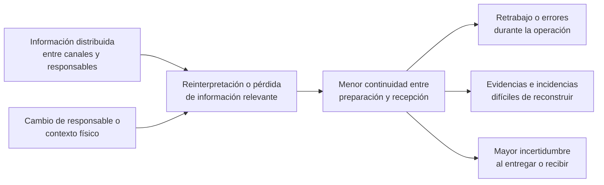

# 1.2 Solution Profile

Esta sección presenta los antecedentes y la problemática que dan origen a
Nexa, y aplica Lean UX para declarar las hipótesis iniciales del proyecto. En
este punto todavía se están explorando los segmentos y actores; su
consolidación como segmentos móviles propuestos se presenta recién en la
sección 1.3.

# 1.2.1. Antecedentes y problemática

## Antecedentes

Las empresas importadoras, distribuidoras y mayoristas necesitan coordinar
información comercial y operativa para transformar una necesidad de compra en
mercadería preparada, despachada, entregada y finalmente recibida. En ese
recorrido intervienen personas con responsabilidades distintas y la información
cambia varias veces de contexto. La continuidad del pedido depende, por tanto,
no solo de que exista información, sino de que cada participante pueda
comprender qué ocurrió antes, qué debe hacer ahora y qué evidencia debe conservar
para la siguiente etapa.

El contexto empresarial peruano muestra que Nexa se plantea sobre un entorno
amplio y heterogéneo. El Instituto Nacional de Estadística e Informática (INEI)
registró **3 302 973 empresas formales en 2024**. De ese total, el **96,4 %**
correspondió a microempresas, el **3,0 %** a pequeñas empresas y el **0,6 %** a
medianas y grandes empresas. Por actividad económica, el **43,5 %** se concentró
en comercio y reparación de vehículos automotores y motocicletas, mientras que
el **5,8 %** perteneció a transporte y almacenamiento. Además, el departamento
de Lima concentró el **45,7 %** de las empresas registradas (INEI, 2025). Estos
datos no permiten identificar por sí solos cuáles empresas utilizarían Nexa,
pero muestran que comercio, distribución y movimiento de bienes forman parte de
un tejido empresarial numeroso y compuesto por organizaciones de escalas muy
distintas.

**Tabla**

*Indicadores del contexto empresarial y logístico relevante para Nexa*

| Dimensión | Indicador | Dato observado | Lectura para el proyecto |
| --- | --- | ---: | --- |
| Estructura empresarial | Empresas formales registradas en Perú, 2024 | 3 302 973 | El mercado empresarial es amplio y heterogéneo; no debe asumirse una única escala organizacional. |
| Tamaño empresarial | Microempresas | 96,4 % | La complejidad de procesos, roles y herramientas puede variar considerablemente entre organizaciones. |
| Actividad económica | Comercio | 43,5 % | El comercio representa una parte importante del tejido empresarial formal peruano. |
| Actividad económica | Transporte y almacenamiento | 5,8 % | Existe una presencia relevante de actividades vinculadas con movimiento y custodia de bienes. |
| Concentración geográfica | Empresas ubicadas en Lima | 45,7 % | Lima resulta un entorno pertinente para el trabajo de campo inicial, sin convertirlo en el único mercado potencial. |
| Desempeño logístico nacional | Logistics Performance Index de Perú, 2023 | 3,0 de 5 | El desempeño logístico del país presenta un nivel intermedio dentro del índice internacional del Banco Mundial. |
| Desempeño logístico nacional | Infraestructura logística | 2,5 de 5 | El contexto físico e infraestructural continúa siendo un condicionante relevante de las operaciones. |
| Desempeño logístico nacional | Competencia y calidad logística | 2,7 de 5 | La calidad de los servicios logísticos no debe darse por homogénea entre organizaciones. |
| Desempeño logístico nacional | Tracking and tracing | 3,4 de 5 | La capacidad de seguimiento es un componente reconocido del desempeño logístico, aunque el índice no describe los procesos internos de una empresa específica. |

> *Nota.* Los indicadores empresariales corresponden a *Perú: Estructura
> Empresarial, 2024* del INEI. Los indicadores logísticos corresponden al
> *Logistics Performance Index 2023* del Banco Mundial. Se utilizan como contexto
> nacional y no como medición del desempeño de los futuros clientes de Nexa.

A nivel de adopción digital, la evidencia disponible también muestra un panorama
desigual. El *Estudio de digitalización del giro bodegas 2022*, elaborado por
Xplora de Grupo Lucky, reportó un nivel promedio de digitalización de **12 %**
entre las bodegas estudiadas y señaló que el **28 %** utilizaba algún aplicativo
para gestionar el negocio, principalmente para registrar ventas y realizar
pedidos. La misma fuente describe el uso de herramientas como WhatsApp y
Facebook para coordinar con proveedores y ofrecer productos (Grupo Lucky,
2022). Al tratarse de un estudio centrado en bodegas y realizado antes de la
investigación actual, sus resultados no pueden generalizarse a importadores,
distribuidores o mayoristas; sí sirven como antecedente de un entorno donde
herramientas digitales y canales cotidianos de coordinación pueden coexistir.

La trazabilidad adquiere especial importancia cuando una operación atraviesa
varias personas, ubicaciones y momentos. El **GS1 Global Traceability Standard**
organiza la trazabilidad mediante *Critical Tracking Events* (CTE) y *Key Data
Elements* (KDE). Los CTE representan eventos relevantes del recorrido de un
objeto —por ejemplo, recepción, empaque, despacho o transporte—, mientras que
los KDE describen los datos necesarios para comprender cada evento. El estándar
estructura ese contexto a partir de las dimensiones **Who, What, Where, When y
Why**, y reconoce que los datos de trazabilidad pueden provenir de información
maestra, transacciones, eventos de visibilidad y otros registros de la cadena
(GS1, 2017). Esta referencia resulta especialmente útil para Nexa porque muestra
que la continuidad no depende de un único “estado”, sino de conservar el
contexto suficiente para reconstruir qué ocurrió durante el recorrido.

La cadena de frío constituye una especialización relevante dentro de este
problema, pero no define por sí sola el mercado de Nexa. Cuando una empresa
trabaja con productos sensibles a temperatura, caducidad o condiciones de
conservación, una pérdida de continuidad informativa puede tener consecuencias
adicionales sobre calidad, inocuidad y merma. El informe conjunto de United
Nations Environment Programme y Food and Agriculture Organization of the United
Nations (UNEP & FAO, 2022) señala que la falta de refrigeración efectiva
contribuyó a la pérdida de **12 % de la producción mundial de alimentos en
2017**. El mismo informe estima que las cadenas de frío de alimentos representan
aproximadamente **4 % de las emisiones globales de gases de efecto invernadero**,
considerando tanto las tecnologías de refrigeración como las pérdidas de
alimentos asociadas a una refrigeración insuficiente.

Mustafa et al. (2024) analizaron **114 publicaciones** sobre logística y gestión
de cadena de frío alimentaria. El estudio encontró seis grupos principales de
investigación y mostró el carácter interdisciplinario del dominio: ingeniería
representó el **20 %** de las publicaciones analizadas, Business, Management and
Accounting el **15 %**, Computer Science el **13 %** y Decision Sciences el
**10 %**; en conjunto, estas cuatro áreas concentraron el **58 %** de los
trabajos revisados. Los autores también identifican brechas relacionadas con la
aplicación práctica de tecnologías y con factores humanos. Esto refuerza una
idea importante para el proyecto: la cadena de frío no debe analizarse solo
como un problema de refrigeración o sensores, sino también como una operación
donde decisiones, personas e información deben mantenerse coordinadas.

De manera complementaria, Zhou et al. (2025) revisan tecnologías de seguimiento
de productos y monitoreo de vida útil en cadenas de suministro alimentarias.
Los autores describen oportunidades de digitalización, pero también desafíos
relacionados con transmisión e interpretación de datos, privacidad, aceptación
y regulación. Para Nexa, este antecedente justifica investigar la continuidad y
la trazabilidad, pero no permite asumir que una tecnología concreta de
monitoreo deba formar parte de la propuesta inicial.

La evidencia empírica permite observar por qué la conservación física no puede
tratarse únicamente como un supuesto abstracto. Arriaga-Lorenzo et al. (2023)
evaluaron cortes de carne de res comercializados en cuatro supermercados y
registraron diferencias importantes entre establecimientos.

**Tabla**

*Temperaturas promedio en cortes de carne de res (°C)*

| Supermercado | Enero | Febrero | Marzo | Abril | Mayo | Media general |
| --- | ---: | ---: | ---: | ---: | ---: | ---: |
| Supermercado 1 | 10.17 | 9.78 | 10.16 | 8.91 | 9.71 | 9.75 |
| Supermercado 2 | 4.83 | 3.31 | 3.59 | 3.38 | 4.11 | 3.84 |
| Supermercado 3 | 6.81 | 7.18 | 12.84 | 8.36 | 9.37 | 8.91 |
| Supermercado 4 | 2.99 | 3.78 | 4.24 | 5.63 | 4.45 | 4.22 |

> *Nota.* El estudio consideró una temperatura máxima de 4 °C para los
> productos cárnicos refrigerados analizados. Las medias generales de los
> supermercados 1 y 3 fueron 9.75 °C y 8.91 °C, respectivamente, más del doble
> de la referencia utilizada por los autores. Adaptado de Arriaga-Lorenzo et
> al. (2023).

En el contexto peruano, Bravo De la Cruz et al. (2025) estudiaron las rupturas
de cadena de frío registradas durante 2021 en establecimientos de salud de la
Microred Río Negro. Identificaron **64 rupturas a lo largo del año**: 50 por
incrementos de temperatura y 14 por disminuciones. En términos relativos, el
**78,1 %** de las rupturas correspondió a sobrecalentamiento y el **21,9 %** a
congelación. Además, el estudio reportó al menos una ruptura en todos los meses
del periodo observado.

**Tabla**

*Rupturas de cadena de frío por mes según tipo de desviación térmica*

| Mes | < 0 °C (congelación) | > 8 °C (sobrecalentamiento) | Total de rupturas |
| --- | ---: | ---: | ---: |
| Enero | 0 | 5 | 5 |
| Febrero | 1 | 4 | 5 |
| Marzo | 2 | 2 | 4 |
| Abril | 0 | 6 | 6 |
| Mayo | 0 | 5 | 5 |
| Junio | 4 | 0 | 4 |
| Julio | 3 | 3 | 6 |
| Agosto | 0 | 2 | 2 |
| Setiembre | 2 | 6 | 8 |
| Octubre | 0 | 4 | 4 |
| Noviembre | 1 | 11 | 12 |
| Diciembre | 1 | 2 | 3 |
| **Total** | **14** | **50** | **64** |

> *Nota.* El dominio sanitario no es equivalente al de distribución comercial
> atendido por Nexa. Los datos se utilizan como evidencia contextual peruana de
> la recurrencia que pueden alcanzar las desviaciones térmicas cuando existe una
> operación de cadena de frío, y no como una medición de los futuros usuarios de
> Nexa. Adaptado de Bravo De la Cruz et al. (2025).

El trabajo físico introduce además condiciones distintas a una tarea puramente
administrativa. De Lombaert et al. (2024) realizaron un experimento con
**164 participantes** para estudiar la exigencia física percibida durante
*order picking*. Los resultados identificaron como factores significativos la
altura de recogida, el peso del producto y la cantidad de unidades. Este estudio
no evalúa una aplicación móvil ni usuarios de Nexa; su aporte consiste en
recordar que una tarea de almacén ocurre mientras la persona se desplaza,
manipula productos y distribuye su atención entre el entorno físico y la
información necesaria para trabajar.

### Síntesis de la evidencia disponible

La evidencia revisada permite construir una base más precisa para el problema,
pero también obliga a diferenciar entre **contexto externo** y **evidencia
propia del proyecto**.

**Tabla**

*Matriz de evidencia, alcance e inferencia para la problemática*

| Evidencia | Resultado cuantitativo o hallazgo | Qué permite sostener | Qué no permite afirmar |
| --- | --- | --- | --- |
| INEI (2025) | 3 302 973 empresas formales; 96,4 % microempresas; 43,5 % comercio; 5,8 % transporte y almacenamiento | Nexa se plantea en un entorno empresarial amplio, concentrado en organizaciones pequeñas y con presencia relevante de actividades comerciales y logísticas. | Que todas esas empresas sean clientes potenciales o sufran las mismas fricciones. |
| Banco Mundial (2023) | Perú: LPI 3,0/5; infraestructura 2,5; competencia logística 2,7; tracking and tracing 3,4 | El entorno logístico nacional presenta fortalezas y limitaciones medibles en distintas dimensiones. | El desempeño interno de un almacén, distribuidor o transportista específico. |
| Grupo Lucky (2022) | 12 % de digitalización promedio y 28 % de uso de aplicativos en las bodegas estudiadas | Existen contextos comerciales donde herramientas digitales conviven con canales cotidianos de coordinación. | Que importadores, distribuidores y mayoristas presenten exactamente el mismo nivel de digitalización. |
| GS1 (2017) | CTE + KDE; dimensiones Who, What, Where, When y Why | La trazabilidad requiere conservar eventos y contexto a través de múltiples participantes. | Que Nexa deba implementar todos los estándares o tecnologías GS1. |
| UNEP & FAO (2022) | 12 % de la producción mundial de alimentos perdida en 2017 por falta de refrigeración efectiva | La continuidad de la cadena de frío tiene impacto económico y de sostenibilidad a escala global. | La magnitud de mermas de los futuros clientes de Nexa. |
| Mustafa et al. (2024) | 114 publicaciones analizadas; 58 % concentrado en cuatro áreas disciplinares | La gestión de cadena de frío es un problema interdisciplinario que incluye gestión, tecnología y factores humanos. | Que la adopción de una tecnología específica resuelva el problema de coordinación. |
| Arriaga-Lorenzo et al. (2023) | Medias de 9.75 °C y 8.91 °C en dos establecimientos frente a una referencia de 4 °C | Las desviaciones térmicas pueden ser persistentes y materialmente relevantes. | Que las mismas desviaciones ocurran en empresas peruanas atendidas por Nexa. |
| Bravo De la Cruz et al. (2025) | 64 rupturas; 78,1 % por sobrecalentamiento y 21,9 % por congelación | Existe evidencia peruana de rupturas recurrentes en una operación de cadena de frío. | Que el dominio sanitario represente directamente la distribución comercial de alimentos. |
| De Lombaert et al. (2024) | Experimento con N=164; peso, altura y cantidad influyeron en exigencia física percibida | Las tareas de picking tienen condicionantes físicos que deben considerarse al investigar el contexto de trabajo. | Que una interfaz móvil determinada sea usable o aceptada por Warehouse Operators de Nexa. |

> *Nota.* Esta matriz se utiliza para evitar dos errores: presentar evidencia
> externa como si fuera un resultado propio de Nexa y convertir una hipótesis de
> producto en una conclusión antes de realizar investigación primaria.
> Elaboración propia.

## Análisis 5W2H del problema

La técnica 5W2H se utiliza como síntesis previa al enunciado de la problemática,
tal como exige la estructura del proyecto. En esta versión, cada dimensión se
relaciona con la evidencia disponible y con aquello que todavía debe investigarse,
de modo que el análisis pueda alimentar posteriormente el Problem Statement sin
inventar resultados.

**Tabla**

*Análisis 5W2H de la problemática*

| Elemento | Análisis aplicado a Nexa | Sustento |
| --- | --- | --- |
| **Who — ¿A quién afecta?** | A los tres grupos inicialmente priorizados para la experiencia móvil: **Warehouse & Dispatch Operations**, **Driver Delivery Execution** y **B2B Buyers**. Warehouse Operator y Dispatch Coordinator intervienen en la preparación y salida; Driver / Delivery Operator ejecuta la entrega; y Customer Buyer verifica la recepción. Otros actores comerciales y de gestión forman parte del proceso general, pero no constituyen el foco móvil inicial. | La delimitación se sustenta en el dominio actual de Nexa y en la necesidad de conservar trazabilidad entre participantes con responsabilidades diferentes. GS1 (2017) reconoce que los eventos trazables atraviesan múltiples partes y roles. |
| **What — ¿Qué problema ocurre?** | Puede perderse continuidad cuando el contexto de un pedido cambia de persona, canal o lugar. La información sobre lo preparado, despachado, entregado o recibido puede necesitar ser reinterpretada o reconstruida antes de continuar el trabajo. | GS1 (2017) establece que la trazabilidad depende de eventos y datos que permitan conservar el contexto de lo ocurrido. Grupo Lucky (2022) aporta evidencia de coexistencia entre aplicaciones y canales cotidianos de coordinación en un entorno comercial peruano. |
| **Where — ¿Dónde ocurre?** | Principalmente en almacén, zona de preparación y despacho, ruta y punto de recepción del comprador. Cuando la operación lo requiere, pueden intervenir también cámaras o áreas sujetas a condiciones particulares de conservación. | INEI (2025) evidencia la presencia significativa de actividades comerciales y de transporte y almacenamiento; De Lombaert et al. (2024) muestra que las tareas de picking poseen condicionantes físicos propios. |
| **When — ¿Cuándo aparece?** | Especialmente cuando cambia la responsabilidad sobre el pedido: durante picking y preparación, staging, handoff al responsable de reparto, ejecución de la entrega y confirmación o discrepancia durante la recepción. Las incidencias pueden aumentar la necesidad de recuperar información de etapas anteriores. | GS1 (2017) reconoce *receiving*, *packing*, *shipping* y *transporting* entre los eventos relevantes para trazabilidad. |
| **Why — ¿Por qué ocurre?** | Porque cada participante necesita información generada en etapas anteriores y esta puede encontrarse distribuida entre conversaciones, documentos o registros diferentes. El contexto físico, la presión temporal y, cuando corresponde, las condiciones de conservación pueden aumentar la dificultad de mantener esa continuidad. | Grupo Lucky (2022) aporta contexto sobre coexistencia de canales; De Lombaert et al. (2024) evidencia condicionantes físicos en picking; Mustafa et al. (2024) identifica factores tecnológicos y humanos dentro de la gestión de cadena de frío. |
| **How — ¿Cómo se manifiesta?** | Puede manifestarse mediante aclaraciones repetidas, reconstrucción manual del contexto, repetición de registros, dificultad para asociar evidencia al pedido correcto e incertidumbre frente a diferencias entre lo entregado y lo recibido. Cuando aplica cadena de frío, también puede dificultarse la reconstrucción de condiciones relevantes del producto. | GS1 (2017) sustenta la necesidad de conectar evento y contexto. Arriaga-Lorenzo et al. (2023) y Bravo De la Cruz et al. (2025) muestran consecuencias observables cuando las condiciones térmicas se apartan de los rangos considerados. |
| **How Much — ¿Qué magnitud tiene?** | La magnitud específica todavía no se encuentra cuantificada para los segmentos de Nexa. La evidencia externa demuestra que existen impactos relevantes en contextos relacionados, pero no permite atribuir una frecuencia o costo determinado a los futuros usuarios. La investigación deberá establecer, cuando sea posible, frecuencia de aclaraciones, retrabajo, incidencias, discrepancias, tiempos afectados y otros impactos observables. | UNEP & FAO (2022) dimensiona impactos globales asociados a refrigeración insuficiente; Bravo De la Cruz et al. (2025) aporta evidencia cuantitativa peruana en un contexto de cadena de frío distinto al comercial. |

> *Nota.* El análisis 5W2H sintetiza la problemática conocida hasta esta etapa
> a partir de evidencia secundaria y del dominio actual del proyecto. La
> frecuencia, magnitud y comportamiento específicos de los segmentos de Nexa
> deberán establecerse mediante investigación primaria. Elaboración propia.

La lectura conjunta del 5W2H permite identificar una idea central: el problema
no es simplemente “falta de digitalización”. Una empresa puede utilizar
mensajería, hojas de cálculo, sistemas administrativos u otras herramientas y,
aun así, necesitar reconstruir contexto cuando el pedido cambia de responsable
o pasa del registro comercial a una actividad física. Por ello, la investigación
debe concentrarse en las **transiciones de responsabilidad y en la información
que debe sobrevivir a esas transiciones**, no en demostrar de antemano que una
aplicación móvil es la respuesta correcta.

## Problemática

### Enunciado preliminar del problema

El problema central propuesto para Nexa es la **falta de continuidad confiable
de la información cuando un pedido B2B pasa de la intención comercial a la
preparación física, el despacho, la entrega y la recepción por parte de la
empresa compradora**.

La problemática puede aparecer cuando el contexto relevante se distribuye entre
diferentes personas, canales o registros y debe reinterpretarse al pasar de una
etapa a otra. Esto puede generar aclaraciones repetitivas, retrabajo, errores de
preparación, dificultad para recuperar evidencias o incertidumbre sobre qué
ocurrió durante una entrega. En operaciones con lotes, caducidad o condiciones
de cadena de frío, además, la pérdida de contexto puede dificultar la
reconstrucción de condiciones e incidencias relevantes.

**Figura**

*Relación causal preliminar de la problemática*

> *Nota.* La figura representa una hipótesis causal preliminar utilizada para
> orientar la investigación. No expresa resultados medidos en usuarios de Nexa.
> Elaboración propia.

### Puntos principales que debe abordar la propuesta

A partir de la problemática y del análisis 5W2H, se identifican los puntos
principales que la propuesta deberá investigar y abordar. Estos puntos no
representan funcionalidades ya definidas, sino aspectos del problema cuya
relevancia deberá comprobarse con los segmentos objetivo.

**Tabla**

*Aspectos prioritarios que la investigación debe resolver*

| Aspecto | Manifestación preliminar | Por qué es relevante | Estado de evidencia |
| --- | --- | --- | --- |
| **Continuidad entre responsables** | Una persona puede necesitar reconstruir información generada por otra para continuar el pedido. | La operación atraviesa almacén, despacho, entrega y recepción; una pérdida de contexto puede propagarse a la siguiente etapa. | Hipótesis central a validar. |
| **Trazabilidad de hechos y evidencias** | Puede resultar difícil relacionar una incidencia, evidencia o resultado con el pedido y el momento correcto. | GS1 reconoce que la trazabilidad depende de eventos y datos de contexto, no únicamente de estados finales. | Sustento externo fuerte; frecuencia en Nexa pendiente. |
| **Diferencia entre entrega y recepción** | El responsable de reparto puede registrar un resultado distinto a lo que el Buyer confirma haber recibido. | Cada actor observa hechos diferentes y una perspectiva no debe borrar automáticamente la otra. | Coherente con el dominio actual de Nexa; debe investigarse cómo lo entienden los usuarios. |
| **Trabajo físico en almacén y despacho** | Consultar o registrar información puede competir con la atención necesaria para manipular mercadería y completar una tarea física. | El estudio de De Lombaert et al. (2024) muestra que el picking posee exigencias físicas medibles. | Evidencia contextual; experiencia móvil aún no validada. |
| **Caducidad y conservación cuando corresponda** | Lote, vencimiento o temperatura pueden convertirse en información crítica de la operación. | Las fuentes de cold chain muestran consecuencias reales cuando el control físico falla. | Evidencia externa fuerte; incidencia específica en clientes Nexa pendiente. |
| **Magnitud económica y operativa** | Tiempo perdido, retrabajo, mermas, reclamos o demoras podrían constituir impactos relevantes. | Permitiría priorizar el problema de acuerdo con evidencia y no por intuición. | **No cuantificado para Nexa**; debe medirse durante la investigación. |

> *Nota.* La tabla distingue explícitamente entre aspectos respaldados por
> literatura y aquellos que todavía representan hipótesis del proyecto.
> Elaboración propia.

La dimensión móvil aparece porque varios de estos momentos ocurren lejos de una
estación de escritorio. Recepción, picking, staging, coordinación de salida,
desplazamiento del responsable de entrega y recepción por parte del comprador
son actividades donde la persona puede estar en movimiento, manipulando
mercadería, atendiendo una incidencia o alternando entre una tarea física y la
consulta de información. El proyecto deberá comprobar si una experiencia móvil
aporta valor en estos momentos y bajo qué condiciones, sin asumir que la sola
digitalización elimina el problema.

## Objetivos y restricciones del proyecto

Los objetivos expresan aquello que esta etapa busca aprender y validar. No se
presentan como resultados alcanzados ni como funcionalidades ya aceptadas por
usuarios.

**Tabla**

*Objetivos del proyecto*

| Tipo | Objetivo |
| --- | --- |
| **Objetivo general** | Explorar y validar una experiencia móvil que mejore la continuidad del trabajo entre la preparación, el despacho, la entrega y la recepción de pedidos B2B en empresas importadoras, distribuidoras y mayoristas, considerando las condiciones de cadena de frío cuando la operación lo requiera. |
| **Objetivo específico 1** | Identificar en qué transiciones del pedido se pierde o reinterpreta información relevante y qué contexto necesita cada participante para continuar su trabajo. |
| **Objetivo específico 2** | Evaluar cómo debe conservarse la evidencia necesaria para comprender qué ocurrió durante la preparación, el handoff y la entrega sin confundir los hechos registrados por actores distintos. |
| **Objetivo específico 3** | Determinar si el Buyer puede verificar la recepción y comunicar diferencias con mayor claridad durante los recorridos priorizados. |
| **Objetivo específico 4** | Obtener una primera cuantificación de las fricciones encontradas —frecuencia de aclaraciones, retrabajo, incidencias u otras métricas que emerjan de la investigación— para priorizar aquello que realmente representa mayor impacto para los segmentos. |

> *Nota.* El cuarto objetivo no presupone cuáles métricas resultarán relevantes.
> Su finalidad es evitar que la problemática permanezca únicamente en términos
> cualitativos cuando la investigación permita obtener una primera línea base.
> Elaboración propia.

Las restricciones delimitan el alcance y evitan introducir decisiones que
corresponden a etapas posteriores del informe.

**Tabla**

*Restricciones iniciales del proyecto*

| Restricción | Delimitación |
| --- | --- |
| **Alcance del producto** | Nexa Mobile se concentra inicialmente en momentos operativos donde la movilidad puede aportar valor: almacén y despacho, ejecución de entrega y recepción del Buyer. No pretende sustituir todos los sistemas administrativos, financieros, comerciales o logísticos de una organización. |
| **Especialización de cadena de frío** | Temperatura, caducidad y otras condiciones de conservación se consideran cuando forman parte de la operación, pero Nexa no se limita exclusivamente a empresas de productos refrigerados o congelados. |
| **Validación** | Los pains, hábitos, frecuencias, costos e impactos descritos permanecen como hipótesis mientras no exista evidencia primaria obtenida con representantes actuales de los segmentos. |
| **Conectividad** | El contexto móvil puede incluir conectividad variable. La primera aproximación prioriza trabajo conectado y no debe asumir que una acción sin confirmación puede tratarse como completada. |
| **Condiciones académicas** | La propuesta deberá cumplir las condiciones establecidas por el curso para el desarrollo y demostración de una solución móvil. Las decisiones concretas de diseño y tecnología se desarrollarán en las secciones posteriores correspondientes. |

> *Nota.* Las restricciones delimitan la investigación y el alcance inicial; no
> describen decisiones detalladas de implementación. Elaboración propia.
