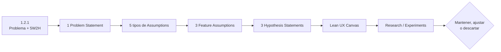

### 1.2.2. Lean UX Process

El **Lean UX Process** se utiliza en Nexa para convertir el entendimiento
preliminar de la problemática en un conjunto explícito de creencias que puedan
ser contrastadas posteriormente mediante investigación y experimentación. El
punto de partida es la sección 1.2.1, donde se identifica como problema central
la posible pérdida de continuidad confiable de la información cuando un pedido
B2B cambia de persona, lugar o responsabilidad durante la preparación, el
despacho, la entrega y la recepción.

Lean UX parte de reconocer que el equipo todavía no conoce con certeza cuáles
fricciones son más frecuentes, qué magnitud tienen ni qué solución será más
efectiva. Por ello, las ideas iniciales se expresan como **assumptions** e
**hypotheses**, no como requisitos definitivos ni como resultados ya validados
(Gothelf & Seiden, 2021).

El alcance actual de investigación se organiza alrededor de tres segmentos
objetivo:

1. **Warehouse & Dispatch Operations**, que reúne para fines de investigación
   las actividades consecutivas de Warehouse Operator y Dispatch Coordinator
   durante preparación, readiness y handoff, manteniendo la diferencia entre
   ambos actores;
2. **Driver Delivery Execution**, centrado en Driver / Delivery Operator durante
   la entrega asignada, el Delivery Attempt, sus incidencias, resultado y
   evidencia;
3. **B2B Buyers**, centrado en Customer Buyer durante la recepción, verificación
   y comunicación de discrepancias desde la empresa compradora.

Estos tres segmentos constituyen el **foco actual de Product y de investigación
Mobile priorizado**. Sales Representative permanece como actor de Nexa, pero su movilidad
comercial queda fuera del alcance Mobile priorizado actual como capacidad comercial
candidata de conveniencia dentro de Nexa Operations Mobile. La investigación no
debe volver a fusionar Sales con Warehouse o Logistics; lo que sí debe contrastar
son las necesidades, comportamientos, fricciones y beneficios atribuidos a los
tres segmentos actuales.

El proceso se documenta mediante cuatro artefactos relacionados:

- **Lean UX Problem Statements**, donde se formula un único Problem Statement
  para todo el proyecto;
- **Lean UX Assumptions**, donde se hacen explícitas las Business Assumptions,
  Business Outcome Assumptions, User Assumptions, User Outcome and Benefit
  Assumptions y Feature Assumptions;
- **Lean UX Hypothesis Statements**, donde cada Feature Assumption se relaciona
  con un business outcome, users y user outcome/benefit;
- **Lean UX Canvas**, donde se sintetiza el razonamiento mediante Business
  Problem, Business Outcomes, Users, User Outcomes and Benefits, Solutions,
  Hypotheses, Learning y MVPs/Experiments.

Para mantener el foco de aprendizaje, esta versión utiliza **tres Feature
Assumptions primarias y tres Hypothesis Statements**, una por cada segmento
objetivo. Capacidades como identificación con cámara o escáner, evidencia manual
de condición, actualizaciones críticas, navegación externa o recuperación
temporal limitada se conservan como posibles capacidades de apoyo dentro de esos
recorridos y no se convierten, en esta etapa, en hypotheses independientes.

*Relación entre problema, assumptions, hypotheses y aprendizaje*

 *Nota.* Elaboración propia a partir del proceso aplicado en Nexa y del Lean UX Canvas de Gothelf y Seiden (2021).

El contenido de esta sección representa el **baseline de aprendizaje previo a la
investigación primaria**. Posteriormente, la evidencia podrá mantener, ajustar o
descartar assumptions e hypotheses. Las conclusiones del proyecto deberán mostrar
esos cambios de manera explícita en lugar de reescribir retroactivamente las
creencias iniciales como si siempre hubieran estado validadas.

#### 1.2.2.1. Lean UX Problem Statements

Lean UX utiliza el Problem Statement para enmarcar la problemática sin convertir
anticipadamente una idea de solución en un requisito. Para una iniciativa nueva,
el patrón organiza cinco elementos: el estado actual del dominio y sus flujos, la
brecha que las alternativas existentes no resuelven suficientemente, la
estrategia general de la propuesta, el foco inicial y los comportamientos
observables que indicarían progreso.

Nexa formula **un único Problem Statement para todo el proyecto**. Su contenido
se deriva de los antecedentes y del análisis 5W2H de la sección 1.2.1. Las
fricciones y comportamientos descritos a continuación siguen siendo hipótesis de
producto y deberán contrastarse con investigación primaria.

##### Iniciativa nueva

###### The current state of the domain we are working in has focused mainly on...

La coordinación de pedidos B2B en empresas importadoras, distribuidoras y
mayoristas exige que un pedido atraviese diferentes personas, espacios y
responsabilidades antes de cerrar su recorrido. La intención comercial se
transforma en preparación física, readiness, despacho, entrega y finalmente
recepción por parte de la empresa compradora.

El contexto empresarial peruano es amplio y heterogéneo. La evidencia revisada
en 1.2.1 muestra una fuerte presencia de empresas vinculadas con comercio, junto
con diferencias relevantes de escala organizacional y adopción digital
(INEI, 2025b; Grupo Lucky, 2022). Estas fuentes no describen directamente a los
futuros usuarios de Nexa, pero permiten sostener que las organizaciones pueden
combinar herramientas administrativas, documentos, hojas de cálculo,
aplicaciones y mensajería dentro de un mismo proceso.

La hipótesis central es que la dificultad no consiste solamente en la existencia
de múltiples herramientas. El problema puede aparecer cuando **el contexto
necesario para continuar el trabajo pierde claridad al cambiar la responsabilidad
sobre el pedido**. Una persona puede necesitar reconstruir qué ocurrió antes,
qué producto o entrega está tratando, cuál es la siguiente acción y qué evidencia
debe conservar para que la etapa posterior sea comprensible.

Desde la perspectiva de los segmentos actuales, esta problemática se expresa de
manera distinta:

- en **Warehouse & Dispatch Operations**, puede aparecer entre recepción,
  preparación, readiness y handoff, donde Warehouse Operator y Dispatch
  Coordinator trabajan sobre hechos relacionados pero conservan
  responsabilidades diferentes;
- en **Driver Delivery Execution**, puede aparecer cuando Driver / Delivery
  Operator necesita reconocer la entrega asignada, ejecutar un Delivery Attempt,
  gestionar una incidencia y conservar un resultado o evidencia atribuibles;
- en **B2B Buyers**, puede aparecer cuando Customer Buyer necesita comprender qué
  entrega esperaba, qué recibió realmente y cómo comunicar una discrepancia sin
  depender de reconstrucciones posteriores.

Cuando la operación involucra lote, vencimiento, condición o temperatura, la
pérdida de contexto puede adquirir consecuencias adicionales. Estas condiciones
constituyen una especialización relevante de Nexa y no una característica
obligatoria de todos los clientes.

###### What existing products or services fail to address is...

Las organizaciones pueden disponer de sistemas administrativos, ERP, soluciones
de inventario, herramientas logísticas, hojas de cálculo o canales de
comunicación que resuelven partes importantes del recorrido. La oportunidad que
Nexa busca explorar aparece cuando la persona que continúa una tarea **todavía
necesita reinterpretar información, consultar varias fuentes o pedir
aclaraciones para comprender qué ocurrió antes y qué debe hacer ahora**.

La brecha no se define como “falta de software” ni como “falta de
digitalización”. Se define como la posible falta de **continuidad confiable entre
hechos y responsabilidades** a lo largo del pedido. Esta brecha puede
manifestarse mediante aclaraciones repetidas, búsqueda en varios canales,
reingreso de información, evidencia difícil de asociar, errores de preparación o
incertidumbre frente a diferencias entre lo entregado y lo recibido.

Las tres perspectivas deben mantenerse separadas. El handoff registrado por
Warehouse o Dispatch no demuestra por sí solo el resultado posterior de la
entrega; el resultado declarado por Driver / Delivery Operator no equivale a la
recepción o aceptación de Customer Buyer; y la recepción del Buyer no debe
reescribir retroactivamente los hechos registrados por otros participantes.

###### Our product or service will address this gap by...

Nexa explorará una **estrategia de coordinación digital orientada por rol** para
preservar contexto útil y trazable cuando cambia la responsabilidad sobre el
pedido. La propuesta busca que cada participante pueda reconocer la tarea que le
corresponde, comprender los hechos relevantes de las etapas anteriores y
registrar su propio resultado sin apropiarse de la responsabilidad de otro actor.

La estrategia prioriza:

- claridad sobre la tarea y la siguiente acción;
- continuidad entre preparación, readiness, handoff, Delivery Attempt y
  recepción;
- trazabilidad de hechos, incidencias y evidencias;
- separación entre Driver outcome y Buyer receipt;
- reducción de reconstrucción manual del contexto;
- una experiencia que pueda acompañar el trabajo físico cuando ello aporte valor;
- soporte de lote, vencimiento o condición cuando la operación lo requiera.

El problema y la estrategia de coordinación no dependen de un dispositivo. La
hipótesis Mobile se limita a los momentos en que el trabajo se realiza junto a la
mercadería, durante la entrega o en el punto de recepción; deberá contrastarse
frente a alternativas que también puedan conservar el contexto requerido. El
framework Mobile, los proveedores externos, el detalle del escaneo, las
notificaciones, la navegación y otras decisiones técnicas permanecen fuera de
este Problem Statement y deberán justificarse posteriormente.

###### Our initial focus will be...

El foco inicial se concentra en tres segmentos objetivo:

1. **Warehouse & Dispatch Operations**, con Warehouse Operator y Dispatch
   Coordinator como actores principales del recorrido de preparación y salida;
2. **Driver Delivery Execution**, con Driver / Delivery Operator como actor del
   recorrido de entrega;
3. **B2B Buyers**, con Customer Buyer como actor de la recepción desde la empresa
   compradora.

La agrupación de Warehouse y Dispatch responde a que ambos participan en una
secuencia física consecutiva que debe investigarse como transición de contexto.
No significa que constituyan el mismo rol ni que compartan las mismas
responsabilidades.

Sales Representative permanece dentro del producto Nexa, pero **no forma parte
del foco Mobile priorizado de esta investigación**. Su movilidad comercial queda
fuera del alcance Mobile priorizado actual como capacidad candidata de
conveniencia dentro de Nexa Operations Mobile y no se fusiona nuevamente con
Warehouse & Dispatch Operations.

La investigación posterior deberá precisar las características internas de cada
segmento, las prácticas actuales, la frecuencia de sus fricciones y el valor de
los outcomes planteados. No se asumirán perfiles demográficos, fricciones o
comportamientos representativos sin evidencia primaria.

###### We’ll know we are successful when we see...

La dirección propuesta mostrará señales favorables cuando, respecto de una línea
base obtenida durante la investigación, se observen comportamientos como los
siguientes:

- **Warehouse & Dispatch Operations:** menor tiempo para reconocer la siguiente
  acción, menos fuentes consultadas, menos aclaraciones entre preparación y
  handoff y mayor proporción de tareas continuadas sin asistencia;
- **Driver Delivery Execution:** mayor proporción de Delivery Attempts cuyo
  resultado, incidencia y evidencia puedan atribuirse correctamente a la entrega
  correspondiente, con menos aclaraciones posteriores;
- **B2B Buyers:** mayor proporción de recepciones y discrepancias verificadas con
  contexto suficiente, con menor necesidad de reconstrucción mediante llamadas,
  mensajes u otras fuentes;
- de manera transversal, disminución de errores de asociación, retrabajo,
  consultas repetidas y tiempo destinado a reconstruir información cuando esas
  variables puedan medirse responsablemente.

Estos comportamientos constituyen **criterios iniciales de éxito y aprendizaje**,
no métricas ya alcanzadas. Para cada experimento se deberá obtener primero una
línea base y definir posteriormente un objetivo medible antes de evaluar la
hypothesis correspondiente.

##### Trazabilidad entre 5W2H y el Problem Statement

*Relación entre el análisis 5W2H y el Problem Statement*

| Componente del Problem Statement | 5W2H relacionado | Aplicación en Nexa |
| --- | --- | --- |
| **Estado actual del dominio** | What, Where, When | El pedido cambia de contexto entre preparación, despacho, ruta y recepción. |
| **Personas afectadas** | Who | Warehouse Operator, Dispatch Coordinator, Driver / Delivery Operator y Customer Buyer, agrupados en tres segmentos de investigación. |
| **Brecha** | What, Why, How | El contexto puede fragmentarse o requerir reinterpretación al cambiar la responsabilidad. |
| **Momentos críticos** | Where, When | Preparación, readiness, handoff, Delivery Attempt y recepción/discrepancia. |
| **Manifestaciones** | How | Aclaraciones, múltiples fuentes, retrabajo, evidencia difícil de asociar e incertidumbre. |
| **Magnitud** | How Much | Todavía no cuantificada para los usuarios de Nexa; requiere línea base de investigación. |

*Nota.* Elaboración propia a partir del análisis 5W2H desarrollado en 1.2.1.

##### Criterios iniciales de éxito por segmento

*Comportamientos e indicadores iniciales*

| Segmento | Cambio de comportamiento esperado | Indicadores iniciales |
| --- | --- | --- |
| **Warehouse & Dispatch Operations** | Continuar preparación, readiness y handoff con menor reconstrucción de información. | Tiempo para identificar la siguiente acción; fuentes consultadas; aclaraciones; tareas completadas sin asistencia; errores u omisiones. |
| **Driver Delivery Execution** | Ejecutar y documentar el Delivery Attempt manteniendo resultado y evidencia asociados a la entrega correcta. | Tiempo para reconocer la entrega; intentos con resultado identificable; evidencias atribuibles; incidencias contextualizadas; consultas posteriores. |
| **B2B Buyers** | Verificar la recepción y comunicar discrepancias con suficiente contexto. | Tiempo de verificación; tareas completadas sin asistencia; discrepancias registradas con contexto; consultas adicionales al proveedor. |

 *Nota.* Los indicadores orientan la obtención de una línea base. Los valores objetivo se definirán antes de cada validación y no se inventan en esta etapa.

##### Alcance y límites del Problem Statement

El Problem Statement determina el problema y la dirección de aprendizaje, pero
no define todavía la solución final. En consecuencia:

- una aplicación Mobile no se considera valiosa únicamente por existir;
- las necesidades atribuidas a los segmentos todavía requieren evidencia
  primaria;
- Warehouse Operator y Dispatch Coordinator conservan responsabilidades
  diferentes aunque compartan un segmento de investigación;
- Driver outcome, Buyer receipt y POD permanecen como hechos distintos;
- la cadena de frío se considera cuando corresponda y no como requisito
  universal;
- las capacidades de Sales se mantienen fuera del núcleo Mobile priorizado;
- cámara, escáner, almacenamiento local, navegación, notificaciones u otros
  mecanismos son capacidades candidatas, no conclusiones de esta sección;
- una feature construida no constituye por sí sola evidencia de éxito: el
  criterio relevante es el cambio observable de comportamiento o resultado.

Esta formulación constituye el punto de partida de las Assumptions de la sección
siguiente.
