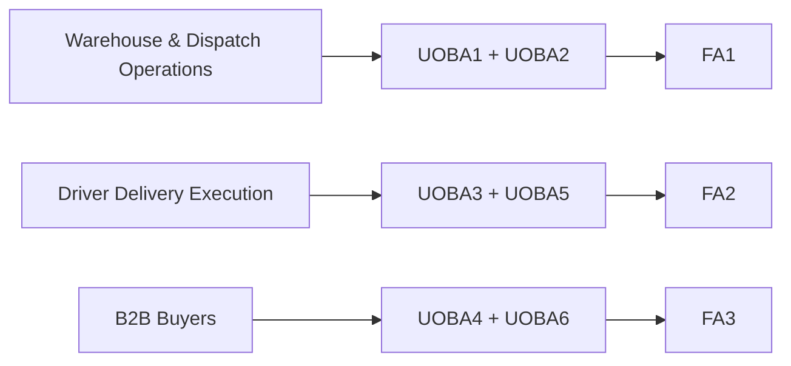

#### 1.2.2.2. Lean UX Assumptions

Las **assumptions** representan creencias iniciales formuladas a partir de
evidencia limitada. Su propósito es hacer explícito aquello que el equipo todavía
no sabe con certeza para poder investigarlo posteriormente. No se presentan como
hechos, requisitos definitivos ni resultados de aceptación
(Gothelf & Seiden, 2021).

En Nexa se utilizan cinco grupos: **Business Assumptions, Business Outcome
Assumptions, User Assumptions, User Outcome and Benefit Assumptions y Feature
Assumptions**. Cada grupo responde a una parte distinta del razonamiento y se
mantiene relacionado con el Problem Statement anterior.

Esta versión conserva **tres Feature Assumptions primarias**, una por cada
segmento objetivo, para producir tres Hypothesis Statements suficientemente
enfocadas. Las capacidades de soporte que antes aparecían como hipótesis
separadas se mantienen visibles, pero subordinadas al flujo principal al que
sirven.

##### Business Assumptions

- **BA1 — Relevancia de la continuidad B2B.** Creemos que importadores,
  distribuidores y mayoristas pueden experimentar fricción relevante cuando la
  preparación, el despacho, la entrega y la recepción dependen de información
  distribuida entre personas, sistemas y canales.

- **BA2 — Valor de Mobile como complemento.** Creemos que Mobile puede aportar
  valor cuando una tarea ocurre cerca de la mercadería, durante una entrega o en
  un punto de recepción y resulta incómodo depender de una estación de
  escritorio.

- **BA3 — Adopción progresiva.** Creemos que Nexa tendrá mayor posibilidad de
  adopción si complementa herramientas existentes y mejora transiciones
  específicas antes que exigir un reemplazo inmediato de todos los sistemas de
  la organización.

- **BA4 — Monetización B2B SaaS.** Creemos que una organización puede estar
  dispuesta a pagar por Nexa cuando la mejora de continuidad, trazabilidad y
  reducción de retrabajo sea suficientemente relevante para su operación.

- **BA5 — Servicio repetible.** Creemos que Nexa puede atender múltiples
  empresas mediante un modelo de servicio común, configuración y onboarding,
  sin convertir cada cliente en una solución totalmente distinta.

- **BA6 — Especialización sin cierre de mercado.** Creemos que lote,
  vencimiento, condición y evidencia de temperatura pueden diferenciar a Nexa en
  operaciones que realmente las necesitan sin limitar el producto
  exclusivamente a cadena de frío.

##### Business Outcome Assumptions

**Tabla**

*Business Outcome Assumptions y métricas iniciales*

| ID | Business Outcome Assumption | Métricas iniciales |
| --- | --- | --- |
| **BOA1 — Continuidad Warehouse & Dispatch** | Creemos que disminuirá el esfuerzo necesario para continuar una tarea entre preparación, readiness y handoff cuando el contexto relevante permanezca disponible durante la transición. | Tiempo para identificar siguiente acción; número de fuentes consultadas; aclaraciones por tarea; tareas completadas sin asistencia; errores u omisiones. |
| **BOA2 — Trazabilidad del Delivery Attempt** | Creemos que aumentará la proporción de intentos de entrega cuyo resultado, incidencia y evidencia puedan reconstruirse sin aclaraciones posteriores con el Driver. | Intentos con resultado identificable; evidencia atribuible; incidencias contextualizadas; errores de asociación; consultas posteriores al Driver. |
| **BOA3 — Autonomía en recepción Buyer** | Creemos que aumentará la proporción de recepciones y discrepancias que el Buyer puede verificar o comunicar con contexto suficiente y menor dependencia de coordinación manual posterior. | Tiempo de verificación; tareas sin asistencia; discrepancias contextualizadas; consultas manuales posteriores; errores de interpretación. |
| **BOA4 — Señales de adopción** | Creemos que, si los recorridos prioritarios generan valor, aparecerán señales de reutilización y disposición de la organización a continuar evaluando o utilizando Nexa. | Reutilización de flujos; frecuencia de retorno; continuidad del piloto; intención de uso posterior; abandono del flujo. |

> *Nota.* Los indicadores expresan qué observar. La línea base se obtiene antes
> de cada validación. Cualquier valor numérico se fija antes del experimento a
> partir de esa línea base y no se interpreta como resultado de validación.

###### Definition of Done del aprendizaje inicial

Una Business Outcome Assumption no se considera respaldada porque una feature
haya sido construida. Para cerrar un ciclo de aprendizaje deberá cumplirse, como
mínimo, lo siguiente:

1. existe una **línea base** obtenida de la práctica actual o de una tarea de
   referencia;
2. antes del experimento se define un **objetivo observable y medible**;
3. se registra evidencia suficiente para comparar el comportamiento observado
   con la línea base;
4. se documentan contradicciones, errores y casos donde la propuesta no aporta
   valor;
5. la assumption recibe una decisión explícita: **mantener, ajustar o
   descartar**;
6. si la evidencia todavía es insuficiente, el resultado permanece abierto y no
   se presenta como validación.

##### User Assumptions

- **UA1 — Warehouse Operator.** Creemos que Warehouse Operator realiza tareas de
  recepción, identificación, lote, condición, picking y preparación mientras
  combina atención al entorno físico con consulta o registro de información.

- **UA2 — Dispatch Coordinator.** Creemos que Dispatch Coordinator necesita
  reconocer qué entrega está lista para continuar, coordinar su salida y
  conservar claridad sobre el handoff y la responsabilidad asociada.

- **UA3 — Driver / Delivery Operator.** Creemos que Driver / Delivery Operator
  ejecuta entregas asignadas en movimiento, enfrenta incidencias variables y
  necesita registrar el resultado de cada Delivery Attempt con evidencia
  atribuible.

- **UA4 — Customer Buyer.** Creemos que Customer Buyer participa en la recepción
  de una entrega B2B y necesita comprender qué esperaba, qué recibió y qué
  diferencia debe comunicar cuando existe una discrepancia.

- **UA5 — Contexto Mobile variable.** Creemos que los tres segmentos realizan
  parte de sus tareas con atención dividida, presión de tiempo, movimiento o
  conectividad variable, por lo que una experiencia Mobile solo aportará valor
  si reduce esfuerzo sin crear ambigüedad sobre el estado real de la operación.

- **UA6 — Roles distintos dentro de un mismo segmento.** Creemos que Warehouse
  Operator y Dispatch Coordinator comparten una transición de trabajo relevante
  para investigación, pero tienen objetivos y responsabilidades suficientemente
  diferentes como para requerir observación separada dentro de
  Warehouse & Dispatch Operations.

##### User Outcome and Benefit Assumptions

- **UOBA1 — Preparación física con contexto.** Creemos que Warehouse Operator
  quiere identificar correctamente producto, cantidad, lote y condición, y saber
  cuál es la siguiente acción sin reconstruir información innecesariamente. El
  beneficio esperado es menor duda, búsqueda y retrabajo durante la tarea física.

- **UOBA2 — Readiness y handoff comprensibles.** Creemos que Dispatch
  Coordinator quiere comprender si una entrega está lista y transferir su
  responsabilidad sin perder contexto. El beneficio esperado es reducir
  omisiones, salidas prematuras y aclaraciones posteriores.

- **UOBA3 — Delivery Attempt defendible.** Creemos que Driver / Delivery
  Operator quiere ejecutar el intento correcto y conservar un resultado, una
  incidencia y evidencia atribuibles a la entrega correspondiente. El beneficio
  esperado es cerrar su responsabilidad con menor incertidumbre y menor
  reconstrucción posterior.

- **UOBA4 — Recepción y discrepancia con contexto.** Creemos que Customer Buyer
  quiere verificar lo recibido frente a lo esperado y comunicar una diferencia
  cuando exista. El beneficio esperado es reducir incertidumbre y facilitar la
  aclaración posterior mediante hechos identificables.

- **UOBA5 — Confianza sobre el estado de una acción.** Creemos que las personas
  necesitan distinguir con claridad entre una acción pendiente, temporal,
  confirmada o que requiere una intervención adicional. El beneficio esperado es
  evitar decisiones basadas en un estado incorrecto.

- **UOBA6 — Información crítica en el momento pertinente.** Creemos que Customer
  Buyer valora conocer cambios relevantes de una entrega esperada cuando esos
  cambios requieren atención, sin convertir Mobile en una copia completa de
  Buyer Portal.

##### Feature Assumptions

- **FA1 — Flujo Mobile de continuidad Warehouse & Dispatch.** Creemos que un
  recorrido Mobile que conserve el contexto autorizado desde preparación hasta
  readiness y handoff puede ayudar a Warehouse Operator y Dispatch Coordinator a
  continuar el trabajo con menos reconstrucción, aclaraciones y omisiones.

- **FA2 — Flujo Mobile de Delivery Attempt y evidencia.** Creemos que un
  recorrido Mobile centrado en la entrega asignada, el Delivery Attempt, su
  resultado, incidencias y evidencia puede ayudar a Driver / Delivery Operator a
  documentar su responsabilidad de manera atribuible y comprensible.

- **FA3 — Flujo Mobile de recepción y discrepancia Buyer.** Creemos que un
  recorrido Mobile acotado a la entrega esperada, la verificación de lo recibido
  y la comunicación de discrepancias puede ayudar a Customer Buyer a completar
  su parte del proceso con mayor claridad, sin replicar toda la experiencia
  comercial del Buyer Portal.

##### Capacidades de soporte conservadas dentro de las Feature Assumptions

**Tabla**

*Capacidades de soporte y Feature Assumption a la que sirven*

| Capacidad candidata | Relación principal | Condición de investigación |
| --- | --- | --- |
| Identificación mediante cámara o escáner, con alternativa manual | **FA1** | Debe comprobarse si reduce digitación o errores en tareas reales de Warehouse. |
| Registro manual de condición y temperatura cuando corresponda | **FA1** | Solo tiene valor donde lote, condición o cold chain sean realmente relevantes. |
| Readiness y handoff con responsable y evidencia identificables | **FA1** | Debe preservar la diferencia entre Warehouse y Dispatch. |
| Navegación externa durante una entrega activa | **FA2** | Puede apoyar la llegada al destino, sin implicar tracking continuo. |
| Evidencia asociada al Delivery Attempt | **FA2** | Debe mantener resultado, incidencia y evidencia vinculados a la entrega correcta. |
| Recuperación temporal limitada ante interrupciones | **FA2** | Un borrador local no puede convertirse en resultado final sin confirmación autoritativa. |
| Actualizaciones críticas de entrega | **FA3** | Debe comprobarse qué cambios requieren realmente la atención del Buyer. |
| Verificación y registro de discrepancia | **FA3** | Debe conservar la perspectiva Buyer sin sobrescribir el resultado del Driver. |

> *Nota.* La tabla preserva ideas previamente exploradas sin convertirlas en
> hypotheses separadas. Cada capacidad deberá justificarse mediante la
> investigación del recorrido principal al que sirve.

##### Trazabilidad de Assumptions hacia las Hypotheses

**Tabla**

*Matriz principal para formular las Hypothesis Statements*

| Feature Assumption | Business Outcome | Users | User Outcome / Benefit |
| --- | --- | --- | --- |
| **FA1** | **BOA1** | UA1, UA2, UA6 | UOBA1, UOBA2 |
| **FA2** | **BOA2** | UA3, UA5 | UOBA3, UOBA5 |
| **FA3** | **BOA3** | UA4 | UOBA4, UOBA6 |

Las Business Assumptions BA1–BA6 y BOA4 permanecen como contexto transversal de
mercado, adopción y sostenibilidad del producto. No se fuerzan dentro del
template de una hypothesis cuando no forman parte directa de la relación causal
que se desea contrastar.

**Figura**

*Relación entre segmentos, outcomes y Feature Assumptions*

> *Nota.* Elaboración propia. La figura muestra la relación principal utilizada
> para construir las Hypothesis Statements.

##### Síntesis

El conjunto de assumptions expresa una cadena coherente: creemos que existe una
fricción de continuidad B2B; identificamos a Warehouse & Dispatch Operations,
Driver Delivery Execution y B2B Buyers como foco actual; describimos los
resultados que creemos que cada grupo intenta obtener; y proponemos tres
recorridos Mobile capaces de producir esos outcomes. La sección siguiente
convierte esas tres Feature Assumptions en tres Hypothesis Statements.
