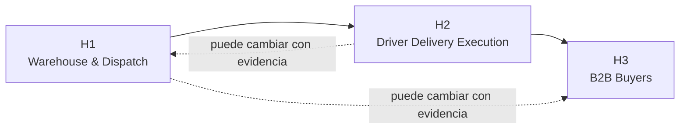

#### 1.2.2.3. Lean UX Hypothesis Statements

Las **Hypothesis Statements** reúnen assumptions relacionadas en afirmaciones
específicas que puedan investigarse y probarse. Lean UX recomienda formular cada
hypothesis vinculando un **business outcome**, las **personas**, el **user
outcome o benefit** y una **feature o solución** (Gothelf & Seiden, 2021).

Nexa mantiene una relación uno a uno entre las tres Feature Assumptions y las
tres hypotheses: **FA1→H1, FA2→H2 y FA3→H3**. De esta forma, las hypotheses
permanecen enfocadas en recorridos concretos y evitan convertir tecnologías o
capacidades de soporte en objetivos por sí mismas.

##### H1 — Continuidad Warehouse & Dispatch

**We believe we will achieve:** una reducción del esfuerzo necesario para
continuar tareas entre preparación, readiness y handoff, observable mediante
menos fuentes consultadas, menos aclaraciones, menor tiempo para reconocer la
siguiente acción y menos errores u omisiones (**BOA1**).

**If:** **Warehouse Operator y Dispatch Coordinator**, manteniendo sus
responsabilidades diferenciadas dentro de Warehouse & Dispatch Operations
(**UA1, UA2, UA6**)

**Attain:** preparar y continuar una entrega con claridad sobre producto,
cantidad, lote o condición cuando corresponda, comprender si está lista para
salida y realizar el handoff sin reconstruir innecesariamente el contexto
(**UOBA1, UOBA2**)

**With:** un **flujo Mobile de continuidad Warehouse & Dispatch** que preserve el
contexto autorizado desde preparación hasta readiness y handoff (**FA1**).

**Qué debe observarse**

- tiempo para reconocer la siguiente acción;
- número de fuentes o canales consultados;
- aclaraciones entre Warehouse y Dispatch;
- tareas completadas sin asistencia;
- errores, omisiones o correcciones detectadas;
- diferencias de necesidad entre Warehouse Operator y Dispatch Coordinator.

**Riesgo principal que podría invalidarla**

Que la pérdida de continuidad entre preparación y handoff no sea una fricción
frecuente o importante, que ambos roles requieran experiencias demasiado
diferentes para beneficiarse de un mismo recorrido, o que el flujo propuesto
agregue más carga que valor durante el trabajo físico.

##### H2 — Delivery Attempt y evidencia atribuible

**We believe we will achieve:** una mayor proporción de Delivery Attempts cuyo
resultado, incidencias y evidencia puedan comprenderse posteriormente sin
depender de aclaraciones adicionales con Driver / Delivery Operator
(**BOA2**).

**If:** el **Driver / Delivery Operator**, trabajando durante una jornada móvil
y bajo condiciones variables de atención y conectividad (**UA3, UA5**)

**Attain:** reconocer la entrega asignada, ejecutar el Delivery Attempt y
conservar un resultado, una incidencia y evidencia atribuibles a la entrega
correcta, comprendiendo además si una acción quedó realmente confirmada
(**UOBA3, UOBA5**)

**With:** un **flujo Mobile de Delivery Attempt y evidencia** centrado en la
entrega asignada y en el registro explícito de lo ocurrido (**FA2**).

**Qué debe observarse**

- tiempo para reconocer la entrega correcta;
- intentos con resultado claramente identificable;
- evidencias atribuibles a la entrega correspondiente;
- incidencias registradas con contexto suficiente;
- acciones duplicadas o estados mal interpretados;
- aclaraciones posteriores solicitadas al Driver.

**Riesgo principal que podría invalidarla**

Que las incidencias o problemas de atribución sean poco frecuentes, que Driver /
Delivery Operator prefiera mecanismos actuales por ser más rápidos, o que el uso
Mobile durante la jornada introduzca distracciones, ambigüedad o carga operativa
adicional.

##### H3 — Recepción y discrepancia B2B Buyer

**We believe we will achieve:** una mayor proporción de recepciones y
discrepancias que puedan verificarse o comunicarse con contexto suficiente y con
menor dependencia de coordinación manual posterior con el proveedor
(**BOA3**).

**If:** el **Customer Buyer** autorizado dentro de la empresa compradora
(**UA4**)

**Attain:** reconocer la entrega esperada, comparar lo recibido con lo esperado y
comunicar una discrepancia cuando exista, conservando suficiente contexto para
comprender posteriormente la recepción (**UOBA4, UOBA6**)

**With:** un **flujo Mobile acotado de recepción y discrepancia Buyer** que
presente la entrega esperada y permita verificar o registrar la diferencia sin
replicar toda la experiencia del Buyer Portal (**FA3**).

**Qué debe observarse**

- tiempo necesario para verificar una recepción;
- tareas completadas sin asistencia;
- discrepancias registradas con contexto suficiente;
- errores de interpretación entre entrega y recepción;
- consultas manuales posteriores al proveedor;
- utilidad real de actualizaciones críticas antes de la recepción.

**Riesgo principal que podría invalidarla**

Que la recepción sea realizada principalmente por perfiles distintos al Buyer
esperado, que la frecuencia de discrepancias no justifique un flujo dedicado, o
que los participantes prefieran resolver la recepción exclusivamente mediante
contacto directo con el proveedor.

##### Trazabilidad de las Hypothesis Statements

*Trazabilidad entre assumptions e hypotheses*

| Hypothesis | Business Outcome | Users | User Outcome / Benefit | Feature Assumption |
| --- | --- | --- | --- | --- |
| **H1** | BOA1 | UA1, UA2, UA6 | UOBA1, UOBA2 | FA1 |
| **H2** | BOA2 | UA3, UA5 | UOBA3, UOBA5 | FA2 |
| **H3** | BOA3 | UA4 | UOBA4, UOBA6 | FA3 |

> *Nota.* La matriz utiliza la relación principal necesaria para formular cada
> hypothesis. El resto de las assumptions continúa proporcionando contexto y
> deberá contrastarse mediante investigación.

##### Métricas y criterios de aprendizaje

El éxito de una hypothesis no se determina por haber construido la feature. Cada
validación deberá comparar el comportamiento observado contra una línea base.

*Indicadores y criterio de cierre por hypothesis*

| Hypothesis | Indicadores principales | Criterio de cierre del ciclo |
| --- | --- | --- |
| **H1** | Tiempo de siguiente acción; fuentes consultadas; aclaraciones; asistencia; errores u omisiones. | Se obtiene línea base, se define objetivo antes del experimento, se compara el flujo propuesto y se decide mantener, ajustar o descartar FA1. |
| **H2** | Entregas correctamente identificadas; resultados atribuibles; evidencias contextualizadas; aclaraciones posteriores; errores de estado. | Se obtiene línea base, se prueba la comprensión del Delivery Attempt y se decide mantener, ajustar o descartar FA2. |
| **H3** | Tiempo de verificación; tareas sin asistencia; discrepancias contextualizadas; consultas posteriores; errores de interpretación. | Se obtiene línea base, se prueba la recepción/discrepancia y se decide mantener, ajustar o descartar FA3. |

No se establecen porcentajes arbitrarios antes de conocer la línea base. El
criterio numérico de éxito de cada experimento deberá quedar fijado **antes de
realizarlo** para evitar interpretar los resultados a conveniencia.

*Evidencia que orientaría la decisión inicial sobre cada hypothesis*

| Hypothesis | Mantener | Ajustar | Descartar |
| --- | --- | --- | --- |
| **H1** | La transición preparación → readiness → handoff aparece como fricción material y el recorrido propuesto reduce reconstrucción sin confundir responsabilidades. | La fricción existe, pero Warehouse y Dispatch necesitan recorridos o información claramente distintos. | La fricción no es material o el recorrido agrega más carga que valor. |
| **H2** | Se observan problemas de atribución y el recorrido facilita reconocer la entrega, el Attempt y la evidencia sin ambigüedad. | El problema existe, pero el alcance, la evidencia requerida o la recuperación ante interrupciones deben cambiar. | La atribución no representa una fricción relevante o la propuesta empeora la ejecución del Driver. |
| **H3** | Customer Buyer realiza o respalda la recepción y el recorrido reduce incertidumbre o coordinación manual posterior. | La necesidad existe, pero otro perfil recibe o la discrepancia requiere un alcance distinto. | La recepción no justifica un recorrido Mobile dedicado o la propuesta no aporta contexto útil. |

> *Nota.* Esta tabla define criterios de aprendizaje; no registra decisiones ya
> tomadas ni evidencia de validación.

##### Priorización inicial de aprendizaje

Las tres hypotheses se consideran de valor potencial alto porque representan
transiciones consecutivas dentro del problema central. Como **supuesto inicial
del equipo**, la prioridad de aprendizaje se coloca en **H1 — Continuidad
Warehouse & Dispatch**
porque conecta dos actores distintos dentro del mismo proveedor y ocurre antes
de la salida física del pedido, de modo que una pérdida de contexto en este punto
puede propagarse hacia la entrega.

Esta priorización también es una assumption. La investigación puede demostrar que
H2 o H3 representa un problema más frecuente, costoso o crítico.

*Prioridad inicial*

| Hypothesis | Valor percibido | Incertidumbre | Prioridad |
| --- | --- | --- | --- |
| **H1 — Warehouse & Dispatch** | Alta | Alta | **Primera en aprendizaje** |
| **H2 — Driver Delivery Execution** | Alta | Alta | Segunda, inmediatamente después del handoff |
| **H3 — B2B Buyers** | Alta | Alta | Tercera dentro de la primera secuencia de aprendizaje |

##### Aprendizaje prioritario inicial

La primera pregunta de aprendizaje es:

> **¿Warehouse Operator y Dispatch Coordinator experimentan una pérdida de
> continuidad suficientemente relevante entre preparación, readiness y handoff
> como para que un flujo Mobile compartido, pero respetando sus responsabilidades
> diferentes, reduzca reconstrucción y aclaraciones?**

Responder esta pregunta requiere comprender primero el proceso actual y observar
qué información consulta cada actor, qué debe recibir del anterior, qué produce
para el siguiente y qué fricciones aparecen en la transición.

Las hypotheses H2 y H3 continúan siendo parte del mismo baseline y deberán
investigarse posteriormente dentro de la secuencia Driver → Buyer. La prioridad
no convierte H1 en una feature aceptada ni elimina las otras dos hypotheses.

*Secuencia inicial de aprendizaje*

> *Nota.* Elaboración propia. La prioridad representa el orden inicial de
> aprendizaje, no una decisión irreversible de alcance.
