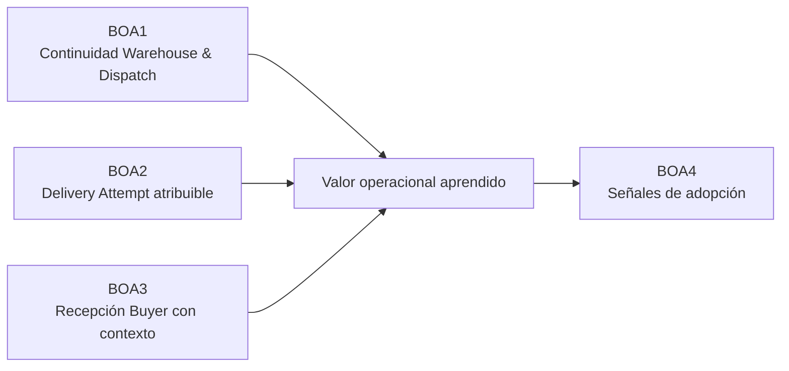
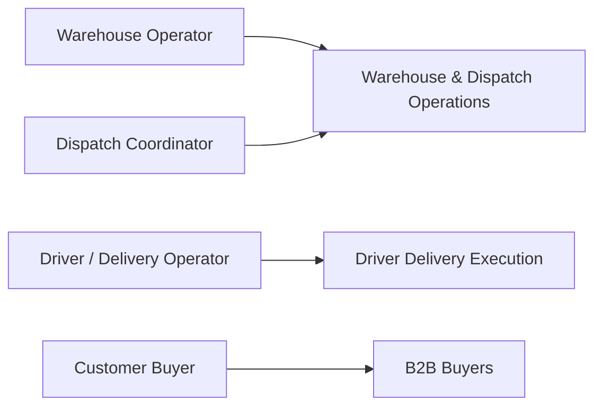
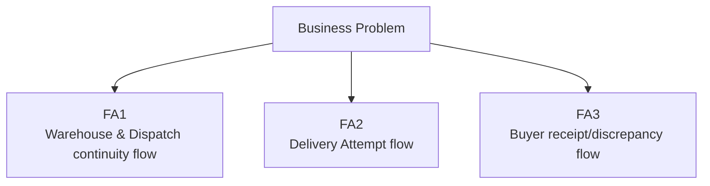
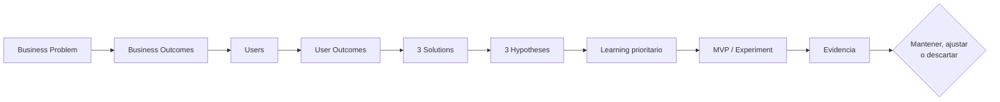

#### 1.2.2.4. Lean UX Canvas

El **Lean UX Canvas** sintetiza el razonamiento construido en las secciones
anteriores. Se presenta al final porque integra el Business Problem, Business
Outcomes, Users, User Outcomes and Benefits, Solutions, Hypotheses, Learning y
MVPs/Experiments en una vista común (Gothelf & Seiden, 2021).

Su contenido representa el estado inicial del aprendizaje. Ningún elemento del
Canvas se considera validado simplemente por aparecer en esta sección.

##### Canvas aplicado a Nexa

**Tabla**

*Lean UX Canvas de Nexa*

| Box | Contenido aplicado a Nexa |
| --- | --- |
| **1. Business Problem** | Importadores, distribuidores y mayoristas coordinan pedidos B2B que atraviesan preparación, despacho, entrega y recepción. La hipótesis central es que el contexto necesario para continuar el trabajo puede fragmentarse al cambiar la responsabilidad, generando aclaraciones, consulta de múltiples fuentes, retrabajo, errores de asociación o incertidumbre sobre lo ocurrido. La cadena de frío aumenta la relevancia de ciertas condiciones cuando corresponde, pero no define todo el mercado. |
| **2. Business Outcomes** | **BOA1:** reducir el esfuerzo de continuidad entre preparación, readiness y handoff. **BOA2:** aumentar Delivery Attempts cuyo resultado y evidencia sean atribuibles y comprensibles. **BOA3:** aumentar recepciones y discrepancias verificadas con contexto suficiente por Customer Buyer. **BOA4:** observar señales de reutilización y continuidad cuando los recorridos demuestren valor. |
| **3. Users** | **Warehouse & Dispatch Operations:** Warehouse Operator + Dispatch Coordinator, manteniendo roles distintos. **Driver Delivery Execution:** Driver / Delivery Operator. **B2B Buyers:** Customer Buyer. Sales Representative permanece como actor del producto, pero su movilidad comercial no forma parte del núcleo Mobile V1. |
| **4. User Outcomes and Benefits** | Warehouse Operator busca preparar con contexto y menor retrabajo; Dispatch Coordinator busca comprender readiness y realizar handoff sin perder responsabilidad; Driver / Delivery Operator busca ejecutar un Delivery Attempt defendible y conservar evidencia atribuible; Customer Buyer busca verificar la recepción y comunicar discrepancias con contexto. |
| **5. Solutions** | **FA1:** flujo Mobile de continuidad Warehouse & Dispatch. **FA2:** flujo Mobile de Delivery Attempt y evidencia. **FA3:** flujo Mobile de recepción y discrepancia Buyer. Capacidades como escaneo, condición/temperatura manual, navegación externa, actualizaciones críticas o recuperación temporal limitada se investigan dentro del recorrido principal al que sirven. |
| **6. Hypotheses** | **H1:** preservar contexto entre preparación, readiness y handoff puede reducir reconstrucción y aclaraciones para Warehouse Operator y Dispatch Coordinator. **H2:** centrar el flujo en Delivery Attempt puede mejorar la atribución de resultado, incidencia y evidencia para Driver. **H3:** un flujo de recepción/discrepancia puede permitir al Buyer verificar lo recibido con mayor contexto y menor coordinación manual posterior. |
| **7. Learning** | El aprendizaje prioritario inicial es comprobar si la transición **preparación → readiness → handoff** representa una fricción material para Warehouse Operator y Dispatch Coordinator y si preservar el contexto dentro de un flujo Mobile compartido reduce esfuerzo sin borrar las diferencias entre ambos roles. |
| **8. MVPs / Experiments** | El menor trabajo para aprender sobre H1 es observar primero el proceso actual y luego probar un **prototipo de baja fidelidad** del recorrido preparación → readiness → handoff con representantes reales de Warehouse y Dispatch. Se compararán comprensión de la siguiente acción, fuentes consultadas, aclaraciones, errores y necesidad de asistencia. |

##### Box 1 — Business Problem

El Business Problem se resume como la posible **falta de continuidad confiable de
la información cuando un pedido B2B cambia de responsabilidad**. No se presupone
que todas las empresas tengan el mismo problema ni que una aplicación Mobile sea
automáticamente la solución correcta.

##### Box 2 — Business Outcomes

Los business outcomes se evalúan mediante comportamiento y resultados, no por
cantidad de funcionalidades construidas. Antes de una validación se debe definir
la línea base y el valor objetivo correspondiente.

> *Nota.* Elaboración propia. BOA4 depende de que los recorridos individuales
> muestren valor suficiente para justificar reutilización o continuidad.

##### Box 3 — Users

Los Users del Canvas se apoyan en actores conocidos del dominio, pero **no son
todavía User Personas derivadas de investigación**.

La agrupación académica de Warehouse y Dispatch no modifica la semántica del
dominio ni los convierte en un único rol.

##### Box 4 — User Outcomes and Benefits

**Tabla**

*User outcomes y beneficios resumidos*

| User | Outcome | Benefit esperado |
| --- | --- | --- |
| Warehouse Operator | Preparar o recibir correctamente con contexto suficiente. | Menos dudas, búsquedas y retrabajo. |
| Dispatch Coordinator | Comprender readiness y realizar handoff identificable. | Menos omisiones y aclaraciones posteriores. |
| Driver / Delivery Operator | Ejecutar un Delivery Attempt y conservar resultado/evidencia atribuibles. | Menor incertidumbre y menor reconstrucción posterior. |
| Customer Buyer | Verificar recepción y comunicar discrepancia con contexto. | Mayor claridad y menor dependencia de coordinación manual. |

##### Box 5 — Solutions

La solución se mantiene deliberadamente a nivel de recorrido. El detalle de
cámara, escáner, almacenamiento local, mapas, notificaciones, proveedores o
frameworks deberá definirse después de comprobar que el recorrido principal
resuelve una necesidad relevante.

##### Box 6 — Hypotheses

**Tabla**

*Hypotheses del Canvas*

| ID | Hypothesis resumida |
| --- | --- |
| **H1** | Preservar contexto entre preparación, readiness y handoff puede reducir reconstrucción y aclaraciones para Warehouse Operator y Dispatch Coordinator. |
| **H2** | Centrar el flujo en la entrega asignada y el Delivery Attempt puede mejorar la atribución de resultado, incidencia y evidencia para Driver / Delivery Operator. |
| **H3** | Proporcionar un flujo acotado de recepción y discrepancia puede permitir a Customer Buyer verificar lo recibido con mayor contexto y menor coordinación manual posterior. |

##### Box 7 — Learning

La pregunta más importante a aprender primero es si el punto
**preparación → readiness → handoff** contiene suficiente fricción y valor como
para justificar FA1. La investigación debe identificar:

- qué información produce Warehouse y cuál necesita Dispatch;
- cuántas fuentes se consultan actualmente;
- qué aclaraciones aparecen;
- qué omisiones o errores son frecuentes;
- qué información es esencial y cuál resulta ruido;
- si un dispositivo Mobile ayuda o interfiere con el trabajo físico.

##### Box 8 — MVPs and Experiments

El MVP inicial no es una aplicación completa. Es **la menor prueba capaz de
responder la pregunta de aprendizaje prioritaria**.

**Experimento inicial propuesto**

1. entrevistar y observar representantes reales de Warehouse Operator y Dispatch
   Coordinator para reconstruir su flujo actual;
2. establecer una línea base sobre fuentes consultadas, tiempo, aclaraciones y
   errores observables;
3. diseñar un prototipo de baja fidelidad del recorrido
   preparación → readiness → handoff;
4. ejecutar tareas equivalentes con el prototipo;
5. comparar comportamientos con la línea base;
6. registrar evidencia a favor y en contra de H1;
7. decidir si FA1 se **mantiene, ajusta o descarta** antes de invertir en mayor
   fidelidad.

El mismo principio se aplicará posteriormente a H2 y H3. Una feature técnica
requerida por la solución académica puede terminar formando parte de la
implementación, pero no debe utilizarse como sustituto de la evidencia de que el
usuario obtiene un outcome.

##### Síntesis del Canvas

El Canvas mantiene una cadena explícita desde el problema hasta el experimento.
Esta estructura permite continuar hacia investigación y Needfinding sin
convertir las assumptions iniciales en conclusiones. El baseline deberá
permanecer trazable para que las etapas posteriores puedan mostrar qué cambió a
partir de la evidencia.
