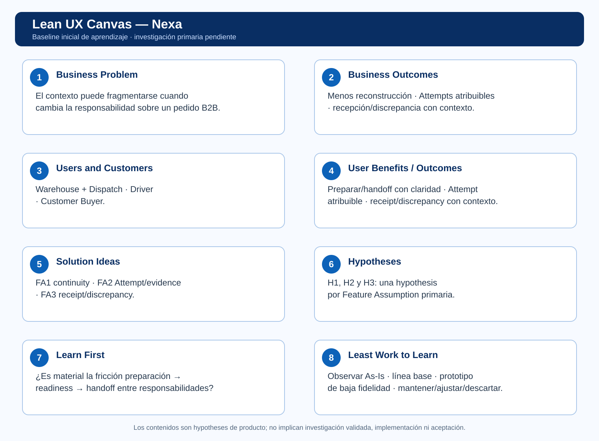

#### 1.2.2.4. Lean UX Canvas

El **Lean UX Canvas** concentra en una vista el razonamiento de las secciones
anteriores: problema, outcomes, usuarios, beneficios, ideas de solución,
hypotheses y aprendizaje (Gothelf & Seiden, 2021). Es una síntesis del baseline
inicial, no una segunda descripción exhaustiva de las Assumptions o las
Hypothesis Statements.

##### Canvas aplicado a Nexa

**Tabla**

*Síntesis textual del Lean UX Canvas de Nexa*

| Box | Síntesis aplicada a Nexa |
| --- | --- |
| **1. Business Problem** | Al cambiar la responsabilidad sobre un pedido B2B, el contexto necesario para continuar puede fragmentarse y obligar a reconstruir información. La cold chain es una especialización cuando aplica, no la definición del mercado. |
| **2. Business Outcomes** | Reducir reconstrucción entre preparación, readiness y handoff; aumentar Delivery Attempts atribuibles; aumentar recepción/discrepancia Buyer con contexto; observar reutilización si los recorridos generan valor. |
| **3. Users and Customers** | Warehouse Operator y Dispatch Coordinator dentro de MOB-SEG-01; Driver / Delivery Operator en MOB-SEG-02; Customer Buyer en MOB-SEG-03. Los actores no son todavía User Personas validadas. |
| **4. User Benefits / Outcomes** | Preparar y hacer handoff con claridad; ejecutar un Delivery Attempt atribuible; verificar recepción y comunicar discrepancias con contexto suficiente. |
| **5. Solution Ideas** | FA1: continuidad Warehouse & Dispatch. FA2: Delivery Attempt y evidencia. FA3: recepción y discrepancia Buyer. Las capacidades de dispositivo solo se evalúan si sirven a uno de estos recorridos. |
| **6. Hypotheses** | H1, H2 y H3 mantienen una relación uno a uno con FA1, FA2 y FA3; su detalle, riesgo y métricas se conserva en 1.2.2.3. |
| **7. Most important thing to learn first** | Determinar si la transición preparación → readiness → handoff genera una fricción material entre responsabilidades y si preservar contexto puede reducirla. |
| **8. Least amount of work needed to learn it** | Observar y entrevistar Warehouse y Dispatch, reconstruir el As-Is, obtener línea base, probar un prototipo de baja fidelidad y decidir mantener, ajustar o descartar H1. |

**Figura**

*Lean UX Canvas: baseline de aprendizaje de Nexa*

> *Nota.* La figura resume el Canvas textual anterior. Sus contenidos son
> hypotheses de producto y aprendizaje; no representan investigación primaria,
> implementación ni aceptación. Elaboración propia.

##### Interpretación de los boxes de aprendizaje

**Box 7.** El primer riesgo no es si una cámara, un mapa o un framework puede
funcionar. Es si la pérdida de continuidad entre preparación, readiness y
handoff es suficientemente material para justificar un recorrido compartido,
sin borrar las responsabilidades distintas de Warehouse Operator y Dispatch
Coordinator.

**Box 8.** El experimento mínimo combina observación e entrevistas de casos
recientes, una reconstrucción del As-Is y un prototipo de baja fidelidad. La
comparación debe registrar fuentes consultadas, aclaraciones, tiempo para
reconocer la siguiente acción, errores u omisiones y necesidad de asistencia.
Solo después de obtener una línea base se fija el objetivo observable de la
prueba.

##### Procedencia y reconciliación posterior

La cadena de evidencia se mantiene explícita:

`INITIAL LEAN UX BASELINE → PRIMARY RESEARCH → NEEDFINDING → RESEARCH RECONCILIATION`.

Los actores y segmentos del Canvas orientan el reclutamiento, pero no sustituyen
User Personas. Mientras falte evidencia suficiente, H1, H2 y H3 permanecen en
**RESEARCH PENDING**. La investigación posterior podrá clasificarlas como
SUPPORTED, ADJUSTED o DISCARDED sin reescribir retrospectivamente el baseline.
