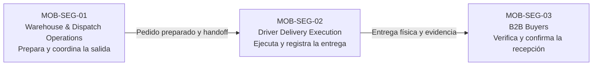

## 1.3. Segmentos objetivo

La segmentación de Nexa Mobile parte del propósito general de Nexa como una
solución **SaaS B2B multi-tenant para importadores, distribuidores y
mayoristas**, con una especialización relevante en operaciones donde la
trazabilidad, los lotes, la caducidad y la cadena de frío pueden ser factores
críticos.

Dentro de esta propuesta, la experiencia móvil busca acompañar momentos de
trabajo que ocurren fuera de un escritorio o que requieren interacción inmediata
con una operación física. Por ello, los segmentos objetivo no se organizan como
módulos del sistema, sino como **grupos de usuarios con responsabilidades,
contextos de uso, necesidades y fricciones diferentes**.

Para esta primera definición se consideran tres segmentos principales:

1. **MOB-SEG-01 — Warehouse & Dispatch Operations**, orientado al personal que
   ejecuta actividades físicas de almacén y coordina la preparación y salida de
   los pedidos.
2. **MOB-SEG-02 — Driver Delivery Execution**, orientado al personal responsable
   de ejecutar la entrega.
3. **MOB-SEG-03 — B2B Buyers**, orientado a compradores empresariales
   autorizados que reciben y verifican las entregas de sus pedidos.

La agrupación de **Warehouse Operator** y **Dispatch Coordinator** dentro de
MOB-SEG-01 responde a la cercanía de sus contextos operativos y a su
participación consecutiva en la preparación y salida de los pedidos. Esta
agrupación se utiliza únicamente como criterio de segmentación para la
investigación y no implica que ambos perfiles compartan las mismas
responsabilidades o niveles de autoridad dentro de Nexa.

Esta segmentación constituye una **hipótesis de producto informada por el
conocimiento actual de Nexa y por antecedentes históricos del proyecto**. La
evidencia histórica se utiliza como punto de partida y no como validación
vigente. Las características concretas de cada segmento serán contrastadas
posteriormente mediante investigación con representantes reales.

### Criterio de segmentación

Los segmentos se diferencian principalmente por cuatro variables:

- **Responsabilidad dentro del proceso:** preparar y coordinar, entregar o
  recibir.
- **Contexto físico de uso:** almacén, punto de despacho, ruta o establecimiento
  del comprador.
- **Tipo de decisión que necesita tomar el usuario:** verificar, registrar,
  coordinar o confirmar.
- **Valor esperado de una experiencia móvil:** rapidez, claridad, continuidad
  del trabajo y trazabilidad.

**Tabla**

*Resumen de los segmentos objetivo de Nexa Mobile*

| ID | Segmento | Usuarios representativos | Contexto principal | Necesidad central |
| --- | --- | --- | --- | --- |
| **MOB-SEG-01** | **Warehouse & Dispatch Operations** | Warehouse Operator y Dispatch Coordinator | Almacén, zona de recepción, picking, staging y punto de despacho; cámara de frío cuando corresponda | Ejecutar y verificar actividades físicas de almacén y preparación con información clara sobre productos, lotes, cantidades y condiciones. |
| **MOB-SEG-02** | **Driver Delivery Execution** | Driver / Delivery Operator | Vehículo, ruta y punto de entrega | Ejecutar las entregas asignadas, registrar lo ocurrido y conservar evidencia asociada al resultado de cada entrega. |
| **MOB-SEG-03** | **B2B Buyers** | Customer Buyer autorizado | Establecimiento o punto de recepción de la empresa compradora | Verificar la entrega, confirmar lo realmente recibido y comunicar discrepancias con claridad. |

> *Nota.* Los identificadores MOB-SEG corresponden exclusivamente a la
> segmentación académica y de investigación de Nexa Mobile. Los segmentos
> representan grupos de usuarios y necesidades de producto; no representan
> módulos técnicos, estructuras de implementación ni nuevos límites del dominio.
> Elaboración propia.

### Caracterización demográfica y estadística preliminar

En esta etapa no se asignan edades, niveles educativos, géneros o distribuciones
porcentuales específicas a los tres segmentos sin evidencia directa. Estas
características deberán obtenerse de las entrevistas y del análisis posterior.
Sin embargo, existen datos oficiales que permiten contextualizar la propuesta y
evitar que la segmentación se construya únicamente a partir de supuestos.

La estructura empresarial peruana muestra un entorno compuesto principalmente
por organizaciones de pequeña escala. En 2024, el **96,4 % de las empresas del
país correspondió a microempresas**, el 3,0 % a pequeñas empresas y el 0,6 % a
medianas y grandes empresas. Asimismo, el **43,5 % de las empresas desarrolló
actividades de comercio** y el **5,8 % actividades de transporte y
almacenamiento**. Lima concentró el 45,7 % del total de empresas registradas
(Instituto Nacional de Estadística e Informática [INEI], 2025a). Estos datos no
describen por sí solos a los clientes de Nexa, pero muestran la relevancia de
los entornos comerciales y logísticos dentro del contexto empresarial donde se
plantea inicialmente la investigación.

El uso del teléfono celular también resulta relevante para una propuesta móvil.
Durante el cuarto trimestre de 2025, el **89,2 % de la población usuaria de
Internet de seis años a más accedió al servicio mediante un teléfono celular**
(INEI, 2026a). Además, en el segundo trimestre de 2025 el uso de Internet
alcanzó el 93,3 % entre las personas de 25 a 40 años y el 81,1 % entre las de 41
a 59 años (INEI, 2025b). Estas cifras permiten reconocer que el acceso digital
móvil está extendido entre grupos de edad vinculados a la población adulta, sin
asumir que todos los integrantes de los segmentos de Nexa pertenezcan a un mismo
rango etario.

**Tabla**

*Contexto estadístico utilizado para la segmentación preliminar*

| Indicador | Dato disponible | Relevancia para la investigación |
| --- | --- | --- |
| Estructura empresarial del Perú, 2024 | 96,4 % microempresas; 3,0 % pequeñas empresas; 0,6 % medianas y grandes empresas | Sugiere que la investigación debe considerar organizaciones de distintas escalas y evitar asumir estructuras operativas complejas en todos los casos. |
| Empresas por actividad económica, 2024 | 43,5 % comercio; 5,8 % transporte y almacenamiento | Confirma la presencia significativa de actividades relacionadas con comercio, distribución y movimiento de bienes en el entorno empresarial peruano. |
| Concentración empresarial, 2024 | 45,7 % de las empresas se ubicó en Lima | Permite sustentar una posible concentración inicial del trabajo de campo en Lima sin convertirla en el único mercado potencial de Nexa. |
| Uso de Internet mediante teléfono celular, IV trimestre de 2025 | 89,2 % de la población usuaria de Internet accedió mediante celular | Sustenta la pertinencia de investigar experiencias móviles para tareas que requieren consulta o registro inmediato. |
| Uso de Internet por edad, II trimestre de 2025 | 93,3 % entre 25 y 40 años; 81,1 % entre 41 y 59 años | Aporta contexto demográfico preliminar, sin reemplazar la caracterización que deberá obtenerse de los participantes reales. |

> *Nota.* Los datos empresariales corresponden a información publicada por el
> INEI sobre la estructura empresarial del Perú en 2024. Los datos de uso de
> Internet corresponden a los informes técnicos de Tecnologías de Información y
> Comunicación en los Hogares de 2025. Los porcentajes se utilizan como contexto
> estadístico general y no como resultados obtenidos de los futuros
> entrevistados.

### Relación entre los segmentos

Los tres segmentos forman parte de un mismo recorrido de negocio, pero
participan en momentos diferentes. Para el recorrido de salida y entrega, el
personal de almacén y despacho prepara el pedido y coordina su handoff al
responsable de reparto. Luego, el Driver ejecuta la entrega física. Finalmente,
el Buyer verifica el handoff y confirma qué recibió realmente.

Esta separación es importante porque cada actor observa una parte distinta del
proceso. La información registrada por un segmento no sustituye automáticamente
la perspectiva de otro. Por ejemplo, que un Driver indique que realizó una
entrega no significa, por sí solo, que el Buyer haya confirmado la totalidad de
lo recibido.

**Figura**

*Relación conceptual entre los segmentos objetivo de Nexa Mobile*

> *Nota.* La figura representa el vínculo conceptual entre preparación,
> entrega y recepción. No implica que una confirmación o discrepancia registrada
> por el Buyer modifique automáticamente los hechos registrados previamente por
> otros participantes. Elaboración propia.

---

### MOB-SEG-01 — Warehouse & Dispatch Operations

El segmento **MOB-SEG-01 — Warehouse & Dispatch Operations** agrupa a las
personas que participan en la ejecución física del almacén y en la preparación
de pedidos para despacho. Esto comprende actividades asociadas con recepción e
identificación de mercadería, lotes y condiciones, así como picking,
preparación, staging y handoff hacia el responsable de la entrega.

Dentro de este segmento se consideran dos perfiles complementarios:

- **Warehouse Operator**, responsable de actividades relacionadas con recepción,
  identificación de productos y lotes, cantidades, condición del stock, picking
  y preparación física.
- **Dispatch Coordinator**, responsable de verificar que la entrega esté lista,
  coordinar su salida y asegurar una transición clara entre el almacén y el
  responsable de reparto.

Su trabajo ocurre en entornos donde la información debe consultarse al mismo
tiempo que se manipulan productos, cajas, etiquetas, lotes y documentos. Cuando
la operación lo requiere, también pueden existir condiciones adicionales
relacionadas con temperatura, caducidad y conservación.

#### Síntesis del segmento

- **Usuarios principales:** Warehouse Operator y Dispatch Coordinator.
- **Contexto dominante:** almacén, zona de recepción, picking, staging y punto
  de despacho; cámara de frío cuando corresponda.
- **Responsabilidad central:** ejecutar y verificar actividades físicas de
  almacén y preparar correctamente los pedidos para su salida.

#### Características preliminares del segmento

**Tabla**

*Características preliminares de Warehouse & Dispatch Operations*

| Variable | Caracterización propuesta |
| --- | --- |
| Tipo de trabajo | Operativo y de coordinación. |
| Relación con el producto físico | Alta: recepción, manipulación, identificación y verificación de mercadería. |
| Presión del rol | Puede aumentar durante recepción, preparación y despacho, especialmente cuando existen varias tareas simultáneas. |
| Entorno | Almacenes, zonas de recepción, picking y despacho; cámaras de frío cuando corresponda. |
| Interacción con otras áreas | Ventas, operaciones, transporte y responsables de entrega. |
| Riesgo principal | Que exista una diferencia entre la información disponible y lo que físicamente se recibe, prepara o entrega. |

> *Nota.* La caracterización corresponde a una hipótesis inicial y deberá ser
> contrastada con representantes reales del segmento.

#### Situaciones de trabajo a investigar

**Tabla**

*Situaciones de trabajo a investigar en MOB-SEG-01*

| Situación | Posible efecto en el trabajo |
| --- | --- |
| Consultar información mientras se manipula mercadería. | Puede aumentar la carga de atención si los datos necesarios no son fáciles de localizar o comprender. |
| Identificar producto, lote y cantidad durante recepción o preparación. | Una identificación incorrecta puede generar diferencias posteriores en inventario, preparación o entrega. |
| Coordinar prioridades entre pedidos y tareas pendientes. | La información dispersa puede provocar aclaraciones, interrupciones o retrabajo. |
| Comunicar diferencias o incidencias durante la operación. | Si una incidencia queda únicamente en conversaciones informales, puede perderse su contexto. |
| Trabajar en espacios con movimiento, frío o tiempo limitado. | La consulta y el registro de información deben adaptarse a un contexto físico exigente. |

#### Necesidades preliminares y valor esperado

**Tabla**

*Necesidades preliminares de MOB-SEG-01*

| Necesidad o situación a investigar | Valor esperado de Nexa Mobile |
| --- | --- |
| Dificultad para identificar rápidamente un producto o lote. | Facilitar el acceso a la información necesaria para continuar la tarea con claridad. |
| Información fragmentada entre recepción, preparación y despacho. | Mantener continuidad entre lo recibido, lo preparado y lo entregado al responsable de reparto. |
| Riesgo de preparar cantidades incorrectas. | Presentar con claridad las cantidades esperadas y las verificaciones realizadas. |
| Incidencias que quedan en conversaciones informales. | Permitir registrar diferencias y observaciones conservando el contexto de la operación. |
| Presión por completar tareas rápidamente. | Reducir pasos innecesarios y decisiones ambiguas durante las tareas frecuentes. |

---

### MOB-SEG-02 — Driver Delivery Execution

El segmento **MOB-SEG-02 — Driver Delivery Execution** representa a las personas
responsables de trasladar una entrega desde el punto de despacho hasta el lugar
de recepción del Buyer.

El Driver necesita conocer qué entregas le corresponden, identificar
correctamente cada destino y registrar lo ocurrido durante la entrega. La
movilidad forma parte natural de su contexto: puede encontrarse en ruta, dentro
del vehículo, frente al establecimiento del comprador o atendiendo una
incidencia.

La propuesta de Nexa Mobile para este segmento busca disminuir la dependencia de
llamadas, mensajes dispersos o evidencia difícil de recuperar, manteniendo una
relación clara entre la entrega asignada y lo que realmente ocurrió.

#### Síntesis del segmento

- **Usuario principal:** Driver / Delivery Operator.
- **Contexto dominante:** vehículo, ruta y punto de entrega.
- **Responsabilidad central:** ejecutar las entregas asignadas y registrar con
  claridad el resultado de cada una.

#### Características preliminares del segmento

**Tabla**

*Características preliminares de Driver Delivery Execution*

| Variable | Caracterización propuesta |
| --- | --- |
| Tipo de trabajo | Operativo y en movimiento. |
| Relación con la entrega | Directa: traslada y entrega físicamente los bienes asignados. |
| Relación con el Buyer | Directa durante el momento de entrega. |
| Presión del rol | Puede estar condicionada por tiempos, tráfico, incidencias y coordinación con otros participantes. |
| Entorno | Vehículo, vía pública y punto de recepción del comprador. |
| Riesgo principal | Confundir entregas, registrar un resultado incorrecto o perder evidencia asociada a una entrega. |

> *Nota.* La caracterización corresponde a una hipótesis inicial y deberá ser
> contrastada con representantes reales del segmento.

#### Situaciones de trabajo a investigar

**Tabla**

*Situaciones de trabajo a investigar en MOB-SEG-02*

| Situación | Posible efecto en el trabajo |
| --- | --- |
| Revisar varias entregas durante una jornada. | Puede existir confusión entre destinos, pedidos o instrucciones. |
| Consultar direcciones o indicaciones durante la ruta. | La información relevante debe poder localizarse y comprenderse con rapidez. |
| Resolver situaciones inesperadas en el punto de entrega. | El Driver necesita representar con claridad si la entrega fue completada, parcial, rechazada o no pudo realizarse. |
| Registrar o conservar evidencia de entrega. | La evidencia debe mantenerse asociada a la entrega correcta. |
| Trabajar con conectividad variable. | Puede generarse incertidumbre sobre si una acción quedó registrada o todavía requiere confirmación. |

#### Necesidades preliminares y valor esperado

**Tabla**

*Necesidades preliminares de MOB-SEG-02*

| Necesidad o situación a investigar | Valor esperado de Nexa Mobile |
| --- | --- |
| Dificultad para reconocer rápidamente la entrega correcta. | Presentar con claridad las entregas asignadas y el contexto necesario para ejecutarlas. |
| Dependencia de mensajes para recordar instrucciones. | Mantener disponible la información relevante durante la entrega. |
| Ambigüedad al registrar el resultado de una entrega. | Diferenciar de forma comprensible lo que realmente ocurrió. |
| Evidencia dispersa entre fotos, mensajes o documentos. | Relacionar la evidencia con la entrega a la que corresponde. |
| Incertidumbre ante problemas de conectividad. | Comunicar con claridad el estado de una acción y evitar que el usuario asuma un resultado que todavía no ha sido confirmado. |

---

### MOB-SEG-03 — B2B Buyers

El segmento **MOB-SEG-03 — B2B Buyers** está conformado por compradores
empresariales autorizados que reciben productos de un proveedor que utiliza
Nexa.

Dentro de una empresa compradora, el Customer Buyer puede corresponder a
distintos perfiles organizacionales autorizados para participar en la relación
de compra o recepción. La composición concreta de estos perfiles, su edad,
ocupación, responsabilidades y demás características demográficas deberán
determinarse mediante la investigación con representantes del segmento.

A diferencia de un consumidor final, el Buyer participa en una relación B2B
vinculada al abastecimiento de una organización. Por ello, una diferencia en
cantidades, un retraso o una entrega incorrecta puede afectar la continuidad de
sus propias actividades.

En la experiencia móvil inicial, el interés principal es facilitar los momentos
más importantes alrededor de la entrega: identificarla, verificarla, confirmar
qué se recibió y comunicar cualquier diferencia.

#### Síntesis del segmento

- **Usuario principal:** Customer Buyer autorizado.
- **Contexto dominante:** establecimiento o punto de recepción de la empresa
  compradora.
- **Responsabilidad central:** verificar la entrega y registrar qué fue
  efectivamente recibido.

#### Características preliminares del segmento

**Tabla**

*Características preliminares de B2B Buyers*

| Variable | Caracterización propuesta |
| --- | --- |
| Tipo de usuario | Persona autorizada dentro de una empresa compradora para participar en la recepción o relación de compra. |
| Relación con el proveedor | Recurrente o vinculada al abastecimiento de su organización, según el tipo de relación comercial. |
| Nivel de decisión | Variable según sus responsabilidades y la autorización otorgada dentro de la empresa compradora. |
| Presión del rol | Evitar faltantes, errores de recepción y demoras que puedan afectar la operación de su organización. |
| Entorno | Establecimiento o punto de recepción de la empresa compradora. |
| Riesgo principal | Confirmar una recepción incorrecta o no comunicar una diferencia relevante a tiempo. |

> *Nota.* La caracterización corresponde a una hipótesis inicial y deberá ser
> contrastada con representantes reales del segmento.

#### Situaciones de trabajo a investigar

**Tabla**

*Situaciones de trabajo a investigar en MOB-SEG-03*

| Situación | Posible efecto en el trabajo |
| --- | --- |
| Comparar físicamente lo recibido con lo esperado. | Requiere distinguir con claridad cantidades esperadas y cantidades efectivamente recibidas. |
| Realizar una recepción mientras continúa atendiendo otras responsabilidades. | La interacción debe adaptarse a un momento operativo que puede requerir rapidez. |
| Comunicar una diferencia al proveedor. | La discrepancia debe conservar el contexto de la entrega a la que pertenece. |
| Buscar confirmación o respaldo cuando existe una duda. | La experiencia móvil debe complementar la relación existente con el proveedor. |
| Utilizar el teléfono celular como herramienta de coordinación. | La información relevante debe poder consultarse y registrarse de forma clara en un contexto móvil. |

#### Necesidades preliminares y valor esperado

**Tabla**

*Necesidades preliminares de MOB-SEG-03*

| Necesidad o situación a investigar | Valor esperado de Nexa Mobile |
| --- | --- |
| Dificultad para identificar qué entrega está recibiendo. | Proporcionar contexto claro sobre la entrega correspondiente. |
| Diferencias entre lo esperado y lo recibido. | Facilitar una confirmación explícita de lo recibido y la comunicación de discrepancias. |
| Dependencia de llamadas o mensajes para aclarar situaciones simples. | Brindar información suficiente para comprender la entrega sin perder el vínculo con el proveedor. |
| Incertidumbre sobre si la recepción quedó registrada. | Proporcionar una confirmación clara del resultado de la acción. |
| Necesidad de conservar respaldo sobre lo ocurrido. | Mantener una referencia comprensible de la recepción y de las diferencias comunicadas. |

---

### Comparación de los segmentos

Los tres segmentos comparten la necesidad de trabajar con información confiable,
pero esperan valores distintos de la experiencia móvil.

**Tabla**

*Comparación de los segmentos objetivo de Nexa Mobile*

| Dimensión | MOB-SEG-01 — Warehouse & Dispatch Operations | MOB-SEG-02 — Driver Delivery Execution | MOB-SEG-03 — B2B Buyers |
| --- | --- | --- | --- |
| Momento principal | Recepción, preparación y salida | Traslado y entrega | Recepción del pedido |
| Objetivo | Ejecutar correctamente las actividades físicas de almacén y preparar la salida | Entregar y registrar lo ocurrido | Verificar y confirmar lo recibido |
| Entorno | Almacén y despacho | Ruta y punto de entrega | Punto de recepción del comprador |
| Fricción principal | Diferencia entre información y realidad física | Coordinación y evidencia durante la entrega | Incertidumbre y discrepancias al recibir |
| Valor esperado | Precisión y continuidad operativa | Claridad y trazabilidad | Confianza y autonomía |
| Evidencia relevante | Producto, lote, cantidad, condición, preparación y handoff | Resultado de entrega y evidencia asociada | Confirmación de recepción y discrepancia |

Esta comparación permite observar que Nexa Mobile no se plantea como una
experiencia genérica para todos los usuarios. Cada segmento necesita una
experiencia adaptada a su responsabilidad y al momento del proceso en el que
participa. Las diferencias aquí descritas funcionan como una base inicial para
la investigación posterior y deberán ajustarse cuando exista evidencia directa
de los representantes de cada segmento.
