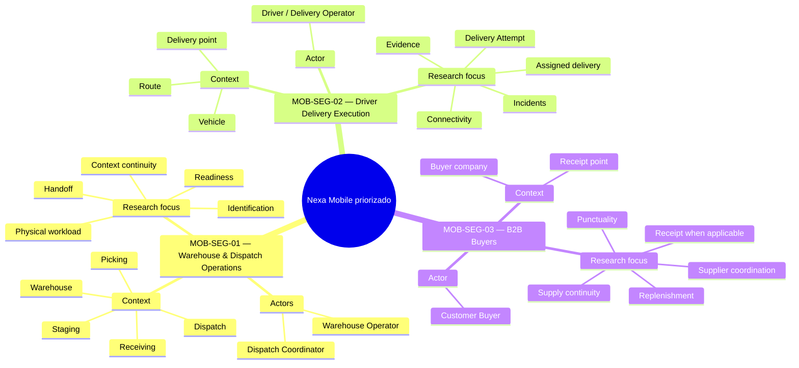
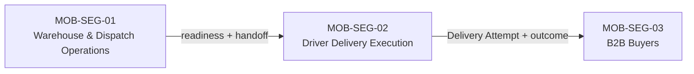

## 1.3. Segmentos objetivo

La segmentación de Nexa Mobile establece **qué grupos de usuarios constituyen el
foco actual de Product e investigación Mobile priorizado**. Su propósito no es dividir
el producto por pantallas, módulos técnicos o límites de dominio, sino reconocer
grupos que participan en momentos distintos del recorrido B2B y que, por su
responsabilidad y contexto de trabajo, requieren preguntas de investigación
diferentes.

Nexa se orienta a empresas **importadoras, distribuidoras y mayoristas B2B**. La
cadena de frío constituye una especialización relevante cuando la operación
involucra productos sensibles a temperatura, lote, vencimiento o condiciones
particulares de conservación, pero no define por sí sola el mercado del
producto.

La experiencia Mobile se concentra inicialmente en situaciones donde una persona
trabaja lejos de una estación de escritorio, participa en una actividad física o
necesita consultar, verificar o registrar información mientras el pedido cambia
de responsabilidad.

Los tres segmentos objetivo actuales son:

1. **MOB-SEG-01 — Warehouse & Dispatch Operations**, formado por las personas que
   participan en recepción, preparación, readiness y salida física del pedido;
2. **MOB-SEG-02 — Driver Delivery Execution**, formado por las personas
   responsables de ejecutar entregas asignadas y registrar el resultado de cada
   Delivery Attempt;
3. **MOB-SEG-03 — B2B Buyers**, formado por compradores empresariales autorizados
   que protegen su abastecimiento, coordinan con proveedores y reciben o
   verifican entregas cuando corresponde.

Esta segmentación constituye el **foco actual aceptado de Mobile priorizado**.
El *Needfinding* cerrado no reabre esos tres grupos: caracteriza, dentro de la
muestra entrevistada, sus prácticas actuales, fricciones y diferencias internas.
Esa evidencia no permite asumir que todos los integrantes de un mismo segmento
actúan de manera homogénea.

Los identificadores `MOB-SEG-*` se utilizan únicamente para mantener trazabilidad
académica y de investigación. No representan roles de autorización, módulos,
aplicaciones independientes ni Bounded Contexts de Nexa.

### Criterio de segmentación

Los segmentos se diferencian principalmente por el momento del proceso en el que
intervienen, el contexto físico en el que trabajan y la responsabilidad que
asumen frente al pedido.

*Criterios utilizados para diferenciar los segmentos objetivo*

| Criterio | MOB-SEG-01 — Warehouse & Dispatch Operations | MOB-SEG-02 — Driver Delivery Execution | MOB-SEG-03 — B2B Buyers |
| --- | --- | --- | --- |
| **Momento principal** | Recepción, preparación, readiness y salida del pedido | Traslado y ejecución de la entrega | Reabastecimiento, coordinación con proveedor, llegada y recepción cuando aplica |
| **Actores principales** | Warehouse Operator y Dispatch Coordinator | Driver / Delivery Operator | Customer Buyer |
| **Contexto físico** | Zona de recepción, almacén, picking, staging y despacho | Vehículo, ruta y punto de entrega | Empresa compradora, punto de recepción y canales de coordinación comercial |
| **Responsabilidad central** | Preparar correctamente la mercadería y transferir su responsabilidad de salida de forma comprensible | Ejecutar la entrega asignada y registrar lo ocurrido durante cada Delivery Attempt | Proteger continuidad de abastecimiento y comunicar recepción o discrepancia cuando corresponde |
| **Relación con el producto físico** | Directa durante recepción, identificación, picking, preparación y handoff | Directa durante traslado y entrega | Directa durante recepción y comprobación |
| **Información especialmente relevante** | Producto, SKU, lote, cantidad, condición, preparación, readiness y handoff | Entrega asignada, destino, intento, resultado, incidencia y evidencia | Disponibilidad, pedido, puntualidad, llegada, excepción y recepción cuando aplica |
| **Valor esperado de la movilidad** | Consultar y registrar información cerca de la operación física | Mantener claridad durante una jornada en movimiento | Consultar contexto comercial o de llegada y actuar sobre una recepción cuando el caso lo justifique |

 *Nota.* Los segmentos representan grupos de investigación y necesidades de producto. No corresponden a módulos técnicos ni modifican las responsabilidades propias de los actores que participan en ellos. Elaboración propia.

La agrupación de **Warehouse Operator** y **Dispatch Coordinator** dentro de
MOB-SEG-01 responde a que ambos participan de manera consecutiva en la
preparación y salida física del pedido. Esta agrupación **no fusiona sus roles**:
Warehouse Operator se relaciona principalmente con recepción, identificación,
lotes, condición, inventario y preparación; Dispatch Coordinator se concentra en
readiness, coordinación de salida, handoff y evidencia asociada al despacho.

Del mismo modo, la relación consecutiva entre Driver y Buyer no elimina sus
perspectivas independientes. **Driver outcome no equivale a Buyer receipt o
acceptance**. Cada uno produce y necesita evidencia desde su propia
responsabilidad.

### Frontera de Sales dentro del alcance Mobile

**Sales Representative** permanece como actor de Nexa y continúa formando parte
del ciclo comercial general del producto. Sin embargo, **Sales no es un segmento
objetivo de Mobile priorizado**.

Las capacidades comerciales Mobile —por ejemplo, consulta rápida de customer
relationship, producto, precio, disponibilidad, pedidos o estado comercial—
quedan fuera del alcance Mobile priorizado actual como **capacidades candidatas
de conveniencia dentro de Nexa Operations Mobile**. Nexa Platform Web continúa siendo la superficie principal
para el trabajo comercial completo.

Esta decisión evita convertir Operations Mobile en una copia de Nexa Platform y
mantiene el foco priorizado en tareas donde la movilidad forma parte del contexto
operativo principal.

 *Nota.* El diagrama diferencia el foco Mobile priorizado de capacidades de conveniencia candidatas fuera de su alcance actual. No representa una división de Bounded Contexts. Elaboración propia.

### Caracterización demográfica y estadística

La caracterización distingue entre la evidencia secundaria de contexto y los
datos observados en la muestra entrevistada. Los rasgos de la muestra no se
extrapolan a la población de usuarios de Nexa.

*Caracterización primaria de los segmentos en la muestra entrevistada*

| Segmento | Caracterización respaldada | Límite de interpretación |
| --- | --- | --- |
| `MOB-SEG-01 — Warehouse & Dispatch Operations` | Tres participantes de Lima Metropolitana, entre 19 y 28 años; dos cumplen funciones de `Warehouse Operator` y uno de `Dispatch Coordinator`. Se observan uso de teléfono inteligente, herramienta empresarial y WhatsApp, además de verificación antes de continuar. | La evidencia de almacén es más fuerte que la específica de despacho; no fusiona ambos actores ni representa a todo el segmento. |
| `MOB-SEG-02 — Driver Delivery Execution` | Tres participantes de Lima Metropolitana, entre 21 y 25 años, con uno o dos años de experiencia. El teléfono interviene en el contexto de entrega, junto con comunicación ante incidencias y mecanismos de evidencia que varían entre fotografía y código. | La disponibilidad y el uso del teléfono no son uniformes; no se infiere un mecanismo único de evidencia ni tracking continuo. |
| `MOB-SEG-03 — B2B Buyers` | Tres participantes de Lima Metropolitana, entre 49 y 63 años, con responsabilidades de compra, abastecimiento, distribución o recepción. Se repiten reabastecimiento, continuidad de suministro, puntualidad, coordinación con proveedores y protección del servicio a clientes propios. | La recepción física detallada aparece con mayor profundidad en un caso; no sustituye la lectura más amplia de continuidad comercial. |

La evidencia secundaria se utiliza únicamente para contextualizar el entorno en
el que se desarrolló la investigación.

En 2024, el Instituto Nacional de Estadística e Informática registró
**3 302 973 empresas formales en el Perú**. El **96,4 %** correspondió a
microempresas, el 3,0 % a pequeñas empresas y el 0,6 % a medianas y grandes
empresas. Asimismo, el **43,5 %** desarrolló actividades de comercio y el
**5,8 %** actividades de transporte y almacenamiento. Lima concentró el
**45,7 %** de las empresas registradas (INEI, 2025b).

Estas cifras no determinan la composición esperada de clientes de Nexa. Sí
muestran que la investigación se desarrolla en un entorno empresarial
heterogéneo, donde no debe asumirse que todas las organizaciones poseen la misma
cantidad de roles, especialización o recursos.

El acceso digital móvil también aporta contexto. Durante el cuarto trimestre de
2025, el **89,2 % de la población usuaria de Internet de seis años a más accedió
mediante teléfono celular** (INEI, 2026). Durante el segundo trimestre de 2025,
el uso de Internet alcanzó el **93,3 % entre las personas de 25 a 40 años** y el
**81,1 % entre las de 41 a 59 años** (INEI, 2025a). Estas cifras no permiten
asignar un rango de edad a los segmentos de Nexa, pero evidencian la relevancia
del acceso móvil dentro de la población adulta.

*Contexto demográfico y estadístico para la investigación de segmentos*

| Dimensión | Evidencia disponible | Aplicación en la segmentación | Límite de interpretación |
| --- | --- | --- | --- |
| **Escala empresarial** | 96,4 % de las empresas formales del Perú fueron microempresas en 2024; 3,0 % pequeñas y 0,6 % medianas y grandes (INEI, 2025b). | La investigación debe considerar organizaciones con distintos niveles de especialización y recursos. | No representa la distribución esperada de clientes de Nexa. |
| **Actividad económica** | 43,5 % de las empresas correspondió a comercio y 5,8 % a transporte y almacenamiento (INEI, 2025b). | Aporta contexto sobre actividades vinculadas con comercialización y movimiento de bienes. | No identifica cuántas empresas son importadoras, distribuidoras o mayoristas compatibles con Nexa. |
| **Ámbito geográfico** | Lima concentró 45,7 % de las empresas registradas en 2024 (INEI, 2025b). | Sustenta que Lima sea un entorno pertinente para una primera investigación de campo. | Nexa no se define como un producto exclusivo de Lima. |
| **Acceso mediante celular** | 89,2 % de la población usuaria de Internet accedió mediante teléfono celular en el IV trimestre de 2025 (INEI, 2026). | Refuerza la pertinencia de investigar Mobile en tareas laborales y de recepción. | No demuestra que todos los segmentos utilicen el celular de la misma manera durante el trabajo. |
| **Uso de Internet por edad** | 93,3 % entre 25–40 años y 81,1 % entre 41–59 años durante el II trimestre de 2025 (INEI, 2025a). | Aporta contexto general de acceso digital en población adulta. | No permite asignar edades específicas a Warehouse, Dispatch, Driver o Buyer. |

 *Nota.* La tabla utiliza evidencia secundaria para caracterizar el contexto de investigación; la caracterización primaria se documenta arriba y en 2.2.3. Elaboración propia.

### Lectura visual de la segmentación

 *Nota.* La figura resume los contextos, actores y focos de investigación de los tres segmentos objetivo Mobile priorizado. Elaboración propia.

---

### MOB-SEG-01 — Warehouse & Dispatch Operations

MOB-SEG-01 agrupa a las personas que participan en la ejecución física del
almacén y en la preparación del pedido para su salida. Dentro del segmento se
consideran dos actores complementarios: **Warehouse Operator** y
**Dispatch Coordinator**.

Warehouse Operator trabaja directamente con recepción, identificación de
productos y lotes, cantidades, condición de la mercadería, picking y preparación
física. Dispatch Coordinator participa posteriormente en la verificación de
readiness, coordinación de salida y handoff hacia la persona responsable de la
entrega.

Cuando la operación lo requiere, este entorno puede incluir cámaras de frío,
productos con caducidad o condiciones particulares de conservación. Estas
características se consideran especializaciones del contexto y no requisitos
universales.

*Perfil de MOB-SEG-01 informado por la muestra entrevistada*

| Dimensión | Caracterización respaldada |
| --- | --- |
| **Actores principales** | Warehouse Operator y Dispatch Coordinator |
| **Composición observada** | Dos participantes realizan actividades de almacén y preparación; uno coordina almacén y rampa de despacho. |
| **Contexto** | Recepción, almacén, preparación, rampa y despacho; cámara de frío cuando la operación lo requiere. |
| **Práctica recurrente** | Verificar producto e información antes de que el pedido continúe hacia la siguiente actividad. |
| **Información y canales** | Herramienta empresarial, WhatsApp y, según el caso, hojas de cálculo, documentos, etiquetas o registros físicos. |
| **Fricciones observadas** | Información distribuida o duplicada, flexibilidad limitada ante excepciones y restricciones físicas para consultar o registrar datos. |
| **Límite** | La evidencia explícita de transferencia no es homogénea y las conclusiones específicas de Dispatch se acotan al caso descrito. |

#### Patrones y necesidades — Warehouse & Dispatch Operations

*Patrones de trabajo y necesidades informados por la investigación*

| Situación observada | Necesidad asociada |
| --- | --- |
| Identificar productos, lotes o cantidades mientras se manipula mercadería | Acceder con rapidez a la información necesaria para verificar la tarea sin perder el contexto físico |
| Información distribuida entre recepción, preparación y despacho | Mantener continuidad entre lo recibido, lo preparado y lo entregado al responsable de reparto |
| Diferencias detectadas durante preparación | Comunicar una incidencia conservando su relación con pedido, producto y momento |
| Varias tareas o pedidos compitiendo por atención | Comprender claramente qué actividad corresponde ejecutar y qué información es prioritaria |
| Operaciones con frío, caducidad o condiciones especiales | Consultar y conservar información relevante de producto y condición cuando la operación realmente lo requiera |
| Cambio entre Warehouse y Dispatch | Mantener suficiente contexto para que el handoff sea comprensible sin fusionar responsabilidades |

Estos patrones describen la muestra entrevistada, no una frecuencia operativa
general. Warehouse Operator y Dispatch Coordinator mantienen responsabilidades
distintas en los artefactos y requisitos posteriores.

---

### MOB-SEG-02 — Driver Delivery Execution

MOB-SEG-02 representa a las personas responsables de trasladar una entrega desde
el punto de despacho hasta el lugar de recepción del comprador. El actor
principal es **Driver / Delivery Operator**.

Su responsabilidad no consiste en representar al comprador ni en declarar la
recepción desde la perspectiva de la empresa compradora. Driver ejecuta la
entrega asignada y registra el resultado de cada **Delivery Attempt**, junto con
las incidencias y evidencias que correspondan.

La navegación priorizada se concibe como un **handoff hacia navegación externa cuando sea
necesario**. La investigación no presupone seguimiento continuo, GPS permanente,
optimización avanzada de rutas ni live tracking para Buyers.

*Perfil de MOB-SEG-02 informado por la muestra entrevistada*

| Dimensión | Caracterización respaldada |
| --- | --- |
| **Actor principal** | Driver / Delivery Operator |
| **Tipo de actividad** | Ejecución móvil de entregas asignadas |
| **Contexto** | Vehículo, ruta y punto de entrega |
| **Responsabilidad principal** | Ejecutar el Delivery Attempt correcto y registrar su resultado |
| **Patrón recurrente** | Verificación previa, traslado, comunicación o escalamiento ante incidencia y evidencia o resultado asociado. |
| **Condiciones de uso** | Batería, señal, sobrecalentamiento, clima y seguridad física condicionan el uso del teléfono. |
| **Evidencia** | Se registran fotografías o códigos de verificación según la operación; no existe un formato único universal. |
| **Límite** | El teléfono participa en los tres casos, pero no está disponible ni se usa del mismo modo durante toda la entrega. |

#### Patrones y necesidades — Driver Delivery Execution

*Patrones de trabajo y necesidades informados por la investigación*

| Situación observada | Necesidad asociada |
| --- | --- |
| Inicio de una entrega asignada | Reconocer rápidamente la entrega, destino y contexto correcto |
| Llegada al punto de entrega | Contar con la información necesaria sin depender de búsqueda en múltiples canales |
| Incidencia durante el intento | Registrar qué ocurrió manteniendo su relación con la entrega correspondiente |
| Captura de evidencia | Conservar evidencia atribuible al Delivery Attempt correcto |
| Condiciones móviles adversas | Mantener continuidad cuando batería, señal, clima, seguridad o disponibilidad del dispositivo limitan el trabajo. |
| Interrupción temporal | Retomar una tarea sin confundir información temporal con un resultado ya confirmado |

La muestra no permite asumir rutas, dispositivos, políticas de evidencia ni
condiciones de conectividad uniformes para todos los Drivers.

---

### MOB-SEG-03 — B2B Buyers

MOB-SEG-03 representa a **Customer Buyers** autorizados dentro de empresas que
mantienen una relación comercial con el Tenant proveedor. El foco Mobile
priorizado no traslada todo el Buyer Portal al teléfono: parte del aprendizaje
de reabastecimiento, continuidad de suministro, puntualidad y coordinación con
proveedores, manteniendo recepción y discrepancia como un subescenario
importante.

Customer Buyer busca proteger la disponibilidad para sus propios clientes,
coordinar compras o pedidos, conocer cambios relevantes y recibir o coordinar la
recepción cuando corresponde. Su declaración de Buyer Receipt permanece separada
del resultado registrado previamente por Driver / Delivery Operator.

*Perfil de MOB-SEG-03 informado por la muestra entrevistada*

| Dimensión | Caracterización respaldada |
| --- | --- |
| **Actor principal** | Customer Buyer |
| **Tipo de actividad** | Compra, reabastecimiento, coordinación con proveedores, seguimiento, distribución o recepción según el caso. |
| **Responsabilidad principal** | Mantener disponibilidad y continuidad comercial para atender a clientes propios. |
| **Información relevante** | Disponibilidad, puntualidad, estado de pedido o llegada, excepciones y, cuando aplica, cantidades, condición y evidencia de recepción. |
| **Patrón recurrente** | Prevenir quiebres, coordinar directamente con proveedores y responder ante demoras o incidencias. |
| **Recepción** | La verificación física detallada de cantidad, condición y vencimiento se describe con mayor profundidad en un caso. |
| **Límite** | Los canales de compra, seguimiento y recepción son diversos; no existe un único flujo ni se confunde Buyer Receipt con Driver Outcome. |

#### Patrones y necesidades — B2B Buyers

*Patrones de trabajo y necesidades informados por la investigación*

| Situación observada | Necesidad asociada |
| --- | --- |
| Reabastecimiento y demanda | Identificar la necesidad antes de un quiebre y preparar o repetir una compra o solicitud con contexto comercial. |
| Coordinación con proveedor | Obtener respuesta oportuna sobre disponibilidad, pedido, demora o excepción sin perseguir manualmente la información. |
| Puntualidad y llegada | Conocer cambios que afecten la capacidad de atender clientes propios. |
| Recepción o discrepancia cuando aplica | Verificar lo recibido, registrar una diferencia y conservar la perspectiva Buyer sin sobrescribir el resultado del Driver. |
| Incidencia comercial | Resolver faltantes, daños o retrasos mediante información verificable y contacto humano cuando se requiere. |

Buyer Mobile priorizado permanece deliberadamente acotado. Esta evidencia no
demuestra que una capacidad Mobile específica funcione ni traslada el catálogo o
la gestión comercial amplia del Buyer Portal al teléfono.

---

### Relación entre los tres segmentos

Los segmentos representan tres perspectivas consecutivas de una misma operación:

La relación entre ellos exige preservar tres hechos distintos:

1. **Warehouse / Dispatch handoff:** registra la salida o transferencia de
   responsabilidad desde la operación de preparación;
2. **Driver outcome:** registra qué ocurrió durante el Delivery Attempt;
3. **Buyer receipt / discrepancy:** registra qué reconoce la empresa compradora
   al recibir.

Ninguno de estos hechos debe utilizarse para reemplazar automáticamente a los
otros.

### Cobertura y límites de la investigación primaria

La sección 1.3 delimita el foco del producto y se reconcilia con los datos
obtenidos durante *Needfinding*. Las entrevistas registraron las siguientes
dimensiones para caracterizar la muestra y contrastar las assumptions del
baseline Lean UX.

*Dimensiones registradas en la investigación primaria*

| Dimensión | Variables registradas |
| --- | --- |
| **Demografía** | Edad, género, distrito, estado civil, composición familiar y otras variables requeridas por el protocolo de entrevistas |
| **Ocupación y contexto** | Cargo real, responsabilidades, antigüedad, tipo de empresa, lugar donde realiza la tarea |
| **Tecnología** | Dispositivos utilizados, frecuencia de uso, restricciones y canales actuales |
| **Comportamiento** | Secuencia real de tareas, fuentes consultadas, interrupciones, alternativas y atajos |
| **Necesidades y fricciones** | Problemas frecuentes, importancia percibida, consecuencias, frecuencia y formas actuales de resolverlos |
| **Objetivos y motivaciones** | Qué intenta completar la persona, qué considera un resultado correcto y qué valoraría mejorar |
| **Segmentación interna** | Diferencias relevantes entre participantes que refinan la caracterización de cada segmento |

 *Nota.* Las variables individuales describen a la muestra entrevistada; no se presentan como características representativas del segmento. Elaboración propia.

### Criterio de priorización de segmentos

Nexa Mobile priorizado concentra su investigación en **Warehouse & Dispatch
Operations, Driver Delivery Execution y B2B Buyers** porque representan tres
momentos donde el pedido cambia de contexto y responsabilidad y donde el trabajo
puede ocurrir lejos de una estación de escritorio.

La evidencia cerrada refinó la caracterización interna de cada grupo y confirmó
que sus problemas no son idénticos: verificación y transferencia en Warehouse &
Dispatch, ejecución e incidencias en Driver, y continuidad de abastecimiento en
Buyer. Las assumptions e hypotheses del Lean UX baseline conservan su condición
de aprendizaje hasta la validación posterior de la solución.
