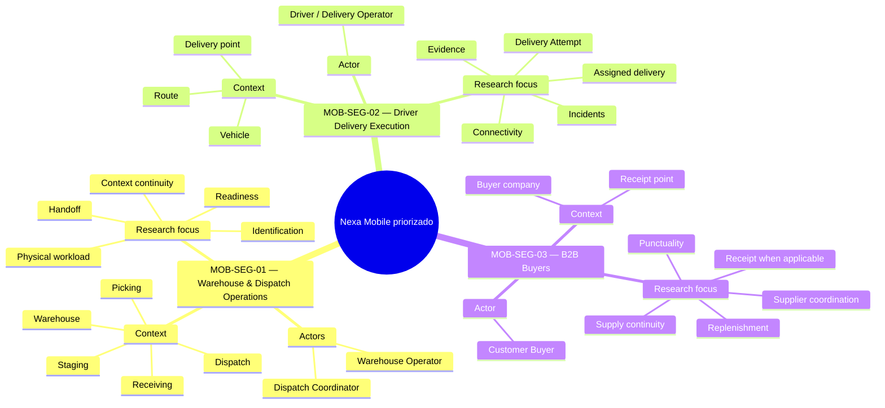

## 1.3. Segmentos objetivo

La segmentación de Nexa Mobile establece qué grupos de usuarios se eligieron
para investigar y por qué sus responsabilidades y contextos de trabajo requieren
preguntas distintas. No divide el producto por pantallas, módulos técnicos ni
límites de dominio; organiza el foco de Product e investigación Mobile
priorizado dentro de un mismo recorrido B2B.

Nexa se orienta a empresas **importadoras, distribuidoras y mayoristas B2B**.
La cadena de frío constituye una especialización relevante cuando la operación
involucra productos sensibles a temperatura, lote, vencimiento o condiciones de
conservación, pero no define por sí sola el mercado del producto.

La investigación Mobile se planteó para situaciones en las que una persona
trabaja lejos de una estación de escritorio, participa en una actividad física o
necesita consultar, verificar o registrar información mientras el pedido cambia
de responsabilidad.

Los tres segmentos objetivo son:

1. **MOB-SEG-01 — Warehouse & Dispatch Operations**, personas que participan en
   recepción, preparación, readiness y salida física del pedido.
2. **MOB-SEG-02 — Driver Delivery Execution**, personas responsables de ejecutar
   entregas asignadas y registrar el resultado de cada Delivery Attempt.
3. **MOB-SEG-03 — B2B Buyers**, compradores empresariales autorizados que
   protegen su abastecimiento, coordinan con proveedores y reciben o verifican
   entregas cuando corresponde.

Los identificadores `MOB-SEG-*` mantienen trazabilidad académica y de
investigación. No representan roles de autorización, módulos, aplicaciones
independientes ni Bounded Contexts de Nexa.

### Criterio de segmentación

Los segmentos se diferencian por el momento del proceso en el que intervienen,
el contexto físico en el que trabajan y la responsabilidad que asumen frente al
pedido.

*Criterios utilizados para diferenciar los segmentos objetivo*

| Criterio | MOB-SEG-01 — Warehouse & Dispatch Operations | MOB-SEG-02 — Driver Delivery Execution | MOB-SEG-03 — B2B Buyers |
| --- | --- | --- | --- |
| **Momento principal** | Recepción, preparación, readiness y salida del pedido | Traslado y ejecución de la entrega | Reabastecimiento, coordinación con proveedor, llegada y recepción cuando aplica |
| **Actores principales** | Warehouse Operator y Dispatch Coordinator | Driver / Delivery Operator | Customer Buyer |
| **Contexto físico** | Zona de recepción, almacén, picking, staging y despacho | Vehículo, ruta y punto de entrega | Empresa compradora, punto de recepción y canales de coordinación comercial |
| **Responsabilidad central** | Preparar la mercadería y transferir su responsabilidad de salida de forma comprensible | Ejecutar la entrega asignada y registrar lo ocurrido durante cada Delivery Attempt | Proteger continuidad de abastecimiento y comunicar recepción o discrepancia cuando corresponde |
| **Información relevante** | Producto, SKU, lote, cantidad, condición, preparación, readiness y handoff | Entrega asignada, destino, intento, resultado, incidencia y evidencia | Disponibilidad, pedido, puntualidad, llegada, excepción y recepción cuando aplica |
| **Pregunta de movilidad** | ¿Qué información debe estar disponible junto a la operación física? | ¿Cómo se conserva claridad durante una jornada en movimiento? | ¿Cuándo aporta valor consultar contexto comercial o de llegada desde el teléfono? |

*Nota.* Los segmentos representan grupos de investigación y necesidades de
producto. No modifican las responsabilidades propias de los actores que
participan en ellos. Elaboración propia.

La agrupación de **Warehouse Operator** y **Dispatch Coordinator** dentro de
MOB-SEG-01 responde a que ambos participan de forma consecutiva en la
preparación y salida física del pedido. Esta agrupación **no fusiona sus roles**:
Warehouse Operator se relaciona principalmente con recepción, identificación,
lotes, condición, inventario y preparación; Dispatch Coordinator se concentra en
readiness, coordinación de salida y handoff hacia la entrega.

La relación consecutiva entre Driver y Buyer tampoco elimina sus perspectivas
independientes. **Driver outcome no equivale a Buyer receipt o acceptance**.
Cada actor necesita registrar o consultar hechos desde su propia responsabilidad.

### Preguntas iniciales de investigación

*Foco de investigación definido para cada segmento*

| Segmento | Preguntas iniciales | Motivo de priorización |
| --- | --- | --- |
| MOB-SEG-01 | ¿Cómo se conserva contexto entre recepción, preparación, readiness y handoff? ¿Qué información ayuda a verificar producto, lote, cantidad o condición cerca de la tarea física? | El pedido cambia de responsabilidad mientras se manipula mercadería y se prepara su salida. |
| MOB-SEG-02 | ¿Qué contexto necesita Driver para ejecutar una entrega asignada, comunicar una incidencia y distinguir un resultado confirmado de uno incierto? | La entrega ocurre bajo movilidad, interrupciones y restricciones del dispositivo. |
| MOB-SEG-03 | ¿Qué información necesita Customer Buyer para proteger reabastecimiento, coordinar con el proveedor y reconocer una recepción o discrepancia cuando aplica? | La continuidad comercial depende de información de pedido, llegada y excepción que puede requerir consulta fuera de escritorio. |

Estas preguntas orientan el levantamiento de evidencia; no anticipan que una
capacidad Mobile específica resuelva el problema ni convierten supuestos en
resultados.

### Frontera de Sales dentro del alcance Mobile

**Sales Representative** permanece como actor de Nexa y forma parte del ciclo
comercial general del producto. Sin embargo, **Sales no es un segmento objetivo
de Mobile priorizado**. Las capacidades comerciales Mobile, como consulta rápida
de customer relationship, producto, precio, disponibilidad, pedidos o estado
comercial, se mantienen fuera de este foco de investigación. Nexa Platform Web
continúa como la superficie principal para el trabajo comercial completo.

Esta delimitación evita convertir Operations Mobile en una copia de Nexa
Platform y conserva el foco en tareas donde la movilidad forma parte del
contexto operativo principal.

*Nota.* El diagrama diferencia el foco Mobile priorizado de capacidades fuera de
su alcance de investigación. No representa una división de Bounded Contexts.
Elaboración propia.

### Contexto demográfico y estadístico

La evidencia secundaria se utiliza para contextualizar el entorno en el que se
planteó la investigación. No determina la composición esperada de clientes de
Nexa ni asigna características demográficas específicas a los segmentos.

En 2024, el Instituto Nacional de Estadística e Informática registró
**3 302 973 empresas formales en el Perú**. El **96,4 %** correspondió a
microempresas, el 3,0 % a pequeñas empresas y el 0,6 % a medianas y grandes
empresas. Asimismo, el **43,5 %** desarrolló actividades de comercio y el
**5,8 %** actividades de transporte y almacenamiento. Lima concentró el
**45,7 %** de las empresas registradas (INEI, 2025b).

El acceso digital móvil también aporta contexto. Durante el cuarto trimestre de
2025, el **89,2 % de la población usuaria de Internet de seis años a más accedió
mediante teléfono celular** (INEI, 2026). Durante el segundo trimestre de 2025,
el uso de Internet alcanzó el **93,3 % entre las personas de 25 a 40 años** y el
**81,1 % entre las de 41 a 59 años** (INEI, 2025a).

*Contexto demográfico y estadístico para la investigación de segmentos*

| Dimensión | Evidencia disponible | Aplicación en la segmentación | Límite de interpretación |
| --- | --- | --- | --- |
| **Escala empresarial** | 96,4 % de las empresas formales del Perú fueron microempresas en 2024; 3,0 % pequeñas y 0,6 % medianas y grandes (INEI, 2025b). | La investigación debe considerar organizaciones con distintos niveles de especialización y recursos. | No representa la distribución esperada de clientes de Nexa. |
| **Actividad económica** | 43,5 % de las empresas correspondió a comercio y 5,8 % a transporte y almacenamiento (INEI, 2025b). | Aporta contexto sobre actividades vinculadas con comercialización y movimiento de bienes. | No identifica cuántas empresas son importadoras, distribuidoras o mayoristas compatibles con Nexa. |
| **Ámbito geográfico** | Lima concentró 45,7 % de las empresas registradas en 2024 (INEI, 2025b). | Sustenta que Lima sea un entorno pertinente para una primera investigación de campo. | Nexa no se define como un producto exclusivo de Lima. |
| **Acceso mediante celular** | 89,2 % de la población usuaria de Internet accedió mediante teléfono celular en el IV trimestre de 2025 (INEI, 2026). | Refuerza la pertinencia de investigar Mobile en tareas laborales y de recepción. | No demuestra que todos los segmentos utilicen el celular de la misma manera durante el trabajo. |
| **Uso de Internet por edad** | 93,3 % entre 25–40 años y 81,1 % entre 41–59 años durante el II trimestre de 2025 (INEI, 2025a). | Aporta contexto general de acceso digital en población adulta. | No permite asignar edades específicas a Warehouse, Dispatch, Driver o Buyer. |

*Nota.* La tabla utiliza evidencia secundaria para caracterizar el contexto de
investigación. Elaboración propia.

### Lectura visual de la segmentación

*Nota.* La figura resume los contextos, actores y focos de investigación de los
tres segmentos objetivo Mobile priorizado. Elaboración propia.

La figura consolida la delimitación anterior: lote, vencimiento, condición y
cadena de frío se consideran en Warehouse & Dispatch cuando pertenecen a una
operación concreta, no como requisitos universales; conectividad, batería, clima
y seguridad física delimitan el contexto de Driver sin presuponer tracking
continuo, ruteo avanzado ni una política única de evidencia; y el Customer Buyer
mantiene una relación comercial autorizada con el Tenant proveedor, con Buyer
Receipt separado del resultado declarado por Driver / Delivery Operator.
