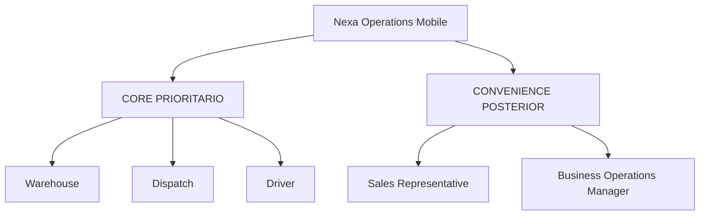
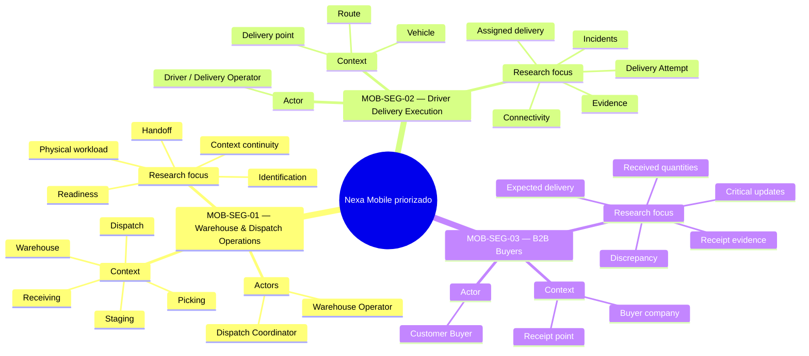
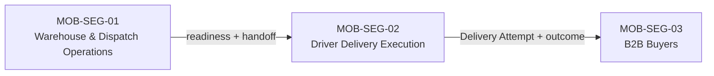

## 1.3. Segmentos objetivo

La segmentación de Nexa Mobile establece **qué grupos de usuarios constituyen el
foco actual de Product e investigación Mobile priorizado**. Su propósito no es dividir
el producto por pantallas, módulos técnicos o límites de dominio, sino reconocer
grupos que participan en momentos distintos del recorrido B2B y que, por su
responsabilidad y contexto de trabajo, requieren preguntas de investigación
diferentes.

Nexa se orienta a empresas **importadoras, distribuidoras y mayoristas B2B**. La
cadena de frío constituye una especialización relevante cuando la operación
involucra productos sensibles a temperatura, lote, vencimiento o condiciones
particulares de conservación, pero no define por sí sola el mercado del
producto.

La experiencia Mobile se concentra inicialmente en situaciones donde una persona
trabaja lejos de una estación de escritorio, participa en una actividad física o
necesita consultar, verificar o registrar información mientras el pedido cambia
de responsabilidad.

Los tres segmentos objetivo actuales son:

1. **MOB-SEG-01 — Warehouse & Dispatch Operations**, formado por las personas que
   participan en recepción, preparación, readiness y salida física del pedido;
2. **MOB-SEG-02 — Driver Delivery Execution**, formado por las personas
   responsables de ejecutar entregas asignadas y registrar el resultado de cada
   Delivery Attempt;
3. **MOB-SEG-03 — B2B Buyers**, formado por compradores empresariales autorizados
   que reciben y verifican entregas realizadas por sus proveedores.

Esta segmentación constituye el **foco actual aceptado de Mobile priorizado**. La
investigación posterior no parte de volver a decidir si estos tres grupos deben
existir como foco del producto; su función será **refinar sus características,
necesidades, diferencias internas, prácticas actuales, fricciones y
comportamientos**, evitando asumir que todos los integrantes de un mismo segmento
actúan de manera homogénea.

Los identificadores `MOB-SEG-*` se utilizan únicamente para mantener trazabilidad
académica y de investigación. No representan roles de autorización, módulos,
aplicaciones independientes ni Bounded Contexts de Nexa.

### Criterio de segmentación

Los segmentos se diferencian principalmente por el momento del proceso en el que
intervienen, el contexto físico en el que trabajan y la responsabilidad que
asumen frente al pedido.

*Criterios utilizados para diferenciar los segmentos objetivo*

| Criterio | MOB-SEG-01 — Warehouse & Dispatch Operations | MOB-SEG-02 — Driver Delivery Execution | MOB-SEG-03 — B2B Buyers |
| --- | --- | --- | --- |
| **Momento principal** | Recepción, preparación, readiness y salida del pedido | Traslado y ejecución de la entrega | Recepción y verificación del pedido |
| **Actores principales** | Warehouse Operator y Dispatch Coordinator | Driver / Delivery Operator | Customer Buyer |
| **Contexto físico** | Zona de recepción, almacén, picking, staging y despacho | Vehículo, ruta y punto de entrega | Establecimiento o punto de recepción de la empresa compradora |
| **Responsabilidad central** | Preparar correctamente la mercadería y transferir su responsabilidad de salida de forma comprensible | Ejecutar la entrega asignada y registrar lo ocurrido durante cada Delivery Attempt | Verificar qué fue efectivamente recibido y comunicar discrepancias |
| **Relación con el producto físico** | Directa durante recepción, identificación, picking, preparación y handoff | Directa durante traslado y entrega | Directa durante recepción y comprobación |
| **Información especialmente relevante** | Producto, SKU, lote, cantidad, condición, preparación, readiness y handoff | Entrega asignada, destino, intento, resultado, incidencia y evidencia | Entrega esperada, cantidades recibidas, diferencias y evidencia de recepción |
| **Valor esperado de la movilidad** | Consultar y registrar información cerca de la operación física | Mantener claridad durante una jornada en movimiento | Verificar y comunicar la recepción sin depender completamente de coordinación manual |

> *Nota.* Los segmentos representan grupos de investigación y necesidades de
> producto. No corresponden a módulos técnicos ni modifican las responsabilidades
> propias de los actores que participan en ellos. Elaboración propia.

La agrupación de **Warehouse Operator** y **Dispatch Coordinator** dentro de
MOB-SEG-01 responde a que ambos participan de manera consecutiva en la
preparación y salida física del pedido. Esta agrupación **no fusiona sus roles**:
Warehouse Operator se relaciona principalmente con recepción, identificación,
lotes, condición, inventario y preparación; Dispatch Coordinator se concentra en
readiness, coordinación de salida, handoff y evidencia asociada al despacho.

Del mismo modo, la relación consecutiva entre Driver y Buyer no elimina sus
perspectivas independientes. **Driver outcome no equivale a Buyer receipt o
acceptance**. Cada uno produce y necesita evidencia desde su propia
responsabilidad.

### Frontera de Sales dentro del alcance Mobile

**Sales Representative** permanece como actor de Nexa y continúa formando parte
del ciclo comercial general del producto. Sin embargo, **Sales no es un segmento
objetivo de Mobile priorizado**.

Las capacidades comerciales Mobile —por ejemplo, consulta rápida de customer
relationship, producto, precio, disponibilidad, pedidos o estado comercial—
permanecen como una posible evolución **posterior de conveniencia dentro de Nexa
Operations Mobile**. Nexa Platform Web continúa siendo la superficie principal
para el trabajo comercial completo.

Esta decisión evita convertir Operations Mobile en una copia de Nexa Platform y
mantiene el foco priorizado en tareas donde la movilidad forma parte del contexto
operativo principal.

> *Nota.* El diagrama diferencia el foco Mobile priorizado de posibles capacidades de
> conveniencia posteriores. No representa una división de Bounded Contexts.
> Elaboración propia.

### Caracterización demográfica y estadística preliminar

La caracterización de los segmentos debe distinguir entre **información conocida
sobre su contexto de trabajo** e **información individual que todavía requiere
investigación primaria**.

En esta etapa, las características conocidas corresponden principalmente a la
ocupación o relación de la persona con la organización, su responsabilidad
dentro del pedido y el contexto físico en el que participa. Variables como
**edad, género, distrito de residencia, estado civil, composición familiar,
nivel educativo específico, dispositivos utilizados o hábitos personales**
deberán obtenerse directamente de los participantes durante las entrevistas y
analizarse posteriormente.

La evidencia secundaria se utiliza únicamente para contextualizar el entorno en
el que se realizará la investigación.

En 2024, el Instituto Nacional de Estadística e Informática registró
**3 302 973 empresas formales en el Perú**. El **96,4 %** correspondió a
microempresas, el 3,0 % a pequeñas empresas y el 0,6 % a medianas y grandes
empresas. Asimismo, el **43,5 %** desarrolló actividades de comercio y el
**5,8 %** actividades de transporte y almacenamiento. Lima concentró el
**45,7 %** de las empresas registradas (INEI, 2025a).

Estas cifras no determinan la composición esperada de clientes de Nexa. Sí
muestran que la investigación se desarrolla en un entorno empresarial
heterogéneo, donde no debe asumirse que todas las organizaciones poseen la misma
cantidad de roles, especialización o recursos.

El acceso digital móvil también aporta contexto. Durante el cuarto trimestre de
2025, el **89,2 % de la población usuaria de Internet de seis años a más accedió
mediante teléfono celular** (INEI, 2026). Durante el segundo trimestre de 2025,
el uso de Internet alcanzó el **93,3 % entre las personas de 25 a 40 años** y el
**81,1 % entre las de 41 a 59 años** (INEI, 2025b). Estas cifras no permiten
asignar un rango de edad a los segmentos de Nexa, pero evidencian la relevancia
del acceso móvil dentro de la población adulta.

Como antecedente complementario, Grupo Lucky (2022) reportó que el **28 % de las
bodegas estudiadas utilizaba algún aplicativo para gestionar tareas del negocio**
y describió el uso de herramientas como WhatsApp para coordinar con proveedores.
Debido a que el estudio corresponde a bodegas, se utiliza únicamente como
contexto de adopción digital y no como descripción directa de B2B Buyers de Nexa.

*Contexto demográfico y estadístico para la investigación de segmentos*

| Dimensión | Evidencia disponible | Aplicación en la segmentación | Límite de interpretación |
| --- | --- | --- | --- |
| **Escala empresarial** | 96,4 % de las empresas formales del Perú fueron microempresas en 2024; 3,0 % pequeñas y 0,6 % medianas y grandes (INEI, 2025a). | La investigación debe considerar organizaciones con distintos niveles de especialización y recursos. | No representa la distribución esperada de clientes de Nexa. |
| **Actividad económica** | 43,5 % de las empresas correspondió a comercio y 5,8 % a transporte y almacenamiento (INEI, 2025a). | Aporta contexto sobre actividades vinculadas con comercialización y movimiento de bienes. | No identifica cuántas empresas son importadoras, distribuidoras o mayoristas compatibles con Nexa. |
| **Ámbito geográfico** | Lima concentró 45,7 % de las empresas registradas en 2024 (INEI, 2025a). | Sustenta que Lima sea un entorno pertinente para una primera investigación de campo. | Nexa no se define como un producto exclusivo de Lima. |
| **Acceso mediante celular** | 89,2 % de la población usuaria de Internet accedió mediante teléfono celular en el IV trimestre de 2025 (INEI, 2026). | Refuerza la pertinencia de investigar Mobile en tareas laborales y de recepción. | No demuestra que todos los segmentos utilicen el celular de la misma manera durante el trabajo. |
| **Uso de Internet por edad** | 93,3 % entre 25–40 años y 81,1 % entre 41–59 años durante el II trimestre de 2025 (INEI, 2025b). | Aporta contexto general de acceso digital en población adulta. | No permite asignar edades específicas a Warehouse, Dispatch, Driver o Buyer. |
| **Adopción digital en canal tradicional** | 28 % de las bodegas estudiadas utilizaba algún aplicativo de gestión (Grupo Lucky, 2022). | Justifica investigar la convivencia entre herramientas digitales y canales cotidianos de coordinación. | No puede extrapolarse directamente a importadores, distribuidores, mayoristas o Buyers de Nexa. |

> *Nota.* La tabla utiliza evidencia secundaria para caracterizar el contexto de
> investigación. Las características demográficas propias de cada segmento
> deberán sustentarse con los datos obtenidos de sus representantes. Elaboración
> propia.

### Lectura visual de la segmentación

> *Nota.* La figura resume los contextos, actores y focos de investigación de los
> tres segmentos objetivo Mobile priorizado. Elaboración propia.

---

### MOB-SEG-01 — Warehouse & Dispatch Operations

MOB-SEG-01 agrupa a las personas que participan en la ejecución física del
almacén y en la preparación del pedido para su salida. Dentro del segmento se
consideran dos actores complementarios: **Warehouse Operator** y
**Dispatch Coordinator**.

Warehouse Operator trabaja directamente con recepción, identificación de
productos y lotes, cantidades, condición de la mercadería, picking y preparación
física. Dispatch Coordinator participa posteriormente en la verificación de
readiness, coordinación de salida y handoff hacia la persona responsable de la
entrega.

Cuando la operación lo requiere, este entorno puede incluir cámaras de frío,
productos con caducidad o condiciones particulares de conservación. Estas
características se consideran especializaciones del contexto y no requisitos
universales.

*Perfil preliminar de MOB-SEG-01 — Warehouse & Dispatch Operations*

| Dimensión | Caracterización actual |
| --- | --- |
| **Actores principales** | Warehouse Operator y Dispatch Coordinator |
| **Tipo de actividad** | Trabajo operativo y coordinación vinculados directamente con mercadería física |
| **Contexto** | Recepción, almacén, picking, staging y despacho; cámara de frío cuando corresponda |
| **Responsabilidad principal** | Preparar correctamente la mercadería y conservar claridad hasta el handoff de salida |
| **Información relevante** | Producto, SKU, lote, cantidad, condición, preparación, readiness y handoff |
| **Condiciones de uso a investigar** | Movimiento, manipulación de mercadería, presión temporal, interrupciones, lectura rápida y conectividad |
| **Principal riesgo de información** | Diferencia entre lo registrado y lo que físicamente se recibió, preparó o entregó al responsable de reparto |

#### Necesidades y fricciones — Warehouse & Dispatch Operations

*Necesidades y fricciones de investigación en MOB-SEG-01*

| Situación a investigar | Necesidad asociada |
| --- | --- |
| Identificar productos, lotes o cantidades mientras se manipula mercadería | Acceder con rapidez a la información necesaria para verificar la tarea sin perder el contexto físico |
| Información distribuida entre recepción, preparación y despacho | Mantener continuidad entre lo recibido, lo preparado y lo entregado al responsable de reparto |
| Diferencias detectadas durante preparación | Comunicar una incidencia conservando su relación con pedido, producto y momento |
| Varias tareas o pedidos compitiendo por atención | Comprender claramente qué actividad corresponde ejecutar y qué información es prioritaria |
| Operaciones con frío, caducidad o condiciones especiales | Consultar y conservar información relevante de producto y condición cuando la operación realmente lo requiera |
| Cambio entre Warehouse y Dispatch | Mantener suficiente contexto para que el handoff sea comprensible sin fusionar responsabilidades |

Estas necesidades representan **hipótesis de investigación sobre el segmento**.
La investigación deberá determinar su frecuencia, importancia y diferencias entre
Warehouse Operator y Dispatch Coordinator.

---

### MOB-SEG-02 — Driver Delivery Execution

MOB-SEG-02 representa a las personas responsables de trasladar una entrega desde
el punto de despacho hasta el lugar de recepción del comprador. El actor
principal es **Driver / Delivery Operator**.

Su responsabilidad no consiste en representar al comprador ni en declarar la
recepción desde la perspectiva de la empresa compradora. Driver ejecuta la
entrega asignada y registra el resultado de cada **Delivery Attempt**, junto con
las incidencias y evidencias que correspondan.

La navegación priorizada se concibe como un **handoff hacia navegación externa cuando sea
necesario**. La investigación no presupone seguimiento continuo, GPS permanente,
optimización avanzada de rutas ni live tracking para Buyers.

*Perfil preliminar de MOB-SEG-02 — Driver Delivery Execution*

| Dimensión | Caracterización actual |
| --- | --- |
| **Actor principal** | Driver / Delivery Operator |
| **Tipo de actividad** | Ejecución móvil de entregas asignadas |
| **Contexto** | Vehículo, ruta y punto de entrega |
| **Responsabilidad principal** | Ejecutar el Delivery Attempt correcto y registrar su resultado |
| **Información relevante** | Entrega asignada, destino, instrucciones pertinentes, resultado, incidencia y evidencia |
| **Condiciones de uso a investigar** | Movimiento, presión temporal, interrupciones, conectividad variable y necesidad de recuperar contexto |
| **Principal riesgo de información** | Asociar un resultado, incidencia o evidencia con la entrega incorrecta o no poder reconstruir posteriormente qué ocurrió |

#### Necesidades y fricciones — Driver Delivery Execution

*Necesidades y fricciones de investigación en MOB-SEG-02*

| Situación a investigar | Necesidad asociada |
| --- | --- |
| Inicio de una entrega asignada | Reconocer rápidamente la entrega, destino y contexto correcto |
| Llegada al punto de entrega | Contar con la información necesaria sin depender de búsqueda en múltiples canales |
| Incidencia durante el intento | Registrar qué ocurrió manteniendo su relación con la entrega correspondiente |
| Captura de evidencia | Conservar evidencia atribuible al Delivery Attempt correcto |
| Conectividad variable | **Determinar cómo afecta la conectividad a la continuidad de la tarea y a la confianza del Driver en la información disponible** |
| Interrupción temporal | Retomar una tarea sin confundir información temporal con un resultado ya confirmado |

La investigación deberá evitar asumir que todos los Drivers trabajan bajo las
mismas rutas, dispositivos, políticas o condiciones de conectividad.

---

### MOB-SEG-03 — B2B Buyers

MOB-SEG-03 representa a **Customer Buyers** autorizados dentro de empresas que
mantienen una relación comercial con el Tenant proveedor. El foco Mobile priorizado no
busca trasladar todo el Buyer Portal al teléfono, sino estudiar momentos
específicos donde la movilidad puede aportar valor durante la entrega y
recepción.

Customer Buyer necesita reconocer la entrega esperada, verificar qué fue
efectivamente recibido y comunicar una discrepancia cuando exista. Su
declaración representa la perspectiva de la empresa compradora y debe conservarse
separada del resultado registrado previamente por Driver / Delivery Operator.

*Perfil preliminar de MOB-SEG-03 — B2B Buyers*

| Dimensión | Caracterización actual |
| --- | --- |
| **Actor principal** | Customer Buyer |
| **Tipo de actividad** | Recepción y verificación B2B desde la empresa compradora |
| **Contexto** | Establecimiento o punto de recepción de la empresa compradora |
| **Responsabilidad principal** | Verificar qué fue recibido y comunicar diferencias desde la perspectiva Buyer |
| **Información relevante** | Entrega esperada, cantidades, productos, diferencias, evidencia de recepción y actualizaciones críticas |
| **Condiciones de uso a investigar** | Disponibilidad durante la recepción, coordinación con otras personas de la empresa, presión de tiempo y necesidad de evidencia |
| **Principal riesgo de información** | Confundir el resultado declarado por Driver con la recepción o aceptación real del Buyer |

#### Necesidades y fricciones — B2B Buyers

*Necesidades y fricciones de investigación en MOB-SEG-03*

| Situación a investigar | Necesidad asociada |
| --- | --- |
| Preparación para recibir una entrega | Conocer cambios realmente críticos que requieran atención |
| Llegada del pedido | Reconocer qué entrega se está recibiendo y qué se esperaba |
| Diferencia entre esperado y recibido | Comunicar la discrepancia con cantidades, productos y evidencia identificables |
| Recepción parcial o problemática | Conservar suficiente contexto para que la aclaración posterior no dependa solo de llamadas o mensajes |
| Cierre de la recepción | Registrar la perspectiva Buyer sin sobrescribir el resultado del Driver |
| Uso Mobile frente a Buyer Portal | Determinar qué momentos justifican una experiencia Mobile y cuáles deben continuar resolviéndose mejor en Web |

Buyer Mobile priorizado permanece deliberadamente acotado. Catálogo completo, gestión
comercial amplia y otras capacidades del Buyer Portal no se trasladan
automáticamente a Mobile.

---

### Relación entre los tres segmentos

Los segmentos representan tres perspectivas consecutivas de una misma operación:

La relación entre ellos exige preservar tres hechos distintos:

1. **Warehouse / Dispatch handoff:** registra la salida o transferencia de
   responsabilidad desde la operación de preparación;
2. **Driver outcome:** registra qué ocurrió durante el Delivery Attempt;
3. **Buyer receipt / discrepancy:** registra qué reconoce la empresa compradora
   al recibir.

Ninguno de estos hechos debe utilizarse para reemplazar automáticamente a los
otros.

### Variables que deberán obtenerse mediante investigación primaria

La sección 1.3 delimita a quiénes estudiar, pero no sustituye la investigación.
Las entrevistas deberán obtener, como mínimo, información que permita
caracterizar a los participantes y contrastar las assumptions formuladas en
Lean UX.

*Variables de investigación previstas*

| Dimensión | Variables a obtener |
| --- | --- |
| **Demografía** | Edad, género, distrito, estado civil, composición familiar y otras variables requeridas por el protocolo de entrevistas |
| **Ocupación y contexto** | Cargo real, responsabilidades, antigüedad, tipo de empresa, lugar donde realiza la tarea |
| **Tecnología** | Dispositivos utilizados, frecuencia de uso, restricciones y canales actuales |
| **Comportamiento** | Secuencia real de tareas, fuentes consultadas, interrupciones, alternativas y atajos |
| **Necesidades y fricciones** | Problemas frecuentes, importancia percibida, consecuencias, frecuencia y formas actuales de resolverlos |
| **Objetivos y motivaciones** | Qué intenta completar la persona, qué considera un resultado correcto y qué valoraría mejorar |
| **Segmentación interna** | Diferencias relevantes entre participantes que puedan requerir refinar la caracterización inicial del segmento |

> *Nota.* Las variables individuales todavía no deben presentarse como
> características representativas del segmento hasta contar con evidencia
> suficiente de participantes reales. Elaboración propia.

### Síntesis de la segmentación

Nexa Mobile priorizado concentra su investigación en **Warehouse & Dispatch Operations,
Driver Delivery Execution y B2B Buyers** porque representan tres momentos donde
el pedido cambia de contexto y responsabilidad y donde el trabajo puede ocurrir
lejos de una estación de escritorio.

La segmentación ya establece el foco actual del producto. La evidencia posterior
permitirá **refinar la caracterización interna de cada grupo**, identificar
diferencias relevantes, comprobar qué fricciones tienen mayor importancia y
determinar qué assumptions e hypotheses del Lean UX baseline deben mantenerse,
ajustarse o descartarse.
