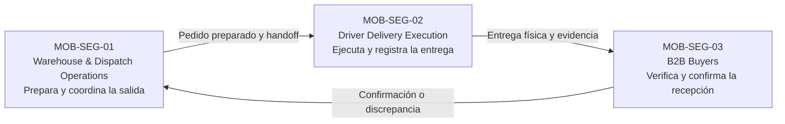

## 1.3. Segmentos Objetivos

La segmentación de Nexa Mobile parte del propósito general de Nexa como una solución **SaaS B2B multi-tenant para importadores, distribuidores y mayoristas**, con una especialización relevante en operaciones donde la trazabilidad, los lotes, la caducidad y la cadena de frío pueden ser factores críticos.

Dentro de esta propuesta, la experiencia móvil busca acompañar momentos de trabajo que ocurren fuera de un escritorio o que requieren interacción inmediata con una operación física. Por ello, los segmentos objetivo no se organizan como módulos del sistema, sino como **grupos de usuarios con responsabilidades, contextos de uso, necesidades y fricciones diferentes**.

Para esta primera definición se consideran tres segmentos principales:

1. **MOB-SEG-01 — Warehouse & Dispatch Operations**, orientado al personal que prepara y coordina físicamente los pedidos antes de su salida.
2. **MOB-SEG-02 — Driver Delivery Execution**, orientado al personal responsable de ejecutar la entrega.
3. **MOB-SEG-03 — B2B Buyers**, orientado a compradores empresariales que reciben y verifican la entrega de sus pedidos.

Esta segmentación constituye una **hipótesis de producto informada por el conocimiento actual de Nexa y por evidencia histórica del proyecto**. Su validación con usuarios se desarrollará posteriormente mediante entrevistas, Needfinding, User Personas, User Journey Mapping y otros artefactos de investigación.

---

### Criterio de segmentación

Los segmentos se diferencian principalmente por cuatro variables:

- **Responsabilidad dentro del proceso:** preparar, entregar o recibir.
- **Contexto físico de uso:** almacén, punto de despacho, ruta o establecimiento del comprador.
- **Tipo de decisión que necesita tomar el usuario:** verificar, registrar, coordinar o confirmar.
- **Valor que espera obtener de una experiencia móvil:** rapidez, claridad, continuidad del trabajo y trazabilidad.

La siguiente tabla resume la propuesta de segmentación.

| ID | Segmento | Usuarios representativos | Contexto principal | Necesidad central |
|---|---|---|---|---|
| **MOB-SEG-01** | **Warehouse & Dispatch Operations** | Warehouse Operator y Dispatch Coordinator | Almacén, cámara de frío, zona de picking, staging y punto de despacho | Preparar y verificar pedidos físicos con información clara sobre productos, lotes, cantidades y condiciones antes de su salida. |
| **MOB-SEG-02** | **Driver Delivery Execution** | Driver / Delivery Operator | Vehículo, ruta y punto de entrega | Ejecutar las entregas asignadas, registrar lo ocurrido y conservar evidencia del resultado de la entrega. |
| **MOB-SEG-03** | **B2B Buyers** | Customer Buyer autorizado | Restaurante, tienda, almacén, oficina o punto de recepción | Verificar la entrega, confirmar lo realmente recibido y comunicar discrepancias con claridad. |

> **Nota.** Los segmentos representan grupos de usuarios y necesidades de producto. No representan módulos técnicos ni estructuras de implementación. Elaboración propia.

---

### Relación entre los segmentos

Los tres segmentos forman parte de un mismo recorrido de negocio, pero participan en momentos diferentes.

El personal de almacén y despacho prepara el pedido para que pueda salir de la empresa proveedora. Luego, el Driver ejecuta la entrega física. Finalmente, el Buyer verifica el handoff y confirma qué recibió realmente.

Esta separación es importante porque cada actor observa una parte distinta del proceso. La información registrada por un segmento no debe sustituir automáticamente la perspectiva de otro. Por ejemplo, que un Driver indique que realizó una entrega no significa, por sí solo, que el Buyer haya confirmado la totalidad de lo recibido.

> **Nota.** El gráfico representa el vínculo conceptual entre preparación, entrega y recepción. Las interacciones específicas serán detalladas posteriormente en las secciones de requisitos y diseño de solución. Elaboración propia.

---

###  MOB-SEG-01 — Warehouse & Dispatch Operations

El segmento **MOB-SEG-01 — Warehouse & Dispatch Operations** agrupa a las personas responsables de convertir un pedido comercial en una operación física preparada para despacho.

Dentro de este segmento se consideran principalmente dos perfiles complementarios:

- **Warehouse Operator**, responsable de actividades relacionadas con identificación de productos, lotes, cantidades, condición del stock, picking y preparación física.
- **Dispatch Coordinator**, responsable de verificar que la entrega esté lista, coordinar su salida y asegurar que exista una transición clara entre el almacén y el responsable de la entrega.

Su trabajo ocurre en entornos donde la información digital debe convivir con productos, cajas, etiquetas, lotes, documentos y movimientos físicos. En operaciones con cadena de frío, además, pueden existir restricciones adicionales relacionadas con temperatura, caducidad y conservación.

#### Resumen MOB-SEG-01

- **Usuarios principales:** Warehouse Operator y Dispatch Coordinator.
- **Contexto dominante:** almacén, cámara de frío, zona de picking, staging y punto de despacho.
- **Responsabilidad principal:** preparar y verificar físicamente los pedidos antes de su salida.
- **Dolor principal a investigar:** información dispersa entre pedidos, inventario, lotes y coordinación de despacho.
- **Valor esperado:** reducir errores de preparación, disminuir doble digitación y mejorar la trazabilidad de lo que realmente sale del almacén.

#### Plano ocupacional

| Variable | Caracterización propuesta |
|---|---|
| Tipo de trabajo | Operativo y de coordinación. |
| Relación con el producto físico | Alta: manipulación, identificación y verificación de mercadería. |
| Presión del rol | Alta durante recepción, preparación y despacho. |
| Entorno | Almacenes, cámaras de frío, zonas de picking y despacho. |
| Interacción con otras áreas | Ventas, operaciones, transporte y responsables de entrega. |
| Riesgo principal | Que exista diferencia entre lo registrado y lo que físicamente se prepara o entrega. |

> **Nota.** Esta caracterización es una hipótesis de investigación y será refinada con evidencia primaria.

#### Plano conductual

El trabajo de este segmento suele requerir atención simultánea a información digital y evidencia física. Por ello, las principales conductas a investigar son:

| Comportamiento o situación a investigar | Posible impacto |
|---|---|
| Consultar información mientras se manipula mercadería. | Puede aumentar la carga cognitiva y provocar errores si la información no es clara. |
| Verificar producto, lote y cantidad antes de preparar un pedido. | Una identificación incorrecta puede afectar inventario y entrega. |
| Coordinar prioridades entre pedidos pendientes. | Puede generar retrabajo si la información llega por canales distintos. |
| Comunicar diferencias o incidencias durante preparación. | Si la incidencia no queda registrada, la causa del problema puede perderse. |
| Realizar tareas en espacios con frío, movimiento o poco tiempo disponible. | La experiencia móvil debe considerar rapidez y facilidad de lectura. |

#### Necesidades y valor esperado

| Necesidad o dolor a investigar | Valor esperado de Nexa Mobile | Indicador inicial para validación |
|---|---|---|
| Dificultad para identificar rápidamente un producto o lote. | Acceso claro a la información necesaria para continuar la tarea. | Tiempo requerido para identificar correctamente un producto o lote. |
| Información fragmentada entre preparación y despacho. | Continuidad entre lo preparado y lo entregado al responsable de reparto. | Número de aclaraciones necesarias durante una tarea. |
| Riesgo de preparar cantidades incorrectas. | Mejor visibilidad de cantidades esperadas y verificadas. | Cantidad de correcciones realizadas durante pruebas. |
| Incidencias que quedan en conversaciones informales. | Registro comprensible de diferencias y observaciones. | Porcentaje de incidencias que el usuario logra registrar correctamente. |
| Presión por completar tareas rápidamente. | Menor cantidad de pasos y decisiones ambiguas. | Tiempo promedio para completar una tarea representativa. |

---

### MOB-SEG-02 — Driver Delivery Execution

El segmento **MOB-SEG-02 — Driver Delivery Execution** representa a las personas responsables de trasladar una entrega desde el punto de despacho hasta el lugar de recepción del Buyer.

El Driver necesita conocer qué entregas le corresponden, identificar correctamente cada destino y registrar lo ocurrido durante la entrega. En este contexto, la movilidad es una condición natural del trabajo: el usuario puede encontrarse en ruta, dentro de un vehículo, frente al establecimiento del comprador o atendiendo una incidencia.

La propuesta de Nexa Mobile para este segmento busca reducir la dependencia de llamadas, mensajes dispersos o evidencia difícil de recuperar, manteniendo una relación clara entre la entrega asignada y lo que realmente ocurrió.

#### Resumen MOB-SEG-02

- **Usuario principal:** Driver / Delivery Operator.
- **Contexto dominante:** vehículo de reparto, ruta y punto de entrega.
- **Responsabilidad principal:** ejecutar las entregas asignadas y dejar evidencia de su resultado.
- **Dolor principal a investigar:** información incompleta, coordinación informal y dificultad para preservar evidencia de la entrega.
- **Valor esperado:** mayor claridad sobre qué debe entregar, qué ocurrió y qué evidencia corresponde a cada entrega.

#### Plano ocupacional

| Variable | Caracterización propuesta |
|---|---|
| Tipo de trabajo | Operativo y en movimiento. |
| Relación con la entrega | Directa: transporta y entrega físicamente los bienes. |
| Relación con el Buyer | Alta durante el momento de entrega. |
| Presión del rol | Alta por tiempos, tráfico, incidencias y coordinación. |
| Entorno | Vehículo, vía pública y establecimiento del comprador. |
| Riesgo principal | Confundir entregas, registrar un resultado incorrecto o perder evidencia. |

#### Plano conductual

| Comportamiento o situación a investigar | Posible impacto |
|---|---|
| Revisar varias entregas durante una jornada. | Puede existir confusión entre destinos o pedidos. |
| Consultar direcciones o instrucciones durante la ruta. | La información debe ser fácil de localizar y comprender. |
| Resolver situaciones inesperadas en el punto de entrega. | El usuario necesita diferenciar una entrega exitosa, parcial, rechazada o no completada. |
| Tomar o conservar evidencia de entrega. | La evidencia debe quedar asociada a la entrega correcta. |
| Trabajar con conectividad variable. | El usuario necesita comprender claramente si una acción fue registrada o todavía requiere confirmación. |

#### Necesidades y valor esperado

| Necesidad o dolor a investigar | Valor esperado de Nexa Mobile | Indicador inicial para validación |
|---|---|---|
| Dificultad para reconocer rápidamente la entrega correcta. | Vista clara de las entregas asignadas y su contexto. | Tiempo para localizar una entrega determinada. |
| Dependencia de mensajes para recordar instrucciones. | Información relevante disponible durante la tarea. | Número de consultas externas necesarias. |
| Ambigüedad al registrar el resultado de una entrega. | Opciones comprensibles para representar lo que realmente ocurrió. | Porcentaje de resultados registrados correctamente durante pruebas. |
| Evidencia dispersa entre fotos, mensajes o documentos. | Evidencia relacionada claramente con la entrega correspondiente. | Tiempo para localizar evidencia después de una tarea. |
| Incertidumbre cuando existe un problema de conectividad. | Estado comprensible de la acción realizada. | Porcentaje de usuarios que identifica correctamente si una acción quedó registrada. |

---

### MOB-SEG-03 — B2B Buyers

El segmento **MOB-SEG-03 — B2B Buyers** está conformado por compradores empresariales que reciben productos de un proveedor que utiliza Nexa.

Estos usuarios pueden ser dueños de negocio, responsables de compras, administradores, encargados de reposición u otras personas autorizadas para recibir pedidos dentro de su organización.

A diferencia de un consumidor final, el Buyer compra para sostener una operación comercial. Por ello, una diferencia en cantidades, un retraso o una entrega incorrecta puede afectar la continuidad de su propio negocio.

En la experiencia Mobile inicial, el interés principal no es reproducir todas las funciones comerciales disponibles en otros canales, sino facilitar los momentos más importantes alrededor de la entrega: identificarla, verificarla, confirmar qué se recibió y comunicar cualquier diferencia.

#### Resumen MOB-SEG-03

- **Usuario principal:** Customer Buyer.
- **Contexto dominante:** restaurante, tienda, almacén, oficina o punto de recepción.
- **Responsabilidad principal:** verificar y recibir pedidos para su organización.
- **Dolor principal a investigar:** incertidumbre sobre la entrega y dificultad para comunicar diferencias de manera clara.
- **Valor esperado:** mayor autonomía y confianza al momento de recibir pedidos.

#### Plano ocupacional

| Variable | Caracterización propuesta |
|---|---|
| Tipo de usuario | Dueño de negocio, comprador, administrador, encargado de reposición o responsable de recepción. |
| Relación con el proveedor | Recurrente y vinculada al abastecimiento del negocio. |
| Nivel de decisión | Variable; puede revisar, recibir y reportar diferencias según su responsabilidad. |
| Presión del rol | Evitar faltantes, errores de recepción y retrasos en el abastecimiento. |
| Entorno | Restaurante, tienda, almacén, oficina u otro punto de recepción. |
| Riesgo principal | Confirmar una entrega incorrecta o no detectar una diferencia a tiempo. |

#### Plano conductual

| Comportamiento o situación a investigar | Posible impacto |
|---|---|
| Comparar físicamente lo recibido con lo esperado. | Necesita distinguir cantidades esperadas y cantidades realmente recibidas. |
| Resolver rápidamente una recepción mientras continúa atendiendo el negocio. | La interacción debe ser breve y comprensible. |
| Reportar una diferencia al proveedor. | La discrepancia debe expresarse sin perder el contexto de la entrega. |
| Buscar confirmación o respaldo humano cuando existe una duda. | La experiencia digital debe complementar y no deteriorar la relación con el proveedor. |
| Utilizar el celular como herramienta principal de coordinación. | La experiencia debe funcionar bien en contextos de uso rápido y móvil. |

#### Necesidades y valor esperado

| Necesidad o dolor a investigar | Valor esperado de Nexa Mobile | Indicador inicial para validación |
|---|---|---|
| Dificultad para identificar qué entrega está recibiendo. | Contexto claro de la entrega. | Tiempo para reconocer la entrega correspondiente. |
| Diferencias entre lo esperado y lo recibido. | Confirmación explícita de cantidades y posibilidad de reportar discrepancias. | Porcentaje de discrepancias registradas correctamente. |
| Dependencia de llamadas para aclarar problemas. | Información suficiente para resolver situaciones simples de manera autónoma. | Cantidad de consultas externas durante una prueba. |
| Incertidumbre sobre si la recepción quedó registrada. | Retroalimentación clara después de confirmar la recepción. | Porcentaje de usuarios que comprende el resultado de la acción. |
| Temor a perder el respaldo del proveedor. | Experiencia que complemente la relación comercial existente. | Percepción de confianza obtenida en entrevistas o pruebas. |

---

### Comparación de los segmentos

Los tres segmentos comparten la necesidad de trabajar con información confiable, pero esperan valores distintos de la experiencia móvil.

| Dimensión | MOB-SEG-01 — Warehouse & Dispatch Operations | MOB-SEG-02 — Driver Delivery Execution | MOB-SEG-03 — B2B Buyers |
|---|---|---|---|
| Momento principal | Antes de la salida | Durante la entrega | Durante la recepción |
| Objetivo | Preparar correctamente | Entregar y registrar lo ocurrido | Verificar y confirmar lo recibido |
| Entorno | Almacén y despacho | Ruta y punto de entrega | Establecimiento del comprador |
| Fricción principal | Diferencia entre información y realidad física | Coordinación y evidencia durante la entrega | Incertidumbre y discrepancias al recibir |
| Valor esperado | Precisión y continuidad operativa | Claridad y trazabilidad | Confianza y autonomía |
| Tipo de evidencia relevante | Producto, lote, cantidad, preparación y handoff | Resultado de entrega y evidencia asociada | Confirmación de recepción y discrepancia |

Esta comparación permite observar que Nexa Mobile no se plantea como una experiencia genérica para todos los usuarios. Cada segmento necesita una experiencia adaptada a su responsabilidad y al momento del proceso en el que participa.

