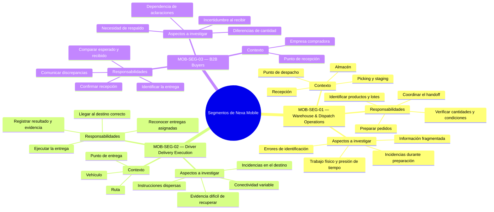

## 1.3. Segmentos objetivo

La definición de los segmentos objetivo de Nexa Mobile parte del problema
descrito en la sección anterior: la pérdida de continuidad de información cuando
un pedido B2B atraviesa preparación, despacho, entrega y recepción. En este
contexto, la segmentación no busca representar módulos del sistema ni dividir el
producto por pantallas, sino identificar **grupos de usuarios que participan en
momentos distintos de la operación y que enfrentan necesidades, restricciones y
fricciones diferentes**.

Nexa se orienta a empresas importadoras, distribuidoras y mayoristas. La cadena
de frío constituye una especialización relevante cuando la operación involucra
productos sensibles a temperatura, lotes o caducidad, pero no define por sí sola
el mercado del producto. La experiencia móvil se concentra inicialmente en
situaciones donde la persona trabaja lejos de una estación de escritorio o
necesita consultar, verificar o registrar información mientras participa en una
actividad física.

A partir del conocimiento actual del dominio se consideran tres segmentos
principales:

1. **MOB-SEG-01 — Warehouse & Dispatch Operations**, formado por personal que
   participa en la recepción, preparación y salida física de los pedidos.
2. **MOB-SEG-02 — Driver Delivery Execution**, formado por responsables de
   ejecutar las entregas asignadas y registrar su resultado.
3. **MOB-SEG-03 — B2B Buyers**, formado por compradores empresariales
   autorizados que reciben y verifican entregas realizadas por sus proveedores.

Esta segmentación constituye una **hipótesis inicial de investigación**. Los
perfiles, comportamientos y fricciones descritos en esta sección se utilizan
para delimitar a quiénes estudiar, pero no se presentan como resultados ya
validados. Las características individuales y los patrones representativos de
cada segmento deberán obtenerse posteriormente mediante investigación con
participantes reales.

### Criterio de segmentación

Los segmentos se diferencian principalmente por el momento del proceso en el que
intervienen, el contexto físico en el que trabajan y la responsabilidad que
asumen frente al pedido.

**Tabla**

*Criterios utilizados para diferenciar los segmentos objetivo*

| Criterio | MOB-SEG-01 — Warehouse & Dispatch Operations | MOB-SEG-02 — Driver Delivery Execution | MOB-SEG-03 — B2B Buyers |
| --- | --- | --- | --- |
| **Momento principal** | Recepción, preparación y salida del pedido | Traslado y ejecución de la entrega | Recepción y verificación del pedido |
| **Contexto físico** | Almacén, zona de recepción, picking, staging y despacho | Vehículo, ruta y punto de entrega | Establecimiento o punto de recepción del comprador |
| **Responsabilidad central** | Verificar y preparar correctamente la mercadería antes de su salida | Entregar lo asignado y registrar lo ocurrido | Verificar qué fue efectivamente recibido |
| **Relación con el producto físico** | Directa durante recepción, identificación, picking y preparación | Directa durante traslado y entrega | Directa durante la recepción y comprobación |
| **Información especialmente relevante** | Producto, SKU, lote, cantidad, condición, preparación y handoff | Entrega asignada, destino, resultado e evidencia asociada | Entrega esperada, cantidades recibidas y discrepancias |
| **Valor esperado de la movilidad** | Consultar y registrar información cerca de la operación física | Mantener claridad durante una jornada en movimiento | Verificar y confirmar una recepción sin depender completamente de coordinación manual |

> *Nota.* Los segmentos representan grupos de usuarios y necesidades de
> investigación. No corresponden a módulos técnicos, aplicaciones independientes
> ni nuevos límites del dominio. Elaboración propia.

La agrupación de **Warehouse Operator** y **Dispatch Coordinator** dentro de
MOB-SEG-01 responde a la proximidad de sus contextos físicos y a su participación
consecutiva en la preparación y salida del pedido. Esta decisión de segmentación
no significa que ambos perfiles tengan las mismas responsabilidades. El
Warehouse Operator se relaciona principalmente con recepción, lotes, inventario
y preparación física, mientras que el Dispatch Coordinator se concentra en
readiness, coordinación de salida, handoff y evidencia asociada al despacho.

### Caracterización demográfica y estadística preliminar

La caracterización demográfica de esta sección se mantiene deliberadamente
prudente. No se asignan edades, géneros, niveles educativos, distritos de
residencia o composiciones familiares específicas a los segmentos sin evidencia
primaria. Esas variables deberán obtenerse de las personas entrevistadas y
analizarse posteriormente. En esta etapa se utilizan datos estadísticos
secundarios únicamente para contextualizar **el entorno empresarial, geográfico
y digital en el que se realizará la investigación**.

En 2024, el Instituto Nacional de Estadística e Informática registró
**3 302 973 empresas formales en el Perú**. El **96,4 %** correspondió a
microempresas, el 3,0 % a pequeñas empresas y el 0,6 % a medianas y grandes
empresas. Asimismo, el **43,5 %** desarrolló actividades de comercio y el
**5,8 %** actividades de transporte y almacenamiento. El departamento de Lima
concentró el **45,7 %** de las empresas registradas (INEI, 2025a). Estos datos
no implican que la composición de clientes de Nexa deba reproducir la estructura
empresarial nacional; sí muestran que la investigación se sitúa en un entorno
con organizaciones de escalas diferentes y con una concentración empresarial
importante en Lima.

El acceso digital móvil también constituye un dato relevante para los tres
segmentos. Durante el cuarto trimestre de 2025, el **89,2 % de la población
usuaria de Internet de seis años a más accedió mediante un teléfono celular**
(INEI, 2026). Durante el segundo trimestre de 2025, el uso de Internet alcanzó
el **93,3 % entre las personas de 25 a 40 años** y el **81,1 % entre las de
41 a 59 años** (INEI, 2025b). Estas cifras no determinan las edades de los
usuarios de Nexa, pero aportan contexto sobre la presencia del acceso digital
entre grupos adultos que pueden participar en actividades laborales y
comerciales.

Como antecedente complementario del canal tradicional, Grupo Lucky (2022)
reportó que el **28 % de las bodegas estudiadas utilizaba algún aplicativo para
gestionar tareas del negocio** y describió el uso de herramientas como WhatsApp
para coordinar con proveedores. Debido a que el estudio corresponde a bodegas y
a un periodo anterior a la investigación actual, se utiliza solo como contexto
de adopción digital y no como descripción directa del comportamiento de los
B2B Buyers de Nexa.

**Tabla**

*Contexto demográfico y estadístico para la investigación de segmentos*

| Dimensión | Evidencia disponible | Aplicación en la segmentación | Límite de interpretación |
| --- | --- | --- | --- |
| **Escala empresarial** | 96,4 % de las empresas formales del Perú fueron microempresas en 2024; 3,0 % pequeñas y 0,6 % medianas y grandes (INEI, 2025a). | La investigación no debe asumir que todas las organizaciones poseen la misma cantidad de roles, especialización o recursos. | No representa la distribución esperada de clientes de Nexa. |
| **Actividad económica** | 43,5 % de las empresas correspondió a comercio y 5,8 % a transporte y almacenamiento (INEI, 2025a). | Aporta contexto sobre actividades relacionadas con comercialización y movimiento de bienes. | No identifica cuántas empresas son importadoras, distribuidoras o mayoristas compatibles con Nexa. |
| **Ámbito geográfico** | Lima concentró 45,7 % de las empresas registradas en 2024 (INEI, 2025a). | Sustenta que Lima sea un entorno pertinente para una primera aproximación de campo. | Nexa no se define como un producto exclusivo de Lima. |
| **Acceso mediante celular** | 89,2 % de la población usuaria de Internet accedió mediante teléfono celular en el IV trimestre de 2025 (INEI, 2026). | Refuerza la pertinencia de investigar interacciones móviles en contextos de trabajo y recepción. | No demuestra que todos los integrantes de los segmentos utilicen el celular de la misma manera durante el trabajo. |
| **Uso de Internet por edad** | 93,3 % entre 25–40 años y 81,1 % entre 41–59 años durante el II trimestre de 2025 (INEI, 2025b). | Proporciona contexto general sobre acceso digital en población adulta. | No permite asignar un rango de edad específico a Warehouse, Dispatch, Driver o Buyer. |
| **Adopción digital en canal tradicional** | 28 % de las bodegas estudiadas utilizaba algún aplicativo de gestión (Grupo Lucky, 2022). | Justifica investigar la convivencia entre herramientas digitales y canales cotidianos de coordinación. | No puede extrapolarse directamente a importadores, distribuidores, mayoristas o Buyers de Nexa. |

> *Nota.* La tabla utiliza evidencia secundaria para caracterizar el contexto de
> investigación. Las características demográficas propias de cada segmento
> deberán sustentarse posteriormente con los datos obtenidos de sus
> representantes. Elaboración propia.

### Lectura visual de la segmentación

Los tres segmentos participan en partes distintas de una misma operación. El
primero se aproxima al pedido desde la ejecución física en almacén y despacho;
el segundo desde la entrega en movimiento; y el tercero desde la recepción en
la empresa compradora. Esta diferencia permite conservar una lectura más
precisa de las necesidades de cada grupo sin convertir todo el proceso en una
experiencia genérica.

**Figura**

*Lectura visual de los segmentos objetivo de Nexa Mobile*

> *Nota.* La figura toma como referencia la utilidad visual del mapa de
> segmentación utilizado en una etapa histórica del proyecto, pero redefine
> completamente sus segmentos y contenidos de acuerdo con el alcance actual de
> Nexa Mobile. Elaboración propia.

La relación entre los tres grupos no elimina sus perspectivas independientes.
Que Warehouse y Dispatch registren la salida de una entrega no demuestra lo que
ocurrió posteriormente en el punto de recepción. De la misma manera, que el
Driver registre un resultado de entrega no significa, por sí solo, que el Buyer
haya confirmado la totalidad de lo recibido. Esta separación resulta importante
para investigar qué información necesita cada participante y qué evidencia
considera confiable desde su propia responsabilidad.

---

### MOB-SEG-01 — Warehouse & Dispatch Operations

MOB-SEG-01 agrupa a las personas que participan en la ejecución física del
almacén y en la preparación de pedidos para su salida. Dentro del segmento se
consideran dos perfiles complementarios: **Warehouse Operator** y
**Dispatch Coordinator**.

El Warehouse Operator trabaja directamente con recepción, identificación de
productos y lotes, cantidades, condición de la mercadería, picking y preparación
física. El Dispatch Coordinator participa posteriormente en la verificación de
readiness, coordinación de salida y handoff hacia la persona responsable de la
entrega. La cercanía entre ambos contextos permite estudiarlos dentro de un mismo
segmento, pero sus responsabilidades deberán mantenerse diferenciadas durante la
investigación.

Cuando la operación lo requiere, este entorno puede incluir cámaras de frío,
productos con caducidad o condiciones particulares de conservación. Estas
características se consideran especializaciones del contexto y no requisitos
universales para todas las empresas estudiadas.

**Tabla**

*Perfil preliminar de MOB-SEG-01 — Warehouse & Dispatch Operations*

| Dimensión | Caracterización preliminar |
| --- | --- |
| **Usuarios representativos** | Warehouse Operator y Dispatch Coordinator. |
| **Tipo de actividad** | Trabajo operativo y de coordinación vinculado directamente con mercadería física. |
| **Contexto** | Recepción, almacén, picking, staging y despacho; cámara de frío cuando corresponda. |
| **Objetivo durante la operación** | Identificar, verificar y preparar correctamente la mercadería, manteniendo claridad hasta el handoff de salida. |
| **Información relevante** | Producto, SKU, lote, cantidad, condición, pedido preparado y evidencia del handoff. |
| **Condiciones de uso a investigar** | Movimiento, manipulación de mercadería, presión temporal, lectura rápida, interrupciones e incidencias. |
| **Principal riesgo de información** | Diferencia entre lo registrado y lo que físicamente se recibió, preparó o entregó al responsable de reparto. |

> *Nota.* La caracterización representa una hipótesis inicial del segmento y no
> sustituye la información que deberá obtenerse de sus participantes.

#### Necesidades y fricciones preliminares

**Tabla**

*Necesidades y fricciones a investigar en MOB-SEG-01*

| Situación preliminar | Necesidad asociada |
| --- | --- |
| Identificar productos, lotes o cantidades mientras se manipula mercadería. | Acceder con rapidez a la información necesaria para verificar la tarea sin perder el contexto físico. |
| Información distribuida entre recepción, preparación y despacho. | Mantener continuidad entre lo recibido, lo preparado y lo entregado al responsable de reparto. |
| Diferencias detectadas durante preparación. | Comunicar una incidencia conservando su relación con el pedido, producto y momento correspondiente. |
| Varias tareas o pedidos compitiendo por atención. | Comprender claramente qué actividad corresponde ejecutar y qué información es prioritaria. |
| Operaciones con frío, caducidad o condiciones especiales. | Consultar y conservar información relevante de producto y condición cuando la operación realmente lo requiera. |

Estas necesidades se mantienen como hipótesis. La investigación deberá
determinar cuáles aparecen con mayor frecuencia, cómo las resuelven actualmente
los operadores y qué diferencias existen entre Warehouse y Dispatch.

---

### MOB-SEG-02 — Driver Delivery Execution

MOB-SEG-02 representa a las personas responsables de trasladar una entrega desde
el punto de despacho hasta el lugar de recepción del comprador. El
**Driver / Delivery Operator** trabaja en un entorno naturalmente móvil: puede
alternar entre vehículo, ruta, búsqueda del destino, contacto con el receptor y
resolución de incidencias durante una misma jornada.

Su responsabilidad no consiste únicamente en trasladar mercadería. También debe
reconocer qué entrega le corresponde, comprender la información necesaria para
ejecutarla y registrar el resultado de lo ocurrido. El segmento se diferencia
de Warehouse & Dispatch porque recibe una entrega ya preparada y se diferencia
del Buyer porque observa el handoff desde la perspectiva de quien ejecuta la
entrega, no desde quien confirma la recepción.

**Tabla**

*Perfil preliminar de MOB-SEG-02 — Driver Delivery Execution*

| Dimensión | Caracterización preliminar |
| --- | --- |
| **Usuario representativo** | Driver / Delivery Operator. |
| **Tipo de actividad** | Trabajo operativo, físico y en movimiento. |
| **Contexto** | Vehículo, vía pública, ruta y punto de entrega. |
| **Objetivo durante la operación** | Ejecutar correctamente las entregas asignadas y registrar de manera clara su resultado. |
| **Información relevante** | Entrega asignada, destino, instrucciones pertinentes, resultado e evidencia asociada. |
| **Condiciones de uso a investigar** | Desplazamiento, presión temporal, tráfico, incidencias en destino, interrupciones y conectividad variable. |
| **Principal riesgo de información** | Confundir entregas, perder instrucciones o registrar un resultado o evidencia sin suficiente contexto. |

> *Nota.* La caracterización representa una hipótesis inicial del segmento y no
> sustituye la información que deberá obtenerse de sus participantes.

#### Necesidades y fricciones preliminares

**Tabla**

*Necesidades y fricciones a investigar en MOB-SEG-02*

| Situación preliminar | Necesidad asociada |
| --- | --- |
| Varias entregas durante una misma jornada. | Reconocer rápidamente la entrega, destino e información correspondientes a la tarea actual. |
| Indicaciones repartidas entre diferentes canales. | Consultar la información pertinente sin tener que reconstruir instrucciones desde conversaciones separadas. |
| Situaciones inesperadas en el punto de entrega. | Registrar con claridad qué ocurrió sin reducir todos los resultados a una entrega exitosa o fallida. |
| Fotografías, documentos u otras evidencias dispersas. | Mantener la evidencia relacionada con la entrega a la que pertenece. |
| Conectividad variable durante la jornada. | Comprender si una acción fue registrada o todavía requiere confirmación, evitando ambigüedad para el usuario. |

La investigación deberá comprobar cuáles de estas situaciones representan
fricciones reales, qué prácticas utilizan actualmente los Drivers y qué
información consideran indispensable antes, durante y después de una entrega.

---

### MOB-SEG-03 — B2B Buyers

MOB-SEG-03 está conformado por personas autorizadas dentro de una empresa
compradora que participan en la recepción de pedidos realizados a un proveedor.
Dentro de Nexa, el **Customer Buyer** representa una relación B2B específica con
la empresa proveedora; no equivale a un consumidor final ni a un usuario interno
del proveedor.

El Buyer puede corresponder a distintos cargos o responsabilidades dentro de su
organización. En esta etapa no se presupone si será propietario, administrador,
encargado de compras, responsable de reposición u otro perfil específico. Esa
composición deberá establecerse mediante evidencia primaria. Lo que sí define al
segmento es su posición frente al problema: recibe una entrega vinculada al
abastecimiento de su organización y necesita comprender qué se esperaba, qué
llegó y qué diferencia debe comunicar si existe una discrepancia.

**Tabla**

*Perfil preliminar de MOB-SEG-03 — B2B Buyers*

| Dimensión | Caracterización preliminar |
| --- | --- |
| **Usuario representativo** | Customer Buyer autorizado dentro de una empresa compradora. |
| **Tipo de actividad** | Recepción y verificación de un pedido dentro de una relación comercial B2B. |
| **Contexto** | Establecimiento, almacén, oficina u otro punto autorizado de recepción de la empresa compradora. |
| **Objetivo durante la operación** | Identificar la entrega, verificar lo recibido y comunicar cualquier diferencia relevante. |
| **Información relevante** | Proveedor, entrega esperada, productos, cantidades, recepción y discrepancias. |
| **Condiciones de uso a investigar** | Atención simultánea a otras tareas del negocio, rapidez de recepción, necesidad de aclaraciones y uso del celular como herramienta de coordinación. |
| **Principal riesgo de información** | Confirmar una recepción incorrecta, perder el contexto de una diferencia o depender de terceros para reconstruir lo ocurrido. |

> *Nota.* La ocupación, edad, género, distrito, composición familiar y demás
> características demográficas concretas deberán obtenerse de representantes
> reales del segmento.

#### Necesidades y fricciones preliminares

**Tabla**

*Necesidades y fricciones a investigar en MOB-SEG-03*

| Situación preliminar | Necesidad asociada |
| --- | --- |
| Dificultad para reconocer rápidamente qué entrega está llegando. | Identificar con claridad proveedor, pedido y contexto de la recepción. |
| Diferencias entre lo esperado y lo recibido. | Comparar cantidades y comunicar discrepancias conservando la relación con la entrega. |
| Dudas que requieren llamadas o mensajes al proveedor. | Contar con suficiente contexto para resolver situaciones simples sin perder el vínculo humano con el proveedor cuando sea necesario. |
| Incertidumbre sobre si una recepción quedó registrada. | Recibir una confirmación comprensible sobre el resultado de la acción realizada. |
| Necesidad de conservar respaldo de la recepción. | Mantener una referencia clara de lo recibido y de cualquier diferencia comunicada. |

La investigación deberá determinar qué cargos representan realmente al
Customer Buyer, cómo realizan actualmente la recepción, qué información
consideran suficiente y cuándo prefieren resolver una situación directamente con
su proveedor.

---

### Síntesis de la segmentación

Los tres segmentos participan en un mismo recorrido, pero observan el pedido
desde responsabilidades diferentes. Warehouse & Dispatch Operations trabaja
sobre la ejecución física previa a la salida; Driver Delivery Execution sobre
la entrega en movimiento; y B2B Buyers sobre la recepción desde la empresa
compradora.

Esta diferenciación permite orientar la investigación hacia necesidades
específicas sin tratar a todos los participantes como un único “usuario
operativo”. Las hipótesis planteadas deberán contrastarse posteriormente con
representantes reales de cada segmento para determinar cuáles se mantienen,
cuáles deben ajustarse y qué diferencias adicionales aparecen dentro de cada
grupo.
