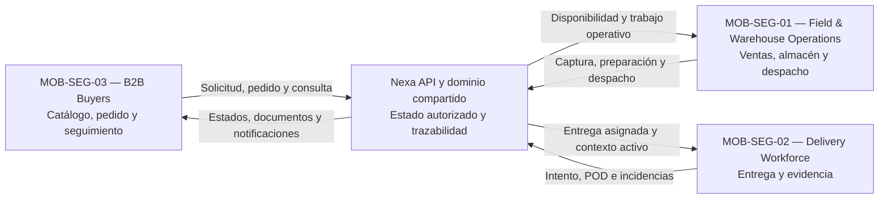

# 1.3 Target Segments

## Segmentación móvil propuesta

Luego de explorar el dominio, los actores y los flujos candidatos en la sección
1.2, Nexa organiza su alcance móvil en tres segmentos objetivo propuestos. Esta
clasificación sirve para orientar la investigación y el diseño; el
`blueprint` todavía marca la validación de investigación como pendiente.

| ID | Segmento | Actores principales | Aplicación | Necesidad móvil a explorar |
| --- | --- | --- | --- | --- |
| **MOB-SEG-01** | **Field & Warehouse Operations** | Sales Representative, Warehouse Operator y Dispatch Coordinator. Business Operations Manager es un actor secundario transversal. | Nexa Operations Mobile | Consultar y actualizar información comercial, inventario, preparación, despacho y evidencias desde almacén, oficina o campo. |
| **MOB-SEG-02** | **Delivery Workforce** | Driver / Delivery Operator. | Nexa Operations Mobile | Ejecutar entregas asignadas, registrar intentos, incidencias, ubicación activa, prueba de entrega y evidencia manual de temperatura, incluso con conectividad variable. |
| **MOB-SEG-03** | **B2B Buyers** | Customer Buyer autorizado por la relación con el proveedor. | Nexa Buyer Mobile | Consultar catálogo, realizar pedidos frecuentes, revisar estados, entregas, documentos, pagos y discrepancias con menor incertidumbre. |

Company Owner y Tenant Administrator continúan siendo actores principalmente
Web-first para las decisiones de gobierno de la empresa y de acceso técnico.
Mobile proyecta capacidades del dominio compartido y no crea un nuevo Bounded
Context.

## Relación entre los segmentos

Los segmentos representan partes diferentes del mismo ciclo comercial y
operativo:

La separación evita tratar Mobile como una sola experiencia genérica. Las
personas de campo y almacén necesitan rapidez y contexto; los conductores
necesitan continuidad, evidencia y ubicación limitada al ciclo activo de
entrega; y los compradores necesitan acciones frecuentes, claridad y
confianza. Las tres experiencias deben conservar una fuente de autoridad común
sin sobrescribir hechos distintos, como la cantidad ofrecida por el conductor
y la cantidad aceptada o disputada por el comprador.

## Características demográficas y ocupacionales

| Segmento | Características demográficas y ocupacionales | Entorno de trabajo |
| --- | --- | --- |
| MOB-SEG-01 | Personal comercial, responsables de almacén, operadores de inventario, coordinadores de despacho y responsables de operaciones. Su nivel de decisión varía entre tareas operativas, coordinación y excepciones autorizadas. | Oficina comercial, almacén, cámara de frío, punto de despacho y uso ocasional de celular en campo. |
| MOB-SEG-02 | Conductores y operadores de entrega responsables de trasladar pedidos, coordinar intentos, registrar incidencias y obtener confirmación o evidencia de recepción. | Vehículos de reparto, rutas urbanas y establecimientos compradores. |
| MOB-SEG-03 | Dueños de negocio, encargados de compras, administradores de local, responsables de reposición y compradores frecuentes de restaurantes, supermercados, retail, bodegas y negocios HORECA. | Local comercial, almacén del comprador, oficina o celular utilizado para compras recurrentes. |

La edad, ubicación, frecuencia de uso, accesibilidad, conectividad y experiencia
digital de cada segmento deberán completarse con investigación primaria. No se
crearán personas validadas a partir de supuestos.

## Sustento histórico del dominio

| Fuente histórica | Dato relevante | Uso responsable en este informe |
| --- | --- | --- |
| Lucky-Xplora (2022) | Alrededor del 83% de las bodegas del canal tradicional se ubicaba en un nivel principiante de madurez digital y cerca del 28% utilizaba alguna aplicación para gestionar tareas del negocio. | Justifica investigar experiencias de bajo esfuerzo para compradores B2B; no representa una medición actual de adopción de Buyer Mobile. |
| Bravo De la Cruz et al. (2025) | El estudio citado reporta 64 rupturas de cadena de frío en el periodo analizado: 14 por congelación y 50 por sobrecalentamiento. | Justifica investigar registro, trazabilidad y disposición de evidencia térmica; no prueba que todos los tenants tengan el mismo riesgo. |

El informe Web anterior ofrece evidencia útil para justificar por qué estos
segmentos merecen investigación, pero no prueba por sí solo las necesidades
móviles. Lucky-Xplora (2022) reporta una madurez digital principalmente
incipiente en el canal tradicional y un uso limitado de aplicaciones para
gestionar tareas del negocio. Esta evidencia respalda explorar experiencias de
bajo esfuerzo para compradores B2B, sin afirmar una tasa universal de adopción.

La evidencia sobre cadena de frío también justifica investigar al personal de
almacén, despacho y entrega. Bravo De la Cruz et al. (2025) documentan
incidentes recurrentes de desviación térmica en el contexto estudiado. Para
Nexa, esto se traduce en una hipótesis sobre registro manual, trazabilidad y
disposición de productos; no autoriza a afirmar que todos los segmentos sufren
el mismo nivel de riesgo ni que exista telemetría IoT implementada.

## Necesidades y valor esperado por segmento

| Segmento | Dolor a investigar | Valor esperado de Nexa | Indicadores iniciales |
| --- | --- | --- | --- |
| MOB-SEG-01 | Información dispersa entre pedido, disponibilidad, inventario, preparación y despacho. | Continuidad de trabajo, siguiente acción clara y menor doble digitación. | Tiempo de completar una tarea, aclaraciones requeridas y datos reconstruidos manualmente. |
| MOB-SEG-02 | Dependencia de comunicación informal, conectividad variable y pérdida de evidencias de entrega. | Trabajo recuperable, estados explícitos y POD asociado a la entrega correcta. | Tareas recuperadas tras desconexión, evidencias asociadas y diferencias entre intentos. |
| MOB-SEG-03 | Incertidumbre sobre disponibilidad, confirmación, entrega, documentos, pagos y discrepancias. | Autonomía para consultar y ejecutar acciones frecuentes con respaldo del proveedor. | Tareas completadas sin asistencia, consultas repetitivas y tiempo para encontrar información. |

Estos indicadores son candidatos para entrevistas y experimentos. No son
métricas de éxito definitivas hasta contar con una línea base y evidencia de
validación.

## Límites de la proyección móvil

- El almacenamiento local puede conservar cachés, borradores, evidencias en
  cola y metadatos de sincronización, pero la API mantiene la autoridad del
  negocio.
- El acceso a cámara, escaneo y ubicación se limita al contexto autorizado de
  la tarea; no se propone seguimiento permanente del personal.
- El registro de temperatura es manual en la propuesta inicial. La medición
  automática mediante IoT queda fuera del alcance actual.
- Dispatch Handoff y POD son hechos diferentes. Las cantidades ofrecidas por
  el conductor y las aceptadas o disputadas por el comprador deben conservarse
  como historias separadas.
- Buyer Portal Web permanece feature-complete; Buyer Mobile es una proyección
  móvil-primary para acciones frecuentes, no una sustitución total del portal.
