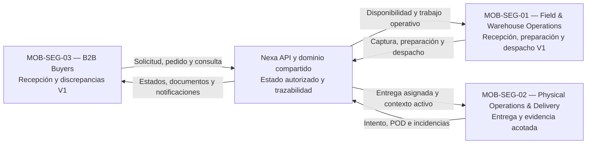

# 1.3 Target Segments

## Segmentación móvil propuesta

Luego de explorar el dominio, los actores y los flujos candidatos en la sección
1.2, Nexa organiza su alcance móvil en tres segmentos objetivo propuestos. Esta
clasificación sirve para orientar la investigación y el diseño. La validación
mediante investigación primaria permanece pendiente.

| ID | Segmento | Actores principales | Aplicación | Necesidad móvil a explorar |
| --- | --- | --- | --- | --- |
| **MOB-SEG-01** | **Field & Warehouse Operations** | Warehouse Operator y Dispatch Coordinator para el alcance V1; Sales Representative es un actor diferido V2+. Business Operations Manager es un actor secundario transversal. | Nexa Operations Mobile | Investigar identificación, recepción, lotes, FEFO, picking, temperatura, preparación y despacho. Las tareas de ventas en campo se mantienen fuera del flujo V1 hasta nueva validación. |
| **MOB-SEG-02** | **Physical Operations & Delivery** | Driver / Delivery Operator. | Nexa Operations Mobile | Ejecutar entregas asignadas, registrar intentos, incidencias, prueba de entrega y handoff con conectividad variable. La ubicación se limita a la acción autorizada de navegación; no se afirma seguimiento continuo. |
| **MOB-SEG-03** | **B2B Buyers** | Customer Buyer autorizado por la relación con el proveedor. | Nexa Buyer Mobile | En V1, atender notificaciones relevantes, verificar el handoff, confirmar cantidades recibidas y registrar discrepancias. Catálogo, solicitudes, pagos y otros flujos permanecen sujetos a V2+ y validación. |

Company Owner y Tenant Administrator continúan siendo actores principalmente
Web-first para las decisiones de gobierno de la empresa y de acceso técnico.
La propuesta móvil proyecta capacidades del dominio compartido y no crea un
nuevo Bounded Context.

## Relación entre los segmentos

Los segmentos representan partes diferentes del mismo ciclo comercial y
operativo:

La separación evita tratar Mobile como una sola experiencia genérica. El
personal de almacén y despacho necesita rapidez y contexto; los conductores
necesitan continuidad y evidencia durante el ciclo activo de entrega; y los
compradores necesitan claridad para verificar la recepción. Las tres
experiencias deben conservar una fuente de autoridad común sin sobrescribir
hechos distintos, como el resultado del conductor y la cantidad aceptada o
disputada por el comprador.

## Características demográficas y ocupacionales

| Segmento | Características demográficas y ocupacionales | Entorno de trabajo |
| --- | --- | --- |
| MOB-SEG-01 | Warehouse Operators y Dispatch Coordinators para V1; Sales Representatives se investigan como alcance diferido. Su nivel de decisión varía entre tareas operativas, coordinación y excepciones autorizadas. | Almacén, cámara de frío, zona de preparación, punto de despacho y, sólo para el alcance diferido, campo comercial. |
| MOB-SEG-02 | Conductores y operadores de entrega responsables de trasladar pedidos, coordinar intentos, registrar incidencias y obtener evidencia de recepción. | Vehículos de reparto, rutas urbanas y establecimientos compradores; la conectividad y seguridad se deben observar en contexto. |
| MOB-SEG-03 | Dueños de negocio, encargados de compras, administradores de local, responsables de reposición y compradores B2B autorizados. | Local comercial, almacén del comprador, oficina o celular utilizado para recepción y coordinación. |

La edad, ubicación, frecuencia de uso, accesibilidad, conectividad y experiencia
digital de cada segmento deberán completarse con investigación primaria. No se
crearán personas validadas a partir de supuestos.

## Sustento documental para la investigación

| Fuente | Aporte relevante | Uso responsable en este informe |
| --- | --- | --- |
| GS1 (n.d.) | Relaciona Critical Tracking Events y Key Data Elements para estudiar quién, qué, dónde, cuándo y por qué en la trazabilidad. | Orienta preguntas sobre custodia y traspasos; no prueba necesidades ni aceptación de Nexa. |
| World Health Organization (2022) | Documenta un procedimiento para mapear la temperatura de equipos y áreas de almacenamiento de cadena de frío. | Orienta la investigación sobre evidencia térmica; no transfiere umbrales ni reglas de aceptación al producto. |
| De Lombaert et al. (2024) | Estudia la exigencia física del order picking mediante un experimento de laboratorio a gran escala. | Orienta preguntas sobre carga, altura, peso, cantidad e interacción con el dispositivo; no representa medición de usuarios Nexa. |

Estas fuentes justifican investigar trazabilidad, conservación y condiciones de
trabajo en los tres segmentos. La segmentación, sus necesidades y sus
indicadores siguen siendo propuestas hasta contar con entrevistas, pruebas y
otra evidencia primaria del proyecto.

## Relación con evidencia histórica

La relación siguiente adapta únicamente hechos y preguntas que pueden
reutilizarse con trazabilidad. El [ledger de procedencia](../../93-annexes/annex-f-translation-and-terms/historical-evidence-provenance.md)
contiene SHA, rutas, estados y bloqueos por registro.

| Fuente histórica | Relación segura con segmento vigente | Límite de reutilización |
| :--- | :--- | :--- |
| S1 — Commercial Coordination (3 registros) | Informa preguntas sobre coordinación en campo, canales paralelos, disponibilidad, crédito, rendimiento y doble digitación para `MOB-SEG-01`. | El antiguo rol comercial no prueba trabajo de Warehouse Operator ni valida captura móvil V1. |
| S2 — Operations / Account Owner (3 registros) | Permite formular preguntas sobre documentos, vencimiento, FEFO, temperatura y preparación dentro de `MOB-SEG-01` y del plan de investigación. | Es `HISTORICAL CONTEXT ONLY`; no representa al nuevo `MOB-SEG-02` ni prueba conducta de Driver / Delivery Operator. |
| S3 — B2B Buyer Portal (2 registros) | Informa preguntas de atención de entrega, handoff, cantidades, discrepancias, recibo, evidencia y confianza para `MOB-SEG-03`. | No valida catálogo, pedidos, pagos, documentos ni tracking completo en Mobile V1. Requiere al menos un participante actual adicional si no aparece un sexto registro compatible. |

La evidencia histórica orienta investigación; no convierte actores, necesidades,
indicadores o historias en elementos validados.

## Necesidades y valor esperado por segmento

| Segmento | Dolor a investigar | Valor esperado de Nexa | Indicadores iniciales |
| --- | --- | --- | --- |
| MOB-SEG-01 | Información dispersa entre pedido, disponibilidad, inventario, preparación y despacho. | Continuidad de trabajo, siguiente acción clara y menor doble digitación. | Tiempo de completar una tarea, aclaraciones requeridas y datos reconstruidos manualmente. |
| MOB-SEG-02 | Dependencia de comunicación informal, conectividad variable y pérdida de evidencias de entrega. | Trabajo recuperable, estados explícitos y POD asociado a la entrega correcta. | Tareas recuperadas tras desconexión, evidencias asociadas y diferencias entre intentos. |
| MOB-SEG-03 | Incertidumbre sobre la entrega, recepción y discrepancias; catálogo, pedidos y pagos quedan sujetos al alcance aprobado. | Autonomía acotada para verificar la entrega y comunicar diferencias con respaldo del proveedor. | Tareas completadas sin asistencia, consultas repetitivas y tiempo para encontrar información. |

Estos indicadores son candidatos para entrevistas y experimentos. No son
métricas de éxito definitivas hasta contar con una línea base y evidencia de
validación.

## Límites de la proyección móvil

- El almacenamiento local puede conservar caché, borradores seguros,
  evidencias temporales y metadatos de reintento, pero la API mantiene la
  autoridad del negocio.
- El acceso a cámara, escaneo y ubicación se limita al contexto autorizado de
  la tarea; no se propone seguimiento permanente del personal ni ETA en vivo.
- El registro de temperatura es manual en la propuesta inicial. La medición
  automática mediante IoT queda fuera del alcance actual.
- Dispatch Handoff y POD son hechos diferentes. Las cantidades ofrecidas por
  el conductor y las aceptadas o disputadas por el comprador deben conservarse
  como historias separadas.
- Buyer Portal Web permanece como superficie independiente; Buyer Mobile es una
  proyección para los flujos V1 explícitos, no una sustitución total del portal.

## Mapeo del alcance V1

| Segmento | Historias V1 principales | Alcance no demostrado en este corte |
| :--- | :--- | :--- |
| MOB-SEG-01 | `MOB-US-001..003`, `MOB-US-011..017`, `MOB-US-019` | Venta en campo, inventario automático, IoT y cualquier flujo no incluido en la proyección |
| MOB-SEG-02 | `MOB-US-020..034` | Seguimiento permanente, GPS histórico, ETA en vivo y autoridad offline no forman parte de V1 |
| MOB-SEG-03 | `MOB-US-044`, `MOB-US-047..049` | Catálogo completo, solicitudes comerciales, pagos y documentos como paridad móvil |

La tabla organiza el backlog académico; no demuestra que las historias estén
implementadas o aceptadas.
