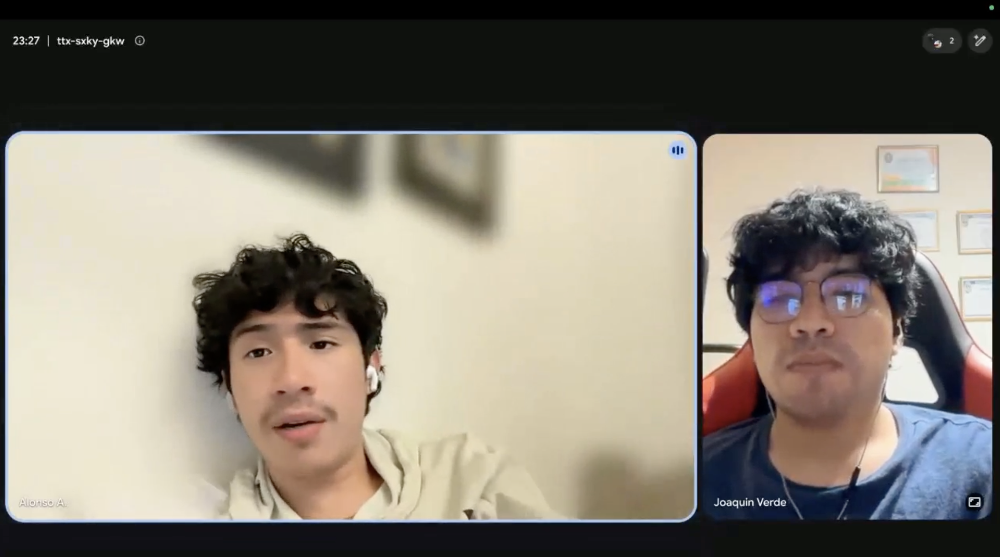
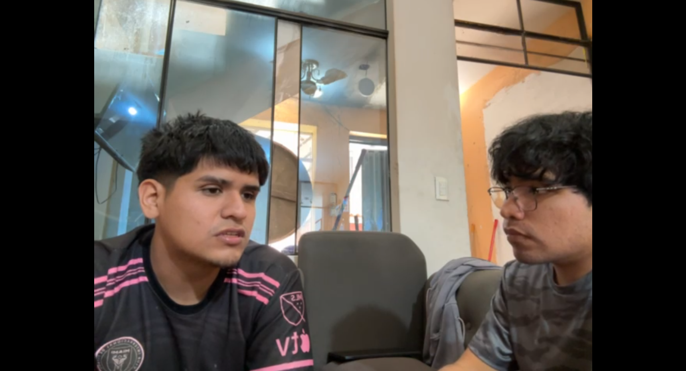
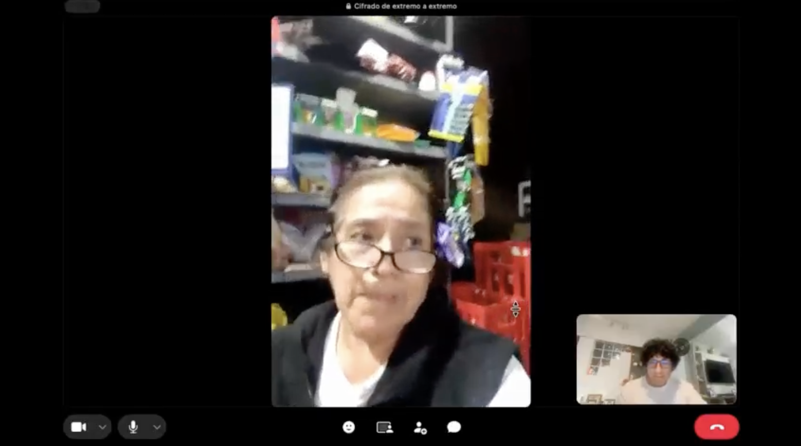

### 2.2.2 Interview Records

Esta sección registra las nueve entrevistas realizadas para la investigación de
*Needfinding*: tres por cada segmento objetivo. Cada ficha conserva la
identificación del participante, la evidencia audiovisual, la marca de tiempo
dentro del video consolidado y un resumen descriptivo de las respuestas.

Los resúmenes deben incluir las características objetivas y subjetivas obtenidas durante
la sesión —incluyendo demografía declarada, personalidad, habilidades, afinidad por marcas e
influencias, tecnología, navegador web, dispositivos, canales, objetivos, frustraciones y
antecedentes— además de la evidencia específica del trabajo o experiencia del
segmento. Cuando un dato no haya sido declarado, se consigna como `NO DECLARADO`.

#### Evidencia audiovisual consolidada

*Registro audiovisual consolidado de Needfinding Interviews*

| Campo | Registro |
| :--- | :--- |
| Nombre del archivo | `upc-pre-202620-1acc0238-4949-nexa-team-needfinding-av1.mp4` |
| URL de OneDrive | [upc-pre-202620-1acc0238-4949-nexa-team-needfinding-av1](https://upcedupe-my.sharepoint.com/personal/u202323040_upc_edu_pe/_layouts/15/stream.aspx?id=%2Fpersonal%2Fu202323040%5Fupc%5Fedu%5Fpe%2FDocuments%2Fupc%2Dpre%2D202620%2D1acc0238%2D4949%2Dnexa%2Dteam%2Fnexa%2Dinterviews%2Fupc%2Dpre%2D202620%2D1acc0238%2D4949%2Dnexa%2Dteam%2D%20needfinding%2Dav1%2Emp4&referrer=StreamWebApp%2EWeb&referrerScenario=AddressBarCopied%2Eview%2Ed5b269f7%2D9881%2D4cf3%2D87ae%2D9906871909cd&isDarkMode=true) |
| Fecha de publicación | `2026-09-15` |
| Duración total | `[1:52:24]` |
| Entrevistas incluidas | `INT-S1-01` a `INT-S3-03` |

*Captura representativa del video consolidado*

**MANUAL EVIDENCE ACTION REQUIRED:** Captura representativa del video
consolidado de Needfinding.

#### Cobertura de entrevistas

*Cobertura de entrevistas por segmento*

| Segmento | Identificadores previstos | Cantidad | Estado |
| :--- | :--- | :---: | :--- |
| `MOB-SEG-01 — Warehouse & Dispatch Operations` | `INT-S1-01`, `INT-S1-02`, `INT-S1-03` | 3 | Completado |
| `MOB-SEG-02 — Driver Delivery Execution` | `INT-S2-01`, `INT-S2-02`, `INT-S2-03` | 3 | Completado |
| `MOB-SEG-03 — B2B Buyers` | `INT-S3-01`, `INT-S3-02`, `INT-S3-03` | 3 | Completado |

#### Segmento `MOB-SEG-01 — Warehouse & Dispatch Operations`

##### `INT-S1-01` — Sandro Alonso Alcántara Cerdá

*Perfil y evidencia de la entrevista*

| Campo | Registro |
| :--- | :--- |
| Nombres | Sandro Alonso |
| Apellidos | Alcántara Cerdá |
| Edad | 19 años |
| Género | Masculino |
| Distrito de residencia | Jesús María |
| Distrito principal de actividad | Jesús María |
| Estado civil | Soltero |
| Composición familiar | Familia tradicional |
| Ocupación / función específica | Trabajador de almacén encargado de recibir, verificar, almacenar y preparar mercadería para su posterior entrega al área de despacho (`Warehouse Operator`) |
| Experiencia en la actividad | Casi un año realizando actividades de almacén |
| Personalidad / forma de decidir | Mantiene una forma de trabajo ordenada y orientada a la verificación. Cuando identifica una diferencia, detiene la actividad relacionada, separa el producto y comunica la situación al responsable antes de continuar. |
| Habilidades | Esfuerzo, organización, atención al detalle y capacidad para verificar productos y cantidades antes de continuar con una operación. |
| Afinidad por marcas e influencias | Utiliza Google Maps y otras aplicaciones digitales que considera útiles para sus actividades cotidianas. Su ingreso al trabajo de almacén estuvo influido por la recomendación de un familiar. |
| Dispositivos | iPhone 12 de uso personal |
| Tecnología / aplicaciones | Sistema de la empresa, hojas de cálculo, WhatsApp, Google Maps y otras aplicaciones de apoyo |
| Navegador web | Safari |
| Canales digitales | WhatsApp para coordinaciones rápidas y herramientas digitales de la empresa para consultar y registrar información |
| Objetivos | Preparar correctamente los pedidos, verificar que los productos, cantidades y lotes correspondan a lo solicitado y transferir el pedido al área de despacho sin observaciones pendientes. |
| Frustraciones | Que un pedido salga con productos, cantidades, lotes o información incorrecta y que sea necesario revisar información distribuida en diferentes herramientas o registros. |
| Antecedentes / biografía | Comenzó a realizar actividades de almacén por recomendación de un familiar y actualmente cuenta con casi un año de experiencia en este tipo de trabajo. |
| Fecha de entrevista | `2026-09-12` |
| Marca de tiempo de inicio en el video consolidado | `00:00:05` |
| Marca de tiempo de fin en el video consolidado | `00:04:47` |
| Duración | `04:42` |
| URL del video consolidado | [upc-pre-202620-1acc0238-4949-nexa-team-needfinding-av1](https://upcedupe-my.sharepoint.com/personal/u202323040_upc_edu_pe/_layouts/15/stream.aspx?id=%2Fpersonal%2Fu202323040%5Fupc%5Fedu%5Fpe%2FDocuments%2Fupc%2Dpre%2D202620%2D1acc0238%2D4949%2Dnexa%2Dteam%2Fnexa%2Dinterviews%2Fupc%2Dpre%2D202620%2D1acc0238%2D4949%2Dnexa%2Dteam%2D%20needfinding%2Dav1%2Emp4&referrer=StreamWebApp%2EWeb&referrerScenario=AddressBarCopied%2Eview%2Ed5b269f7%2D9881%2D4cf3%2D87ae%2D9906871909cd&isDarkMode=true) |

*Evidencia audiovisual de INT-S1-01*

**Resumen descriptivo.** Sandro Alonso Alcántara Cerdá tiene 19 años, se identifica
como masculino, es soltero y reside en Jesús María, distrito donde también realiza
principalmente sus actividades laborales. Indicó que pertenece a una familia
tradicional y cuenta con casi un año de experiencia trabajando en almacén. Llegó a
esta actividad por recomendación de un familiar.

Dentro del almacén, Sandro participa en la recepción, verificación, almacenamiento y
preparación de mercadería. Explicó que, cuando llega un pedido, primero revisa los
productos y las cantidades correspondientes, registra la información y posteriormente
ubica la mercadería en el almacén. Cuando se solicita un pedido, participa en su
preparación, realiza una nueva verificación y deja los productos listos para ser
entregados al área de despacho.

Para verificar la mercadería revisa el código, nombre del producto, lote, fecha de
vencimiento, cantidad y estado del empaque. Cuando alguno de estos elementos no
coincide con la información disponible, separa el producto y comunica la diferencia
al responsable antes de continuar. Esta forma de trabajo refleja una orientación hacia
la verificación y prevención de errores antes de que el pedido avance a la siguiente
actividad.

La disponibilidad de productos se consulta inicialmente mediante el sistema o los
registros disponibles. Después, Sandro realiza una comprobación física para confirmar
que el producto, la cantidad y el lote correspondan a lo solicitado. Una vez
seleccionada la mercadería, esta se prepara, se revisa nuevamente y queda disponible
para despacho.

Considera que un pedido se encuentra listo para continuar cuando los productos y las
cantidades han sido verificados y la mercadería se encuentra correctamente separada o
embalada. Posteriormente, el pedido es transferido al responsable de despacho y queda
un registro, guía o comprobante asociado a la entrega de responsabilidad entre ambas
actividades.

Cuando identifica un producto faltante, dañado o perteneciente a un lote incorrecto,
detiene esa parte de la preparación y comunica el problema al responsable. A partir de
ello se determina si corresponde reemplazar el producto, corregir la información o
esperar una nueva indicación antes de continuar con el pedido.

Para realizar su trabajo utiliza el sistema de la empresa, hojas de cálculo,
documentos, etiquetas y WhatsApp para coordinaciones rápidas. También utiliza un
iPhone 12 de uso personal, con Safari como navegador web, además de Google Maps y
otras aplicaciones digitales que considera útiles. Durante la manipulación de
mercadería procura reducir la cantidad de herramientas que necesita consultar de
manera simultánea para realizar las actividades con mayor rapidez.

Entre las principales dificultades identifica la posibilidad de que un pedido avance
con información o productos incorrectos. También considera poco conveniente tener que
consultar o registrar información en diferentes lugares. Por este motivo,
simplificaría principalmente la búsqueda y el registro de productos, pedidos y
excepciones.

Sandro considera que una herramienta de apoyo sería útil si permitiera consultar
rápidamente información sobre productos, cantidades, lotes y estados desde un mismo
lugar, pudiera utilizarse fácilmente desde el teléfono y evitara registrar varias
veces la misma información. Su objetivo durante la preparación es que el pedido pase
al área de despacho correctamente verificado y sin observaciones que obliguen a
reconstruir posteriormente lo ocurrido.

##### `INT-S1-02` — Sebastián Bardales

*Perfil y evidencia de la entrevista*

| Campo | Registro |
| :--- | :--- |
| Nombres | Sebastián |
| Apellidos | Bardales |
| Edad | 22 años |
| Género | Masculino |
| Distrito de residencia | Santiago de Surco |
| Distrito principal de actividad | Lima |
| Estado civil | Soltero |
| Composición familiar | Vive solo |
| Ocupación / función específica | Despachador de pedidos encargado de verificar productos, preparar pedidos y transferirlos a la siguiente actividad del proceso (`Warehouse Operator`) |
| Experiencia en la actividad | Dos meses trabajando como despachador de pedidos |
| Personalidad / forma de decidir | Se describe como calmado y sereno. Ante un problema procura mantener la calma y resolver la situación de la mejor manera posible. |
| Habilidades | Organización, atención al detalle, comunicación y capacidad para mantener la calma ante situaciones imprevistas. |
| Afinidad por marcas e influencias | No señaló una marca específica como influencia. Indicó que utiliza aplicaciones de organización personal para administrar y medir mejor sus tiempos. |
| Dispositivos | Teléfono móvil con sistema operativo Android |
| Tecnología / aplicaciones | Aplicación de la empresa, WhatsApp y aplicaciones de organización personal |
| Navegador web | Google Chrome |
| Canales digitales | WhatsApp para consultas y coordinaciones habituales; llamadas telefónicas cuando una situación requiere atención prioritaria |
| Objetivos | Preparar correctamente los pedidos, verificar que los productos coincidan con lo solicitado por el cliente y transferirlos sin errores a la siguiente actividad. |
| Frustraciones | La limitada flexibilidad de la aplicación de la empresa ante faltantes o situaciones excepcionales, debido a que ofrece pocas alternativas para resolver casos que requieren decisiones más específicas. |
| Antecedentes / biografía | No cuenta con experiencia previa relacionada con esta actividad y actualmente tiene dos meses de experiencia en el puesto. Utiliza herramientas de organización personal para administrar mejor sus tiempos. |
| Fecha de entrevista | `2026-09-12` |
| Marca de tiempo de inicio en el video consolidado | `00:04:49` |
| Marca de tiempo de fin en el video consolidado | `00:13:24` |
| Duración | `09:25` |
| URL del video consolidado | [upc-pre-202620-1acc0238-4949-nexa-team-needfinding-av1](https://upcedupe-my.sharepoint.com/personal/u202323040_upc_edu_pe/_layouts/15/stream.aspx?id=%2Fpersonal%2Fu202323040%5Fupc%5Fedu%5Fpe%2FDocuments%2Fupc%2Dpre%2D202620%2D1acc0238%2D4949%2Dnexa%2Dteam%2Fnexa%2Dinterviews%2Fupc%2Dpre%2D202620%2D1acc0238%2D4949%2Dnexa%2Dteam%2D%20needfinding%2Dav1%2Emp4&referrer=StreamWebApp%2EWeb&referrerScenario=AddressBarCopied%2Eview%2Ed5b269f7%2D9881%2D4cf3%2D87ae%2D9906871909cd&isDarkMode=true) |

*Evidencia audiovisual de INT-S1-02*

**Resumen descriptivo.** Sebastián Bardales tiene 22 años, se identifica como
masculino, es soltero, reside en Santiago de Surco y vive solo. Realiza sus actividades
laborales principalmente en Lima y actualmente trabaja como despachador de pedidos.
Cuenta con dos meses de experiencia en esta función y no señaló experiencia laboral
previa relacionada con este tipo de actividad.

Para realizar su trabajo utiliza un teléfono móvil con sistema operativo Android y la
aplicación de la empresa mediante la cual recibe la información de los pedidos.
También utiliza WhatsApp para consultas y coordinaciones con sus compañeros y recurre
a llamadas telefónicas cuando necesita comunicar una situación de mayor prioridad.
Utiliza Google Chrome como navegador web y, fuera de las herramientas directamente
relacionadas con el trabajo, emplea aplicaciones de organización personal para
administrar y medir mejor sus tiempos.

Sebastián describe su forma de trabajar como calmada y serena. Cuando aparece un
problema inesperado considera importante mantener la calma e intentar resolver la
situación de la mejor manera posible. Su forma de trabajo también requiere
organización, comunicación y atención al detalle, especialmente durante la revisión de
los productos que integran cada pedido.

Al recibir un pedido, revisa la información correspondiente e identifica los productos
que deben prepararse. Posteriormente solicita los productos necesarios y, una vez que
los recibe, verifica que correspondan con lo indicado en el pedido y procede a
empaquetarlos. Cuando termina su actividad, el pedido pasa a un compañero encargado
de realizar el sellado de la caja antes de continuar con la siguiente etapa.

La disponibilidad de productos no es gestionada directamente por Sebastián. Explicó
que existe otra área relacionada con la suya que se encarga de mantener esta
información. Según su comprensión del proceso, la aplicación de la empresa contiene
la cantidad de productos disponibles y esta cantidad disminuye conforme se atienden
los pedidos. Su responsabilidad se concentra principalmente en comprobar que los
productos entregados para preparación sean los correctos y correspondan con lo
solicitado.

Cuando un producto no se encuentra disponible, la aplicación permite considerar la
preferencia indicada previamente por el cliente. Dependiendo de esa configuración, el
producto puede ser reemplazado por una alternativa o puede omitirse de la entrega.
Sebastián considera que esta función presenta limitaciones porque ofrece pocas
alternativas y no proporciona suficiente flexibilidad cuando aparece una situación más
compleja.

Antes de transferir un pedido a la siguiente actividad, Sebastián verifica que los
productos correspondan con los nombres indicados, que no exista mercadería adicional
y que ningún producto haya sido asignado incorrectamente a otro pedido. Una vez
realizada esta comprobación, el pedido se entrega al compañero encargado de sellar la
caja.

Respecto de este cambio de responsabilidad, indicó que no existe un protocolo
específico ni un registro generado expresamente para documentar la transferencia.
Señaló que las cámaras de seguridad podrían constituir una evidencia indirecta de lo
ocurrido, pero no existe un mecanismo formal utilizado por los trabajadores para
registrar este cambio.

Sebastián no identifica mayores dificultades para consultar información mientras
realiza sus actividades. Sin embargo, cuando necesita resolver una situación de
especial importancia utiliza llamadas telefónicas y números personales de sus
compañeros como medio de comunicación complementario. Esta necesidad de recurrir a
otros canales se relaciona con las limitaciones que reconoce en las herramientas
disponibles.

Para Sebastián, lo más importante es verificar que el pedido contenga exactamente los
productos solicitados por el cliente y respetar las decisiones establecidas cuando un
producto no se encuentra disponible. Su objetivo es que el pedido avance correctamente
a la siguiente actividad y que el cliente reciba lo que esperaba, reduciendo errores
que puedan afectar su experiencia.

##### `INT-S1-03` — Rodrigo Mendoza

*Perfil y evidencia de la entrevista*

| Campo | Registro |
| :--- | :--- |
| Nombres | Rodrigo |
| Apellidos | Mendoza |
| Edad | 28 años |
| Género | Masculino |
| Distrito de residencia | Lima |
| Distrito principal de actividad | Lima |
| Estado civil | Soltero |
| Composición familiar | Vive solo |
| Ocupación / función específica | Coordinador de almacén encargado también de actividades vinculadas con la rampa de despacho (`Dispatch Coordinator`) |
| Experiencia en la actividad | Un año realizando actividades de coordinación de almacén y despacho |
| Personalidad / forma de decidir | Mantiene una forma de trabajo orientada a la verificación y al control de la información. Evalúa si una herramienta resulta viable según su impacto real en la velocidad de la operación y en las condiciones físicas del almacén y la rampa. |
| Habilidades | Organización, atención al detalle, coordinación de equipos, control de información y verificación de lotes y fechas de vencimiento. |
| Afinidad por marcas e influencias | No manifestó una preferencia de marca específica. Utiliza habitualmente un Samsung A52 y herramientas como Microsoft Excel, Gmail y WhatsApp. Ingresó a esta actividad por recomendación de un conocido. |
| Dispositivos | Teléfono móvil Samsung A52 con Android y computadora de escritorio en su espacio de trabajo |
| Tecnología / aplicaciones | ERP de la empresa, Microsoft Excel, Gmail, WhatsApp y Google Chrome |
| Navegador web | Google Chrome |
| Canales digitales | Correo electrónico para recibir programaciones e información operativa; WhatsApp para coordinaciones y verificación de información con otros participantes del proceso |
| Objetivos | Mantener el control correcto de productos, lotes y vencimientos, reducir errores durante la preparación y permitir que los pedidos pasen al despacho dentro de los horarios establecidos. |
| Frustraciones | Doble registro entre papel y Excel, errores de digitación, dificultad para interpretar anotaciones manuales, necesidad de reconstruir información ante reclamos y limitaciones para usar el teléfono en condiciones de frío, con guantes o con conectividad deficiente. |
| Antecedentes / biografía | Ingresó a este tipo de trabajo por recomendación de un conocido y cuenta actualmente con aproximadamente un año de experiencia en coordinación de almacén y despacho. |
| Fecha de entrevista | `2026-09-14` |
| Marca de tiempo de inicio en el video consolidado | `00:13:25` |
| Marca de tiempo de fin en el video consolidado | `00:21:35` |
| Duración | `08:10` |
| URL del video consolidado | [upc-pre-202620-1acc0238-4949-nexa-team-needfinding-av1](https://upcedupe-my.sharepoint.com/personal/u202323040_upc_edu_pe/_layouts/15/stream.aspx?id=%2Fpersonal%2Fu202323040%5Fupc%5Fedu%5Fpe%2FDocuments%2Fupc%2Dpre%2D202620%2D1acc0238%2D4949%2Dnexa%2Dteam%2Fnexa%2Dinterviews%2Fupc%2Dpre%2D202620%2D1acc0238%2D4949%2Dnexa%2Dteam%2D%20needfinding%2Dav1%2Emp4&referrer=StreamWebApp%2EWeb&referrerScenario=AddressBarCopied%2Eview%2Ed5b269f7%2D9881%2D4cf3%2D87ae%2D9906871909cd&isDarkMode=true) |

*Evidencia audiovisual de INT-S1-03*

**Resumen descriptivo.** Rodrigo Mendoza tiene 28 años, se identifica como masculino,
es soltero, vive solo y reside en Lima, donde también realiza principalmente sus
actividades laborales. Cuenta con aproximadamente un año de experiencia y trabaja
como coordinador de almacén, además de participar en actividades relacionadas con la
rampa de despacho de una empresa importadora y distribuidora de productos lácteos y
embutidos. Indicó que llegó a este tipo de trabajo por recomendación de un conocido.

Para desarrollar sus actividades utiliza un teléfono Samsung A52 con sistema operativo
Android y una computadora en su espacio de trabajo. Entre las herramientas digitales
que emplea se encuentran el ERP de la empresa, Microsoft Excel, Gmail, WhatsApp y
Google Chrome. También utiliza recursos físicos como portapapeles, lapiceros, libretas,
documentos impresos y otros registros necesarios durante la operación.

Rodrigo explicó que la programación de despacho llega mediante correo electrónico,
generalmente acompañada por documentos que contienen la información necesaria para
preparar los pedidos. Posteriormente, consulta el ERP de la empresa e imprime las
órdenes de preparación correspondientes. Con esta información, el personal ingresa a
la cámara de frío para organizar los productos, bultos y lotes que formarán parte de
la carga.

El control de lotes y fechas de vencimiento constituye una actividad especialmente
importante debido al tipo de productos que distribuyen. Rodrigo señaló que un error
en estas verificaciones puede provocar el rechazo de una carga por parte del cliente.
Por ello, durante la preparación se registran códigos y se controla la mercadería que
ingresa y sale de la operación.

Una parte de este registro todavía se realiza manualmente. Según explicó, los
trabajadores que se encuentran dentro de la cámara de frío suelen anotar códigos a
mano y posteriormente Rodrigo debe trasladar esa información a Microsoft Excel para
conciliar los datos del turno. Considera que este procedimiento genera trabajo
adicional y puede producir errores cuando una anotación es incorrecta, se digita mal
o resulta difícil de interpretar.

Cuando ocurre un reclamo o existe alguna diferencia en la información, Rodrigo puede
necesitar revisar documentación física almacenada en archivadores y contrastar los
datos disponibles mediante coordinaciones por WhatsApp con otros participantes del
proceso, como el chofer. Esta reconstrucción de información requiere tiempo y puede
dificultar la identificación de lo ocurrido durante la preparación o el despacho.

Rodrigo también describió condiciones físicas que afectan directamente el uso de
herramientas digitales dentro de la operación. En la cámara de frío se trabaja a
temperaturas cercanas a los 3 °C y los trabajadores utilizan guantes térmicos gruesos.
Estas condiciones dificultan desbloquear el teléfono, manipular la pantalla o utilizar
la cámara con rapidez. Asimismo, los cambios de temperatura pueden empañar los lentes
de la cámara y las características de la infraestructura pueden reducir la calidad de
la señal.

Estas limitaciones son especialmente relevantes porque la operación se encuentra
condicionada por los horarios de entrada y salida de los camiones. Rodrigo considera
que cualquier herramienta que introduzca pasos adicionales o detenga demasiado al
personal podría terminar siendo abandonada durante el trabajo cotidiano. Su criterio
para evaluar una herramienta se relaciona principalmente con que pueda utilizarse de
forma rápida, sencilla y sin interrumpir el ritmo de la rampa de despacho.

Durante la entrevista también se plantearon posibles características de una solución
digital, como el funcionamiento sin conexión, el uso de etiquetas generales para los
lotes y una firma digital del transportista. Estas alternativas fueron introducidas por
el entrevistador, por lo que no se consideran necesidades descubiertas de manera
independiente durante la investigación. Sin embargo, las respuestas de Rodrigo sí
permiten identificar condiciones operativas relevantes para cualquier solución:
funcionamiento confiable con conectividad limitada, interacción sencilla incluso con
guantes, reducción del registro duplicado y rapidez suficiente para no afectar los
horarios de despacho.

Para Rodrigo, el objetivo principal es mantener información confiable sobre los
productos, lotes y vencimientos, reducir errores durante la preparación y evitar que
las dificultades de registro generen reclamos, pérdida de mercadería o retrasos en la
salida de los vehículos.

#### Segmento `MOB-SEG-02 — Driver Delivery Execution`

##### `INT-S2-01` — Nicolás Castro

*Perfil y evidencia de la entrevista*

| Campo | Registro |
| :--- | :--- |
| Nombres | Nicolás |
| Apellidos | Castro |
| Edad | 25 años |
| Género | Masculino |
| Distrito de residencia | La Victoria |
| Distrito principal de actividad | La Victoria |
| Estado civil | Soltero |
| Composición familiar | Con Padres y Hermanos |
| Ocupación / función específica | Repartidor (`Driver / Delivery Operator`) |
| Experiencia en la actividad | Aproximadamente un año realizando entregas |
| Personalidad / forma de decidir | Se describe como orientado a encontrar soluciones rápidas, evitar quedar detenido ante un problema y buscar alternativas que reduzcan inconvenientes con el cliente. |
| Habilidades | Adaptabilidad ante situaciones imprevistas y agilidad para tomar decisiones. |
| Afinidad por marcas e influencias | No declaró afinidad por una marca específica. Mencionó Samsung, Google Maps y WhatsApp como parte de sus herramientas habituales. Indicó que las entregas fallidas, el tráfico, la impuntualidad y los recorridos realizados han influido en su manera de trabajar. |
| Dispositivos | Teléfono móvil personal Samsung |
| Tecnología / aplicaciones | Android, Google Maps, WhatsApp y aplicación proporcionada por la empresa para gestionar pedidos |
| Navegador web | Google Chrome |
| Canales digitales | WhatsApp como canal principal; correo electrónico y llamadas como medios complementarios |
| Objetivos | Completar correctamente la entrega y mantener una buena relación con el cliente. |
| Frustraciones | La demora de coordinación cuando ocurre una incidencia, debido a que debe permanecer detenido y puede retrasar otras entregas. |
| Antecedentes / biografía | Aproximadamente un año de experiencia como repartidor. Señala que las entregas fallidas, las distintas rutas recorridas y los problemas enfrentados durante el trabajo le han permitido mejorar su capacidad de respuesta. |
| Fecha de entrevista | `2026-09-12` |
| Marca de tiempo de inicio en el video consolidado | `00:21:40` |
| Marca de tiempo de fin en el video consolidado | `00:29:42` |
| Duración | `08:02` |
| URL del video consolidado | [upc-pre-202620-1acc0238-4949-nexa-team-needfinding-av1](https://upcedupe-my.sharepoint.com/personal/u202323040_upc_edu_pe/_layouts/15/stream.aspx?id=%2Fpersonal%2Fu202323040%5Fupc%5Fedu%5Fpe%2FDocuments%2Fupc%2Dpre%2D202620%2D1acc0238%2D4949%2Dnexa%2Dteam%2Fnexa%2Dinterviews%2Fupc%2Dpre%2D202620%2D1acc0238%2D4949%2Dnexa%2Dteam%2D%20needfinding%2Dav1%2Emp4&referrer=StreamWebApp%2EWeb&referrerScenario=AddressBarCopied%2Eview%2Ed5b269f7%2D9881%2D4cf3%2D87ae%2D9906871909cd&isDarkMode=true) |

*Evidencia audiovisual de INT-S2-01*

**Resumen descriptivo.** Nicolás Castro tiene 25 años, se identifica como masculino,
es soltero y reside en La Victoria, distrito donde también realiza principalmente sus
actividades de reparto. Vive con sus padres y hermanos y cuenta con aproximadamente
un año de experiencia trabajando como repartidor.

Durante sus entregas utiliza su teléfono móvil personal Samsung con sistema operativo
Android. Para desarrollar su trabajo emplea Google Maps para orientarse, WhatsApp como
principal canal de comunicación y una aplicación proporcionada por la empresa para
recibir y gestionar pedidos. También utiliza correo electrónico y, cuando requiere un
contacto más directo, llamadas telefónicas. Google Chrome es su navegador web habitual.

Respecto de su forma de trabajo, Nicolás explicó que, cuando surge un problema,
procura encontrar una solución rápida y evitar quedar detenido. Considera que la
capacidad de adaptarse a situaciones imprevistas es una habilidad importante para
realizar entregas y señaló que la experiencia acumulada le ha permitido tomar
decisiones con mayor agilidad.

No manifestó una afinidad específica por una marca como criterio de preferencia; sin
embargo, Samsung, Google Maps y WhatsApp forman parte de las herramientas que utiliza
habitualmente. Asimismo, indicó que las entregas fallidas, el tráfico, la
impuntualidad y las distintas rutas recorridas han influido en su aprendizaje y en la
forma en que actualmente responde ante situaciones inesperadas.

Al describir una entrega reciente, indicó que recibe la asignación mediante una
notificación de la aplicación de la empresa. Antes de iniciar el recorrido consulta
Google Maps para elegir una ruta adecuada, recibe el paquete y revisa su condición.
Una vez aceptada la entrega, informa al cliente mediante WhatsApp que el pedido se
encuentra en camino.

Cuando se presenta una dirección incorrecta, el cliente no responde u ocurre otra
incidencia, Nicolás se comunica con coordinación para informar lo sucedido. La demora
en obtener una respuesta constituye su principal frustración, porque debe permanecer
detenido y considera que ese tiempo puede afectar el cumplimiento de otras entregas
programadas.

Para dejar constancia de una entrega completada, solicita al cliente que sostenga el
producto y toma una fotografía con su teléfono. Luego envía la imagen a la empresa
como evidencia de la entrega. Cuando ocurre una situación inesperada, también registra
fotográficamente el contexto y comunica lo sucedido a coordinación.

Durante la ruta identifica como dificultades recurrentes el consumo de batería
asociado al uso continuo de Google Maps y las fallas de señal que dificultan la
comunicación por WhatsApp. Para reducir el consumo de batería evita utilizar la
navegación en rutas que ya conoce y, cuando pierde señal, reinicia el teléfono para
intentar recuperar la conexión.

Para Nicolás, realizar correctamente una entrega implica conseguir que el paquete
llegue al cliente, resolver con rapidez los problemas que puedan surgir durante la
ruta y mantener una buena relación con el cliente durante la interacción.

##### INT-S2-02 — Michelle Rodríguez

*Perfil y evidencia de la entrevista*

| Campo | Registro |
| :--- | :--- |
| Nombres | Michelle |
| Apellidos | Rodríguez |
| Edad | 21 años |
| Género | Mujer |
| Distrito de residencia | Lima, según lo declarado por la participante |
| Distrito principal de actividad | Lima |
| Estado civil | Soltera |
| Composición familiar | Familia |
| Ocupación / función específica | Repartidora mediante plataformas de delivery (Driver / Delivery Operator) |
| Experiencia en la actividad | Un año |
| Personalidad / forma de decidir | Prioriza la comunicación oportuna con el cliente y procura anticipar inconvenientes que puedan generar malentendidos o afectar la entrega. |
| Habilidades | Comunicación con el cliente y capacidad para reaccionar ante incidentes durante la entrega. |
| Afinidad por marcas e influencias | No declaró afinidad por una marca específica. Indicó que familiares que también trabajan en delivery influyeron en su ingreso a esta actividad y le enseñaron cómo actuar ante incidentes. |
| Dispositivos | Teléfono móvil Vivo V22, según lo recuerda la participante; fue adquirido especialmente para realizar entregas. |
| Tecnología / aplicaciones | Didi y Uber Delivery. En la síntesis final también confirmó una mención a WhatsApp y Google Maps, aunque su uso específico no fue desarrollado previamente durante la entrevista. |
| Navegador web | Google Chrome |
| Canales digitales | Mensajería integrada en las aplicaciones para comunicarse con clientes y llamadas al servicio de atención cuando surge un problema. |
| Objetivos | Entregar el producto correctamente, mantener informado al cliente y procurar que el pedido llegue en buenas condiciones. |
| Frustraciones | No declaró una frustración específica. Señaló como dificultades el sobrecalentamiento del teléfono y la necesidad de protegerlo del sol y la lluvia durante la ruta. |
| Antecedentes / biografía | Ingresó al trabajo de delivery influida por familiares que ya realizaban esta actividad y que le brindaron recomendaciones sobre el funcionamiento del trabajo y la respuesta ante incidentes. |
| Fecha de entrevista | 2026-09-12 |
| Marca de tiempo de inicio en el video consolidado | 00:29:43 |
| Marca de tiempo de fin en el video consolidado | 00:37:50 |
| Duración | 08:07 |
| URL del video consolidado | [upc-pre-202620-1acc0238-4949-nexa-team-needfinding-av1](https://upcedupe-my.sharepoint.com/personal/u202323040_upc_edu_pe/_layouts/15/stream.aspx?id=%2Fpersonal%2Fu202323040%5Fupc%5Fedu%5Fpe%2FDocuments%2Fupc%2Dpre%2D202620%2D1acc0238%2D4949%2Dnexa%2Dteam%2Fnexa%2Dinterviews%2Fupc%2Dpre%2D202620%2D1acc0238%2D4949%2Dnexa%2Dteam%2D%20needfinding%2Dav1%2Emp4&referrer=StreamWebApp%2EWeb&referrerScenario=AddressBarCopied%2Eview%2Ed5b269f7%2D9881%2D4cf3%2D87ae%2D9906871909cd&isDarkMode=true) |

*Evidencia audiovisual de INT-S2-02*

**Resumen descriptivo.** Michelle Rodríguez tiene 21 años, se identifica como mujer,
es soltera y reside en Lima, donde también realiza principalmente sus actividades de
reparto. Vive con su familia y cuenta con aproximadamente un año de experiencia
realizando entregas mediante plataformas de delivery.

Para desarrollar su trabajo utiliza un teléfono móvil Vivo V22, modelo que adquirió
especialmente para realizar entregas. Emplea principalmente Didi y Uber Delivery para
gestionar sus actividades y utiliza Google Chrome como navegador web. Para comunicarse
con los clientes recurre a la mensajería integrada en las aplicaciones y, cuando
necesita atención ante un problema, utiliza llamadas al servicio correspondiente.
Indicó que este contacto puede comenzar mediante un bot y posteriormente continuar
con una persona cuando la situación requiere asistencia adicional.

Durante la síntesis final de la entrevista también confirmó el uso de WhatsApp y
Google Maps. Sin embargo, estas herramientas no fueron desarrolladas con el mismo
nivel de detalle que Didi, Uber Delivery y la mensajería integrada de las plataformas,
por lo que se consideran herramientas complementarias dentro de su actividad.

Michelle considera que mantener una comunicación clara y oportuna con el cliente es
fundamental durante una entrega. Explicó que informar a tiempo sobre lo que ocurre
ayuda a prevenir malentendidos y posibles calificaciones negativas tanto para quien
realiza la entrega como para el establecimiento donde se recoge el pedido. Esta
orientación hacia la comunicación influye directamente en su forma de resolver
situaciones inesperadas.

Su ingreso a la actividad de delivery estuvo influido por familiares que también
trabajan realizando entregas. Según explicó, estas personas le enseñaron cómo funciona
el trabajo, le brindaron recomendaciones para comenzar y le transmitieron formas de
reaccionar ante distintos incidentes que pueden aparecer durante una ruta.

Al describir el proceso de una entrega, Michelle indicó que recibe una notificación en
su teléfono según la zona en la que se encuentra. Antes de aceptar puede evaluar si la
asignación le conviene considerando factores como la ubicación, el tiempo y la
distancia. Después de aceptar, la aplicación le proporciona una ruta hacia el
establecimiento o punto donde debe recoger el pedido.

Durante este proceso, la plataforma también mantiene informado al cliente. Cuando
Michelle recoge el producto, confirma esta acción mediante la aplicación y el cliente
puede conocer que el pedido ya se encuentra en camino. De esta manera, la aplicación
funciona tanto como herramienta de trabajo para la repartidora como medio de
actualización para el comprador.

Cuando ocurre un problema con el producto, Michelle explicó que la incidencia se
reporta mediante la aplicación. La plataforma puede revisar las circunstancias de lo
ocurrido para determinar qué acción corresponde, por ejemplo, si debe realizarse un
reembolso parcial o completo. Para ello se considera si el producto sufrió daños
durante el traslado, si existió un problema de empaquetado desde el establecimiento o
si la situación ocurrió posteriormente.

Para comprobar que una entrega fue realizada, el proceso utiliza códigos de
verificación. El cliente recibe determinados dígitos que deben coincidir con los datos
del pedido y con la información disponible en la aplicación de la repartidora. Este
mecanismo permite confirmar que el producto fue entregado a la persona correspondiente.

Entre las principales dificultades que enfrenta durante la ruta se encuentra el
sobrecalentamiento del teléfono debido al uso prolongado y a la exposición al sol.
Cuando el dispositivo alcanza una temperatura elevada, Michelle debe realizar pausas
para permitir que vuelva a funcionar correctamente. También debe protegerlo durante
la lluvia para evitar daños que puedan afectar la continuidad de su trabajo.

Aunque no describió estas situaciones como una frustración concreta, sí las identificó
como condiciones que complican la ejecución de las entregas, debido a que el teléfono
constituye una herramienta necesaria para consultar rutas, gestionar pedidos y
mantener comunicación durante el recorrido.

Michelle también destacó la importancia de revisar el empaquetado antes de abandonar
el establecimiento. Cuando considera que un producto no se encuentra suficientemente
protegido, solicita que se refuerce el empaque antes de iniciar el traslado. Esta
verificación preventiva busca reducir el riesgo de que el producto llegue dañado al
cliente.

Para Michelle, realizar correctamente una entrega implica mantener informado al
cliente, trasladar el pedido en buenas condiciones, responder adecuadamente ante los
incidentes y completar el proceso de forma que el comprador reciba correctamente lo
que solicitó.

##### `INT-S2-03` — Renzo Valentino Bueno Montilla

*Perfil y evidencia de la entrevista*

| Campo | Registro |
| :--- | :--- |
| Nombres | Renzo Valentino |
| Apellidos | Bueno Montilla |
| Edad | 21 años |
| Género | Masculino |
| Distrito de residencia | San Juan de Lurigancho |
| Distrito principal de actividad | No corresponde a un único distrito; realiza entregas principalmente en la zona este de Lima |
| Estado civil | Soltero |
| Composición familiar | Hogar de cuatro integrantes: su madre, sus dos hermanos y él |
| Ocupación / función específica | Repartidor encargado de distribuir productos desde el almacén hasta el cliente final (`Driver / Delivery Operator`) |
| Experiencia en la actividad | 2 años |
| Personalidad / forma de decidir | Procura resolver los problemas durante la entrega directamente con el cliente cuando es posible y busca reducir rechazos que puedan afectar el resultado de la ruta. |
| Habilidades | No declaró habilidades de forma explícita. Durante la entrevista describió actividades de verificación de productos, coordinación ante incidencias y resolución de problemas con clientes. |
| Afinidad por marcas e influencias | No declaró afinidad por una marca específica. |
| Dispositivos | No declaró un modelo de dispositivo. Indicó que procura no llevar su teléfono durante las entregas debido al riesgo de robo, pérdida o daño. |
| Tecnología / aplicaciones | Google Maps participa en el proceso cuando el vendedor envía una ubicación al chofer. El participante indicó que el teléfono tiene un uso limitado durante su parte de la entrega. |
| Navegador web | Google Chrome |
| Canales digitales | Llamadas al vendedor cuando existen errores de dirección o incidencias relevantes; fotografías enviadas al supervisor en entregas de productos sensibles. |
| Objetivos | Completar la mayor cantidad posible de entregas, reducir rechazos y entregar los productos en buenas condiciones. |
| Frustraciones | No declaró una frustración de forma explícita. Señaló que los rechazos, especialmente en pedidos de alto valor, pueden perjudicar significativamente el resultado de la ruta y sus bonificaciones. |
| Antecedentes / biografía | Ingreso al trabajo de repartidor por recomendación de un familiar. |
| Fecha de entrevista | 2026-09-10 |
| Marca de tiempo de inicio en el video consolidado | `00:37:51` |
| Marca de tiempo de fin en el video consolidado | `00:44:29` |
| Duración | `07:22` |
| URL del video consolidado | [upc-pre-202620-1acc0238-4949-nexa-team-needfinding-av1](https://upcedupe-my.sharepoint.com/personal/u202323040_upc_edu_pe/_layouts/15/stream.aspx?id=%2Fpersonal%2Fu202323040%5Fupc%5Fedu%5Fpe%2FDocuments%2Fupc%2Dpre%2D202620%2D1acc0238%2D4949%2Dnexa%2Dteam%2Fnexa%2Dinterviews%2Fupc%2Dpre%2D202620%2D1acc0238%2D4949%2Dnexa%2Dteam%2D%20needfinding%2Dav1%2Emp4&referrer=StreamWebApp%2EWeb&referrerScenario=AddressBarCopied%2Eview%2Ed5b269f7%2D9881%2D4cf3%2D87ae%2D9906871909cd&isDarkMode=true) |

*Evidencia audiovisual de INT-S2-03*

**Resumen descriptivo.** Renzo Valentino Bueno Montilla tiene 21 años, se identifica
como masculino, es soltero y reside en San Juan de Lurigancho. Realiza sus actividades
de reparto principalmente en la zona este de Lima. Su hogar está conformado por cuatro
integrantes: su madre, sus dos hermanos y él. Cuenta con aproximadamente 2 años de
experiencia como repartidor e ingresó a esta actividad por recomendación de un familiar.

Renzo trabaja distribuyendo productos desde el almacén hasta el cliente final. Según
explicó, los trabajadores del almacén cargan el vehículo y, antes de iniciar la ruta,
los repartidores revisan que los productos se encuentren en buenas condiciones. Esta
verificación es importante porque, si un producto se daña durante el recorrido, la
responsabilidad puede recaer sobre quienes realizan el reparto.

Durante una entrega, llega al establecimiento o punto indicado, identifica al cliente,
revisa los productos señalados en la boleta, realiza la entrega y recibe el pago
correspondiente. Explicó que el equipo procura completar la mayor cantidad posible de
entregas porque existen bonificaciones asociadas al porcentaje de pedidos entregados
correctamente y al nivel de rechazos registrado durante la jornada.

Respecto del uso del teléfono, Renzo indicó que procura utilizarlo lo menos posible
durante las entregas debido a los riesgos asociados al entorno. Llevar el dispositivo
consigo puede representar un peligro por posibles robos, por la posibilidad de perderlo
mientras manipula productos o por situaciones de inseguridad en determinadas zonas.
Por este motivo, el teléfono no constituye una herramienta de uso permanente durante
su parte de la operación.

Aunque no especificó el modelo de teléfono que utiliza, señaló que determinadas
coordinaciones pueden apoyarse en herramientas digitales. Google Maps participa en el
proceso cuando el vendedor envía una ubicación al chofer y Google Chrome es su
navegador web habitual. Sin embargo, Renzo aclaró que algunas tareas digitales recaen
principalmente en el chofer y no directamente en el repartidor.

Cuando existe un error en la dirección, los repartidores se comunican con el vendedor.
El vendedor puede proporcionar la ubicación mediante Google Maps al chofer para
facilitar la llegada al punto correcto. Cuando el cliente no se encuentra disponible,
intentan contactarlo mediante el vendedor después de tocar la puerta o el timbre. Si
no existe una alternativa para completar la entrega, el producto retorna al almacén.

Cuando se produce un rechazo, el producto también regresa al almacén, donde debe
cotejarse nuevamente con la mercadería devuelta. Esta situación puede perjudicar el
resultado de la ruta debido a que las bonificaciones se relacionan con la proporción de
entregas completadas y con el nivel de rechazos registrado.

En el caso de productos dañados, Renzo explicó que la situación puede resolverse
directamente con el cliente mediante un descuento sobre el precio, dependiendo de las
condiciones del producto y del acuerdo alcanzado. También destacó que los repartidores
verifican previamente el estado de la mercadería para determinar si un eventual daño
ocurrió antes o durante el recorrido.

Renzo señaló que no siempre existe una evidencia digital obligatoria para demostrar la
ausencia del cliente o un rechazo. En estos casos, el procedimiento depende en buena
medida de la confianza de la empresa y de los intentos de coordinación con el vendedor.
Si no se consigue completar la entrega, el producto debe retornar al almacén.

Para productos sensibles, explicó que acostumbran registrar fotografías antes de salir
del almacén y enviarlas al supervisor. Al llegar al punto de entrega pueden tomar una
segunda fotografía para demostrar que el producto permanece en buenas condiciones.
Sin embargo, aclaró que esta práctica no constituye una exigencia formal de la empresa,
sino una medida preventiva utilizada para reducir problemas ante posibles reclamos.
Indicó además que, en determinadas situaciones, es el chofer quien realiza estas
fotografías.

Renzo procura resolver los problemas directamente con el cliente cuando la situación
lo permite y busca reducir los rechazos que puedan afectar el desempeño de la ruta. En
su trabajo son importantes la verificación de productos, la coordinación ante
incidencias y la capacidad de reaccionar frente a problemas durante la entrega.

Finalmente, explicó que las incidencias adquieren mayor importancia cuando se trata de
compradores mayoristas con pedidos cuyo valor puede alcanzar cuatro o cinco cifras. El
rechazo de uno de estos pedidos puede representar aproximadamente entre el 40 % y el
50 % del valor transportado en el vehículo, por lo que el equipo debe comunicarse con
el vendedor para intentar resolver la situación. Según Renzo, un rechazo de esta
magnitud puede perjudicar significativamente el resultado de la ruta y las bonificaciones
asociadas al desempeño del equipo.

Para Renzo, realizar correctamente una entrega implica completar la mayor cantidad
posible de pedidos, reducir rechazos, conservar los productos en buenas condiciones y
resolver las incidencias antes de que afecten de manera significativa el resultado de
la ruta.

#### Segmento `MOB-SEG-03 — B2B Buyers`

##### `INT-S3-01` — Pedro Puente Arnao

*Perfil y evidencia de la entrevista*

| Campo | Registro |
| :--- | :--- |
| Nombres | Pedro |
| Apellidos | Puente Arnao |
| Edad | 56 años |
| Género | Masculino |
| Distrito de residencia | San Isidro |
| Distrito principal de actividad | Lima |
| Estado civil | Casado |
| Composición familiar | Vive con su esposa |
| Ocupación / función específica | Distribuidor encargado de adquirir productos de diferentes proveedores para posteriormente revenderlos y distribuirlos entre sus propios clientes (`Customer Buyer`) |
| Experiencia en la actividad | 5 años trabajando como distribuidor |
| Personalidad / forma de decidir | Mantiene una forma de trabajo preventiva, práctica y orientada a la rapidez. Procura conservar suficiente mercadería disponible, anticiparse a faltantes y resolver coordinaciones mediante comunicación directa cuando necesita una respuesta inmediata. |
| Habilidades | Gestión de abastecimiento, coordinación con clientes y proveedores, planificación de existencias, negociación y organización comercial. |
| Afinidad por marcas e influencias | Sus decisiones de compra están influenciadas principalmente por el flujo de ventas, las necesidades de sus clientes y la disponibilidad de sus proveedores. Está habituado al uso del teléfono y WhatsApp como medios principales de coordinación. |
| Dispositivos | iPhone y MacBook |
| Tecnología / aplicaciones | WhatsApp, correo electrónico, Excel, Yape y TikTok |
| Navegador web | Safari y Google Chrome |
| Canales digitales | Teléfono como canal preferido cuando necesita una respuesta inmediata; WhatsApp como segunda alternativa y correo electrónico como medio complementario |
| Objetivos | Mantener suficiente mercadería disponible, recibir los pedidos dentro de los horarios requeridos y cumplir oportunamente con sus propios clientes para conservar sus relaciones comerciales. |
| Frustraciones | Demoras en el despacho de los proveedores, falta de seguimiento estructurado, quiebres de existencias originados en el importador y priorización de grandes cadenas que puede retrasar la atención de distribuidores de menor escala. |
| Antecedentes / biografía | Inició en la actividad comercial a partir de su experiencia en ventas y, con el tiempo, comenzó a trabajar de manera independiente en la compra, reventa y distribución de productos. Actualmente cuenta con 5 años de experiencia como distribuidor. |
| Fecha de entrevista | `2026-04-09` |
| Marca de tiempo de inicio en el video consolidado | `00:44:43` |
| Marca de tiempo de fin en el video consolidado | `00:56:59` |
| Duración | `12:16` |
| URL del video consolidado | [upc-pre-202620-1acc0238-4949-nexa-team-needfinding-av1](https://upcedupe-my.sharepoint.com/personal/u202323040_upc_edu_pe/_layouts/15/stream.aspx?id=%2Fpersonal%2Fu202323040%5Fupc%5Fedu%5Fpe%2FDocuments%2Fupc%2Dpre%2D202620%2D1acc0238%2D4949%2Dnexa%2Dteam%2Fnexa%2Dinterviews%2Fupc%2Dpre%2D202620%2D1acc0238%2D4949%2Dnexa%2Dteam%2D%20needfinding%2Dav1%2Emp4&referrer=StreamWebApp%2EWeb&referrerScenario=AddressBarCopied%2Eview%2Ed5b269f7%2D9881%2D4cf3%2D87ae%2D9906871909cd&isDarkMode=true) |

*Evidencia audiovisual de INT-S3-01*

**Resumen descriptivo.** Pedro Puente Arnao tiene 56 años, se identifica como
masculino, es casado, reside en San Isidro y vive con su esposa. Desarrolla
principalmente su actividad comercial en Lima y cuenta con 5 años de experiencia
trabajando como distribuidor. Su actividad consiste en adquirir productos de distintos
proveedores para posteriormente revenderlos y distribuirlos entre sus propios
clientes.

Pedro procura mantener suficiente mercadería disponible y realiza compras a diferentes
proveedores aproximadamente una o dos veces por semana. La frecuencia y composición
de sus pedidos dependen principalmente del movimiento de ventas y de los productos que
sus clientes solicitan habitualmente. Con el tiempo se ha familiarizado con las listas
de productos de sus proveedores y conoce qué mercadería necesita adquirir de acuerdo
con la demanda recurrente de su negocio.

Para realizar sus actividades utiliza principalmente un iPhone y una MacBook. Entre
sus herramientas digitales se encuentran WhatsApp, correo electrónico, Excel, Yape y
TikTok, mientras que utiliza Safari y Google Chrome como navegadores web. Para
coordinar pedidos emplea principalmente llamadas telefónicas y WhatsApp, además del
correo electrónico como canal complementario.

Pedro manifiesta una preferencia clara por las llamadas telefónicas cuando necesita
resolver una situación con rapidez. Considera que este canal le permite obtener una
respuesta más inmediata que WhatsApp, especialmente cuando debe coordinar una entrega
dentro de un periodo limitado. Por ello, la rapidez de respuesta tiene mayor
importancia para él que la incorporación de una herramienta adicional.

Después de realizar un pedido, Pedro no dispone de un mecanismo estructurado que le
permita consultar continuamente su estado. Cuando una entrega se demora, debe
comunicarse directamente con la persona encargada de ventas para solicitar información
o pedir que se agilice el transporte. Esta necesidad de seguimiento adquiere especial
importancia porque varios de sus propios clientes manejan horarios específicos para
recibir mercadería.

Las demoras de los proveedores afectan directamente su capacidad para cumplir con sus
compradores. Cuando una entrega no llega dentro del horario previsto, Pedro también
retrasa sus propias entregas y corre el riesgo de que sus clientes busquen otro
proveedor que pueda ofrecerles mayor puntualidad.

Respecto de la precisión de los pedidos, indicó que normalmente recibe los productos de
acuerdo con lo solicitado. Los errores en productos o cantidades no representan su
principal dificultad, aunque ocasionalmente puede faltar algún artículo. Su
preocupación principal se concentra en los tiempos de despacho y en la disponibilidad
de mercadería.

Pedro procura evitar quedarse sin existencias. Sin embargo, explicó que cuando el
importador presenta un quiebre de existencias, esta situación se traslada rápidamente
al distribuidor. En esos casos intenta priorizar a sus clientes más fidelizados, pero
puede terminar agotando sus propias existencias mientras espera que el proveedor
recupere la disponibilidad.

Esta falta de abastecimiento puede tener consecuencias comerciales posteriores.
Cuando un cliente no encuentra el producto que necesita, puede buscar otra alternativa
o adquirirlo de otro proveedor. Incluso después de recuperar la mercadería, Pedro
considera que no siempre resulta posible recuperar completamente esa venta o al
cliente para ese producto específico.

Otro factor que afecta su operación es la prioridad que algunos proveedores otorgan a
grandes cadenas y supermercados. Según su experiencia, estos clientes suelen recibir
atención primero y los distribuidores son atendidos posteriormente, incluso cuando
mantienen un flujo comercial frecuente con el proveedor. Esta situación puede
incrementar los retrasos y dificultar el cumplimiento de los horarios acordados con
sus propios compradores.

Pedro atiende principalmente clientes de segmentos comerciales A y B, entre ellos
tiendas y restaurantes orientados a productos gourmet. Por este motivo, la continuidad
del abastecimiento y el cumplimiento de los horarios son importantes para mantener las
relaciones comerciales de su negocio.

Ante la posibilidad de utilizar una plataforma web adicional para realizar pedidos,
Pedro señaló que no sería su alternativa preferida. Está acostumbrado a trabajar con
el teléfono, WhatsApp y correo electrónico, y considera que incorporar otro canal
podría requerir un tiempo que actualmente no dispone. Para él, una solución útil debe
facilitar una comunicación rápida y reducir la necesidad de perseguir manualmente la
información de cada entrega.

En conjunto, su experiencia refleja una operación en la que el abastecimiento depende
de la coordinación continua entre proveedor, distribuidor y cliente final. Pedro busca
mantener suficientes existencias, recibir información oportuna sobre retrasos y
obtener respuestas rápidas que le permitan cumplir con sus propios clientes y reducir
el riesgo de perder ventas o relaciones comerciales.

##### `INT-S3-02` — Henrry García

*Perfil y evidencia de la entrevista*

| Campo | Registro |
| :--- | :--- |
| Nombres | Henrry |
| Apellidos | García |
| Edad | 49 años |
| Género | Masculino |
| Distrito de residencia | San Borja |
| Distrito principal de actividad | San Borja |
| Estado civil | Soltero |
| Composición familiar | Vive solo |
| Ocupación / función específica | Responsable de compras, reabastecimiento, control de existencias y coordinación de distribución dentro de un negocio dedicado a la elaboración y comercialización de quesos (`Customer Buyer`) |
| Experiencia en la actividad | 2 años participando en actividades de abastecimiento, control de existencias y distribución |
| Personalidad / forma de decidir | Mantiene una forma de trabajo directa, orientada a resultados y a la resolución de problemas. Da especial importancia a la confianza, al cumplimiento de compromisos y a contrastar información antes de tomar decisiones. |
| Habilidades | Coordinación de equipos, control de existencias, seguimiento de entregas, negociación, resolución de incidencias y atención al cliente. |
| Afinidad por marcas e influencias | Valora herramientas y servicios que ofrezcan seguimiento, disponibilidad en distintos horarios, tarifas razonables y reputación verificable. Utiliza inDrive para determinadas entregas y considera importantes las calificaciones de los conductores. Su forma de trabajar también está influida por capacitaciones y experiencias previas con incidencias logísticas. |
| Dispositivos | Teléfono móvil con sistema operativo Android y computadora con Windows |
| Tecnología / aplicaciones | inDrive, WhatsApp, Excel, Yape y herramientas de seguimiento mediante GPS |
| Navegador web | Google Chrome |
| Canales digitales | WhatsApp y teléfono para coordinación; aplicaciones de reparto y seguimiento GPS para controlar entregas y comprobar su recepción |
| Objetivos | Evitar quiebres de existencias, cumplir los horarios acordados, mantener seguimiento sobre las entregas, conservar la confianza de los clientes y ofrecer alternativas cuando un producto no se encuentra disponible. |
| Frustraciones | Incumplimientos o pérdidas durante las entregas, falta de confiabilidad de terceros, interrupciones en el abastecimiento y situaciones en las que debe asumir costos o responder frente al cliente por errores ocurridos durante la distribución. |
| Antecedentes / biografía | Inició en actividades comerciales vinculadas con productos alimenticios y posteriormente asumió responsabilidades relacionadas con abastecimiento, control de existencias y distribución. Con el tiempo ha reforzado su forma de trabajar mediante experiencia práctica, capacitaciones y aprendizaje derivado de incidencias logísticas. Actualmente cuenta con 2 años de experiencia en esta actividad. |
| Fecha de entrevista | `2026-04-10` |
| Marca de tiempo de inicio en el video consolidado | `00:57:00` |
| Marca de tiempo de fin en el video consolidado | `01:37:39` |
| Duración | `40:39` |
| URL del video consolidado | [upc-pre-202620-1acc0238-4949-nexa-team-needfinding-av1](https://upcedupe-my.sharepoint.com/personal/u202323040_upc_edu_pe/_layouts/15/stream.aspx?id=%2Fpersonal%2Fu202323040%5Fupc%5Fedu%5Fpe%2FDocuments%2Fupc%2Dpre%2D202620%2D1acc0238%2D4949%2Dnexa%2Dteam%2Fnexa%2Dinterviews%2Fupc%2Dpre%2D202620%2D1acc0238%2D4949%2Dnexa%2Dteam%2D%20needfinding%2Dav1%2Emp4&referrer=StreamWebApp%2EWeb&referrerScenario=AddressBarCopied%2Eview%2Ed5b269f7%2D9881%2D4cf3%2D87ae%2D9906871909cd&isDarkMode=true) |

*Evidencia audiovisual de INT-S3-02*

**Resumen descriptivo.** Henrry García tiene 49 años, se identifica como masculino,
es soltero, vive solo y reside en San Borja, distrito donde también desarrolla
principalmente sus actividades laborales. Cuenta con aproximadamente 2 años de
experiencia participando en actividades relacionadas con abastecimiento, control de
existencias y distribución dentro de un negocio dedicado a la elaboración y
comercialización de quesos.

Dentro de la operación, Henry participa en compras y reabastecimiento de los insumos
necesarios para mantener la continuidad del negocio. También interviene en el control
de existencias y en la coordinación de las entregas de los productos elaborados por
la empresa. Considera que un quiebre de existencias debe prevenirse antes de llegar a
la última unidad disponible y que el equipo necesita compartir información
constantemente para evitar interrupciones.

La frecuencia de reabastecimiento no responde a un calendario completamente fijo.
Henry explicó que la demanda puede variar según el día de la semana y las necesidades
de los clientes, por lo que el control de existencias debe adaptarse al comportamiento
real de las ventas. Su objetivo es anticiparse a los faltantes y conservar
disponibilidad suficiente para responder a los pedidos.

La confianza constituye uno de los criterios centrales de su manera de trabajar.
Henry considera que una relación comercial se fortalece cuando las personas cumplen
lo acordado y comunican con claridad aquello que pueden o no pueden realizar. Para él,
si se promete una entrega a determinada hora, el compromiso debe cumplirse; cuando no
es posible hacerlo, considera preferible informarlo directamente antes que crear una
expectativa falsa.

Esta forma de entender la confianza también se extiende al trabajo en equipo. Henry
señaló que una operación depende de que sus integrantes compartan objetivos y
mantengan información coordinada. Por ello, considera importante contrastar datos
entre diferentes personas y funciones antes de tomar decisiones que puedan afectar el
abastecimiento o una entrega.

Para desarrollar sus actividades utiliza un teléfono móvil con sistema operativo
Android y una computadora con Windows. Entre sus herramientas se encuentran WhatsApp,
Excel, Yape, Google Chrome y servicios digitales relacionados con distribución y
seguimiento. Para determinadas entregas utiliza inDrive y herramientas de
localización que permiten conocer la posición del envío mediante GPS.

El seguimiento de las entregas ocupa un lugar importante dentro de su operación.
Henry explicó que actualmente es posible conocer la ubicación de un envío en tiempo
real y que una persona puede supervisar su recorrido hasta el destino. La recepción
también puede quedar respaldada mediante una fotografía del cliente o responsable que
recibe el producto.

Para Henry, esta trazabilidad permite relacionar cuatro elementos: conocer dónde se
encuentra el pedido, comprobar que avance según lo previsto, verificar el cumplimiento
del horario acordado y disponer de una evidencia de recepción. Estos elementos
contribuyen a fortalecer la confianza entre su negocio y el cliente.

Su manera de trabajar también ha sido influida por experiencias negativas durante la
distribución. Henry relató que, cuando comenzaron a utilizar servicios de reparto por
aplicación, enfrentaron situaciones en las que un pedido no llegó al destino. En uno
de estos casos se perdió el seguimiento del conductor y la empresa tuvo que responder
ante el cliente por la mercadería que no fue entregada.

El incidente produjo una pérdida económica y llevó al equipo a modificar la forma en
que seleccionaba a los responsables de las entregas. A partir de esas experiencias
comenzaron a prestar mayor atención a las calificaciones disponibles en las
plataformas y a priorizar conductores con la mejor reputación posible. Henry considera
que estas valoraciones constituyen una referencia útil para reducir el riesgo de
nuevas incidencias.

Actualmente utiliza inDrive para determinadas entregas y valora principalmente la
disponibilidad del servicio en distintos horarios, las alternativas disponibles y sus
tarifas. La experiencia acumulada le ha permitido establecer criterios más cuidadosos
para seleccionar a terceros y supervisar el recorrido de los pedidos.

Cuando un producto no se encuentra disponible, Henry procura evitar que la interacción
con el cliente termine únicamente en una respuesta negativa. Explicó que el equipo
busca ofrecer alternativas similares que puedan satisfacer la necesidad del comprador.
En algunos casos estas opciones pueden incluso corresponder a productos de mayor
calidad.

Esta orientación hacia la solución también aparece en su forma general de entender los
negocios. Henry considera que una herramienta, servicio o persona aporta valor cuando
permite resolver problemas concretos, reducir pérdidas y facilitar el trabajo de la
empresa. Por ello, no evalúa una solución digital únicamente por la cantidad de
funciones disponibles, sino por su capacidad para generar resultados útiles dentro de
la operación.

Aunque valora el seguimiento y las herramientas digitales, también considera
importante conservar la atención humana. Durante la entrevista explicó que una
herramienta relacionada con pedidos debería facilitar la resolución de problemas y
mantener una interacción empática con el cliente. Para él, la tecnología puede
facilitar el acceso a información, pero la confianza también depende de la capacidad
de una persona o equipo para responder cuando ocurre una excepción.

Las experiencias previas, las capacitaciones y los problemas enfrentados durante las
entregas han influido en su forma de tomar decisiones. Henry considera que los errores
pueden convertirse en aprendizaje cuando permiten modificar procedimientos y evitar
que la misma situación vuelva a repetirse.

En conjunto, su experiencia refleja una operación en la que el abastecimiento, el
control de existencias y la distribución deben mantenerse coordinados. Sus principales
objetivos son evitar quiebres de existencias, cumplir los compromisos asumidos,
mantener trazabilidad sobre las entregas y conservar la confianza de los clientes.
Cuando aparece una incidencia, prioriza contar con información verificable, alternativas
de solución y comunicación suficiente para responder frente al comprador.

##### `INT-S3-03` — Gloria Marilú Ángulo Vega

*Perfil y evidencia de la entrevista*

| Campo | Registro |
| :--- | :--- |
| Nombres | Gloria Marilú |
| Apellidos | Ángulo Vega |
| Edad | 63 años |
| Género | Femenino |
| Distrito de residencia | El Agustino |
| Distrito principal de actividad | El Agustino |
| Estado civil | Casada |
| Composición familiar | Vive con su esposo y su nieto |
| Ocupación / función específica | Propietaria y encargada de una bodega, bazar y Agente BCP; participa en compras, recepción de mercadería, reposición de productos y atención al público (`Customer Buyer`) |
| Experiencia en la actividad | 12 años trabajando en la bodega |
| Personalidad / forma de decidir | Mantiene una forma de trabajo atenta y orientada a la verificación. Procura revisar cantidades, estado y fechas de vencimiento antes de aceptar una entrega y toma decisiones de compra considerando precio, disponibilidad y competencia. |
| Habilidades | Atención al cliente, organización, verificación de productos, control de fechas de vencimiento, administración de compras y manejo de reclamos con proveedores. |
| Afinidad por marcas e influencias | Sus decisiones de compra están influenciadas principalmente por el precio, la competencia del entorno y la posibilidad de conseguir productos a menor costo en La Parada o el Mercado de Productores. |
| Dispositivos | Teléfono móvil Redmi 13 con Android y equipo utilizado para las operaciones del Agente BCP |
| Tecnología / aplicaciones | Yape, herramientas del Agente BCP y Google Chrome |
| Navegador web | Google Chrome |
| Canales digitales | Yape para recibir y verificar pagos. La coordinación de pedidos con proveedores se realiza principalmente de manera presencial. |
| Objetivos | Mantener disponibilidad de productos, recibir pedidos completos y en buenas condiciones, reponer la mercadería correctamente y adquirir productos a precios que le permitan mantener una oferta competitiva para sus clientes. |
| Frustraciones | Entregas fuera del horario esperado, productos faltantes o dañados, dificultad para revisar completamente la mercadería mientras atiende clientes y pérdida de ventas cuando los pedidos llegan demasiado tarde. |
| Antecedentes / biografía | Cuenta con 12 años de experiencia trabajando en su bodega, donde combina atención al público, compras, recepción y reposición de productos, además de la operación de un Agente BCP. |
| Fecha de entrevista | `2026-09-14` |
| Marca de tiempo de inicio en el video consolidado | `01:37:40` |
| Marca de tiempo de fin en el video consolidado | `01:52:24` |
| Duración | `14:44` |
| URL del video consolidado | [upc-pre-202620-1acc0238-4949-nexa-team-needfinding-av1](https://upcedupe-my.sharepoint.com/personal/u202323040_upc_edu_pe/_layouts/15/stream.aspx?id=%2Fpersonal%2Fu202323040%5Fupc%5Fedu%5Fpe%2FDocuments%2Fupc%2Dpre%2D202620%2D1acc0238%2D4949%2Dnexa%2Dteam%2Fnexa%2Dinterviews%2Fupc%2Dpre%2D202620%2D1acc0238%2D4949%2Dnexa%2Dteam%2D%20needfinding%2Dav1%2Emp4&referrer=StreamWebApp%2EWeb&referrerScenario=AddressBarCopied%2Eview%2Ed5b269f7%2D9881%2D4cf3%2D87ae%2D9906871909cd&isDarkMode=true) |

*Evidencia audiovisual de INT-S3-03*

**Resumen descriptivo.** Gloria Marilú Ángulo Vega tiene 63 años, se identifica como
femenino, es casada y reside en El Agustino, distrito donde también desarrolla
principalmente su actividad comercial. Vive con su esposo y su nieto y cuenta con
aproximadamente 12 años de experiencia trabajando en su bodega. Actualmente administra
una bodega y bazar, además de operar un Agente BCP dentro del mismo establecimiento.

Dentro de su negocio, Gloria atiende directamente al público, realiza actividades
relacionadas con la compra y recepción de mercadería, repone los productos que ingresan
y administra tanto las ventas de la bodega como las operaciones correspondientes al
Agente BCP. Para sus actividades utiliza un teléfono Redmi 13 con sistema operativo
Android, Yape para verificar pagos y un equipo específico para las operaciones del
Agente BCP. Utiliza Google Chrome como navegador web.

La adquisición de productos se realiza mediante distintos mecanismos. Gloria explicó
que algunos vendedores visitan personalmente su negocio para recibir los pedidos y
posteriormente realizar la entrega. En otras ocasiones, su esposo utiliza su vehículo
para comprar mercadería directamente en La Parada o en el Mercado de Productores.
Esta segunda alternativa puede resultar económicamente más conveniente debido a que,
según su experiencia, determinados proveedores incluyen IGV y otros costos que elevan
el precio final de los productos.

La competencia existente entre bodegas influye directamente en sus decisiones de
compra. Gloria procura obtener productos a un precio que le permita mantener precios
atractivos para sus clientes y conservar su rentabilidad. Por este motivo, compara las
condiciones ofrecidas por los proveedores con los precios que puede encontrar en
mercados mayoristas antes de decidir dónde abastecerse.

Durante la recepción de una entrega, Gloria debe verificar que los productos estén
completos, que correspondan con lo indicado en la boleta, que se encuentren en buenas
condiciones y que sus fechas de vencimiento sean adecuadas. Después de recibirlos,
reorganiza y repone la mercadería en los espacios correspondientes de la bodega,
incluyendo andamios y congeladoras.

Una de las principales dificultades de este proceso aparece cuando una entrega coincide
con momentos de alta atención al público. Gloria explicó que, mientras atiende a sus
clientes, los repartidores pueden encontrarse apurados por continuar con su ruta. Esto
reduce el tiempo disponible para revisar detalladamente la mercadería y puede provocar
que determinados faltantes o daños sean descubiertos después de que el repartidor se
haya retirado.

Relató un caso reciente en el que, durante una entrega de bebidas, identificó primero
la ausencia de una gaseosa incluida en la boleta. El monto correspondiente fue
descontado en ese momento; sin embargo, después de terminar de atender a sus clientes,
revisó nuevamente la mercadería y descubrió que también faltaba otra botella. Como el
repartidor ya se había retirado, tuvo que esperar la siguiente visita del vendedor para
presentar el reclamo, quien indicó que informaría lo ocurrido al supervisor.

También mencionó situaciones en las que productos empaquetados, como latas de cerveza,
pueden presentar daños que no son visibles inmediatamente. Si una lata ha sido golpeada
y pierde líquido, el problema puede detectarse recién después de la entrega. En estos
casos, Gloria realiza posteriormente el reclamo al vendedor y solicita el cambio del
producto afectado.

Además de los faltantes y daños, la hora de llegada constituye una preocupación
importante. Gloria señaló que algunos proveedores no mantienen horarios de entrega
suficientemente previsibles. Cuando la mercadería llega a las seis o siete de la noche,
por ejemplo, puede haber perdido buena parte de las ventas del día, debido a que muchos
de sus clientes compran bebidas durante la mañana o alrededor de la hora del almuerzo.

Esta situación no representa únicamente una venta perdida de manera inmediata. Gloria
considera que un cliente que no encuentra el producto cuando lo necesita puede acudir
a otro establecimiento y no regresar posteriormente. Por ello, la puntualidad y la
disponibilidad de mercadería tienen un impacto directo en la continuidad de sus ventas
y en la relación con sus compradores habituales.

Los pedidos que realiza a determinados proveedores se gestionan principalmente de forma
presencial. El vendedor visita la bodega aproximadamente una vez por semana, Gloria
realiza el pedido y normalmente espera recibirlo al día siguiente. Durante la recepción
utiliza la boleta o factura para comprobar el monto, las cantidades y los productos
entregados.

Gloria también administra cuidadosamente la reposición de la mercadería después de
recibirla. Cada producto tiene un espacio determinado y debe organizarse considerando
su fecha de vencimiento. Esta actividad exige revisar tanto la cantidad recibida como
el estado físico y la vigencia de los productos antes de incorporarlos nuevamente al
inventario disponible para la venta.

En cuanto a pagos digitales, utiliza Yape con frecuencia debido a que una proporción
importante de sus clientes prefiere pagar mediante este medio en lugar de utilizar
efectivo. El código QR se encuentra disponible en el establecimiento y Gloria verifica
en su teléfono que el pago haya sido recibido antes de completar la venta.

Su experiencia muestra que la recepción de mercadería debe realizarse al mismo tiempo
que otras responsabilidades propias de una pequeña bodega, especialmente la atención
al público. Para Gloria, recibir correctamente un pedido implica disponer del tiempo
suficiente para verificarlo, detectar faltantes o productos dañados antes de que el
repartidor se retire y contar con la mercadería dentro de un horario que le permita
atender la demanda de sus propios clientes.

Sus principales objetivos son mantener productos disponibles, recibir pedidos completos
y en buen estado y conservar precios competitivos. En contraste, los faltantes, daños,
entregas tardías y la necesidad de realizar reclamos posteriormente representan
situaciones que pueden afectar tanto su rentabilidad como la continuidad de sus
clientes.

#### Criterio de cierre del registro

El registro está cerrado con tres entrevistas por segmento y cada ficha permite
rastrear las características analizadas en 2.2.3. Los campos `NO DECLARADO` se
conservan como ausencia de respuesta y no se completan mediante inferencias del
equipo.
