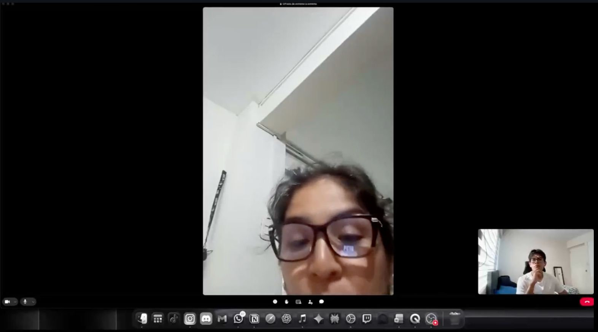
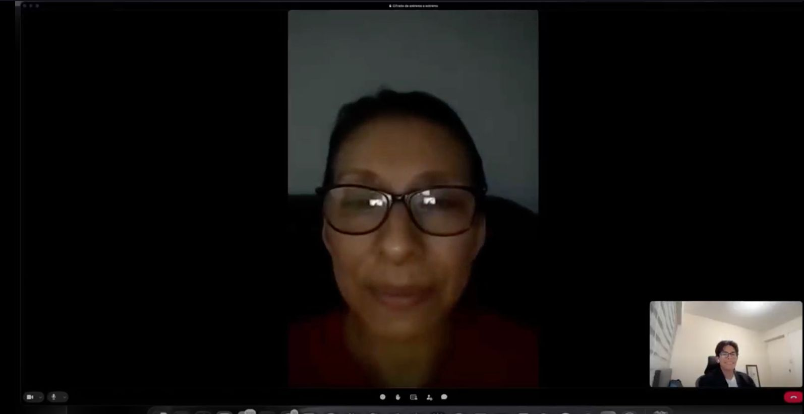
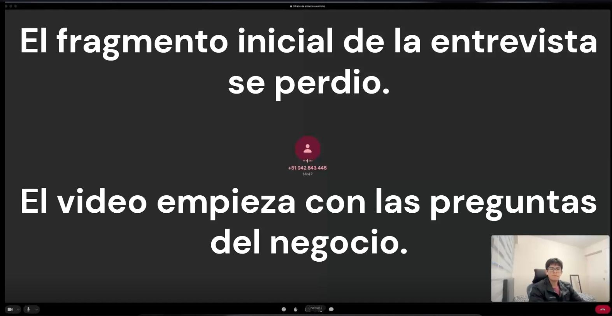
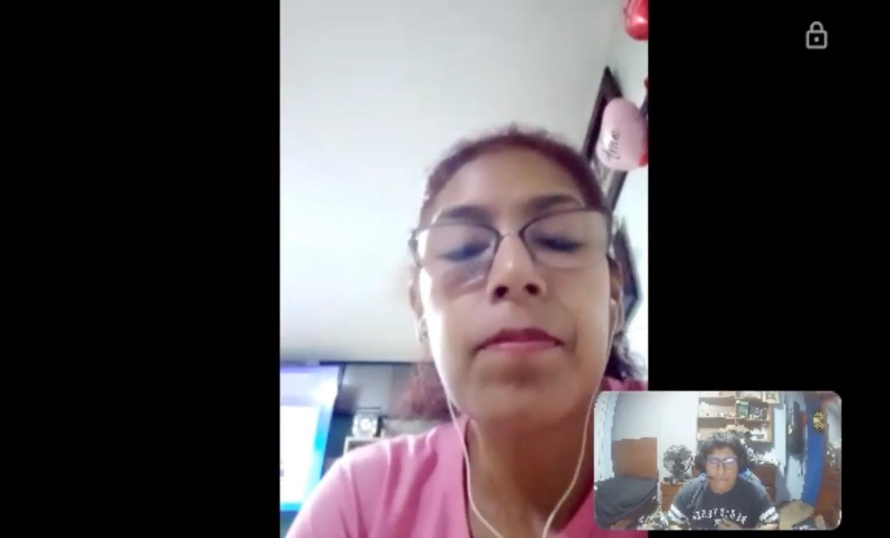
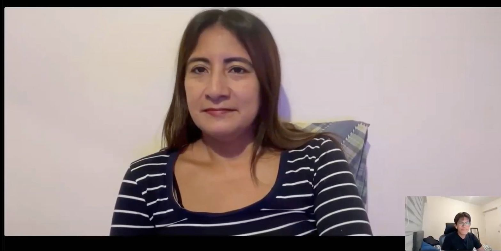

### 2.2.2. Registro de entrevistas

#### Registro audiovisual

El registro consolida ocho entrevistas en un único material audiovisual y
mantiene el timing de cada participación para relacionar cada ficha con su
captura, resumen y segmento móvil.

- **Video consolidado:** [Entrevistas consolidadas](https://cutt.ly/Ct7JM0DK).
- **Medio de entrega:** OneDrive institucional mediante el enlace audiovisual
  consolidado.
- **Año del registro:** 2026.
- **Identificación audiovisual:** cada participación se relaciona con el nombre
  del participante, su segmento, la fecha registrada y el timing indicado en su
  ficha.
- **Estructura:** tres fichas para `MOB-SEG-01`, tres para `MOB-SEG-02` y dos
  para `MOB-SEG-03`.

#### Resumen de entrevistas

| ID | Persona registrada | Segmento móvil | Contexto principal |
| :--- | :--- | :--- | :--- |
| `INT-S1-01` | Lorena Vanesa Silva Leca | `MOB-SEG-01` | Coordinación de pedidos y trabajo comercial en campo |
| `INT-S1-02` | Cinthia Paola Levano Asca | `MOB-SEG-01` | Coordinación de ventas y validación de información |
| `INT-S1-03` | Celia Pérez Huaman | `MOB-SEG-01` | Ventas de ruta y uso de herramientas móviles |
| `INT-S2-01` | Hilda Litano Ramos | `MOB-SEG-02` | Operación logística, documentación y abastecimiento |
| `INT-S2-02` | Edith Taype Peñaloza | `MOB-SEG-02` | Operación en punto de venta y cadena de frío |
| `INT-S2-03` | Jesica Maria Sandoval Romero | `MOB-SEG-02` | Supervisión HORECA, preparación y vencimientos |
| `INT-S3-01` | Pedro Puente Arnao | `MOB-SEG-03` | Abastecimiento B2B y previsibilidad de llegada |
| `INT-S3-02` | Henrry García Robles | `MOB-SEG-03` | Confianza B2B, seguimiento y soporte humano |

#### Segmento `MOB-SEG-01 — Field & Warehouse Operations`

Las tres fichas describen la entrada del pedido, la validación de stock y
crédito, el trabajo fuera del escritorio y las condiciones de adopción de una
herramienta que conecte la coordinación con la operación.

##### `INT-S1-01` — Lorena Vanesa Silva Leca

- **Nombres:** Lorena Vanesa
- **Apellidos:** Silva Leca
- **Edad:** 42 años
- **Distrito:** Chorrillos
- **Ocupación:** Asesora comercial
- **Habilidades y forma de trabajo:** Gestión de cartera, asesoría técnica y coordinación logística; prioriza rapidez y continuidad en campo.
- **Referencias y marcas mencionadas:** WhatsApp, Defontana y productos refrigerados.
- **Segmento:** `MOB-SEG-01`
- **Dispositivos:** Android y Windows
- **Navegador:** Google Chrome
- **Herramientas y canales:** WhatsApp, Excel y ERP
- **Inicio:** 0:00:05
- **Fin:** 0:26:05
- **Duración:** 26:01
- **Fecha de registro:** 2026
- **Video individual:** [Lorena Silva](https://cutt.ly/3t7J9Nja)
- **Video consolidado:** [Entrevistas consolidadas](https://cutt.ly/Ct7JM0DK)
- **Captura:** 

**Resumen.**

Lorena Silva gestiona carteras de clientes, pedidos y coordinación logística.
También brinda asesoría técnica sobre presentaciones de productos refrigerados y
supervisa condiciones de crédito de hasta 45 días. Identifica WhatsApp como canal
operativo crítico por su inmediatez y utiliza el correo electrónico para
formalidades corporativas.

Reporta fricciones con Defontana: ante accesos simultáneos el sistema puede
colapsar y requerir reinicios que retrasan la operación. La ausencia de funciones
móviles para registrar clientes la obliga a depender de una laptop en campo.
También observa diferencias entre el stock mostrado y el stock real, por lo que
valida manualmente con almacén.

##### `INT-S1-02` — Cinthia Paola Levano Asca

- **Nombres:** Cinthia Paola
- **Apellidos:** Levano Asca
- **Edad:** 39 años
- **Distrito:** Lurín
- **Ocupación:** Coordinadora de ventas de quesos y embutidos
- **Habilidades y forma de trabajo:** Coordinación de ventas y validación comercial; prioriza simplicidad y autonomía.
- **Referencias y marcas mencionadas:** Trello, WhatsApp, Excel y ERP.
- **Segmento:** `MOB-SEG-01`
- **Dispositivos:** Android y Windows
- **Navegadores:** Google Chrome y Microsoft Edge
- **Herramientas y canales:** WhatsApp, correo electrónico, teléfono, Excel, ERP y Trello
- **Inicio:** 0:26:06
- **Fin:** 0:47:05
- **Duración:** 20:59
- **Fecha de registro:** 2026
- **Video individual:** [Cinthia Paola Levano](https://cutt.ly/9t7J37nn)
- **Video consolidado:** [Entrevistas consolidadas](https://cutt.ly/Ct7JM0DK)
- **Captura:** 

**Resumen.**

Cinthia Levano cuenta con dos años de experiencia en la coordinación de ventas.
Su proceso es manual y fragmentado, con dependencia de Trello, WhatsApp y Excel.
La falta de integración dispersa la información y la imprecisión del stock la
obliga a consultar a su jefatura antes de confirmar pedidos.

Su prioridad es la simplicidad. Describe como pérdida de tiempo la cantidad de
clics y ventanas necesarias para registrar una orden y propone automatizar el
control de morosidad y mostrar con claridad el crédito disponible para decidir
con mayor autonomía.

##### `INT-S1-03` — Celia Pérez Huaman

- **Nombres:** Celia
- **Apellidos:** Pérez Huaman
- **Edad:** 51 años
- **Distrito:** San Miguel
- **Ocupación:** Vendedora de ruta
- **Habilidades y forma de trabajo:** Atención comercial en campo y uso de herramientas de venta; prioriza estabilidad y velocidad.
- **Referencias y marcas mencionadas:** Riqra, WhatsApp y datos de cliente como RUC, saldos y dirección.
- **Segmento:** `MOB-SEG-01`
- **Dispositivos:** Android y Windows
- **Navegador:** Microsoft Edge
- **Herramientas y canales:** WhatsApp, teléfono y Excel
- **Inicio:** 0:47:06
- **Fin:** 1:04:01
- **Duración:** 16:55
- **Fecha de registro:** 2026
- **Video:** [Entrevistas consolidadas](https://cutt.ly/Ct7JM0DK), tramo `0:47:06–1:04:01`
- **Captura:** 

**Resumen.**

Celia Pérez tiene experiencia en ventas de ruta y aporta una perspectiva sobre el
trabajo en campo. Utilizó Riqra para digitalizar la venta y eliminar papel, pero
la lentitud y los problemas de rendimiento la llevaron a volver a canales
informales. Considera importante integrar RUC, saldos y dirección del cliente
para evitar la doble digitación.

Su experiencia relaciona la adopción con la estabilidad de la conexión y la
velocidad de respuesta. Una herramienta móvil debe reducir pasos y mantener la
continuidad de la atención durante el trabajo en campo.

#### Segmento `MOB-SEG-02 — Delivery Workforce`

Las tres fichas describen la operación que sostiene el despacho y la entrega:
trazabilidad documental, inventario, cadena de frío, vencimientos, preparación,
coordinación y evidencia de las excepciones.

##### `INT-S2-01` — Hilda Litano Ramos

- **Nombres:** Hilda
- **Apellidos:** Litano Ramos
- **Edad:** 47 años
- **Distrito:** Villa El Salvador
- **Ocupación:** Supervisora de importación y cumplimiento sanitario
- **Habilidades y forma de trabajo:** Supervisión documental y control sanitario; prioriza trazabilidad y consistencia entre carga y certificados.
- **Referencias y marcas mencionadas:** DIGESA, VUCE, ERP y productos perecibles.
- **Segmento:** `MOB-SEG-02`
- **Dispositivos:** Android y Windows
- **Navegador:** Google Chrome
- **Herramientas y canales:** ERP, WhatsApp, teléfono y Excel
- **Inicio:** 1:04:07
- **Fin:** 1:19:39
- **Duración:** 15:32
- **Fecha de registro:** 2026
- **Video individual:** [Hilda Litano](https://cutt.ly/Dt7J4i85)
- **Video consolidado:** [Entrevistas consolidadas](https://cutt.ly/Ct7JM0DK)
- **Captura:** 

**Resumen.**

Hilda Litano supervisa procesos de importación y cumplimiento sanitario. Su foco
es la trazabilidad documental y la consistencia entre la carga física y los
certificados de DIGESA/VUCE. Señala que un stock no dinámico entorpece la
operación y eleva el riesgo de sobreinventario o quiebres en productos
perecibles.

##### `INT-S2-02` — Edith Taype Peñaloza

- **Nombres:** Edith
- **Apellidos:** Taype Peñaloza
- **Edad:** 49 años
- **Distrito:** Callao
- **Ocupación:** Operadora de punto de venta en supermercados
- **Habilidades y forma de trabajo:** Manipulación de productos y control de conservación; prioriza visibilidad y respuesta en el punto de venta.
- **Referencias y marcas mencionadas:** Cadena de frío, etiquetas digitales, ERP y supermercados.
- **Segmento:** `MOB-SEG-02`
- **Dispositivos:** Android y Windows
- **Navegador:** Google Chrome
- **Herramientas y canales:** ERP, WhatsApp, teléfono y Excel
- **Inicio:** 1:19:40
- **Fin:** 1:51:08
- **Duración:** 31:28
- **Fecha de registro:** 2026
- **Video individual:** [Edith Taype](https://cutt.ly/2t7J4Akh)
- **Video consolidado:** [Entrevistas consolidadas](https://cutt.ly/Ct7JM0DK)
- **Captura:** 

**Resumen.**

Edith Taype trabaja en un punto de venta de supermercados, donde la manipulación
y la cadena de frío, indicada en el registro entre -5 °C y 0 °C, son críticas.
Describe desorden en cámaras de frío y falta de acceso directo a inventario en
tiempo real, reservado para jefaturas. Considera que las etiquetas digitales y la
visibilidad de movimientos de stock facilitarían su labor diaria.

##### `INT-S2-03` — Jesica Maria Sandoval Romero

- **Nombres:** Jesica Maria
- **Apellidos:** Sandoval Romero
- **Edad:** 48 años
- **Distrito:** Jesús María
- **Ocupación:** Supervisora de ventas HORECA
- **Habilidades y forma de trabajo:** Supervisión de pedidos y coordinación con almacén; prioriza exactitud de cantidades y control FEFO.
- **Referencias y marcas mencionadas:** HORECA, FEFO, ERP y productos perecibles.
- **Segmento:** `MOB-SEG-02`
- **Dispositivos:** iOS y MacOS
- **Navegadores:** Safari y Google Chrome
- **Herramientas y canales:** ERP, teléfono y Excel
- **Inicio:** 1:51:09
- **Fin:** 2:12:02
- **Duración:** 20:54
- **Fecha de registro:** 2026
- **Video individual:** [Jesica Sandoval](https://cutt.ly/bt7J42QX)
- **Video consolidado:** [Entrevistas consolidadas](https://cutt.ly/Ct7JM0DK)
- **Captura:** 

**Resumen.**

Jesica Sandoval supervisa ventas HORECA. Señala que la transcripción manual de
pedidos produce errores en cantidades y obliga a validar cada orden. Identifica
el control de vencimientos mediante FEFO como variable crítica; la información
no está integrada y requiere coordinación constante con almacén.

#### Segmento `MOB-SEG-03 — B2B Buyers`

Las dos fichas describen necesidades de visibilidad, previsibilidad y confianza
en la relación de abastecimiento B2B, con atención a la llegada del pedido, el
seguimiento y la comunicación de excepciones.

##### `INT-S3-01` — Pedro Puente Arnao

- **Nombres:** Pedro
- **Apellidos:** Puente Arnao
- **Edad:** 56 años
- **Distrito:** San Isidro
- **Ocupación:** Distribuidor
- **Habilidades y forma de trabajo:** Abastecimiento y coordinación con clientes; prioriza previsibilidad de llegada y continuidad de stock.
- **Referencias y marcas mencionadas:** WhatsApp, Excel, Yape, TikTok y distribución minorista.
- **Segmento:** `MOB-SEG-03`
- **Dispositivos:** iOS y MacOS
- **Navegadores:** Safari y Google Chrome
- **Herramientas y canales:** WhatsApp, teléfono, Excel, Yape y TikTok
- **Inicio:** 2:12:08
- **Fin:** 2:24:34
- **Duración:** 12:26
- **Fecha de registro:** 2026
- **Video individual:** [Pedro Puente](https://cutt.ly/Tt7J7pEx)
- **Video consolidado:** [Entrevistas consolidadas](https://cutt.ly/Ct7JM0DK)
- **Captura:** 

**Resumen.**

Pedro Puente es distribuidor y su principal frustración es la incertidumbre
logística. Hace pedidos por WhatsApp, pero no tiene visibilidad clara del momento
de llegada y eso dificulta coordinar con sus propios clientes. También reporta
que los proveedores pueden priorizar a grandes cadenas, dejando a los minoristas
con quiebres de stock que afectan su rentabilidad.

##### `INT-S3-02` — Henrry García Robles

- **Nombres:** Henrry
- **Apellidos:** García Robles
- **Edad:** 49 años
- **Distrito:** San Borja
- **Ocupación:** Distribuidor y responsable de despachos
- **Habilidades y forma de trabajo:** Coordinación de despachos y seguimiento; prioriza confianza y soporte humano en las excepciones.
- **Referencias y marcas mencionadas:** GPS, WhatsApp, Excel, Yape y comunicación personalizada.
- **Segmento:** `MOB-SEG-03`
- **Dispositivos:** Android y Windows
- **Navegador:** Google Chrome
- **Herramientas y canales:** WhatsApp, teléfono, Excel y Yape
- **Inicio:** 2:24:35
- **Fin:** 2:40:00
- **Duración:** 15:25
- **Fecha de registro:** 2026
- **Video individual:** [Henrry García](https://cutt.ly/yt7J7RTk)
- **Video consolidado:** [Entrevistas consolidadas](https://cutt.ly/Ct7JM0DK)
- **Captura:** 

**Resumen.**

Henrry García enfatiza que la confianza sostiene la relación B2B. Aunque usa
GPS para monitorear sus propios despachos, no desea que el software reemplace la
comunicación personalizada. Considera que la plataforma debe apoyar el
inventario y el seguimiento, manteniendo una ruta de contacto humano para
resolver excepciones.

#### Criterio de lectura

Los resúmenes describen experiencias, herramientas, objetivos y frustraciones
expresadas durante las sesiones. El análisis de la siguiente subsección conecta
estos registros con las características objetivas y subjetivas de cada segmento,
sus necesidades móviles y las decisiones de diseño correspondientes.
