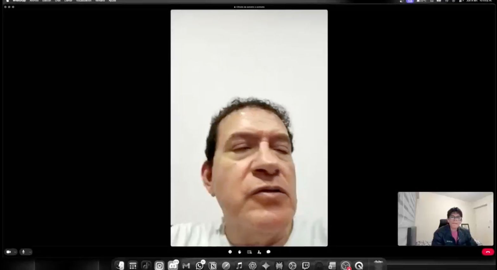

# 2.2.2 Interview Records

## Registro audiovisual y cobertura

El registro actual documenta dos entrevistas vinculadas con
`MOB-SEG-03 — B2B Buyers`. No se presentan entrevistas de otros perfiles como
si representaran los segmentos de almacén, despacho o entrega definidos en la
sección 1.3.

| Segmento | Fichas registradas | Cobertura de la muestra |
| :--- | :--- | :--- |
| `MOB-SEG-01` | — | Se reservan tres fichas para `Warehouse Operator` o `Dispatch Coordinator`. |
| `MOB-SEG-02` | — | Se reservan tres fichas para `Driver` o `Delivery Operator`. |
| `MOB-SEG-03` | `INT-S3-01..02` | Se reserva `INT-S3-03` para completar la muestra mínima de tres entrevistas. |

El material audiovisual consolidado disponible contiene los tramos de las dos
sesiones B2B documentadas. El timing de cada participante se consigna en su
ficha; las sesiones que ocupen los espacios reservados deberán incorporarse al
video de entrega con su respectivo índice.

| Evidencia audiovisual consolidada | URL | Tramos documentados |
| :--- | :--- | :--- |
| Entrevistas registradas | [Video consolidado de entrevistas](https://cutt.ly/Ct7JM0DK) | `INT-S3-01` e `INT-S3-02`. |

La guía de diseño solicita género, estado civil y composición familiar. Esos
datos no se infieren de nombres, imágenes o contexto; cuando no están
consignados en el registro disponible, permanecen como información no declarada.

## Resumen de entrevistas documentadas

| ID | Participante | Segmento | Contexto principal |
| :--- | :--- | :--- | :--- |
| `INT-S3-01` | Pedro Puente Arnao | `MOB-SEG-03` | Abastecimiento B2B y previsibilidad de llegada. |
| `INT-S3-02` | Henrry García Robles | `MOB-SEG-03` | Confianza B2B, seguimiento y soporte humano. |

## Segmento `MOB-SEG-01 — Warehouse & Dispatch Operations`

No hay fichas documentadas para este segmento. Las tres filas siguientes
reservan la estructura requerida para incorporar entrevistas directas de los
roles que participan en recepción, preparación y salida de pedidos.

| ID reservado | Participante | Evidencia audiovisual | Resumen requerido |
| :--- | :--- | :--- | :--- |
| `INT-S1-01` | Espacio para nombre, apellidos, edad, distrito y ocupación de un `Warehouse Operator` o `Dispatch Coordinator`. | Espacio para captura, URL, timing y duración. | Caso reciente de recepción, identificación, preparación, salida o handoff. |
| `INT-S1-02` | Espacio para nombre, apellidos, edad, distrito y ocupación de un `Warehouse Operator` o `Dispatch Coordinator`. | Espacio para captura, URL, timing y duración. | Caso reciente de recepción, identificación, preparación, salida o handoff. |
| `INT-S1-03` | Espacio para nombre, apellidos, edad, distrito y ocupación de un `Warehouse Operator` o `Dispatch Coordinator`. | Espacio para captura, URL, timing y duración. | Caso reciente de recepción, identificación, preparación, salida o handoff. |

## Segmento `MOB-SEG-02 — Driver Delivery Execution`

No se incluyen entrevistas de otros perfiles como si representaran a un
conductor u operador de entrega. Las tres fichas siguientes quedan reservadas
para evidencia directa del trabajo en ruta, intento de entrega, incidencia,
conectividad y prueba de recepción.

| ID reservado | Participante | Evidencia audiovisual | Resumen requerido |
| :--- | :--- | :--- | :--- |
| `INT-S2-01` | Espacio para nombre, apellidos, edad, distrito y ocupación de un `Driver` o `Delivery Operator`. | Espacio para captura, URL, timing y duración. | Caso reciente de entrega, ruta, conectividad, incidencia y evidencia. |
| `INT-S2-02` | Espacio para nombre, apellidos, edad, distrito y ocupación de un `Driver` o `Delivery Operator`. | Espacio para captura, URL, timing y duración. | Caso reciente de entrega, ruta, conectividad, incidencia y evidencia. |
| `INT-S2-03` | Espacio para nombre, apellidos, edad, distrito y ocupación de un `Driver` o `Delivery Operator`. | Espacio para captura, URL, timing y duración. | Caso reciente de entrega, ruta, conectividad, incidencia y evidencia. |

Cada ficha reservada deberá añadir los campos de caracterización de la sección
2.2.1, dispositivos, navegador, canales, consentimiento y un resumen
descriptivo de las respuestas.

## Segmento `MOB-SEG-03 — B2B Buyers`

Las dos fichas documentadas describen actividades de abastecimiento B2B,
visibilidad de llegada y confianza en la relación con el proveedor. Ninguna
sustituye la evidencia específica de una recepción completa; la tercera ficha
reservada permitirá registrar de forma directa la verificación de lo esperado,
lo recibido y cualquier discrepancia.

### `INT-S3-01` — Pedro Puente Arnao

- **Nombres:** Pedro
- **Apellidos:** Puente Arnao
- **Edad:** 56 años
- **Distrito:** San Isidro
- **Ocupación:** Distribuidor.
- **Género, estado civil y composición familiar:** No declarados en el registro disponible.
- **Habilidades y forma de trabajo:** Abastecimiento y coordinación con clientes; prioriza previsibilidad de llegada y continuidad de stock.
- **Referencias y marcas mencionadas:** WhatsApp, Excel, Yape, TikTok y distribución minorista.
- **Dispositivos:** iOS y MacOS.
- **Navegadores:** Safari y Google Chrome.
- **Herramientas y canales:** WhatsApp, teléfono, Excel, Yape y TikTok.
- **Timing del registro audiovisual:** `2:12:08–2:24:34`.
- **Duración:** 12:26.
- **Video individual:** [Pedro Puente](https://cutt.ly/Tt7J7pEx).
- **Captura:** 

**Resumen.** Pedro es distribuidor y su principal frustración es la
incertidumbre logística. Realiza pedidos por WhatsApp, pero la falta de
visibilidad sobre el momento estimado de llegada dificulta la coordinación con
sus propios clientes. También observa que los proveedores pueden priorizar a
grandes cadenas, dejando a negocios más pequeños con quiebres de stock que
afectan su rentabilidad. Para su actividad, la continuidad del abastecimiento y
una comunicación clara de cambios son condiciones relevantes.

### `INT-S3-02` — Henrry García Robles

- **Nombres:** Henrry
- **Apellidos:** García Robles
- **Edad:** 49 años
- **Distrito:** San Borja
- **Ocupación:** Distribuidor y responsable de despachos.
- **Género, estado civil y composición familiar:** No declarados en el registro disponible.
- **Habilidades y forma de trabajo:** Coordinación de despachos y seguimiento; prioriza confianza y soporte humano ante excepciones.
- **Referencias y marcas mencionadas:** GPS, WhatsApp, Excel, Yape y comunicación personalizada.
- **Dispositivos:** Android y Windows.
- **Navegador:** Google Chrome.
- **Herramientas y canales:** WhatsApp, teléfono, Excel y Yape.
- **Timing del registro audiovisual:** `2:24:35–2:40:00`.
- **Duración:** 15:25.
- **Video individual:** [Henrry García](https://cutt.ly/yt7J7RTk).
- **Captura:** 

**Resumen.** Henrry enfatiza que la confianza sostiene la relación B2B. Aunque
utiliza GPS para monitorear sus propios despachos, no desea que el software
reemplace la comunicación personalizada. Considera que una plataforma debe
apoyar el inventario y el seguimiento, manteniendo una ruta de contacto humano
para resolver excepciones. Su testimonio vincula la adopción con claridad
operativa, rapidez de respuesta y acompañamiento cuando surge una diferencia.

### `INT-S3-03` — Espacio reservado para completar la muestra

- **Participante:** Espacio para nombres, apellidos, edad, distrito y ocupación de un comprador B2B autorizado.
- **Caracterización:** Espacio para género, estado civil, composición familiar, biografía, personalidad, habilidades, marcas e influencias.
- **Tecnología y canales:** Espacio para dispositivos, navegador, herramientas y canales de interacción.
- **Evidencia:** Espacio para captura, URL, timing y duración de la entrevista.
- **Resumen:** Espacio para describir recepción, verificación de cantidades, condición del producto, discrepancias, documentos y confianza.

## Criterio de lectura

Las fichas describen la experiencia de cada participante y no convierten los
espacios reservados en resultados. La siguiente subsección analiza únicamente
las dos entrevistas documentadas, utilizando el denominador real del segmento
con evidencia.
