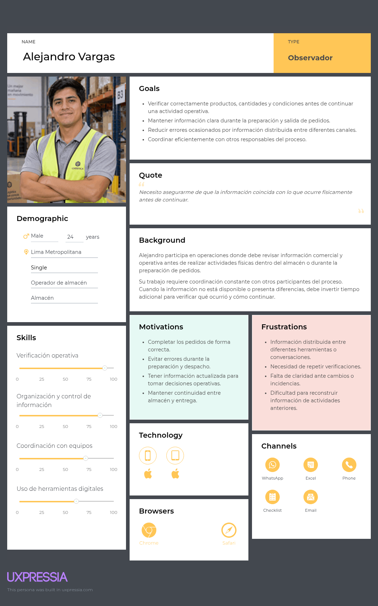
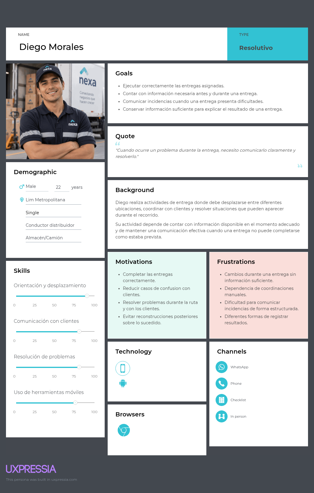
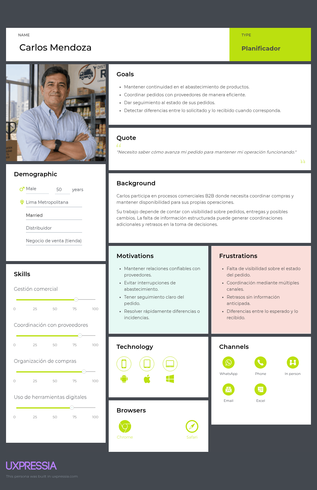

## 2.3. Needfinding

### 2.3.1. User Personas

Las tres personas siguientes son arquetipos preliminares de investigación y
diseño. No representan entrevistados, perfiles de autorización, entidades de
dominio ni resultados validados. Sus datos biográficos, demográficos y de
preferencia son hipótesis explícitas para preparar entrevistas que puedan
confirmarlas, matizarlas o refutarlas sin sesgo de confirmación.

#### Mariela Torres — Operadora de almacén orientada a la continuidad
Mariela representa a una operadora de almacén que trabaja en entornos donde debe contrastar constantemente la información registrada con el estado físico de la mercadería. Su jornada combina recepción, preparación y *staging*, por lo que necesita identificar con rapidez qué producto, lote, cantidad o condición requiere atención antes de continuar una tarea. Para ella, la continuidad operativa depende de conservar el contexto entre actividades, responsables y excepciones, especialmente cuando existen interrupciones, prioridades cambiantes o información distribuida entre diferentes fuentes.

Sus principales necesidades se relacionan con reducir la pérdida de contexto, evitar validaciones repetidas y disponer de evidencia suficiente para escalar una excepción o transferir una tarea sin reconstruir manualmente lo sucedido. Por ello, valora herramientas que permitan distinguir claramente entre una tarea pendiente, una excepción abierta y una actividad ya resuelta.

*Nota.* Mariela Torres representa a una operadora de almacén de 40 años, de perfil observador, que prioriza la identificación correcta de productos, lotes, cantidades y condiciones para mantener la continuidad de las operaciones y evitar errores durante la preparación y transferencia de mercadería.

#### Diego Ramírez — Conductor que necesita cerrar cada intento con claridad

Diego representa a un conductor distribuidor cuyo trabajo combina desplazamiento, contacto con el destinatario, registro del intento de entrega y comunicación de incidencias. Antes de iniciar una entrega necesita reconocer con claridad el destino, las instrucciones y las condiciones asociadas al pedido; durante el proceso, requiere mantener la evidencia vinculada al intento correcto y, al finalizar, registrar un resultado que pueda ser comprendido por el siguiente responsable.

Su contexto de trabajo presenta condiciones variables de conectividad, batería, iluminación, tránsito e interrupciones, por lo que la información debe mantenerse disponible y asociada correctamente a cada entrega. Sus principales frustraciones aparecen cuando una asignación cambia sin indicar qué información sigue vigente, cuando las instrucciones están dispersas o cuando una incidencia puede confundirse con una entrega completada.

*Nota.* Diego Ramírez representa a un conductor distribuidor de 40 años, de perfil resolutivo, que necesita reconocer claramente sus entregas, registrar cada *Delivery Attempt* sin ambigüedad y conservar evidencia e incidencias asociadas al pedido y momento correctos.

#### Carlos Mendoza — Comprador B2B que necesita anticipar y explicar diferencias
Carlos representa a un comprador B2B que coordina pedidos, recepción, abastecimiento interno y comunicación con proveedores. Para organizar adecuadamente su operación necesita anticipar cuándo llegará una entrega, qué pedido corresponde, qué cantidades espera recibir y qué diferencias podrían afectar la continuidad de su negocio. Esta visibilidad le permite preparar personal y espacio con anticipación y reaccionar cuando una entrega presenta retrasos, faltantes o condiciones inesperadas.

Su experiencia actual suele apoyarse en varios canales, como correo electrónico, llamadas, hojas de cálculo y mensajería, lo que dificulta mantener una referencia común sobre el estado de una entrega. Por ello, necesita comparar con facilidad lo esperado frente a lo recibido, registrar discrepancias con contexto verificable y conocer si una diferencia ya fue recibida, revisada o escalada.

*Nota.* Carlos Mendoza representa a un comprador B2B de 45 años, de perfil planificador, que busca anticipar la llegada de sus pedidos, comparar las cantidades esperadas con las recibidas y gestionar discrepancias con información clara y verificable sin depender de múltiples canales.

#### Uso y estado metodológico

Mariela Torres, Diego Ramírez y Carlos Mendoza organizan la User Task Matrix,
los tres User Journey Maps, los Empathy Maps, el Impact Mapping y la
priorización de historias. 
