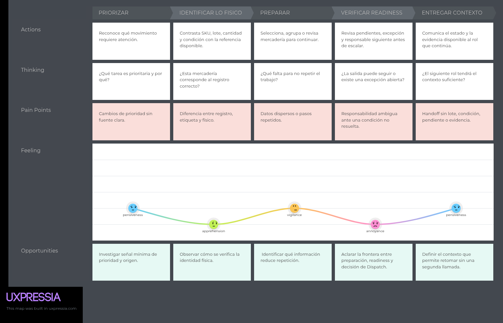
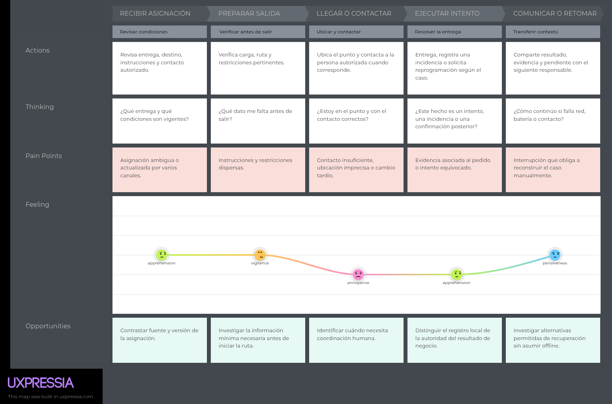
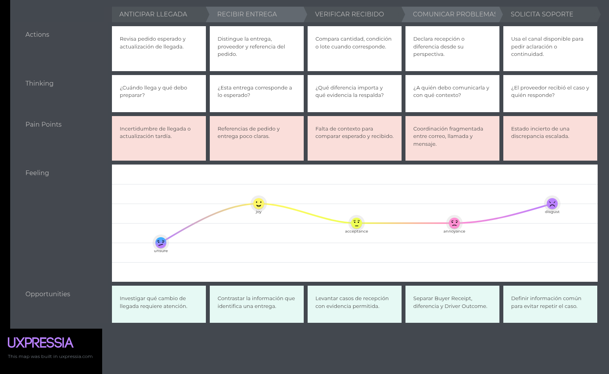

### 2.3.3. User Journey Mapping

Los Journey Maps describen la situación actual de cada segmento antes de Nexa. Representan el recorrido As-Is: cómo se realiza hoy cada proceso, qué fricciones aparecen en cada etapa y dónde se concentra el mayor estrés operativo. No describen la experiencia dentro de la plataforma propuesta.

#### Mariela Torres — Warehouse & Dispatch Operations

*As-Is Journey Map de Mariela Torres: continuidad de preparación y handoff.*

*Nota.* Hipótesis As-Is para entrevista y observación. Los valores de Feeling,
los pains y las oportunidades no son hallazgos validados.

#### Diego Ramírez — Driver Delivery Execution

*As-Is Journey Map de Diego Ramírez: ejecución y cierre atribuible de un intento.*

*Nota.* Hipótesis As-Is para entrevista y observación. El recorrido no declara
que el Driver confirme por sí solo un hecho autoritativo de entrega.

#### Carlos Mendoza — B2B Buyers

*As-Is Journey Map de Carlos Mendoza: anticipación, recepción y discrepancia.*

*Nota.* Hipótesis As-Is para entrevista y observación. La perspectiva Buyer no
reescribe el Delivery Attempt, Driver Outcome ni la autoridad de inventario.
