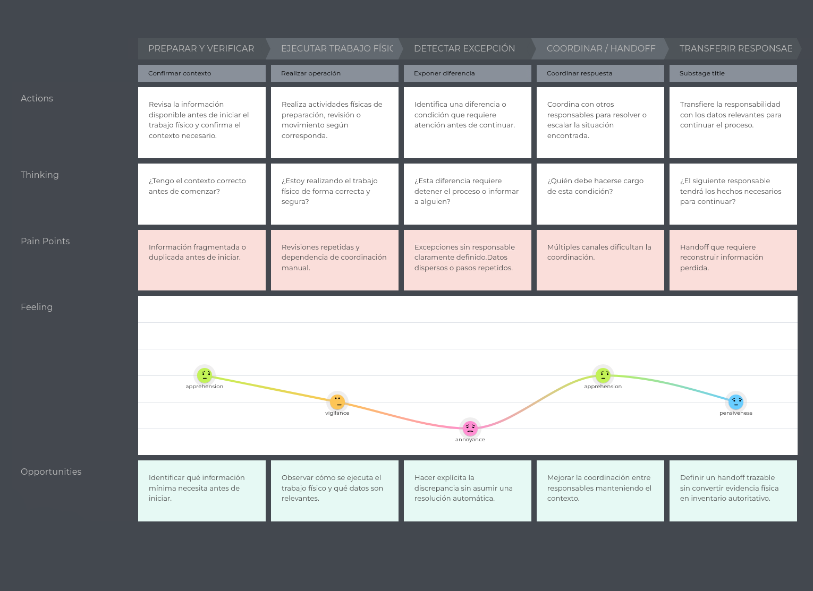
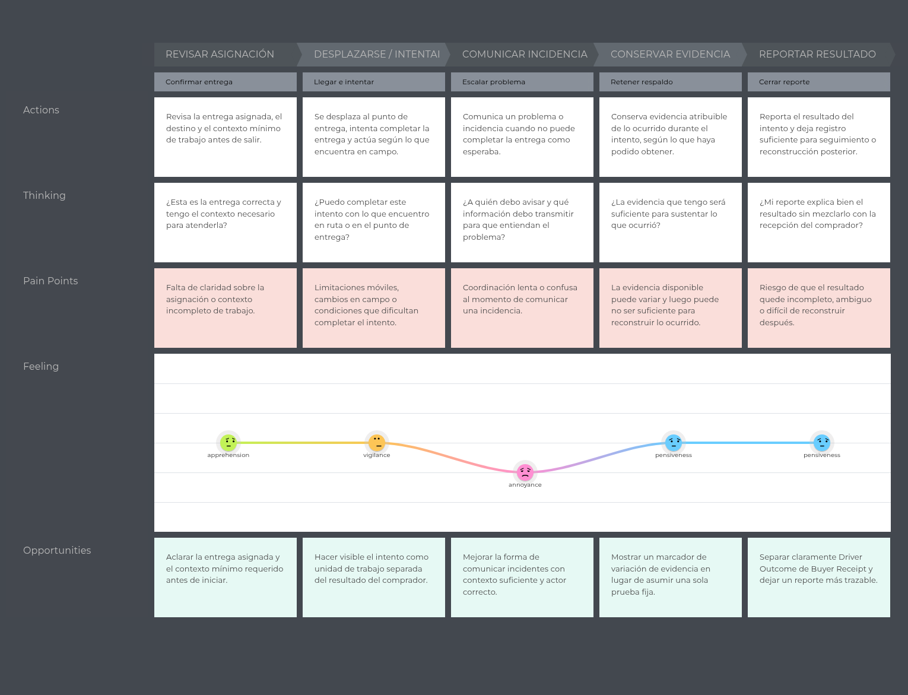
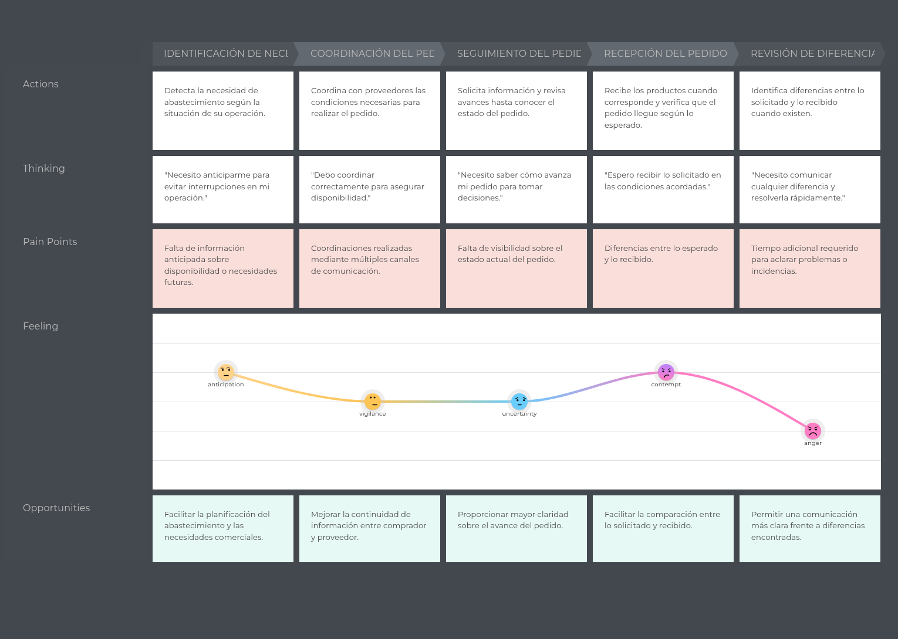

### 2.3.3. User Journey Mapping

Los Journey Maps muestran cómo se desarrolla hoy el trabajo de cada Persona,
antes de considerar una solución digital. Las fases permiten leer la experiencia
como una secuencia humana: acciones, pensamientos, emociones, dificultades y
oportunidades que aparecen mientras la responsabilidad avanza.

---

#### Alejandro Vargas — Warehouse & Dispatch Operations

Alejandro prepara y verifica mercadería, ejecuta trabajo físico, detecta una
excepción, coordina el siguiente paso y transfiere responsabilidad. Su recorrido
depende de que la información consultada y las condiciones físicas del pedido
coincidan antes de que otra persona continúe el trabajo.

**Figura** 
*Warehouse & Dispatch Operations Journey Map*

*Nota.* Journey Map elaborado a partir de las entrevistas de Warehouse & Dispatch
Operations y de la User Persona Alejandro. Representa el recorrido actual
(*As-Is*) durante preparación, verificación, coordinación y transferencia de
responsabilidad. Elaboración propia.

#### Diego Morales — Driver Delivery Execution

Diego revisa una asignación, se desplaza e intenta la entrega, comunica una
incidencia, conserva la evidencia disponible y reporta el resultado. Su recorrido
ocurre bajo restricciones de ruta, señal, batería, clima y seguridad que pueden
alterar lo que logra completar.

**Figura** 
*Driver Delivery Execution Journey Map*

*Nota.* Journey Map elaborado a partir de las entrevistas de Driver Delivery
Execution y de la User Persona Diego. Representa el recorrido actual (*As-Is*)
durante la ejecución de entregas, la coordinación de incidencias y la explicación
del resultado. Elaboración propia.

#### Carlos Mendoza — B2B Buyers

Carlos identifica una necesidad, coordina el pedido, realiza seguimiento, recibe
cuando corresponde y revisa diferencias. Su recorrido busca proteger la
continuidad del abastecimiento mientras combina decisiones comerciales,
coordinación con proveedores y otras tareas del negocio.

**Figura** 
*B2B Buyers Journey Map*

*Nota.* Journey Map elaborado a partir de las entrevistas de B2B Buyers y de la
User Persona Carlos. Representa el recorrido actual (*As-Is*) relacionado con
reabastecimiento, coordinación, seguimiento, recepción cuando aplica y revisión
de diferencias. Elaboración propia.

#### Lectura general de los recorridos

Los tres recorridos necesitan continuidad de información, aunque cada Persona
decide en un momento diferente. Alejandro decide dentro del almacén; Diego
resuelve situaciones durante una actividad física en movimiento; Carlos decide
cómo proteger el abastecimiento de su negocio.

Las dificultades se parecen en un punto: cuando un pedido cambia de responsable,
la siguiente persona puede tener que reconstruir lo ocurrido. El resultado
informado por el conductor no equivale a la recepción confirmada por el
comprador; ambos hechos deben conservar su propio contexto. Esta observación
explica la oportunidad de mejorar continuidad, coordinación y trazabilidad sin
convertir el Journey Map As-Is en una descripción de implementación.
