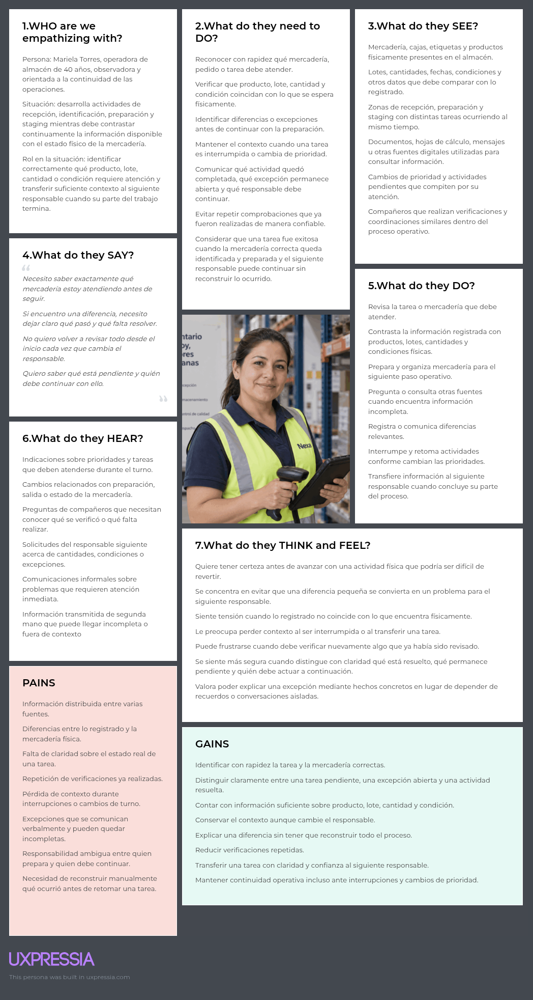
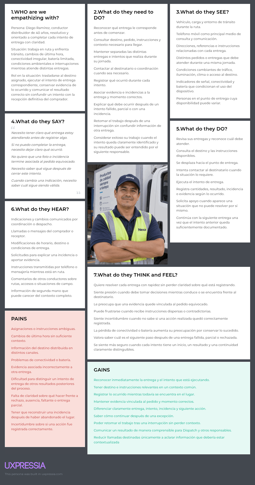
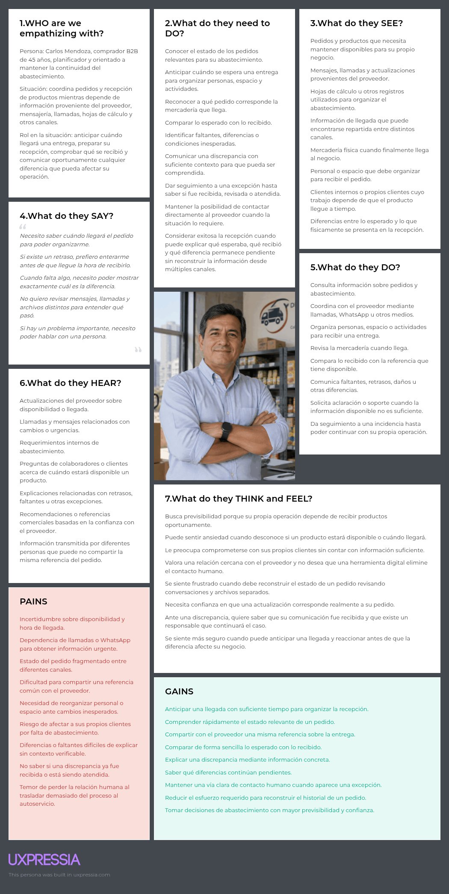

### 2.3.4. Empathy Mapping

Los Empathy Maps complementan los User Personas, la User Task Matrix y los
User Journey Maps mediante una representación estructurada de lo que cada
arquetipo necesita hacer, observa, expresa, realiza, escucha, piensa y siente
dentro de su situación de trabajo actual. Su finalidad es profundizar en las
motivaciones, preocupaciones, fricciones y resultados esperados que deben ser
contrastados durante la investigación antes de convertirlos en decisiones de
diseño o requisitos de la solución.

Los mapas se mantienen deliberadamente en una perspectiva As-Is. Por ello, no
describen cómo los usuarios interactuarían con Nexa ni presentan funcionalidades
de la propuesta como si ya formaran parte de su experiencia actual. Para
Mariela Torres y Diego Ramírez, cuyo segmento todavía no cuenta con entrevistas
directas registradas, el contenido constituye una hipótesis sintética derivada
de los artefactos previos de Needfinding. En el caso de Carlos Mendoza, el mapa
también incorpora los patrones iniciales observados en las entrevistas del
segmento B2B Buyers, aunque estos permanecen sujetos a contraste debido al
tamaño limitado de la muestra.

*Nota de procedencia.* Los tres Empathy Maps fueron elaborados en UXPressia y
exportados para incorporarse al informe. La procedencia visual no cambia el
estado de hipótesis ni la cobertura de investigación de cada segmento.

#### Mariela Torres — Warehouse & Dispatch Operations

El mapa de Mariela profundiza en la necesidad de mantener continuidad entre la
mercadería física, la información registrada y los responsables que participan
en la preparación de una salida. Debido a que todavía no existen entrevistas
directas válidas del segmento Warehouse & Dispatch Operations, sus componentes
se consideran hipótesis para posterior observación y contraste.

*Nota.* El Empathy Map de Mariela Torres constituye una hipótesis As-Is
derivada de su User Persona, User Task Matrix y User Journey Map.

#### Diego Ramírez — Driver Delivery Execution

El mapa de Diego representa las condiciones de un conductor que debe reconocer
una entrega asignada, ejecutar un intento en un entorno variable y dejar un
resultado comprensible para quienes continuarán el proceso. Al igual que en el
caso del segmento de almacén, todavía no existen entrevistas directas válidas
del segmento Driver Delivery Execution, por lo que sus contenidos se mantienen
como hipótesis de investigación.

*Nota.* El Empathy Map de Diego Ramírez constituye una hipótesis As-Is derivada
de su User Persona, User Task Matrix y User Journey Map.

#### Carlos Mendoza — B2B Buyers

El mapa de Carlos profundiza en la perspectiva de un comprador B2B que depende
de la continuidad de abastecimiento y necesita anticipar la llegada de sus
pedidos. A diferencia de los dos mapas anteriores, esta construcción también
se apoya en evidencia inicial de las entrevistas Buyer registradas, en las que
aparecen la necesidad de visibilidad sobre la llegada, el uso de canales
directos como WhatsApp y llamadas, y la importancia de mantener soporte humano.
No obstante, la muestra disponible todavía es insuficiente para considerar
todos los elementos del mapa como hallazgos validados.

*Nota.* El Empathy Map de Carlos Mendoza combina hipótesis del arquetipo con
evidencia inicial del segmento B2B Buyers.

#### Síntesis de los Empathy Maps

Los tres mapas evidencian una necesidad transversal de conservar contexto a
medida que el trabajo pasa de una actividad o responsable a otro, aunque dicha
necesidad se manifiesta de manera diferente en cada segmento. Mariela necesita
continuidad entre la realidad física del almacén y el siguiente responsable;
Diego necesita que cada intento de entrega pueda distinguirse y explicarse con
claridad; y Carlos necesita anticipar la llegada y mantener una referencia
común cuando recibe o comunica una diferencia.

Esta síntesis no constituye todavía una especificación funcional de Nexa. Los
pains, gains y comportamientos representados sirven como insumo de Needfinding
para continuar profundizando el dominio en las siguientes secciones y,
posteriormente, formular requisitos de solución con una separación explícita
entre evidencia de investigación, interpretación y propuesta.
