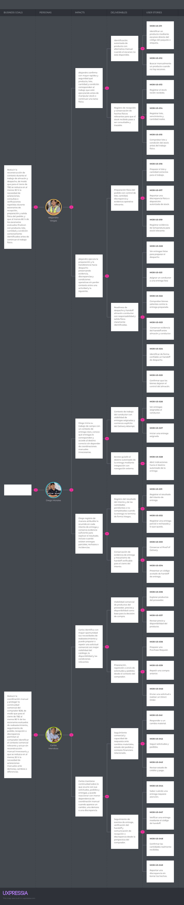

### 2.4.2. Impact Mapping

El **Impact Mapping** permite vincular los objetivos de negocio de Nexa Mobile con los cambios de comportamiento esperados de las User Personas, los deliverables que el producto digital puede ofrecer para provocar dichos cambios y las Functional User Stories que materializan esas capacidades. La estructura empleada sigue la relación **Business Goals > Personas > Impacts > Deliverables > User Stories** indicada para esta sección del reporte.

Los Business Goals se plantean como metas SMART de validación para el proyecto. Sus porcentajes y umbrales representan objetivos que deberán contrastarse durante la evaluación de la solución; no constituyen resultados ya alcanzados. Las Personas utilizadas corresponden a los tres User Personas definidos previamente en Needfinding: **Mariela Torres**, **Diego Ramírez** y **Carlos Mendoza**.

*Nota.* El Impact Mapping de Nexa Mobile relaciona los Business Goals con los User Personas, los cambios de comportamiento esperados, los deliverables propuestos y las User Stories. Elaboración propia en UXPressia.

#### Business Goal 1 — Reducir la reconstrucción de contexto durante el trabajo de almacén

Para el cierre de **TB2**, se busca reducir en al menos **30 %**, respecto de la línea base de validación, la cantidad promedio de consultas, aclaraciones o fuentes adicionales necesarias para completar un escenario de recepción o preparación de almacén, y conseguir que al menos **80 % de los escenarios evaluados** finalicen con producto, lote, cantidad y condición correctamente identificados antes de continuar el trabajo físico.

La Persona relacionada con este objetivo es **Mariela Torres**, quien representa al **Warehouse Operator**. Su contribución al objetivo se concentra en tres Impacts: identificar el producto correcto antes de registrar o manipular stock; registrar lo que realmente llegó y distinguir los datos físicos necesarios antes de continuar el trabajo; y preparar únicamente el lote y la cantidad válidos, haciendo visible cualquier diferencia encontrada durante la operación.

Para provocar estos cambios se plantean tres grupos de Deliverables. El primero corresponde a la **identificación confiable de producto**, mediante código de paquete o etiqueta y una alternativa manual cuando el escaneo no sea posible, relacionado con `MOB-US-011` y `MOB-US-012`. El segundo corresponde al **registro verificable de recepción, lote y condición de stock**, manteniendo producto, lote, vencimiento, cantidad, condición y evidencia relevante, y se relaciona con `MOB-US-013`, `MOB-US-014`, `MOB-US-015` y `MOB-US-019`. El tercero corresponde al **picking controlado y la gestión explícita de discrepancias**, relacionado con `MOB-US-016` y `MOB-US-017`.

Esta rama mantiene a Mariela vinculada con las User Stories cuyo actor funcional es Warehouse Operator, evitando atribuirle responsabilidades específicas de Dispatch Coordinator únicamente para ampliar la cobertura del mapa.

#### Business Goal 2 — Aumentar la atribución confiable de los Delivery Attempts

Para el cierre de **TB2**, se busca lograr que al menos **85 % de los Delivery Attempts evaluados** permitan asociar correctamente la Delivery, el Attempt, su resultado y la evidencia correspondiente, y reducir en al menos **30 %**, respecto de la línea base, la necesidad de reconstrucciones o aclaraciones posteriores sobre lo ocurrido durante la entrega.

La Persona relacionada con este objetivo es **Diego Ramírez**, quien representa al **Driver / Delivery Operator**. Sus Impacts consisten en reconocer la Delivery correcta y comenzar únicamente trabajo actualmente asignado; registrar el resultado físico del intento correcto sin confundir una entrega parcial, un rechazo o una obligación pendiente; y conservar evidencia vinculada al intento para que el destinatario pueda identificar la entrega correcta durante el handoff.

Los Deliverables asociados son, primero, el **contexto de Delivery asignada**, con inicio explícito del Delivery Attempt y acceso al destino autorizado, relacionado con `MOB-US-026`, `MOB-US-027` y `MOB-US-028`. En segundo lugar, el **registro explícito de Delivery Attempt y Driver Outcome**, diferenciando resultados completos, parciales, rechazados y cantidades restantes, relacionado con `MOB-US-031` y `MOB-US-032`. Finalmente, el **Proof of Delivery y handoff identificable**, manteniendo la evidencia y el código de handoff asociados a una Delivery y Delivery Attempt determinados, relacionado con `MOB-US-033` y `MOB-US-034`.

El Driver Outcome representa lo que el conductor registra sobre el resultado físico del Delivery Attempt. Este hecho se mantiene separado del Buyer Receipt y no convierte por sí solo una verificación de handoff en recepción, pago o cierre de la Delivery.

#### Business Goal 3 — Reducir la coordinación manual durante la recepción Buyer

Para el cierre de **TB2**, se busca conseguir que al menos **80 % de los escenarios de recepción o discrepancia evaluados** permitan al Customer Buyer identificar la Delivery correcta, registrar las cantidades realmente recibidas y comunicar diferencias manteniendo el contexto previo; además, se busca reducir en al menos **30 %**, respecto de la línea base, las aclaraciones manuales necesarias para explicar lo esperado frente a lo recibido.

La Persona relacionada con este objetivo es **Carlos Mendoza**, quien representa al **Customer Buyer**. Sus Impacts se orientan a reconocer oportunamente cuándo una Delivery requiere su atención, verificar la Delivery correcta antes de declarar la recepción y explicar las cantidades recibidas o cualquier diferencia sin sustituir los hechos registrados previamente por el Driver.

Para favorecer estos cambios se plantea una **actualización crítica de Delivery** vinculada a la entrega correspondiente y al contexto autorizado del Buyer, asociada con `MOB-US-040` ,`MOB-US-042` y `MOB-US-044`. Asimismo, la **verificación acotada de handoff** permite relacionar el código con la Delivery y Delivery Attempt correctos antes de continuar con la recepción, y se vincula con `MOB-US-041` y `MOB-US-047`. Finalmente, el **Buyer Receipt y la gestión de discrepancias** mantienen separadas las cantidades declaradas por el Buyer, el Driver Outcome y la evidencia posterior, relacionándose con `MOB-US-048`, `MOB-US-049` y `MOB-US-050`.

El Buyer Receipt expresa la perspectiva del comprador sobre lo físicamente recibido. Si esta difiere del Driver Outcome, ambos hechos permanecen separados y la diferencia puede registrarse como una discrepancia sin borrar el historial previo.

#### Síntesis del Impact Mapping

El mapa muestra tres relaciones causales principales. **Mariela Torres** contribuye al objetivo de continuidad en almacén mediante una identificación y preparación verificables; **Diego Ramírez** contribuye a una ejecución de Delivery atribuible mediante un Delivery Attempt con resultado y evidencia distinguibles; y **Carlos Mendoza** contribuye a una recepción Buyer con menor coordinación manual mediante verificación, Buyer Receipt y gestión de discrepancias.

Las Functional User Stories utilizadas como hojas del mapa conservan sus identificadores y descripciones de la sección [**2.4.1. User Stories**](./2.4.1-user-stories.md). El Impact Mapping no pretende incluir todo el catálogo funcional: prioriza únicamente las historias que presentan una relación directa con los Business Goals, Impacts y Deliverables representados. Las historias transversales de acceso y autorización permanecen en la especificación de requisitos y el Product Backlog, pero no introducen una cuarta Persona, ya que **Mobile User** es una abstracción funcional y no un User Persona de investigación.

*Nota.* El Impact Mapping representa relaciones de hipótesis entre objetivos de negocio, comportamientos esperados y capacidades de producto. Su inclusión en el reporte no constituye evidencia de que los objetivos hayan sido alcanzados, que los comportamientos hayan cambiado ni que las funcionalidades se encuentren implementadas.
