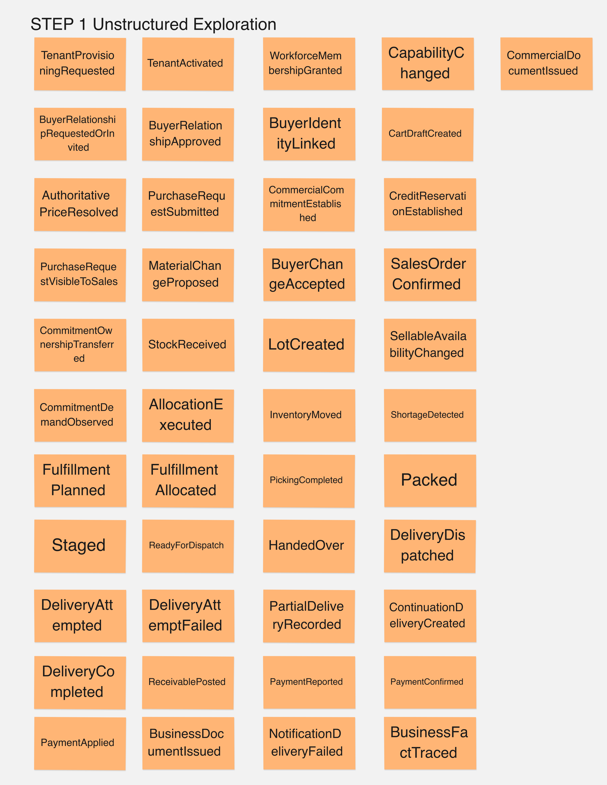
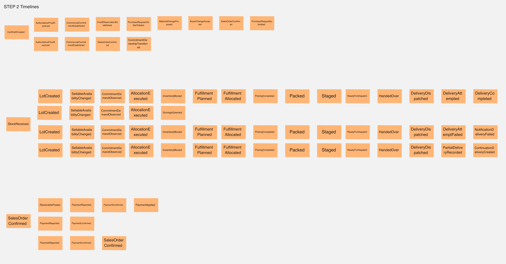
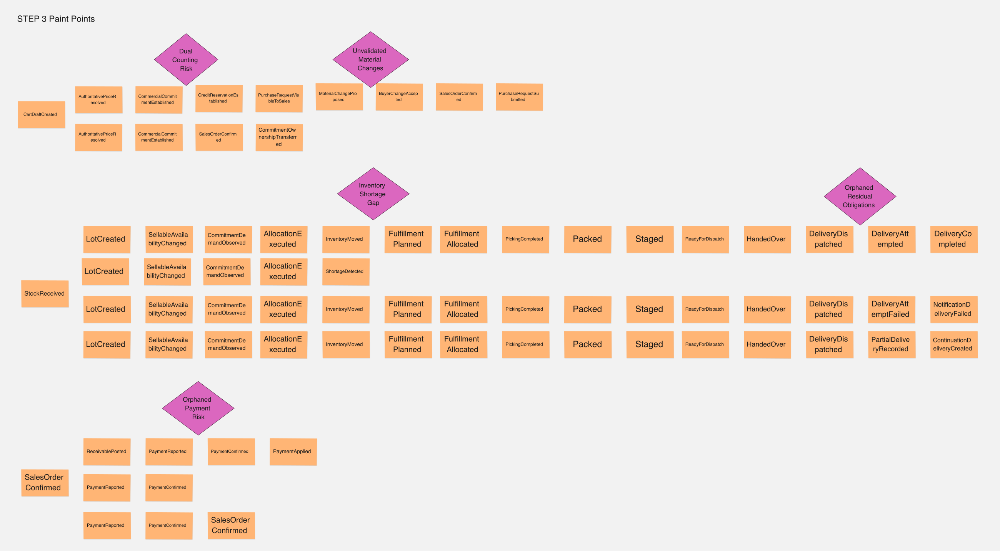
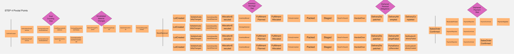
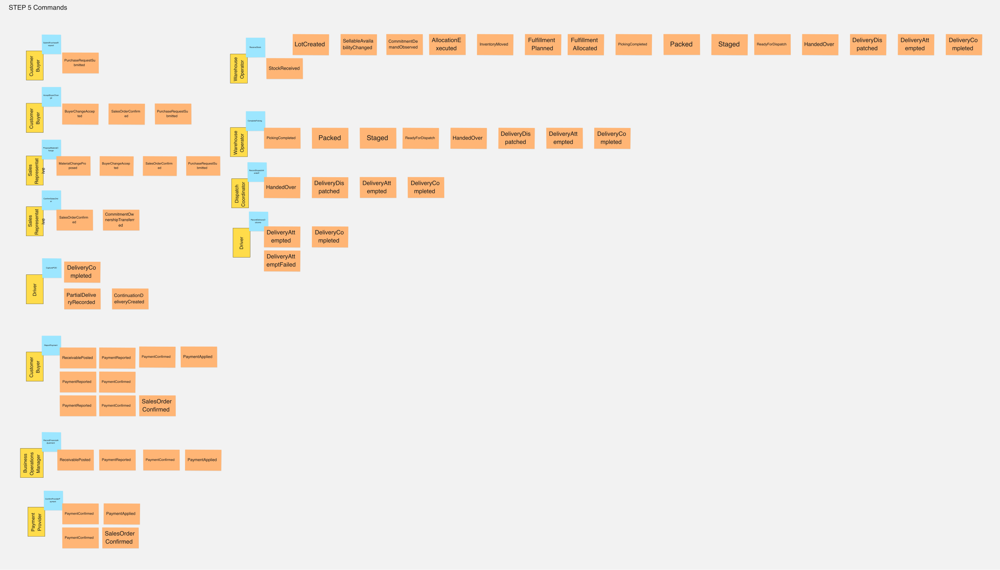
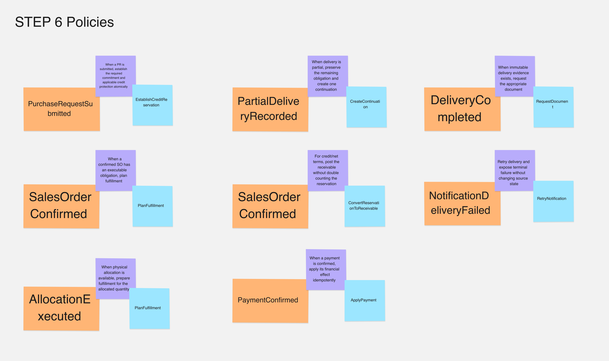
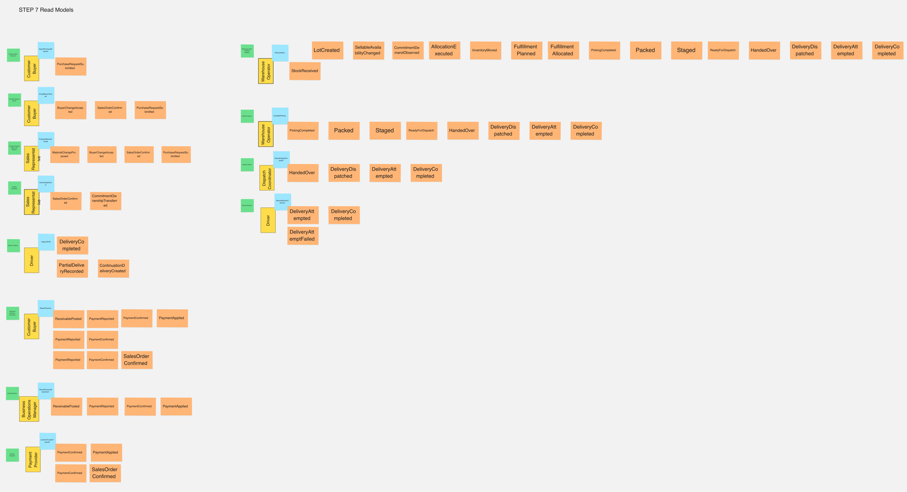
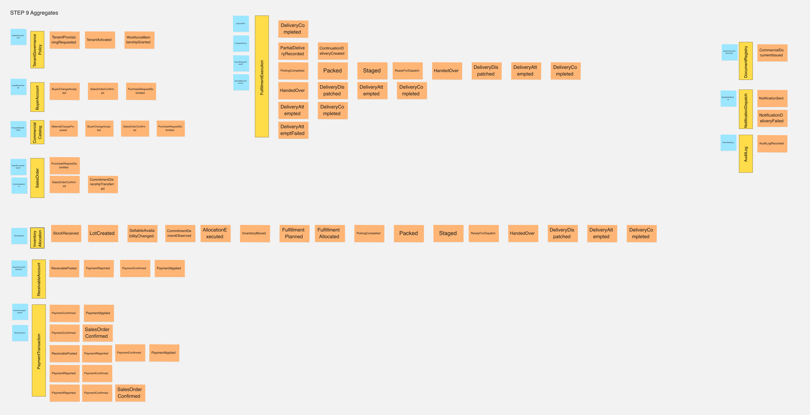
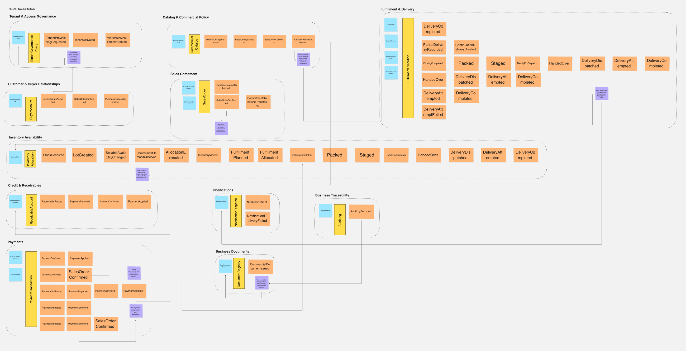

## 2.5 Strategic-Level Domain-Driven Design

Strategic Domain-Driven Design convierte el conocimiento del dominio en límites
de modelo, responsabilidades y relaciones explícitas. Nexa es una sola
plataforma B2B SaaS multi-tenant: Web y Mobile son superficies que proyectan el
dominio compartido y no crean Bounded Contexts adicionales.

El Core Domain coordina compromisos comerciales B2B contra disponibilidad de
inventario real, seguido por fulfillment físico y entrega trazables bajo lote,
vencimiento y restricciones opcionales de cadena de frío.

### Clasificación estratégica de los Bounded Contexts de Nexa

La clasificación expresa diferenciación, densidad de políticas y riesgo de
negocio. Generic no significa irrelevante: indica una capacidad más
reemplazable o común, mientras su corrección sigue siendo crítica.

| Clasificación | Bounded Contexts | Razón estratégica |
| :--- | :--- | :--- |
| Core | BC-04 Sales Commitment; BC-05 Inventory Availability; BC-06 Fulfillment & Delivery | Diferencian la coordinación entre obligación comercial, verdad física y resultado de entrega. |
| Supporting | BC-01 Tenant & Access Governance; BC-02 Customer & Buyer Relationships; BC-03 Catalog & Commercial Policy; BC-07 Credit & Receivables; BC-11 Business Traceability | Hacen posible operar de forma segura, elegible, configurable, financieramente consistente y explicable. |
| Generic | BC-08 Payments; BC-09 Business Documents; BC-10 Notifications | Aíslan capacidades comunes o sustituibles sin transferirles la autoridad de los hechos de negocio. |

El modelo final contiene exactamente 11 Bounded Contexts:

| Código | Bounded Context |
| :--- | :--- |
| BC-01 | Tenant & Access Governance |
| BC-02 | Customer & Buyer Relationships |
| BC-03 | Catalog & Commercial Policy |
| BC-04 | Sales Commitment |
| BC-05 | Inventory Availability |
| BC-06 | Fulfillment & Delivery |
| BC-07 | Credit & Receivables |
| BC-08 | Payments |
| BC-09 | Business Documents |
| BC-10 | Notifications |
| BC-11 | Business Traceability |

Mobile, Operations Mobile, Buyer Mobile, Android, Flutter, iOS, cámara,
scanner, QR, push, offline, ubicación, mapas, cold chain e IoT son superficies,
capacidades, integraciones o decisiones de implementación. No son Bounded
Contexts.

### 2.5.1 EventStorming

El EventStorming organiza el dominio de Nexa desde una vista amplia hasta
límites de modelo, responsabilidades y relaciones explícitas. Las figuras
conservan etiquetas del material de modelado, pero el informe las presenta como
actividades de análisis y no como una metodología rígida de pasos.

#### Big Picture EventStorming

El Big Picture comienza con eventos de dominio sin imponer de inmediato límites
técnicos. La exploración cubre onboarding, relaciones con compradores, catálogo,
compromiso comercial, inventario, fulfillment, delivery, pagos, documentos,
notificaciones y trazabilidad. Su propósito es comprender el dominio de extremo
a extremo, no inferir una implementación ni dividirlo por aplicaciones.

La organización temporal permite distinguir los ciclos de compromiso comercial,
inventario, fulfillment, entrega y hechos financieros. Esto hace visible dónde
una decisión depende de otra y dónde cambia la responsabilidad.

Las zonas de fricción identificadas incluyen el riesgo de doble conteo de
compromiso o stock, cambios materiales sin revalidación, diferencia entre
demanda comprometida y respaldo físico, obligaciones residuales después de una
entrega parcial y pagos que requieren aplicación y reconciliación explícitas.
Estas fricciones orientan el modelado estratégico; no se convierten por sí
solas en Bounded Contexts.

Mobile representa puntos de interacción con el mismo dominio. Cámara, mapas,
notificaciones, almacenamiento local y sincronización son capacidades de
superficie o integración, salvo que una regla de negocio aceptada establezca una
autoridad distinta.

Cada actividad responde una pregunta estratégica distinta:

| Actividad documentada | Pregunta que responde | Resultado estratégico |
| :--- | :--- | :--- |
| Pivotal Points | ¿Dónde cambia autoridad, responsabilidad o consistencia? | Se aíslan decisiones comerciales, protección física, entrega, pago y corrección. |
| Commands | ¿Qué intención de un actor solicita una decisión? | Se separan actor, intención, command, decisión autoritativa y hecho resultante. |
| Policies | ¿Qué reacción de negocio sigue a un hecho? | Se distinguen invariantes síncronas de propagación posterior a hechos confirmados. |
| Read Models | ¿Qué información necesita cada actor para decidir? | Se separan proyecciones de lectura de la autoridad de los contextos fuente. |
| Aggregate boundaries | ¿Qué debe ser consistente dentro de un modelo? | Se ubican límites internos de consistencia sin confundirlos con Bounded Contexts. |
| Consolidación de Bounded Contexts | ¿Qué lenguaje, reglas y autoridad deben permanecer juntos? | Se consolidan los once límites estratégicos aceptados por Nexa. |

#### EventStorming — Pivotal Points

Los pain points del Big Picture se transformaron en puntos observables donde
cambia autoridad, responsabilidad, consistencia o lifecycle. Destacan
compromiso, protección de inventario, continuidad de obligaciones,
reconciliación de pagos y evidencia de entrega. No nombran contextos por
conveniencia técnica.

#### EventStorming — Commands

El tablero relaciona actor, intención, command, decisión y Domain Event:
Customer Buyer y Sales Representative expresan intención comercial; Warehouse
Operator prepara trabajo físico; Dispatch Coordinator y Driver ejecutan handoff
y delivery; Payment Provider informa resultados externos. Un command solicita
una decisión y un evento registra un hecho confirmado; ninguno equivale por sí
solo a un endpoint.

#### EventStorming — Policies

Las policies conectan hechos con reacciones: submit de PR protege compromiso,
inventario y crédito aplicable; una entrega parcial conserva el restante;
SalesOrderConfirmed planifica fulfillment; DeliveryCompleted solicita
documento; PaymentConfirmed aplica pago de forma idempotente y
NotificationDeliveryFailed permite retry sin mutar la fuente.

Los invariantes fuertes pueden ser síncronos y atómicos. La propagación durable
de hechos confirmados puede ser asíncrona mediante outbox/inbox y entrega
at-least-once; esto no convierte Nexa en microservicios ni hace asíncrona una
consistencia que debe ser atómica.

#### EventStorming — Read Models

El tablero identifica información que actores necesitan para decidir: Purchase
Request, Resolved Offer Snapshot, Warehouse Stock/Batch Availability,
Fulfillment Queue, Delivery Timeline, Delivery Manifest, Payments, Ledger
Balances, Documents Registry y Authorized Timeline. Un Read Model no es
autoridad de negocio, Bounded Context ni tabla.

#### EventStorming — Aggregate boundaries

El tablero propone etiquetas de consistencia como Tenant Governance Policy,
Buyer Account, Commercial Catalog, SalesOrder, Inventory Allocation,
Fulfillment Execution, Receivable Account, Payment Transaction, Document
Registry, Notification Dispatch y Audit Log. Aggregate no es Bounded Context,
tabla, Spring module ni C4 Container. Audit Log conserva aquí terminología
histórica distinta de BC-11 Business Traceability.

#### EventStorming — Consolidación de Bounded Contexts

El agrupamiento final converge en Tenant & Access Governance, Customer & Buyer
Relationships, Catalog & Commercial Policy, Sales Commitment, Inventory
Availability, Fulfillment & Delivery, Credit & Receivables, Payments, Business
Documents, Notifications y Business Traceability.

Mobile, Driver, Scanner, QR, Maps, Tracking y Push siguen siendo superficies,
capacidades o integraciones; no son Bounded Contexts. Los nombres de eventos y
commands mantienen lenguaje de dominio y no representan automáticamente
endpoints, clases Java, tablas ni eventos publicados.

#### Salidas relacionadas

- [Candidate Context Discovery](./2.5.1.1-candidate-context-discovery.md) explica `look-for-pivotal-events`, `start-with-value`, candidatos y alternativas.
- [Domain Message Flows Modeling](./2.5.1.2-domain-message-flows-modeling.md) documenta cinco Domain Stories.
- [Bounded Context Canvases](./2.5.1.3-bounded-context-canvases.md) conserva los once canvases y sus imágenes.
