#### 2.5.1.1. Candidate Context Discovery

Candidate Context Discovery organiza los hallazgos del EventStorming por
cambios de autoridad, lenguaje, reglas y consistencia. Un candidato permanece
separado cuando protege un ciclo de vida o una decisión que perdería significado
en otro modelo.

Las imágenes de este apartado son evidencia histórica de discovery, no fuentes
de la arquitectura current. La referencia current Post-AV1/V1 es el
[manifiesto de exports Wave 3](../../../assets/chapter-2/provenance/wave3-construction-blueprint.md).

La exploración comenzó con eventos pivote y agrupaciones iniciales. Después se
contrastaron alternativas de fusión y separación antes de consolidar los once
Bounded Contexts.

*Eventos pivote y agrupaciones iniciales.*

*Nota. Elaboración propia.*

Los eventos de onboarding, relación Buyer, oferta comercial, compromiso,
protección de inventario, ejecución física, pago y documento señalan cambios de
autoridad. Notifications y Business Traceability aparecen cuando un hecho
confirmado requiere comunicación o conservación separada.

*Eventos pivote y decisiones de separación.*

| Evento o decisión pivote | Cambio de responsabilidad | Candidato |
| :--- | :--- | :--- |
| TenantActivated y WorkforceMembershipGranted | La solicitud pasa a un alcance autorizado y tenant-scoped. | BC-01 Tenant & Access Governance |
| BuyerRelationshipApproved | Una relación proveedor-comprador se vuelve elegible. | BC-02 Customer & Buyer Relationships |
| AuthoritativePriceResolved | Catálogo entrega una oferta resuelta a la decisión comercial. | BC-03 Catalog & Commercial Policy |
| PurchaseRequestSubmitted y SalesOrderConfirmed | La intención se vuelve compromiso y obligación confirmada. | BC-04 Sales Commitment |
| CommitmentDemandObserved y PhysicalAllocationExecuted | Demanda, protección por Warehouse y selección de lotes mantienen autoridad distinta. | BC-05 Inventory Availability |
| ReadyForDispatch, DeliveryAttempted y ContinuationDeliveryCreated | La obligación entra en ejecución física, entrega y continuidad. | BC-06 Fulfillment & Delivery |
| CreditReservationEstablished y ReceivablePosted | Riesgo y obligación financiera requieren consistencia propia. | BC-07 Credit & Receivables |
| PaymentReported y PaymentConfirmed | Un resultado externo se traduce a lenguaje de pago. | BC-08 Payments |
| BusinessDocumentIssued | Un snapshot autorizado adquiere historia documental. | BC-09 Business Documents |
| NotificationDeliveryFailed | La comunicación conserva intentos y resultado sin mutar la fuente. | BC-10 Notifications |
| BusinessFactTraced | Un hecho significativo se agrega a una línea de tiempo. | BC-11 Business Traceability |

*Crítica de fronteras y cambios de candidatos.*

*Nota. Elaboración propia.*

La crítica conserva separado Catalog de Sales Commitment para proteger
snapshots; Inventory Availability de Fulfillment & Delivery para distinguir
disponibilidad de ejecución; Payments de Credit & Receivables para separar
resultado del proveedor y obligación; y Notifications de Business Traceability
para distinguir entrega de historia de negocio.

*Candidatos consolidados a Bounded Context.*

*Nota. Elaboración propia.*

Las conexiones muestran continuidad de negocio y handoffs entre autoridades.
No definen unidades de despliegue ni almacenamiento independiente.

*Catálogo consolidado de Bounded Contexts.*

| Código | Bounded Context | Alineación estratégica | Capacidad y límite |
| :--- | :--- | :--- | :--- |
| BC-01 | Tenant & Access Governance | Supporting-aligned | Tenant, Workspace, identidad, membership, roles y capacidades. |
| BC-02 | Customer & Buyer Relationships | Supporting-aligned | Customer Account y Buyer Relationship. |
| BC-03 | Catalog & Commercial Policy | Supporting-aligned | Product, SKU, precio, términos y promoción. |
| BC-04 | Sales Commitment | Core-aligned | Draft, Purchase Request, Commercial Commitment y Sales Order. |
| BC-05 | Inventory Availability | Core-aligned | Stock físico, Inventory Reservation, Warehouse Backing, lotes y Physical Allocation. |
| BC-06 | Fulfillment & Delivery | Core-aligned | Fulfillment, dispatch, Delivery, POD y continuidad. |
| BC-07 | Credit & Receivables | Supporting-aligned | Crédito, reservas, receivables y ajustes. |
| BC-08 | Payments | Generic-aligned | Pago, traducción de proveedor y conciliación. |
| BC-09 | Business Documents | Generic-aligned | Numeración, documentos emitidos, revisiones y referencias documentales. |
| BC-10 | Notifications | Generic-aligned | Intención, preferencias, suscripciones, intentos y entrega. |
| BC-11 | Business Traceability | Supporting-aligned | Hechos significativos append-only, evidencia y línea de tiempo. |

La consolidación preserva distinciones que cambian responsabilidad: Tenant,
Workspace, Human Identity, Workforce Membership, Buyer Relationship y Customer
Account; Product y SKU; Commercial Commitment, Inventory Reservation,
Warehouse Backing, Physical Allocation y stock físico; Payment, Receivable y
Credit; Delivery, Proof of Delivery, Buyer Receipt y Discrepancy.

DIRECT_ORDER confirma una obligación sin crear una Purchase Request. El camino
APPROVAL_REQUIRED conserva su Purchase Request y la aceptación correspondiente.
