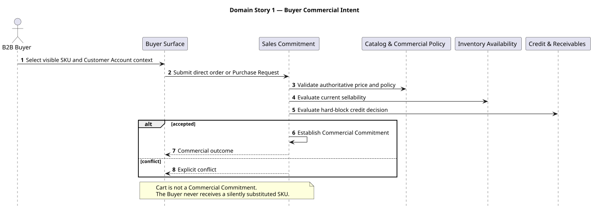
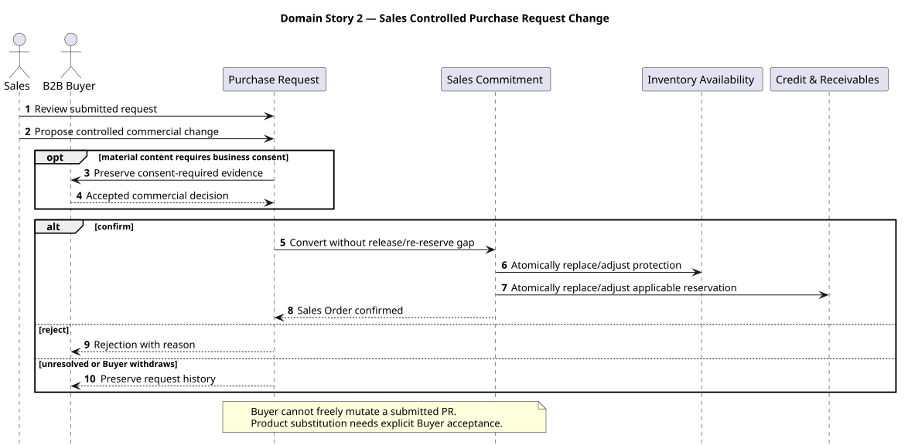
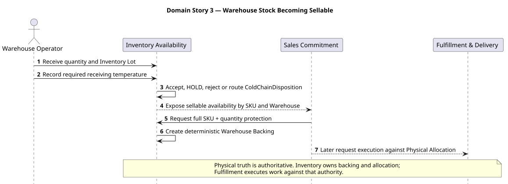
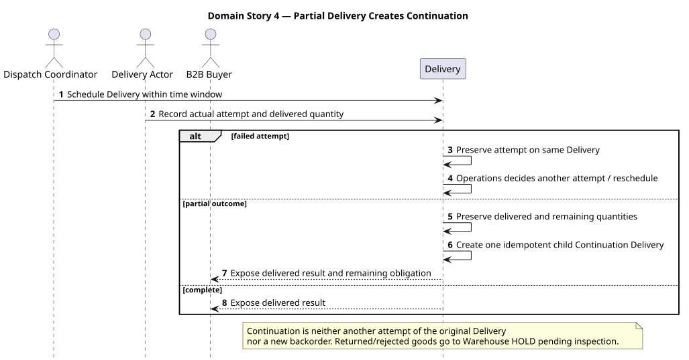
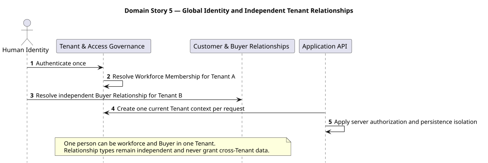
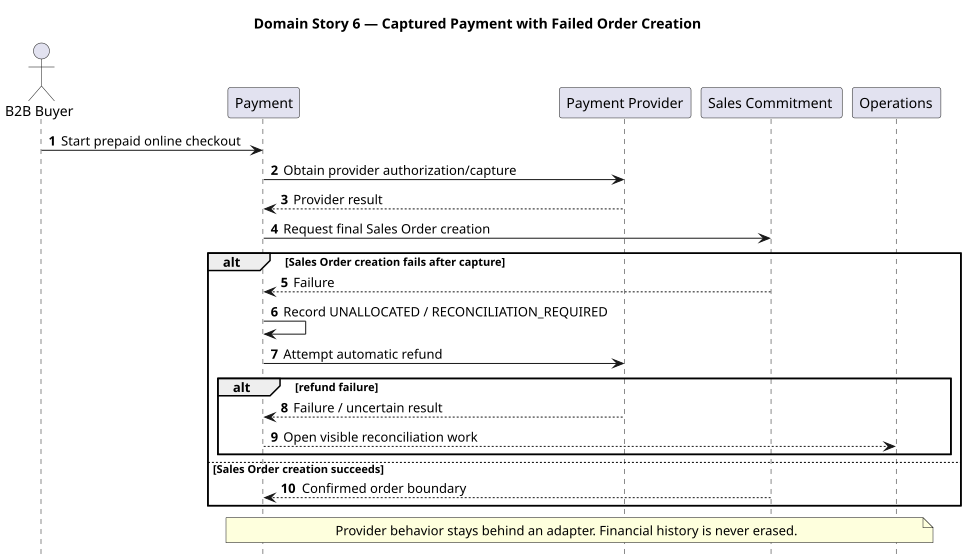
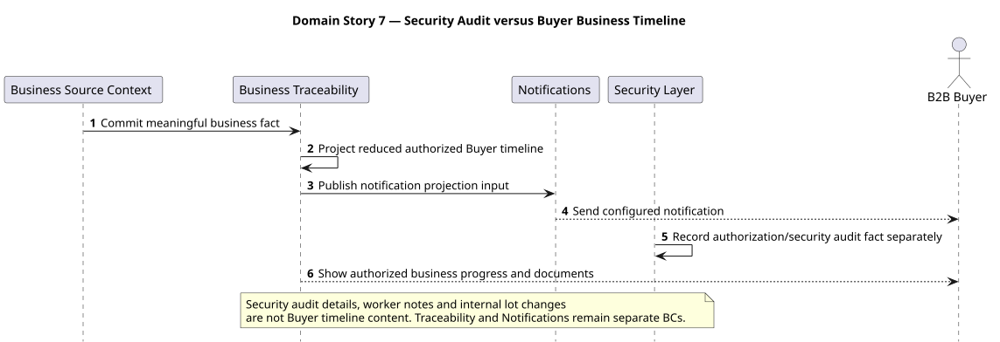

#### 2.5.1.2. Domain Message Flows Modeling

Las siete Domain Stories canónicas muestran actores, objetos de trabajo,
handoffs y cambios de autoridad. Son exports generados de Blueprint Wave 3;
este informe no mantiene una fuente alternativa de sus flujos. Los Bounded
Contexts siguen siendo fronteras de lenguaje y responsabilidad, no componentes
ni unidades de despliegue.

##### Domain Story 1: Buyer Commercial Intent

El Buyer selecciona un SKU visible en su contexto de Customer Account y envía
una orden directa o Purchase Request. Sales Commitment consulta precio/política,
sellability y decisión de crédito antes de establecer Commercial Commitment o
devolver un conflicto explícito. Un cart no es Commercial Commitment ni permite
sustituir silenciosamente un SKU.

##### Domain Story 2: Sales Controlled Purchase Request Change

Sales revisa una Purchase Request enviada y preserva evidencia de consentimiento
cuando un cambio comercial es material. La conversión confirmada no abre una
brecha de release/re-reserve; ajusta protección de Inventory y Credit de forma
atómica. El Buyer no muta libremente una PR enviada.

##### Domain Story 3: Warehouse Stock Becoming Sellable

Warehouse registra cantidad, Inventory Lot y temperatura de recepción.
Inventory Availability decide aceptación, HOLD, rechazo o ColdChainDisposition,
expone sellability y distribuye protección mediante Warehouse Backing.
Fulfillment ejecuta luego contra Physical Allocation, sin adquirir la autoridad
física.

##### Domain Story 4: Partial Delivery Creates Continuation

Un Delivery conserva el intento y las cantidades reales. Ante resultado parcial
preserva lo entregado y lo pendiente, y crea una única Continuation Delivery
idempotente como hijo real; no es otro intento del Delivery original ni un nuevo
backorder. Returned/rejected goods quedan en Warehouse HOLD pendiente de
inspección.

##### Domain Story 5: Global Identity and Independent Tenant Relationships

Una Human Identity puede autenticar una vez, resolver Workforce Membership para
un Tenant y una Buyer Relationship independiente para otro. La API construye
un solo Tenant context por request, aplica autorización de servidor y
aislamiento de persistencia; las relaciones nunca otorgan datos cross-Tenant.

##### Domain Story 6: Captured Payment with Failed Order Creation

Payment encapsula el proveedor detrás de un adapter. Si la creación final de
Sales Order falla después de captura, conserva la historia como UNALLOCATED /
RECONCILIATION_REQUIRED, intenta un reembolso y abre trabajo visible de
conciliación cuando el resultado es fallido o incierto. La historia financiera
nunca se borra.

##### Domain Story 7: Security Audit versus Buyer Business Timeline

Business Traceability proyecta hechos de negocio reducidos y autorizados para
la línea de tiempo Buyer; Notifications genera su proyección independiente. La
auditoría de autorización/seguridad, notas de worker y cambios internos de lote
no forman parte de la línea de tiempo Buyer.

*Nota. Exports canónicos generados desde Blueprint Wave 3.*

| Domain Story | Bounded Contexts principales | Handoff decisivo |
| :--- | :--- | :--- |
| Buyer Commercial Intent | BC-02, BC-03, BC-04, BC-05, BC-07 | Intención a Commercial Commitment o conflicto explícito. |
| Sales Controlled Purchase Request Change | BC-04, BC-05, BC-07 | Consentimiento y conversión sin brecha de protección. |
| Warehouse Stock Becoming Sellable | BC-04, BC-05, BC-06 | Verdad física a ejecución contra Physical Allocation. |
| Partial Delivery Creates Continuation | BC-06 | Resultado parcial a Delivery hijo idempotente. |
| Global Identity and Independent Tenant Relationships | BC-01, BC-02 | Identidad global a contexto tenant-scoped. |
| Captured Payment with Failed Order Creation | BC-08, BC-04 | Captura a conciliación/reembolso preservando historia. |
| Security Audit versus Buyer Business Timeline | BC-10, BC-11 | Hecho autorizado a proyección Buyer separada de auditoría. |
