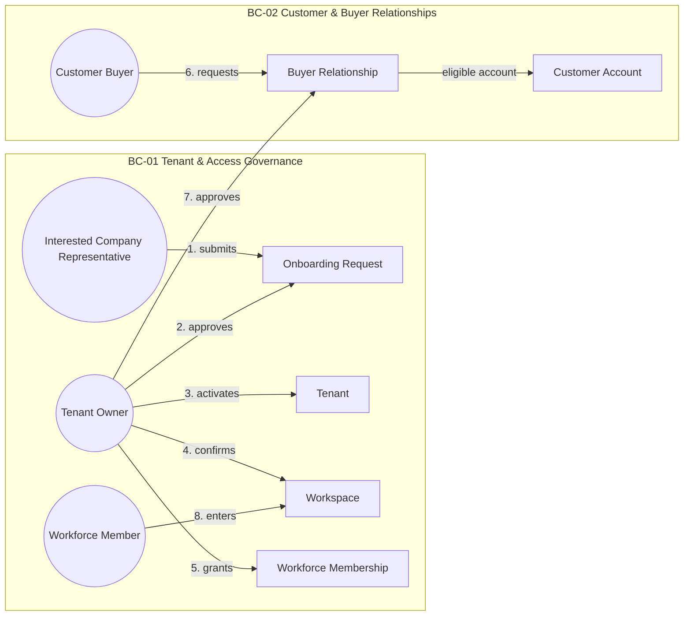
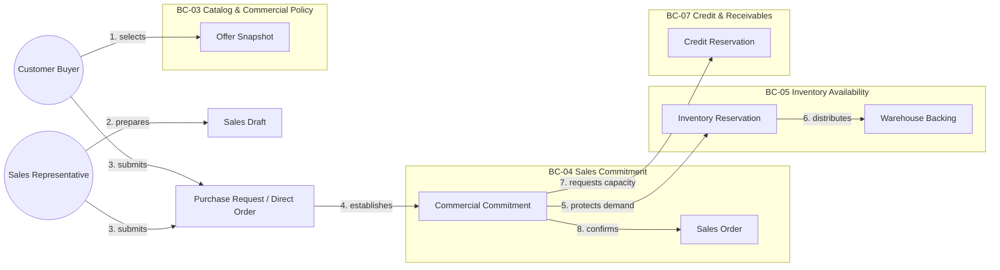
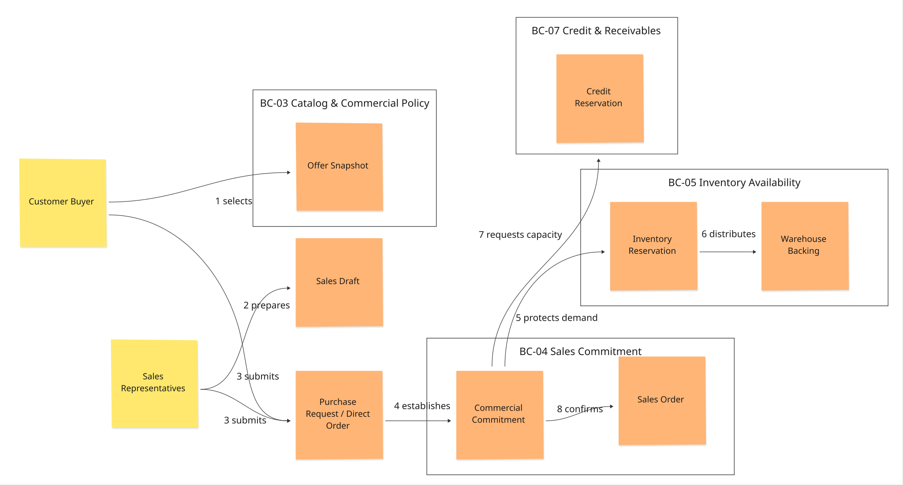
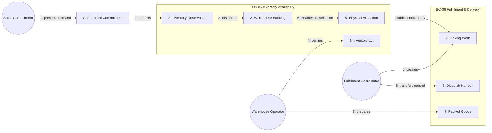
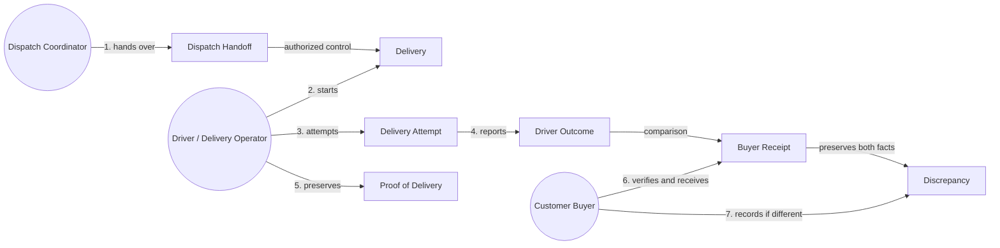
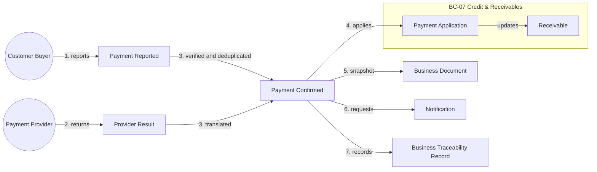

#### 2.5.1.2. Domain Storytelling

Este artefacto reemplaza los flujos orientados a mensajes técnicos por cinco
Domain Stories. Cada historia muestra actores nombrados, objetos de trabajo,
actividades numeradas, handoffs y cambios de autoridad. Los Bounded Contexts
aparecen como fronteras de lenguaje y responsabilidad, no como endpoints,
colas, tablas o servicios de despliegue.

La notación mantiene la convención de Domain Storytelling: una persona o rol
actúa sobre un objeto de trabajo y produce un resultado que otro actor puede
recibir. La secuencia representa negocio observable; cualquier publicación
asíncrona, outbox o adapter se documenta en el diseño de contratos y no se
inventa dentro de la historia.

##### Domain Story 1 — Company onboarding and authorized relationship

**Actores:** Interested Company Representative, Tenant Owner, Workforce Member
y Customer Buyer.

**Objetos de trabajo:** Onboarding Request, Tenant, Workspace, Workforce
Membership, Customer Account y Buyer Relationship.

| # | Actor | Actividad | Objeto de trabajo | Resultado y autoridad | Bounded Context |
| ---: | --- | --- | --- | --- | --- |
| 1 | Interested Company Representative | Presenta los datos de la empresa | Onboarding Request | La solicitud queda pendiente; no crea Tenant ni Workspace | BC-01 |
| 2 | Tenant Owner | Revisa y aprueba la habilitación | Onboarding Request | Se autoriza la activación de la empresa | BC-01 |
| 3 | Tenant Owner | Activa la empresa | Tenant | Tenant activo y aislado por alcance | BC-01 |
| 4 | Tenant Owner | Confirma el entorno operativo | Workspace | Workspace 1:1 asociado al Tenant | BC-01 |
| 5 | Tenant Owner | Concede capacidad de trabajo | Workforce Membership | Membership con rol y alcance explícitos | BC-01 |
| 6 | Customer Buyer | Solicita operar con el proveedor | Buyer Relationship | Relación pendiente de aprobación | BC-02 |
| 7 | Tenant Owner | Aprueba la relación comercial | Buyer Relationship | La relación se vuelve elegible para el catálogo | BC-02 |
| 8 | Workforce Member | Entra al contexto autorizado | Tenant, Workspace, Membership | El trabajo queda limitado por Tenant, Workspace, relación y rol | BC-01 / BC-02 |

*Figura.* Render reproducible de la Domain Story 1; el SVG se conserva junto al
PNG para consulta y exportación.

**Handoff y cambio de autoridad:** la solicitud pública sólo llega a BC-01;
Tenant y Workspace se vuelven autoritativos después de la aprobación. BC-02
conserva Buyer Relationship y su elegibilidad. Una identidad, membership o
relación revocada no puede reutilizar una proyección local para abrir trabajo.

##### Domain Story 2 — Commercial request or Direct Order to Commitment

**Actores:** Customer Buyer, Sales Representative, Commercial Policy Owner,
Inventory Availability decision maker y Credit Manager.

**Objetos de trabajo:** Product/SKU Offer Snapshot, Sales Draft, Purchase
Request, Commercial Commitment, Inventory Reservation, Warehouse Backing,
Credit Reservation y Sales Order.

| # | Actor | Actividad | Objeto de trabajo | Resultado y autoridad | Bounded Context |
| ---: | --- | --- | --- | --- | --- |
| 1 | Customer Buyer o Sales Representative | Selecciona una oferta para una relación elegible | Product/SKU Offer Snapshot | El snapshot congela precio, términos y política aplicables | BC-02 / BC-03 |
| 2 | Customer Buyer o Sales Representative | Prepara la intención comercial | Sales Draft | El Draft sigue sin crear compromiso | BC-04 |
| 3 | Customer Buyer o Sales Representative | Envía una PR o confirma una ruta Direct Order permitida | Purchase Request / Direct Order | La ruta y el actor quedan explícitos | BC-04 |
| 4 | Sales Commitment | Establece la demanda persistente | Commercial Commitment | BC-04 conserva SKU, cantidad, origen y lifecycle | BC-04 |
| 5 | Inventory Availability | Protege la demanda comercial | Inventory Reservation | La demanda queda reservada sin seleccionar un Lot | BC-05 |
| 6 | Inventory Availability | Distribuye la protección por almacén elegible | Warehouse Backing | La Reservation obtiene una distribución determinista por Warehouse | BC-05 |
| 7 | Credit Manager | Protege capacidad financiera aplicable | Credit Reservation | La exposición queda reservada o rechazada | BC-07 |
| 8 | Sales Commitment | Confirma la obligación comercial | Sales Order | El SO queda confirmado sólo si las decisiones requeridas tienen éxito | BC-04 |

*Figura.* Render reproducible de la Domain Story 2; el SVG se conserva junto al
PNG para consulta y exportación.

**Handoff y cambio de autoridad:** BC-03 entrega un snapshot; BC-04 conserva
la intención y Commercial Commitment; BC-05 conserva la Inventory Reservation
y su Warehouse Backing; BC-07 conserva la Credit Reservation. La confirmación
puede requerir un límite lógico síncrono común, pero no fusiona los agregados ni
autoriza a Sales Commitment a seleccionar Warehouse o Lot. Si una decisión
falla, el resultado es rechazo o conflicto explícito; no se registra un
compromiso parcial.

##### Domain Story 3 — Commercial Commitment to Inventory Reservation to Warehouse Backing to Physical Allocation

**Actores:** Sales Commitment, Warehouse Operator, Inventory Availability y
Fulfillment Coordinator.

**Objetos de trabajo:** Commercial Commitment, Inventory Reservation, Warehouse
Backing, Inventory Lot, Physical Allocation, Picking Work, Packed Goods y
Dispatch Handoff.

| # | Actor | Actividad | Objeto de trabajo | Resultado y autoridad | Bounded Context |
| ---: | --- | --- | --- | --- | --- |
| 1 | Sales Commitment | Entrega la demanda confirmada para ejecución | Commercial Commitment | El SKU y la cantidad permanecen Warehouse-neutral | BC-04 |
| 2 | Inventory Availability | Crea la protección de demanda | Inventory Reservation | Se protege la cantidad comprometida sin elegir un lote | BC-05 |
| 3 | Inventory Availability | Distribuye la protección entre almacenes elegibles | Warehouse Backing | La cobertura por Warehouse queda explícita; shortage no se oculta | BC-05 |
| 4 | Warehouse Operator | Recibe y verifica disponibilidad física | Inventory Lot | Lote, vencimiento, condición y cantidad se mantienen como hechos físicos | BC-05 |
| 5 | Inventory Availability | Selecciona lotes elegibles según FEFO y política | Physical Allocation | La asignación física se realiza después de Reservation y Backing | BC-05 |
| 6 | Fulfillment Coordinator | Crea trabajo contra la asignación | Picking Work | Fulfillment recibe un allocation ID estable; no escribe inventario directamente | BC-06 |
| 7 | Warehouse Operator | Recoge, acondiciona y prepara los bienes | Packed Goods | Picking, packing y staging quedan vinculados al trabajo | BC-06 |
| 8 | Fulfillment Coordinator | Transfiere el control operativo | Dispatch Handoff | La responsabilidad cambia del almacén al flujo de Delivery | BC-06 |

*Figura.* Render reproducible de la Domain Story 3; el SVG se conserva junto al
PNG para consulta y exportación.

**Handoff y cambio de autoridad:** Inventory Availability conserva la cadena
`Commercial Commitment → Inventory Reservation → Warehouse Backing → Physical
Allocation`. Fulfillment ejecuta contra la Physical Allocation y solicita
mutaciones explícitas cuando corresponde; no convierte un scan Mobile en
autoridad de stock. Warehouse Backing no es Physical Allocation y Safety Stock
no es Inventory Reservation.

##### Domain Story 4 — Delivery to POD to Buyer Receipt

**Actores:** Dispatch Coordinator, Driver / Delivery Operator y Customer Buyer.

**Objetos de trabajo:** Dispatch Handoff, Delivery, Delivery Attempt, Driver
Outcome, Proof of Delivery, Buyer Receipt y Discrepancy.

| # | Actor | Actividad | Objeto de trabajo | Resultado y autoridad | Bounded Context |
| ---: | --- | --- | --- | --- | --- |
| 1 | Dispatch Coordinator | Entrega bienes preparados al responsable de ruta | Dispatch Handoff | La transferencia conserva actor, momento y alcance | BC-06 |
| 2 | Driver / Delivery Operator | Inicia una entrega asignada | Delivery | El destino autorizado queda congelado | BC-06 |
| 3 | Driver / Delivery Operator | Ejecuta un intento de entrega | Delivery Attempt | El intento conserva resultado propio y no reescribe handoff | BC-06 |
| 4 | Driver / Delivery Operator | Informa cantidades, aceptación o rechazo | Driver Outcome | El resultado del conductor queda separado de la recepción Buyer | BC-06 |
| 5 | Driver / Delivery Operator | Adjunta la evidencia aplicable | Proof of Delivery | POD queda inmutable; una corrección es un addendum | BC-06 / BC-09 |
| 6 | Customer Buyer | Verifica el handoff y las cantidades recibidas | Buyer Receipt | Buyer declara su propio hecho de recepción | BC-06 |
| 7 | Customer Buyer | Registra una diferencia cuando corresponde | Discrepancy | La discrepancia conserva ambos hechos sin borrar historia | BC-06 / BC-11 |

*Figura.* Render reproducible de la Domain Story 4; el SVG se conserva junto al
PNG para consulta y exportación.

**Handoff y cambio de autoridad:** BC-06 conserva Delivery, attempts, Driver
Outcome, POD, Buyer Receipt y continuación. BC-09 puede emitir un documento
desde un snapshot; BC-11 conserva una representación durable. Ninguna
proyección de Buyer sustituye el hecho fuente ni convierte Driver Outcome en
Buyer Receipt.

##### Domain Story 5 — Payment, Receivable, Document and Traceability

**Actores:** Customer Buyer, Payment Provider, Finance Operator y Business
Operations Manager.

**Objetos de trabajo:** Payment Reported, Payment Confirmed, Receivable, Payment
Application, Business Document, Notification y Business Traceability Record.

| # | Actor | Actividad | Objeto de trabajo | Resultado y autoridad | Bounded Context |
| ---: | --- | --- | --- | --- | --- |
| 1 | Customer Buyer | Informa o inicia un pago | Payment Reported | El reporte queda pendiente de verificación | BC-08 |
| 2 | Payment Provider | Devuelve un resultado externo | Provider Result | El proveedor no se convierte en autoridad de crédito | BC-08 |
| 3 | Finance Operator | Verifica y deduplica el resultado | Payment Confirmed | Payment queda confirmado, rechazado, reembolsado o en reconciliación | BC-08 |
| 4 | Finance Operator | Aplica el pago a una obligación | Payment Application | BC-07 actualiza Receivable y exposición de forma idempotente | BC-07 |
| 5 | Business Operations Manager | Solicita un artefacto desde el snapshot autorizado | Business Document | BC-09 conserva el documento emitido y su historia | BC-09 |
| 6 | Business Operations Manager | Solicita una comunicación | Notification | BC-10 conserva intención, canal, delivery y retry | BC-10 |
| 7 | Business Operations Manager | Consulta el hecho y su evidencia | Business Traceability Record | BC-11 conserva timeline append-only sin asumir autoridad de origen | BC-11 |

*Figura.* Render reproducible de la Domain Story 5; el SVG se conserva junto al
PNG para consulta y exportación.

**Handoff y cambio de autoridad:** BC-08 traduce el ciclo del provider; BC-07
conserva Credit, Receivable y aplicación; BC-09 conserva snapshots emitidos;
BC-10 conserva comunicación; BC-11 conserva hechos de negocio append-only.
`Payment Reported != Payment Confirmed`, `Payment != Receivable`, y Business
Traceability != Security Audit. Si una aplicación es incierta, se conserva el
resultado pendiente o de reconciliación y no se borra el historial.

##### Cobertura y trazabilidad de las Domain Stories

| Domain Story | Actores principales | Objetos de trabajo decisivos | Bounded Contexts | Handoff decisivo |
| --- | --- | --- | --- | --- |
| Company onboarding and authorized relationship | Interested Company Representative, Tenant Owner, Workforce Member, Customer Buyer | Onboarding Request, Tenant, Workspace, Membership, Buyer Relationship | BC-01, BC-02 | De onboarding pendiente a scope y relación elegibles |
| Commercial request or Direct Order to Commitment | Customer Buyer, Sales Representative, Policy Owner, Inventory, Credit | Offer Snapshot, Draft, PR, Commitment, Reservation, Backing, Credit Reservation, SO | BC-02, BC-03, BC-04, BC-05, BC-07 | De intención a obligación confirmada con protección explícita |
| Commitment to Reservation to Backing to Physical Allocation | Sales Commitment, Warehouse Operator, Inventory, Fulfillment Coordinator | Commitment, Inventory Reservation, Warehouse Backing, Lot, Physical Allocation, Picking Work | BC-04, BC-05, BC-06 | De demanda Warehouse-neutral a bienes bajo control de Dispatch |
| Delivery to POD to Buyer Receipt | Dispatch Coordinator, Driver, Customer Buyer | Handoff, Delivery Attempt, Outcome, POD, Receipt, Discrepancy | BC-06, BC-09, BC-11 | De control operativo a hechos separados de recepción y discrepancia |
| Payment, Receivable, Document and Traceability | Customer Buyer, Provider, Finance Operator, Operations Manager | Payment, Receivable, Document, Notification, Traceability Record | BC-07, BC-08, BC-09, BC-10, BC-11 | De resultado externo verificado a obligación aplicada y evidencia durable |

Las historias cubren los once contextos aceptados sin crear un contexto Mobile.
Operations Mobile y Buyer Mobile son proyecciones que apoyan actores y
actividades; la autoridad permanece en Nexa API y en el contexto propietario.
