# 2.5.1.3 Bounded Context Canvases

Cada canvas conserva seis celdas estratégicas: Context Overview, Business Rules
& Ubiquitous Language, Capability Analysis, Capability Layering, Dependencies y
Design Critique. Las imágenes PNG/SVG producidas para los canvases se mantienen
como evidencia visual; esta estructura Markdown es la lectura normativa y no
añade un Bounded Context para Operations Mobile o Buyer Mobile.

## BC-04 Sales Commitment — Core

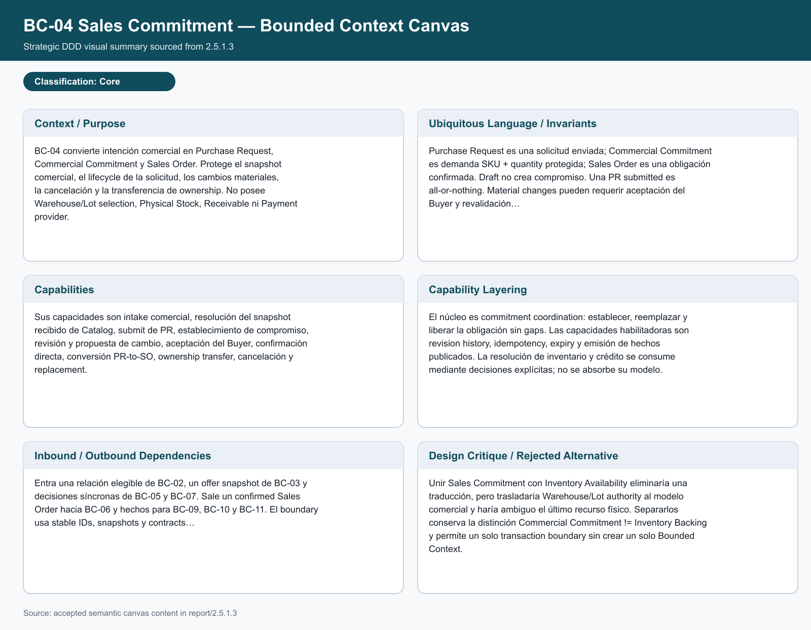

| **Context Overview**  Convierte intención comercial en Purchase Request, Commercial Commitment y Sales Order. Protege snapshot, lifecycle, cambios materiales, cancelación y ownership transfer. No posee Warehouse/Lot selection, Physical Stock, Receivable ni Payment provider. | **Business Rules & Ubiquitous Language**  Draft no crea compromiso. Purchase Request es solicitud enviada; Commercial Commitment es demanda SKU + quantity protegida; Sales Order es obligación confirmada. PR submitted es all-or-nothing; cambios materiales pueden requerir aceptación y revalidación. |
| :--- | :--- |
| **Capability Analysis**  Intake comercial, resolución de offer snapshot, submit de PR, establecimiento de compromiso, revisión, cambio, aceptación, confirmación directa, PR-to-SO, ownership transfer, cancelación y replacement. | **Capability Layering**  El núcleo coordina commitment y release sin gaps. Revision history, idempotency, expiry y hechos publicados son habilitadores. Inventario y crédito se consumen como decisiones explícitas. |
| **Dependencies**  Consume relación elegible de BC-02, offer snapshot de BC-03 y decisiones síncronas de BC-05 y BC-07. Entrega Sales Order a BC-06 y hechos a BC-09, BC-10 y BC-11. Submit y Direct Order requieren consistencia atómica cuando aplica. | **Design Critique**  Separarlo de Inventory Availability conserva Commercial Commitment != Inventory Backing sin impedir una frontera transaccional común para la decisión atómica. |

## BC-05 Inventory Availability — Core

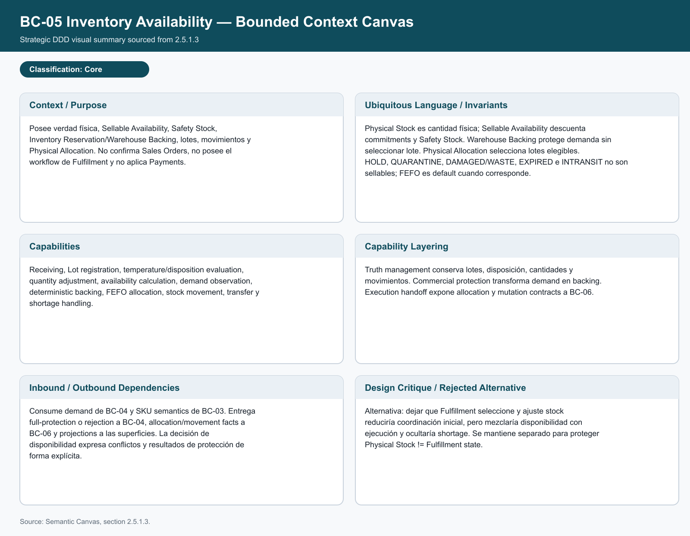

| **Context Overview**  Posee verdad física, Sellable Availability, Safety Stock, Inventory Reservation/Warehouse Backing, lotes, movimientos y Physical Allocation. No confirma Sales Orders, no posee el workflow de Fulfillment y no aplica Payments. | **Business Rules & Ubiquitous Language**  Physical Stock es cantidad física; Sellable Availability descuenta commitments y Safety Stock. Warehouse Backing protege demanda sin seleccionar lote. Physical Allocation selecciona lotes elegibles. HOLD, QUARANTINE, DAMAGED/WASTE, EXPIRED e IN_TRANSIT no son sellables; FEFO es default cuando corresponde. |
| :--- | :--- |
| **Capability Analysis**  Receiving, Lot registration, temperature/disposition evaluation, quantity adjustment, availability calculation, demand observation, deterministic backing, FEFO allocation, stock movement, transfer y shortage handling. | **Capability Layering**  Truth management conserva lotes, disposición, cantidades y movimientos. Commercial protection transforma demand en backing. Execution handoff expone allocation y mutation contracts a BC-06. |
| **Dependencies**  Consume demand de BC-04 y SKU semantics de BC-03. Entrega full-protection o rejection a BC-04, allocation/movement facts a BC-06 y projections a las superficies. Scarce resources usan conditional update, row lock u optimistic version; no last-write-wins. | **Design Critique**  Separarlo de Fulfillment evita mezclar stock físico con ejecución de trabajo y protege Physical Stock != Fulfillment state. |

## BC-06 Fulfillment & Delivery — Core

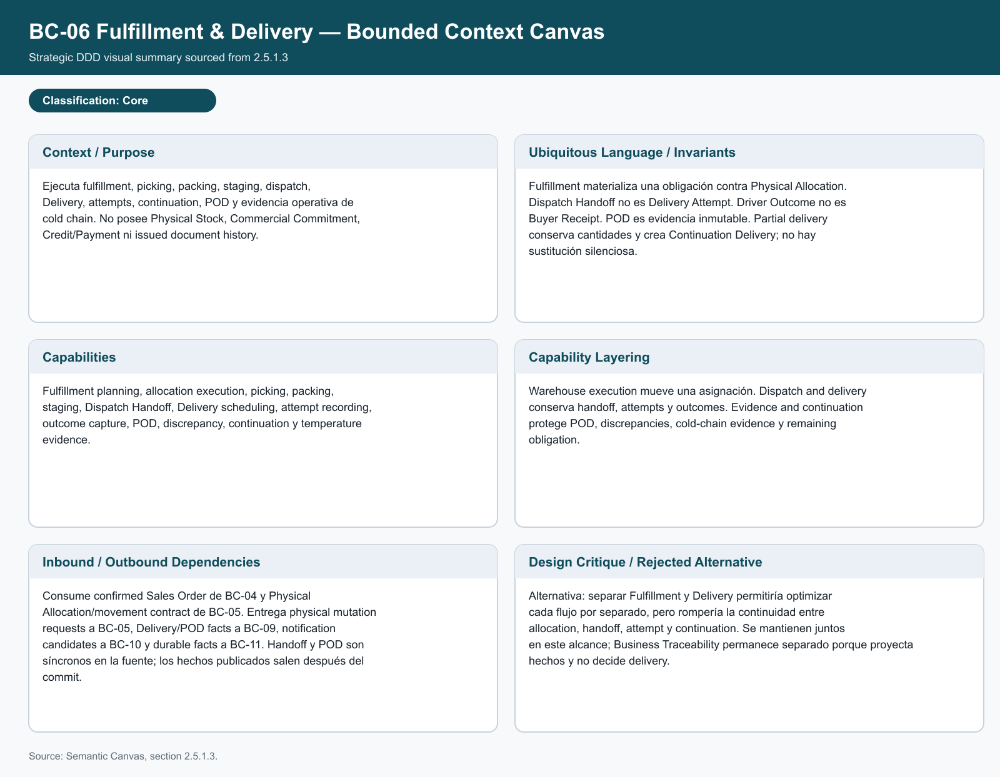

| **Context Overview**  Ejecuta fulfillment, picking, packing, staging, dispatch, Delivery, attempts, continuation, POD y evidencia operativa de cold chain. No posee Physical Stock, Commercial Commitment, Credit/Payment ni issued document history. | **Business Rules & Ubiquitous Language**  Fulfillment materializa una obligación contra Physical Allocation. Dispatch Handoff no es Delivery Attempt. Driver Outcome no es Buyer Receipt. POD es evidencia inmutable. Partial delivery conserva cantidades y crea Continuation Delivery; no hay sustitución silenciosa. |
| :--- | :--- |
| **Capability Analysis**  Fulfillment planning, allocation execution, picking, packing, staging, Dispatch Handoff, Delivery scheduling, attempt recording, outcome capture, POD, discrepancy, continuation y temperature evidence. | **Capability Layering**  Warehouse execution mueve una asignación. Dispatch and delivery conserva handoff, attempts y outcomes. Evidence and continuation protege POD, discrepancies, cold-chain evidence y remaining obligation. |
| **Dependencies**  Consume confirmed Sales Order de BC-04 y Physical Allocation/movement contract de BC-05. Entrega physical mutation requests a BC-05, Delivery/POD facts a BC-09, notification candidates a BC-10 y durable facts a BC-11. Handoff y POD son síncronos en la fuente; los hechos publicados salen después del commit. | **Design Critique**  Mantener Fulfillment y Delivery juntos en V1 protege la continuidad entre allocation, handoff, attempt y continuation. Business Traceability permanece separado porque proyecta hechos y no decide delivery. |

## BC-03 Catalog & Commercial Policy — Supporting

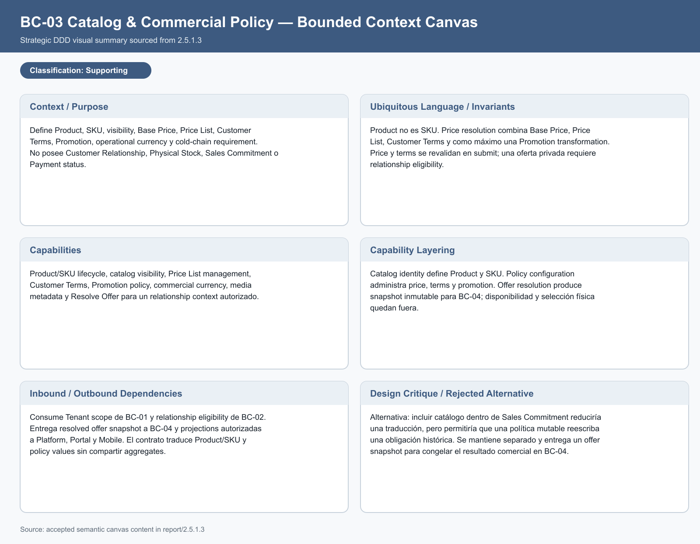

| **Context Overview**  Define Product, SKU, visibility, Base Price, Price List, Customer Terms, Promotion, operational currency y cold-chain requirement. No posee Customer Relationship, Physical Stock, Sales Commitment o Payment status. | **Business Rules & Ubiquitous Language**  Product no es SKU. Price resolution combina Base Price, Price List, Customer Terms y como máximo una Promotion transformation. Price y terms se revalidan en submit; una oferta privada requiere relationship eligibility. |
| :--- | :--- |
| **Capability Analysis**  Product/SKU lifecycle, catalog visibility, Price List management, Customer Terms, Promotion policy, commercial currency, media metadata y Resolve Offer para un relationship context autorizado. | **Capability Layering**  Catalog identity define Product y SKU. Policy configuration administra price, terms y promotion. Offer resolution produce snapshot inmutable para BC-04; disponibilidad y selección física quedan fuera. |
| **Dependencies**  Consume Tenant scope de BC-01 y relationship eligibility de BC-02. Entrega resolved offer snapshot a BC-04 y projections autorizadas a Platform, Portal y Mobile. El contrato traduce Product/SKU y policy values sin compartir aggregates. | **Design Critique**  Separarlo de Sales Commitment evita que una oferta mutable reescriba una obligación histórica y permite congelar el resultado comercial en BC-04. |

## BC-02 Customer & Buyer Relationships — Supporting

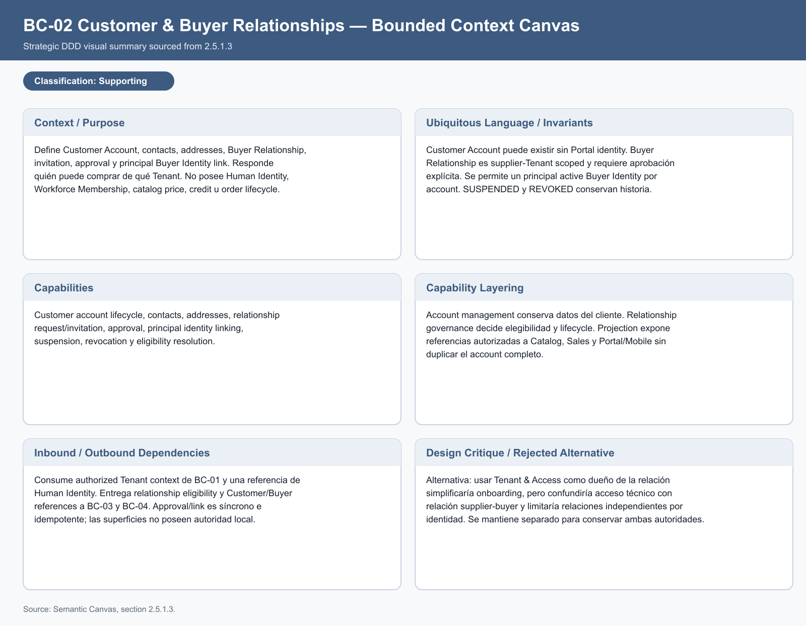

| **Context Overview**  Define Customer Account, contacts, addresses, Buyer Relationship, invitation, approval y principal Buyer Identity link. Responde quién puede comprar de qué Tenant. No posee Human Identity, Workforce Membership, catalog price, credit u order lifecycle. | **Business Rules & Ubiquitous Language**  Customer Account puede existir sin Portal identity. Buyer Relationship es supplier-Tenant scoped y requiere aprobación explícita. V1 permite un principal active Buyer Identity por account. SUSPENDED y REVOKED conservan historia. |
| :--- | :--- |
| **Capability Analysis**  Customer account lifecycle, contacts, addresses, relationship request/invitation, approval, principal identity linking, suspension, revocation y eligibility resolution. | **Capability Layering**  Account management conserva datos del cliente. Relationship governance decide elegibilidad y lifecycle. Projection expone referencias autorizadas a Catalog, Sales y Portal/Mobile sin duplicar el account completo. |
| **Dependencies**  Consume authorized Tenant context de BC-01 y una referencia de Human Identity. Entrega relationship eligibility y Customer/Buyer references a BC-03 y BC-04. Approval/link es síncrono e idempotente; las superficies no poseen autoridad local. | **Design Critique**  Separarlo de Tenant & Access evita mezclar acceso técnico con una relación comercial supplier-buyer y permite relaciones independientes por identidad. |

## BC-07 Credit & Receivables — Supporting

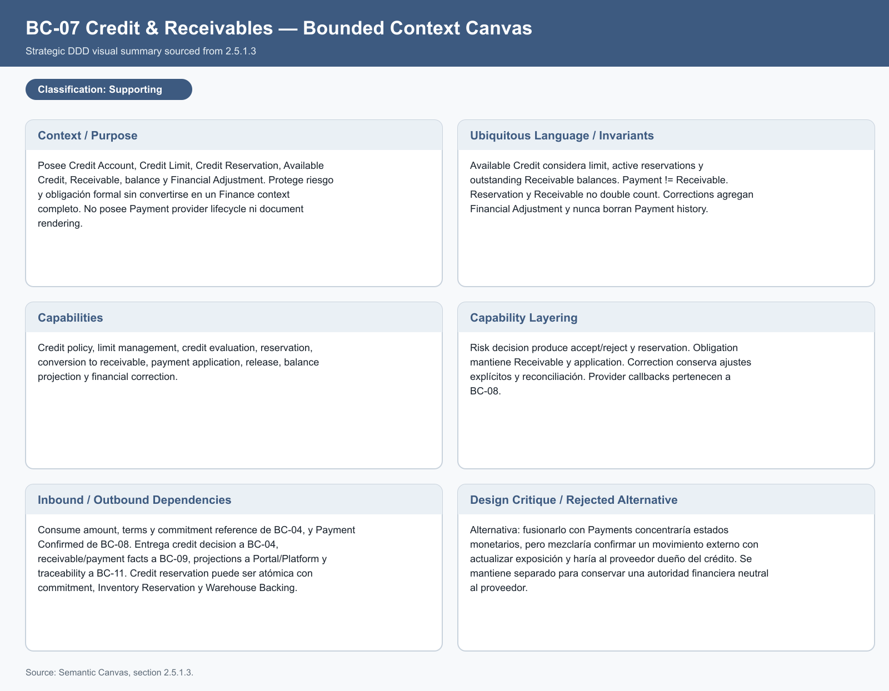

| **Context Overview**  Posee Credit Account, Credit Limit, Credit Reservation, Available Credit, Receivable, balance y Financial Adjustment. Protege riesgo y obligación formal sin convertirse en un Finance context completo. No posee Payment provider lifecycle ni document rendering. | **Business Rules & Ubiquitous Language**  Available Credit considera limit, active reservations y outstanding Receivable balances. Payment != Receivable. Reservation y Receivable no double count. Corrections agregan Financial Adjustment y nunca borran Payment history. |
| :--- | :--- |
| **Capability Analysis**  Credit policy, limit management, credit evaluation, reservation, conversion to receivable, payment application, release, balance projection y financial correction. | **Capability Layering**  Risk decision produce accept/reject y reservation. Obligation mantiene Receivable y application. Correction conserva ajustes explícitos y reconciliación. Provider callbacks pertenecen a BC-08. |
| **Dependencies**  Consume amount, terms y commitment reference de BC-04, y Payment Confirmed de BC-08. Entrega credit decision a BC-04, receivable/payment facts a BC-09, projections a Portal/Platform y traceability a BC-11. Credit reservation puede ser atómica con commitment e inventory backing. | **Design Critique**  Separarlo de Payments distingue confirmar un movimiento externo de actualizar exposición y conserva una autoridad financiera neutral al proveedor. |

## BC-01 Tenant & Access Governance — Supporting

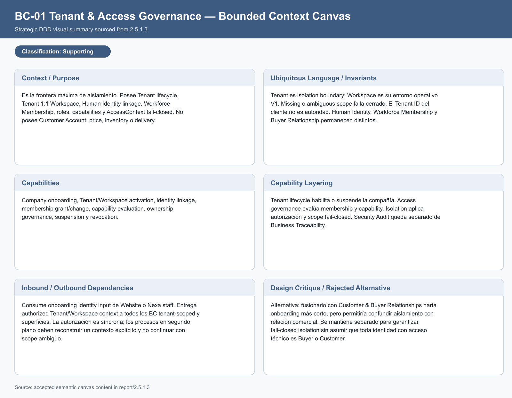

| **Context Overview**  Es la frontera máxima de aislamiento. Posee Tenant lifecycle, Tenant 1:1 Workspace, Human Identity linkage, Workforce Membership, roles, capabilities y AccessContext fail-closed. No posee Customer Account, price, inventory o delivery. | **Business Rules & Ubiquitous Language**  Tenant es isolation boundary; Workspace es su entorno operativo V1. Missing o ambiguous scope falla cerrado. El Tenant ID del cliente no es autoridad. Human Identity, Workforce Membership y Buyer Relationship permanecen distintos. |
| :--- | :--- |
| **Capability Analysis**  Company onboarding, Tenant/Workspace activation, identity linkage, membership grant/change, capability evaluation, ownership governance, suspension, revocation y server-side context propagation. | **Capability Layering**  Tenant lifecycle habilita o suspende la compañía. Access governance evalúa membership y capability. Isolation aplica authorization, object authorization, server predicates y RLS context. Security Audit queda separado de Business Traceability. |
| **Dependencies**  Consume onboarding identity input de Website o Nexa staff. Entrega authorized Tenant/Workspace context a todos los BC tenant-scoped y superficies. Access decision es síncrona; workers reconstruyen SYSTEM Tenant/Workspace context y lo limpian al terminar. | **Design Critique**  Separarlo de Customer & Buyer Relationships permite fail-closed isolation sin asumir que toda identidad con acceso técnico es Buyer o Customer. |

## BC-11 Business Traceability — Supporting

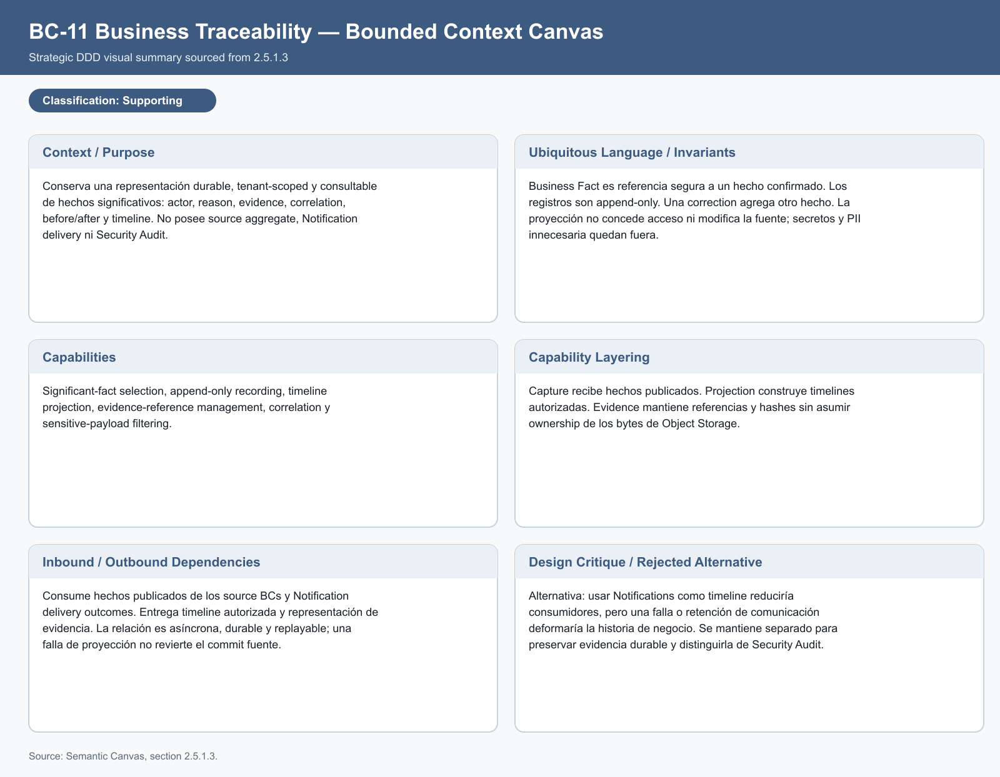

| **Context Overview**  Conserva una representación durable, tenant-scoped y consultable de hechos significativos: actor, reason, evidence, correlation, before/after y timeline. No posee source aggregate, Notification delivery ni Security Audit. | **Business Rules & Ubiquitous Language**  Business Fact es referencia segura a un hecho confirmado. Los registros son append-only. Una correction agrega otro hecho. La proyección no concede acceso ni modifica la fuente; secretos y PII innecesaria quedan fuera. |
| :--- | :--- |
| **Capability Analysis**  Significant-fact selection, append-only recording, timeline projection, evidence-reference management, correlation y sensitive-payload filtering. | **Capability Layering**  Capture recibe hechos publicados. Projection construye timelines autorizadas. Evidence mantiene referencias y hashes sin asumir ownership de los bytes de Object Storage. |
| **Dependencies**  Consume hechos publicados de los source BCs y Notification delivery outcomes. Entrega timeline autorizada y representación de evidencia. La relación es asíncrona, durable y replayable con outbox/inbox; una falla de proyección no revierte el commit fuente. | **Design Critique**  Separarlo de Notifications conserva historia de negocio aunque email o in-app fallen y distingue Business Traceability de Security Audit. |

## BC-08 Payments — Generic

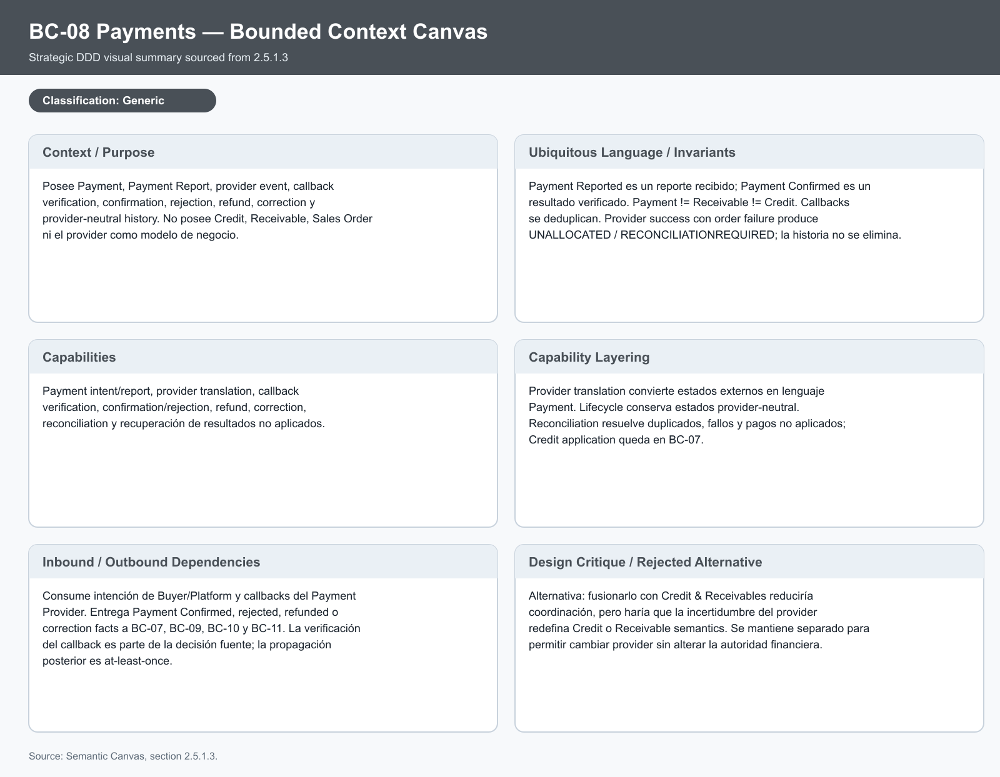

| **Context Overview**  Posee Payment, Payment Report, provider event, callback verification, confirmation, rejection, refund, correction y provider-neutral history. No posee Credit, Receivable, Sales Order ni el provider como modelo de negocio. | **Business Rules & Ubiquitous Language**  Payment Reported es un reporte recibido; Payment Confirmed es un resultado verificado. Payment != Receivable != Credit. Callbacks se deduplican. Provider success con order failure produce UNALLOCATED / RECONCILIATION_REQUIRED; la historia no se elimina. |
| :--- | :--- |
| **Capability Analysis**  Payment intent/report, provider adapter, callback verification, confirmation/rejection, refund, correction, reconciliation e idempotent inbox processing. | **Capability Layering**  Provider translation convierte DTOs externos en lenguaje Payment. Lifecycle conserva estados provider-neutral. Reconciliation resuelve duplicados, fallos y pagos no aplicados; Credit application queda en BC-07. |
| **Dependencies**  Consume intención de Buyer/Platform y callbacks del Payment Provider. Entrega Payment Confirmed, rejected, refunded o correction facts a BC-07, BC-09, BC-10 y BC-11. Callback verification es síncrona con el inbox; la propagación posterior es at-least-once. | **Design Critique**  Separarlo de Credit & Receivables aísla incertidumbre del provider y permite cambiar provider sin alterar Credit o Receivable semantics. |

## BC-09 Business Documents — Generic

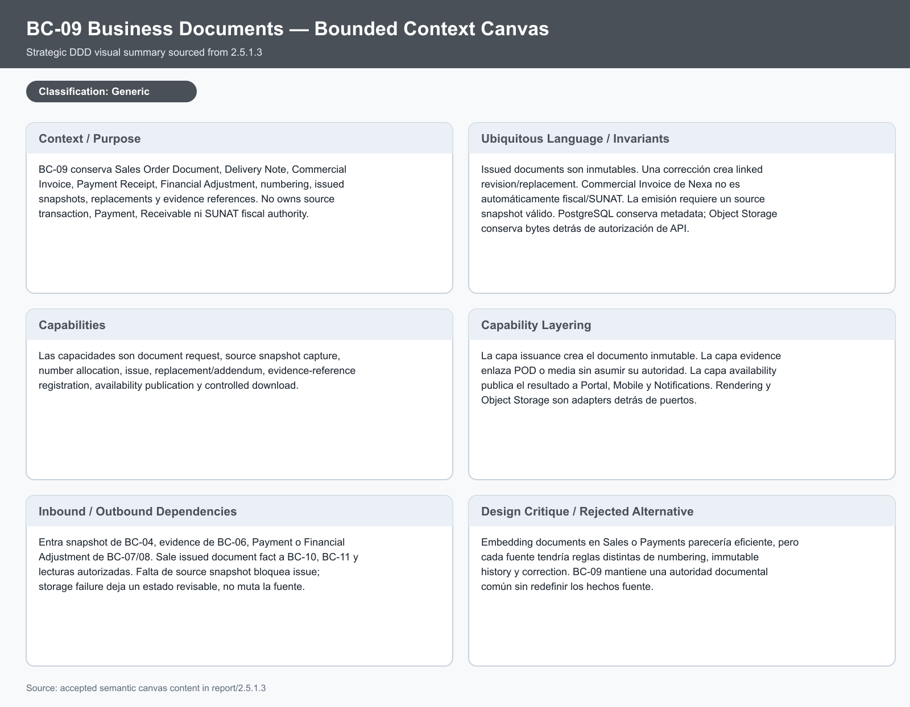

| **Context Overview**  Conserva Sales Order Document, Delivery Note, Commercial Invoice, Payment Receipt, Financial Adjustment, numbering, issued snapshots, replacements y evidence references. No posee source transaction, Payment, Receivable ni SUNAT fiscal authority. | **Business Rules & Ubiquitous Language**  Issued documents son inmutables. Una corrección crea linked revision/replacement. Commercial Invoice de Nexa no es automáticamente fiscal/SUNAT. La emisión requiere source snapshot válido. |
| :--- | :--- |
| **Capability Analysis**  Document request, source snapshot capture, number allocation, issue, replacement/addendum, evidence-reference registration, availability publication y controlled download. | **Capability Layering**  Issuance crea el documento inmutable. Evidence enlaza POD o media sin asumir su autoridad. Availability publica a Portal, Mobile y Notifications. Rendering y Object Storage son adapters detrás de puertos. |
| **Dependencies**  Consume snapshot de BC-04, evidence de BC-06 y Payment o Financial Adjustment de BC-07/08. Entrega issued document fact a BC-10, BC-11 y lecturas autorizadas. Falta de snapshot bloquea issue; storage failure deja un estado revisable. | **Design Critique**  BC-09 mantiene una autoridad documental común sin redefinir los hechos fuente ni convertir el documento de Nexa en documento fiscal automáticamente. |

## BC-10 Notifications — Generic

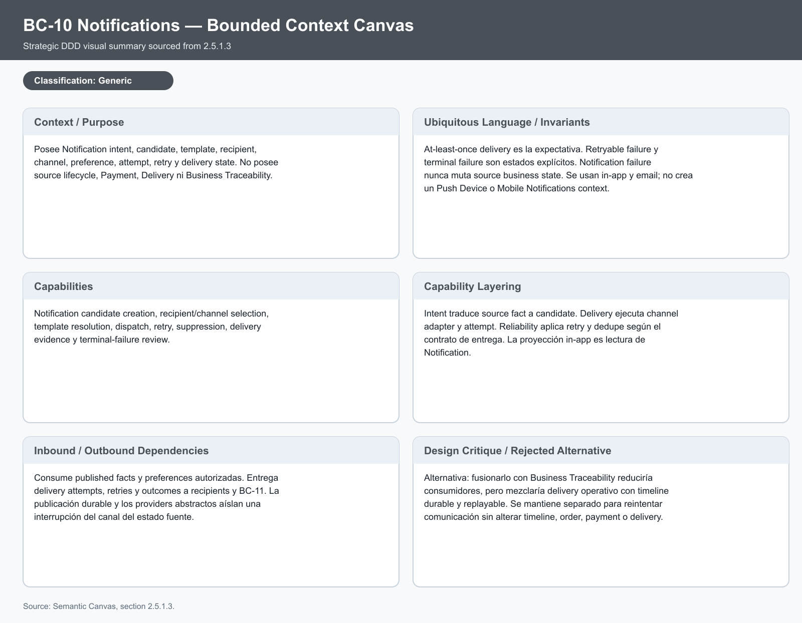

| **Context Overview**  Posee Notification intent, candidate, template, recipient, channel, preference, attempt, retry y delivery state. No posee source lifecycle, Payment, Delivery ni Business Traceability. | **Business Rules & Ubiquitous Language**  At-least-once delivery es la expectativa. Retryable failure y terminal failure son estados explícitos. Notification failure nunca muta source business state. V1 usa in-app y email; no crea un Push Device o Mobile Notifications context. |
| :--- | :--- |
| **Capability Analysis**  Notification candidate creation, recipient/channel selection, template resolution, dispatch, retry, suppression, delivery evidence y terminal-failure review. | **Capability Layering**  Intent traduce source fact a candidate. Delivery ejecuta channel adapter y attempt. Reliability aplica retry, lease, fencing y dedupe. La proyección in-app es lectura de Notification. |
| **Dependencies**  Consume published facts y preferences autorizadas. Entrega delivery attempts, retries y outcomes a recipients y BC-11. Outbox/inbox y providers abstractos aíslan provider outage del transaction source. | **Design Critique**  Separarlo de Business Traceability permite reintentar comunicación sin alterar timeline, order, payment o delivery. |

## Cobertura de los canvases

| Contexto | Autoridad principal | Consumidores principales |
| :--- | :--- | :--- |
| BC-01 | Tenant scope y access eligibility | Todos los BC tenant-scoped y superficies. |
| BC-02 | Customer Account y Buyer Relationship | BC-03, BC-04 y experiencias autorizadas. |
| BC-03 | Offer, price, terms y SKU policy | BC-04 y proyecciones de catálogo. |
| BC-04 | Commercial Commitment y Sales Order | BC-05, BC-06, BC-07 y documentos/proyecciones. |
| BC-05 | Sellable Availability, backing y allocation | BC-04, BC-06 y consultas autorizadas. |
| BC-06 | Fulfillment, Delivery, POD y continuation | BC-09, BC-10, BC-11 y lectores autorizados. |
| BC-07 | Credit, Receivable y financial adjustment | BC-04, BC-08, BC-09 y traceability. |
| BC-08 | Payment lifecycle y provider translation | BC-07, BC-09, BC-10 y traceability. |
| BC-09 | Issued document history y evidence metadata | Portal, Buyer Mobile, Notifications y traceability. |
| BC-10 | Notification delivery y retry | Recipients y BC-11 delivery evidence. |
| BC-11 | Durable business fact representation | Timelines autorizadas y revisión operativa. |

El canvas describe autoridad estratégica, no clases Java, controllers,
repository methods, tablas o SQL. Esos detalles permanecen en 2.6 y no pueden
redefinir estos límites.
