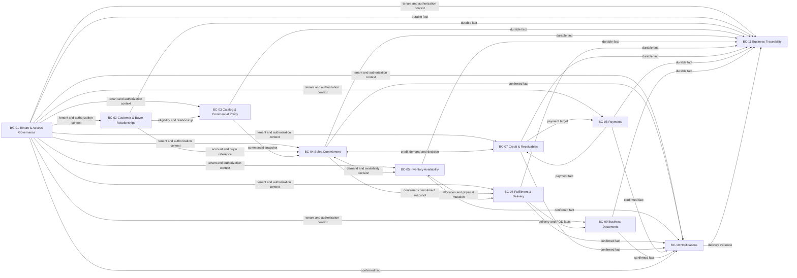

# 2.5.2 Context Mapping

El Context Map documenta autoridad, traducción y consistencia entre los once
Bounded Contexts aceptados. No describe despliegues separados, paquetes,
schemas PostgreSQL ni una base de datos por contexto.

## Mapa de relaciones

El diagrama agrupa las publicaciones hacia Notifications y Business
Traceability para mantenerlo legible. La tabla siguiente conserva el contrato
de cada relación sin convertir a un consumidor en autoridad del estado fuente.

## Relaciones y contratos

| Upstream | Downstream | Relación y traducción | Interacción y consistencia |
| :--- | :--- | :--- | :--- |
| BC-01 Tenant & Access Governance | BC-02..BC-11 tenant-scoped | Contexto de autorización, Tenant/Workspace y capacidades; ACL fail-closed | Síncrona cuando se autoriza una operación; el alcance ausente falla cerrado |
| BC-02 Customer & Buyer Relationships | BC-03 Catalog & Commercial Policy | Elegibilidad y relación activa del comprador | Proyección/consulta síncrona; no entrega autoridad de catálogo |
| BC-02 Customer & Buyer Relationships | BC-04 Sales Commitment | Referencia de cuenta, comprador y relación autorizada | Síncrona para validar el actor y el sujeto comercial |
| BC-03 Catalog & Commercial Policy | BC-04 Sales Commitment | Published Language con SKU, precio resuelto, términos y promoción | Snapshot inmutable al compromiso; la política fuente permanece en BC-03 |
| BC-04 Sales Commitment | BC-05 Inventory Availability | Contrato de demanda y comando de reserva/protección | Síncrona y atómica cuando la disponibilidad forma parte de la confirmación |
| BC-05 Inventory Availability | BC-04 Sales Commitment | Decisión de disponibilidad y resultado de protección | Síncrona; no comparte aggregate ni permite que BC-04 escriba stock |
| BC-04 Sales Commitment | BC-07 Credit & Receivables | Demanda de crédito y términos aplicables | Síncrona para reservar crédito cuando la regla lo exige |
| BC-07 Credit & Receivables | BC-04 Sales Commitment | Decisión de crédito, reserva o rechazo | Síncrona; el resultado es explícito y no se infiere desde un pago |
| BC-04 Sales Commitment | BC-06 Fulfillment & Delivery | Snapshot del Sales Order confirmado | Publicado después del commit; BC-06 ejecuta fulfillment con su propia autoridad |
| BC-05 Inventory Availability | BC-06 Fulfillment & Delivery | Verdad física y hechos de asignación | Publicado/proyectado; la asignación crítica mantiene el contrato de mutación |
| BC-06 Fulfillment & Delivery | BC-05 Inventory Availability | Movimiento, disposición y consumo físico | Síncrona en la mutación física; no se reescribe el historial |
| BC-06 Fulfillment & Delivery | BC-09 Business Documents | Evidencia de entrega y POD | Publicada después del commit; BC-09 registra el documento con su propia autoridad |
| BC-07 Credit & Receivables | BC-08 Payments | Destino de pago y referencia de conciliación | Entrada síncrona para iniciar/identificar el pago |
| BC-08 Payments | BC-07 Credit & Receivables | Payment confirmado, rechazado o reembolsado | Asíncrona después del commit, con ACL del proveedor y deduplicación |
| Contextos fuente | BC-10 Notifications | Hechos confirmados convertidos en intención de notificación | Asíncrona, al menos una vez; no muta el estado fuente |
| Contextos fuente | BC-11 Business Traceability | Hechos durables para timeline append-only y replay | Asíncrona, al menos una vez; conserva el contexto propietario |
| BC-10 Notifications | BC-11 Business Traceability | Evidencia de entrega, fallo y reintento | Asíncrona; no reemplaza el hecho de negocio que originó la notificación |

## Patrones de relación

| Situación | Patrón adoptado | Responsabilidad |
| :--- | :--- | :--- |
| BC-01 hacia contextos tenant-scoped | Customer/Supplier con contexto autorizado | BC-01 controla el alcance; cada consumidor valida su objeto y operación |
| BC-02/03 hacia BC-04 | Customer/Supplier + Published Language | El consumidor recibe referencias y snapshots, no entidades persistentes |
| BC-04/05/07 durante confirmación | Contrato síncrono de consistencia | La reserva de compromiso, inventario y crédito aplicable se decide dentro de una frontera transaccional lógica |
| BC-04/05 hacia BC-06 | Published facts y contratos de mutación | BC-06 ejecuta fulfillment; BC-05 conserva la autoridad física |
| Provider externo hacia BC propietario | Anti-Corruption Layer | DTOs y estados del proveedor se traducen a lenguaje Nexa |
| Contextos fuente hacia BC-10/11 | Published Language | Los consumidores reciben hechos confirmados y toleran entrega al menos una vez |

No se adopta Shared Kernel entre los once contextos. Conformist tampoco se
deduce porque un contrato actual sea cómodo de reutilizar; se requiere una
decisión explícita sobre traducción y ACL.

## Frontera transaccional

La presentación de un Purchase Request o la confirmación de un direct order
puede requerir, en una única transacción lógica de PostgreSQL, el compromiso
comercial, la protección completa de inventario y la reserva de crédito
aplicable. Esto no fusiona BC-04, BC-05 y BC-07: mantiene sus autoridades
lógicas y sus contratos síncronos.

Los eventos publicados se emiten después del commit. Para propagación
asíncrona se conserva la secuencia `estado fuente + outbox durable`, y los
consumidores usan deduplicación/inbox cuando el contrato lo requiere. No se
afirma exactamente una vez.

## Alternativas evaluadas

| Alternativa | Ventaja potencial | Coste semántico y de consistencia | Decisión |
| :--- | :--- | :--- | :--- |
| Fusionar Sales Commitment e Inventory Availability | Menos coordinación durante la confirmación | Mezcla intención comercial con verdad física, dificulta shortage, reserva y corrección de movimientos | Rechazada; se mantienen BC-04 y BC-05 |
| Fusionar Inventory Availability y Fulfillment & Delivery | Flujo operativo aparentemente lineal | Oculta el límite entre disponibilidad/asignación y ejecución física, y vuelve ambiguas las mutaciones | Rechazada; se mantienen BC-05 y BC-06 |
| Fusionar Fulfillment & Delivery en una sola abstracción de Delivery | Modelo simple para una primera UI | Pierde preparación, picking, staging, handoff y continuidad como responsabilidades distintas | Rechazada; BC-06 conserva ambas capacidades con lenguaje explícito |
| Fusionar Credit & Receivables y Payments como Finance | Un único lugar para estados monetarios | Confunde obligación contable con intento/resultado de proveedor y complica idempotencia/reconciliación | Rechazada; BC-07 y BC-08 separados |
| Fusionar Notifications y Business Traceability | Menos consumidores de eventos | Confunde entrega operativa con timeline durable y replayable | Rechazada; BC-10 y BC-11 separados |
| Colocar Business Documents dentro de Sales Commitment o Payments | Menos contextos visibles | Documento emitido, POD y evidencia tienen lifecycle, retención y autoridad propios | Rechazada; BC-09 separado |
| Fusionar Tenant & Access Governance con Customer & Buyer Relationships | Onboarding más corto en pantalla | Confunde máxima frontera de aislamiento/autorización con relación comercial y comprador | Rechazada; BC-01 y BC-02 separados |

Estas alternativas no implican microservicios. La decisión aceptada sigue siendo
un sistema Nexa, un modular monolith y PostgreSQL físicamente compartido con
ownership lógico por contexto.

## Lectura de las visualizaciones

La secuencia colaborativa de Miro y el Step 10 muestran los once grupos
aceptados. Las visualizaciones apoyan la discusión y la trazabilidad del
modelo; no convierten un Bounded Context en Spring Modulith ApplicationModule,
paquete Java, schema PostgreSQL, C4 Container o deployment unit. La procedencia
de los assets está en el [Chapter 2 provenance register](../../assets/chapter-2/provenance.md).
