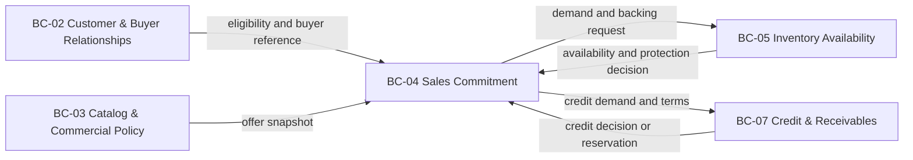
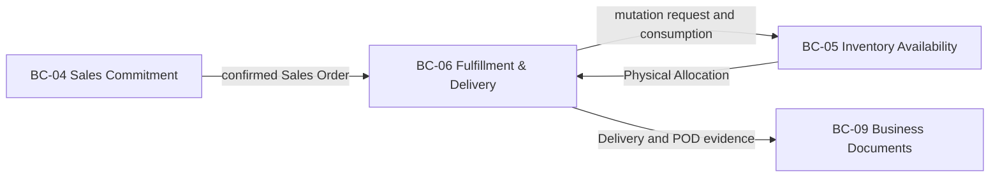
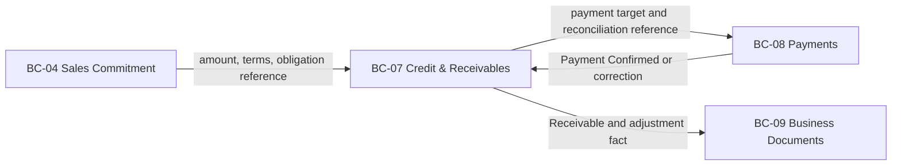
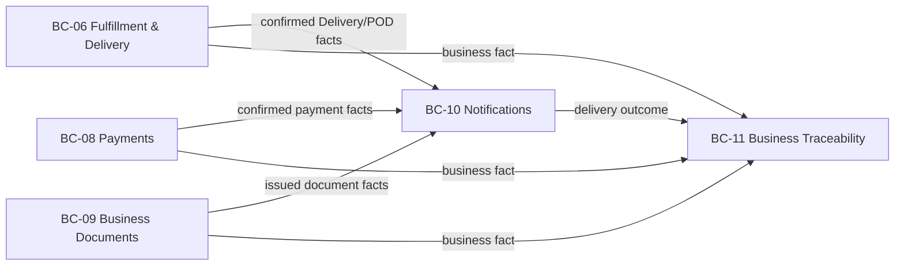
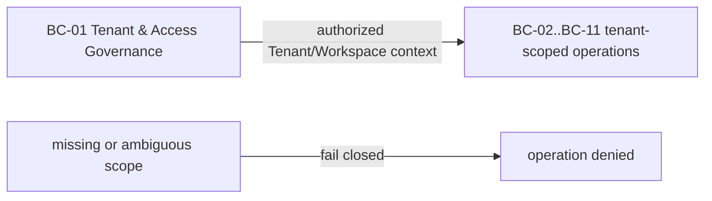

# 2.5.2 Context Mapping

El Context Map documenta autoridad, traducción y consistencia entre los once
Bounded Contexts aceptados. Los mapas son deliberadamente focalizados: muestran
contratos de colaboración y no una topología de despliegue, paquetes, schemas
PostgreSQL ni una base de datos por contexto.

## Cómo se evaluaron las relaciones

El equipo comparó cada relación desde la autoridad que produce el hecho, la
traducción que necesita el consumidor y la consistencia que exige la decisión.
Para no convertir el mapa en una lista de dependencias, se probaron alternativas
de diseño con estas preguntas:

- ¿Qué capacidad se mueve si cambia la autoridad del hecho?
- ¿Qué responsabilidad se vuelve más clara o más ambigua si el contexto se divide?
- ¿Qué invariantes se mezclan si dos contextos se fusionan?
- ¿Qué duplicación reduce una dependencia y qué duplicación sólo crea dos verdades?
- ¿Un servicio compartido mejora el modelo o sólo oculta ownership?
- ¿Aislar el Core Domain mejora la comprensión sin convertir cada frontera en un deployment?

Las respuestas se reflejan en la tabla de alternativas al final. Se conserva una
relación sólo cuando su patrón explica el contrato y su coste no transfiere
autoridad silenciosamente. Las fronteras transaccionales se mantienen síncronas
cuando una única decisión requiere consistencia inmediata; los hechos ya
confirmados se publican de forma durable para comunicación y traceability.

## Commercial Decision Map

BC-02 conserva la elegibilidad, BC-03 resuelve el offer snapshot, BC-05 decide
Inventory Backing y BC-07 decide Credit Reservation. BC-04 posee el resultado
comercial. La confirmación de PR o Direct Order puede requerir una frontera
transaccional lógica común, sin fusionar las autoridades.

## Physical Execution Map

BC-05 conserva Physical Stock, Sellable Availability y Physical Allocation;
BC-06 ejecuta picking, packing, staging, dispatch y delivery; BC-09 conserva
issued document history. La asignación o mutación física usa un contrato
explícito y no permite que Fulfillment reescriba stock.

## Financial Map

Payment Reported no es Payment Confirmed; Payment no es Receivable. BC-08
traduce el provider y verifica callbacks. BC-07 conserva Credit, Receivable y
Financial Adjustment. BC-09 emite documentos desde snapshots válidos y no
reescribe la obligación fuente.

## Communication and Traceability Map

BC-10 convierte hechos confirmados en Notification intent, delivery y retry;
BC-11 conserva una representación append-only y tenant-scoped. Ninguno muta
el lifecycle de la fuente. La entrega asíncrona usa outbox/inbox y tolera
at-least-once.

## Tenant Scope Map

BC-01 es la frontera máxima de aislamiento y no es Customer Account ni Buyer
Relationship. El contexto de Tenant/Workspace se reconstruye también en workers;
la autorización de objeto y los predicados del servidor siguen siendo
obligatorias.

## Master relationship table

| Upstream | Downstream | Relación y traducción | Interacción y consistencia |
| :--- | :--- | :--- | :--- |
| BC-01 Tenant & Access Governance | BC-02..BC-11 tenant-scoped | Tenant/Workspace y capabilities con scope fail-closed. | Síncrona cuando se autoriza una operación; scope ausente falla cerrado. |
| BC-02 Customer & Buyer Relationships | BC-03 Catalog & Commercial Policy | Eligibility y relación activa del comprador. | Consulta o decisión síncrona; no entrega autoridad de catálogo. |
| BC-02 Customer & Buyer Relationships | BC-04 Sales Commitment | Account, buyer y relación autorizada. | Síncrona para validar actor y sujeto comercial. |
| BC-03 Catalog & Commercial Policy | BC-04 Sales Commitment | Published Language con SKU, precio resuelto, términos y promoción. | Snapshot inmutable al compromiso. |
| BC-04 Sales Commitment | BC-05 Inventory Availability | Demanda y solicitud de protección. | Síncrona y atómica cuando la disponibilidad forma parte de la confirmación. |
| BC-05 Inventory Availability | BC-04 Sales Commitment | Decisión de disponibilidad y resultado de backing. | Síncrona; no comparte aggregate ni permite escritura directa de stock. |
| BC-04 Sales Commitment | BC-07 Credit & Receivables | Demanda de crédito y términos aplicables. | Síncrona para reservar crédito cuando la regla lo exige. |
| BC-07 Credit & Receivables | BC-04 Sales Commitment | Decisión de crédito, reserva o rechazo. | Resultado explícito; no se infiere desde un pago. |
| BC-04 Sales Commitment | BC-06 Fulfillment & Delivery | Sales Order confirmado. | Publicado después del commit; BC-06 ejecuta con su propia autoridad. |
| BC-05 Inventory Availability | BC-06 Fulfillment & Delivery | Physical Allocation y hechos de asignación. | Contrato de mutación explícito; la historia física no se reescribe. |
| BC-06 Fulfillment & Delivery | BC-09 Business Documents | POD y evidencia de entrega. | Publicada después del commit; BC-09 emite su documento. |
| BC-07 Credit & Receivables | BC-08 Payments | Payment target y referencia de conciliación. | Entrada síncrona para iniciar o identificar el pago. |
| BC-08 Payments | BC-07 Credit & Receivables | Payment confirmado, rechazado, reembolsado o corregido. | Después del commit, con ACL del provider y deduplicación. |
| Contextos fuente | BC-10 Notifications | Hechos confirmados convertidos en Notification intent. | Asíncrona, al menos una vez; no muta la fuente. |
| Contextos fuente | BC-11 Business Traceability | Hechos durables para timeline append-only y replay. | Asíncrona, al menos una vez; conserva el contexto propietario. |
| BC-10 Notifications | BC-11 Business Traceability | Evidencia de entrega, fallo y retry. | Asíncrona; no reemplaza el hecho de negocio originador. |

## Patrones y frontera transaccional

| Situación | Patrón adoptado | Responsabilidad |
| :--- | :--- | :--- |
| BC-01 hacia contextos tenant-scoped | Upstream Authorization Context + fail-closed ACL | BC-01 entrega Tenant/Workspace scope, membership y capability decision verificados; la autorización es inmediata y las proyecciones stale no pueden otorgar autoridad. |
| BC-02/03 hacia BC-04 | Customer/Supplier + Published Language | Se reciben referencias y snapshots, no entidades persistentes. |
| BC-04/05/07 durante confirmación | Contrato síncrono de consistencia | Commitment, inventory backing y credit aplicable se deciden dentro de una frontera lógica. |
| BC-04/05 hacia BC-06 | Published facts y contratos de mutación | BC-06 ejecuta fulfillment; BC-05 conserva autoridad física. |
| Provider externo hacia BC propietario | Anti-Corruption Layer | DTOs y estados externos se traducen a lenguaje Nexa. |
| Contextos fuente hacia BC-10/11 | Published Language | Consumidores reciben hechos confirmados y toleran entrega al menos una vez. |

No se adopta Shared Kernel entre los once contextos. Conformist tampoco se
deduce porque un contrato actual sea cómodo de reutilizar; se requiere una
decisión explícita sobre traducción y ACL.

La confirmación de una Purchase Request o Direct Order puede requerir una única
transacción lógica de PostgreSQL para compromiso comercial, protección completa
de inventario y reserva de crédito aplicable. La secuencia es `estado fuente +
outbox durable`; los consumidores usan deduplicación/inbox cuando corresponde.
No se afirma exactamente una vez.

## Alternativas evaluadas

| Alternativa | Ventaja potencial | Coste semántico y de consistencia | Decisión |
| :--- | :--- | :--- | :--- |
| Fusionar Sales Commitment e Inventory Availability | Menos coordinación durante la confirmación. | Mezcla intención comercial con verdad física y dificulta shortage, reserva y corrección. | Rechazada; se mantienen BC-04 y BC-05. |
| Fusionar Inventory Availability y Fulfillment & Delivery | Flujo operativo aparentemente lineal. | Oculta el límite entre disponibilidad, asignación y ejecución física. | Rechazada; se mantienen BC-05 y BC-06. |
| Fusionar Fulfillment & Delivery en una abstracción de Delivery | Modelo simple para una UI inicial. | Pierde preparación, picking, staging, handoff y continuation como responsabilidades distintas. | Rechazada; BC-06 conserva el lenguaje explícito. |
| Fusionar Credit & Receivables y Payments como Finance | Un único lugar para estados monetarios. | Confunde obligación con resultado de provider y complica idempotencia y reconciliación. | Rechazada; se mantienen BC-07 y BC-08. |
| Fusionar Notifications y Business Traceability | Menos consumidores de eventos. | Confunde delivery operativo con timeline durable y replayable. | Rechazada; se mantienen BC-10 y BC-11. |
| Colocar Business Documents dentro de Sales Commitment o Payments | Menos contextos visibles. | Documento emitido, POD y evidencia tienen lifecycle y autoridad propios. | Rechazada; se mantiene BC-09. |
| Fusionar Tenant & Access Governance con Customer & Buyer Relationships | Onboarding más corto en pantalla. | Confunde aislamiento y autorización con relación comercial. | Rechazada; se mantienen BC-01 y BC-02. |

Estas alternativas no implican microservicios. La decisión aceptada sigue siendo
un sistema Nexa, un Spring Boot modular monolith y PostgreSQL físicamente
compartido con ownership lógico por contexto.
