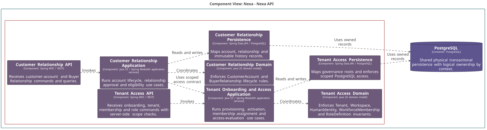
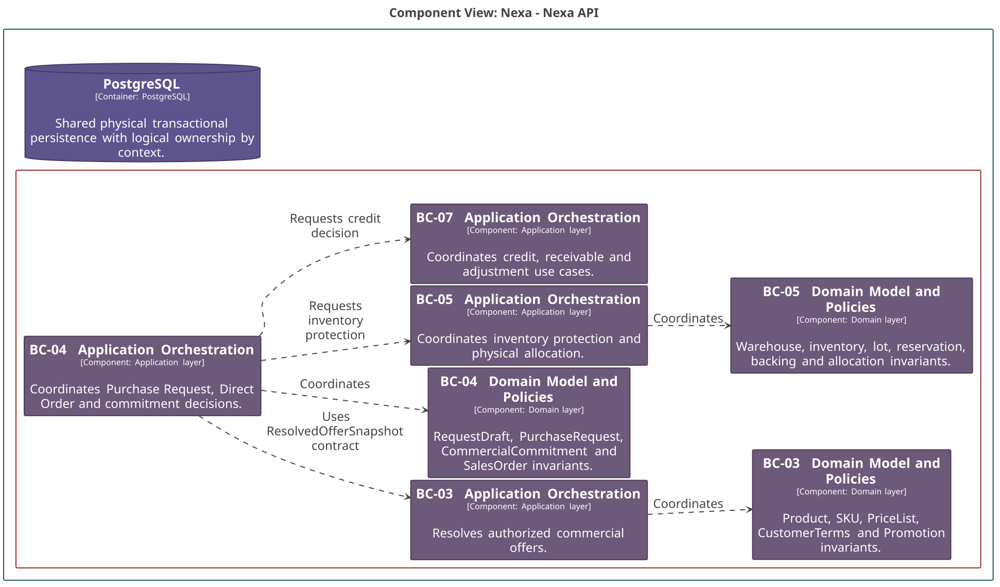
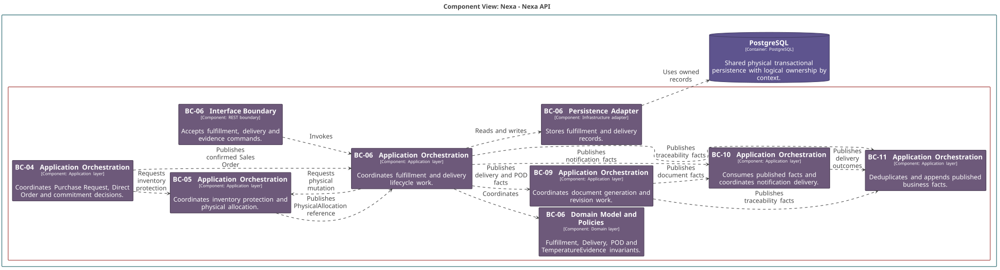
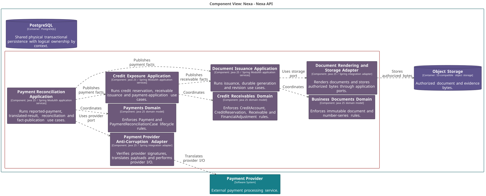

### 2.5.3. Software Architecture

La arquitectura se expresa con C4 y una fuente reproducible en
[Structurizr DSL](../../assets/chapter-2/c4/src/workspace.dsl). Nexa conserva
una API modular como autoridad de negocio. Un Bounded Context delimita lenguaje
y responsabilidad; no equivale a un container C4, paquete, schema ni unidad de
despliegue.

#### Vistas C4

*Conjunto de vistas que describe el sistema y sus fronteras.*

| Vista | Alcance | Lectura |
| :--- | :--- | :--- |
| L1 System Context | Nexa, actores y dependencias externas. | Límite del sistema y relaciones externas. |
| L2 Container | Superficies, API y almacenamiento. | Unidades ejecutables o de almacenamiento. |
| L3 Component | Capas colaborativas dentro de Nexa API. | Responsabilidades, contratos y adaptadores. |
| Deployment | Nodos lógicos de ejecución y datos. | Topología sin convertir contextos en nodos. |

#### Decisiones de arquitectura

- Nexa API mantiene la autoridad de negocio, autorización, transacciones e
  idempotencia.
- PostgreSQL se comparte físicamente; cada contexto conserva ownership lógico
  y alcance explícito de Tenant/Workspace.
- Object Storage se accede mediante ports/adapters y referencias autorizadas.
- Website, Platform, Buyer Portal, Operations Mobile y Buyer Mobile son
  superficies de producto, no Bounded Contexts. Las dos superficies Mobile son
  proyecciones aceptadas para planificación; no prueban un cliente implementado.
- Los componentes C4 muestran responsabilidades arquitectónicas y tecnología,
  no paquetes ni clases Java.

Las vistas son modelos de arquitectura. No demuestran por sí mismas runtime,
integraciones ejecutadas, autorización efectiva o preparación de producción.

#### Familias de componentes

*Cortes de componentes dentro del mismo Nexa API modular.*

| Familia | Bounded Contexts | Responsabilidad visible |
| :--- | :--- | :--- |
| Identity, Tenant & Customer | BC-01, BC-02 | Alcance, identidad, Customer Account y Buyer Relationship. |
| Commercial & Inventory | BC-03, BC-04, BC-05, BC-07 | Oferta resuelta, compromiso, protección de inventario y decisión de crédito. |
| Fulfillment & Delivery | BC-04, BC-05, BC-06 | Orden confirmada, Physical Allocation y ejecución de entrega. |
| Credit, Payment & Documents | BC-07, BC-08, BC-09 | Obligación, pago traducido, documento y referencias de almacenamiento. |

*Componentes C4: Identity, Tenant & Customer.*

*Nota. Elaboración propia.*

*Componentes C4: Commercial & Inventory.*

*Nota. Elaboración propia.*

*Componentes C4: Fulfillment & Delivery.*

*Nota. Elaboración propia.*

*Componentes C4: Credit, Payment & Documents.*

*Nota. Elaboración propia.*

#### Cobertura L3 por Bounded Context

*Vistas de componentes que mantienen una frontera explícita por contexto.*

| Bounded Context | Vista C4 L3 |
| :--- | :--- |
| BC-01 Tenant & Access Governance | [Vista BC-01](../../assets/chapter-2/c4/Nexa-API-BC-01-TenantAccessGovernance.svg) |
| BC-02 Customer & Buyer Relationships | [Vista BC-02](../../assets/chapter-2/c4/Nexa-API-BC-02-CustomerBuyerRelationships.svg) |
| BC-03 Catalog & Commercial Policy | [Vista BC-03](../../assets/chapter-2/c4/Nexa-API-BC-03-CatalogCommercialPolicy.svg) |
| BC-04 Sales Commitment | [Vista BC-04](../../assets/chapter-2/c4/Nexa-API-BC-04-SalesCommitment.svg) |
| BC-05 Inventory Availability | [Vista BC-05](../../assets/chapter-2/c4/Nexa-API-BC-05-InventoryAvailability.svg) |
| BC-06 Fulfillment & Delivery | [Vista BC-06](../../assets/chapter-2/c4/Nexa-API-BC-06-FulfillmentDelivery.svg) |
| BC-07 Credit & Receivables | [Vista BC-07](../../assets/chapter-2/c4/Nexa-API-BC-07-CreditReceivables.svg) |
| BC-08 Payments | [Vista BC-08](../../assets/chapter-2/c4/Nexa-API-BC-08-Payments.svg) |
| BC-09 Business Documents | [Vista BC-09](../../assets/chapter-2/c4/Nexa-API-BC-09-BusinessDocuments.svg) |
| BC-10 Notifications | [Vista BC-10](../../assets/chapter-2/c4/Nexa-API-BC-10-Notifications.svg) |
| BC-11 Business Traceability | [Vista BC-11](../../assets/chapter-2/c4/Nexa-API-BC-11-BusinessTraceability.svg) |

Cada vista conserva Interface como borde de entrada y salida, Application como
orquestación, Domain como reglas puras e Infrastructure como persistencia o
I/O. Los contratos entre contextos se alinean con el Context Map; una flecha no
crea propiedad de objetos ajenos.
