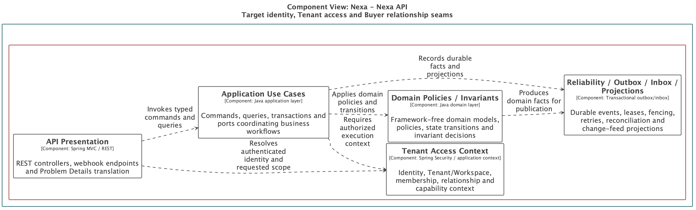
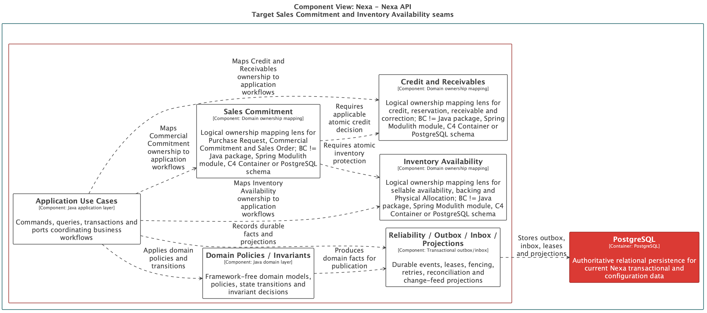
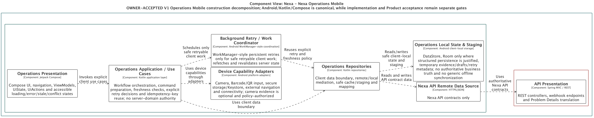
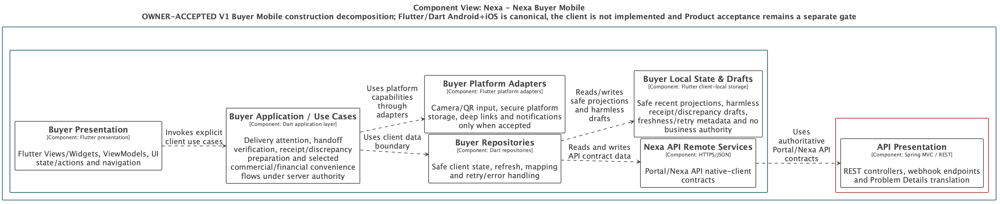

### 2.5.3. Software Architecture

La arquitectura estratégica se expresa mediante C4 y Structurizr. Nexa es una
plataforma B2B SaaS multi-tenant con una API que conserva la autoridad de
negocio. Los Bounded Contexts delimitan lenguaje y responsabilidad; no se
convierten automáticamente en containers, procesos ni unidades de despliegue.

#### Organización de la vista C4

*Organización de las vistas C4 de la arquitectura de Nexa.*
| Vista | Propósito | Lectura académica |
| --- | --- | --- |
| 2.5.3.1 Context | Mostrar Nexa, actores y sistemas externos abstractos. | Define el límite del sistema y sus relaciones. |
| 2.5.3.2 Container | Mostrar superficies, API y stores del sistema. | Distingue superficies de producto, API y almacenamiento. |
| Componentes de arquitectura de software | Mostrar cortes selectivos dentro de Nexa API y clientes. | Los componentes son lentes de diseño, no inventario de paquetes o clases. |
| 2.5.3.3 Deployment | Mostrar nodos y relaciones de runtime. | Explica una topología provider-neutral. |

El orden visible de la arquitectura es Context, Container y Deployment. Las
familias de componentes complementan esas vistas sin reemplazar el Context Map
ni el diseño táctico.

#### Decisiones de arquitectura

- Nexa conserva una API modular con Java 25, Spring Boot 4.1.x y Spring
  Modulith como línea base técnica.
- PostgreSQL se comparte físicamente, con ownership lógico por contexto y
  alcance explícito de Tenant/Workspace.
- Object Storage se delimita mediante ports/adapters y referencias autorizadas.
- Website, Platform, Buyer Portal, Operations Mobile y Buyer Mobile son
  superficies o containers del sistema; no son Bounded Contexts.
- No se incorporan brokers, una segunda base de datos, Kubernetes,
  microservicios ni transacciones distribuidas sin una necesidad demostrada.

#### Alcance de los diagramas

Los exports C4 presentan el diseño académico y las decisiones de frontera. Una
imagen por sí sola no acredita build, integración ejecutada, runtime,
autorización, aceptación de producto ni preparación de producción. Operations
Mobile y Buyer Mobile son clientes planificados; el framework y su ejecución
requieren evidencia propia cuando existan.

#### Software Architecture Components

Los componentes muestran cortes selectivos de Nexa API o de sus superficies
cliente. No son Bounded Contexts y no alteran la autoridad de los once
contextos.

##### Familias de componentes del API

*Familias de componentes del Nexa API y sus límites estratégicos.*
| Familia C4 | Responsabilidades de diseño | Límite estratégico |
| --- | --- | --- |
| Identity, Tenant & Customer | Identity, tenant/workspace, customer y buyer relationship adapters. | Sirve BC-01 y BC-02 sin fusionar autoridades. |
| Commercial & Inventory | Catálogo/política, Commercial Commitment y la cadena Inventory Reservation → Warehouse Backing → Physical Allocation. | Proyecta BC-03/04/05 sin convertir cada módulo en container; la reserva, el respaldo por Warehouse y la selección física siguen siendo hechos distintos. |
| Fulfillment & Delivery | Fulfillment, dispatch, handoff, delivery y continuidad. | Sirve BC-06 y conserva delivery outcome/POD separados. |
| Credit, Payment & Documents | Crédito/receivables, pagos, documentos y provider ACL. | Sirve BC-07/08/09 sin crear un Finance context genérico. |
| Integration Reliability | Outbox, inbox/deduplication, retries y publicación de hechos. | Soporta BC-10/11 sin ser un nuevo Bounded Context. |

##### Vistas L3 seleccionadas

**Propósito.** Mostrar cómo el API modular proyecta capacidades colaborativas sin
convertir cada familia en una unidad de despliegue independiente.

*Vista C4 L3 TARGET — Identity, Tenant & Customer.*

*Nota.* Exportación Structurizr de una familia de componentes del Nexa API; no
equivale a la fusión de BC-01 y BC-02.

*Vista C4 L3 TARGET — Commercial & Inventory.*

*Nota.* Exportación Structurizr de responsabilidades colaborativas de BC-03,
BC-04 y BC-05; no los convierte en containers separados.

*Vista C4 L3 TARGET — Fulfillment & Delivery.*

*Nota.* Exportación Structurizr del corte de diseño que sirve BC-06 dentro del
Nexa API modular.

*Vista C4 L3 TARGET — Credit, Payment & Documents.*

*Nota.* Exportación Structurizr de responsabilidades relacionadas, sin crear un
contexto financiero genérico ni una unidad de despliegue nueva.

Las familias muestran responsabilidades colaborativas. La autorización, las
transacciones e idempotencia siguen perteneciendo a las decisiones y contratos
del contexto propietario.

##### Cobertura L3 por Bounded Context

Las familias anteriores son vistas de orientación. La cobertura académica L3 se
realiza con una vista específica por cada Bounded Context dentro del mismo Nexa
API modular; ninguna vista convierte un contexto en container o deployment
independiente.

Las once vistas específicas se incluyen como exports de diseño TARGET dentro
del informe. Esta Wave sincroniza las etiquetas afectadas con la semántica
revisada; el DSL canónico que origina esos exports vive en Blueprint y no se
modifica desde la rama propietaria de este informe. Por ello, el asset es
evidencia de diseño documental, no una ejecución Structurizr ni una prueba de
implementación.

*Cobertura de las vistas C4 L3 TARGET por Bounded Context.*
| Bounded Context | Vista C4 L3 TARGET |
| --- | --- |
| BC-01 Tenant & Access Governance | [Vista Structurizr BC-01](../../assets/chapter-2/c4/Nexa-API-BC-01-TenantAccessGovernance-TARGET-dark.svg) |
| BC-02 Customer & Buyer Relationships | [Vista Structurizr BC-02](../../assets/chapter-2/c4/Nexa-API-BC-02-CustomerBuyerRelationships-TARGET-dark.svg) |
| BC-03 Catalog & Commercial Policy | [Vista Structurizr BC-03](../../assets/chapter-2/c4/Nexa-API-BC-03-CatalogCommercialPolicy-TARGET-dark.svg) |
| BC-04 Sales Commitment | [Vista Structurizr BC-04](../../assets/chapter-2/c4/Nexa-API-BC-04-SalesCommitment-TARGET-dark.svg) |
| BC-05 Inventory Availability | [Vista Structurizr BC-05](../../assets/chapter-2/c4/Nexa-API-BC-05-InventoryAvailability-TARGET-dark.svg) |
| BC-06 Fulfillment & Delivery | [Vista Structurizr BC-06](../../assets/chapter-2/c4/Nexa-API-BC-06-FulfillmentDelivery-TARGET-dark.svg) |
| BC-07 Credit & Receivables | [Vista Structurizr BC-07](../../assets/chapter-2/c4/Nexa-API-BC-07-CreditReceivables-TARGET-dark.svg) |
| BC-08 Payments | [Vista Structurizr BC-08](../../assets/chapter-2/c4/Nexa-API-BC-08-Payments-TARGET-dark.svg) |
| BC-09 Business Documents | [Vista Structurizr BC-09](../../assets/chapter-2/c4/Nexa-API-BC-09-BusinessDocuments-TARGET-dark.svg) |
| BC-10 Notifications | [Vista Structurizr BC-10](../../assets/chapter-2/c4/Nexa-API-BC-10-Notifications-TARGET-dark.svg) |
| BC-11 Business Traceability | [Vista Structurizr BC-11](../../assets/chapter-2/c4/Nexa-API-BC-11-BusinessTraceability-TARGET-dark.svg) |

##### Proyecciones de cliente

*Proyecciones de cliente y componentes de lectura.*
| Proyección | Componentes de lectura | Regla de autoridad |
| --- | --- | --- |
| Operations Mobile | Session/context client, work projection, command/retry coordinator, evidence staging. | Mutaciones autorizadas por Nexa API; recursos del dispositivo requieren permiso y fallback. |
| Buyer Mobile | Session/context client, delivery projection, handoff/receipt flow, discrepancy evidence. | Receipt, discrepancy y confirmaciones siguen siendo hechos autorizados por el servidor. |

*Vista C4 L3 TARGET — Operations Mobile.*

*Nota.* Exportación Structurizr de una proyección móvil planificada; no prueba
una aplicación móvil implementada ni selecciona un framework.

*Vista C4 L3 TARGET — Buyer Mobile.*

*Nota.* Exportación Structurizr de una proyección móvil planificada; la API
mantiene la autoridad sobre los hechos y las decisiones de negocio.

Las proyecciones consumen contratos de Nexa API; no crean autoridad local de
Tenant, inventario, compromiso, entrega, pago o receipt.
