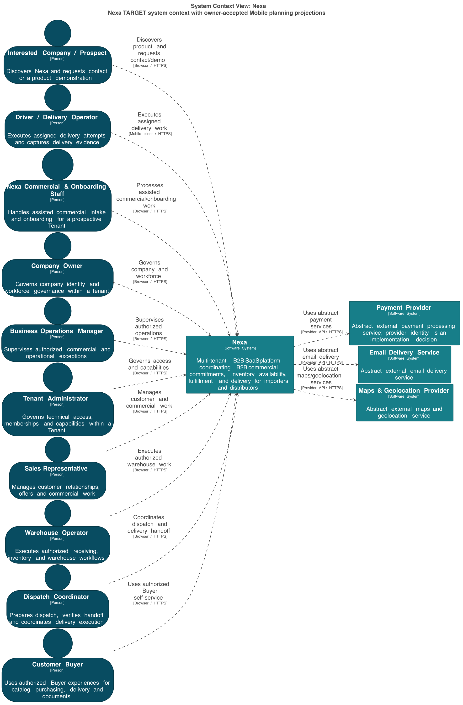

#### 2.5.3.1. Software Architecture Context Level Diagrams

El Context Diagram presenta a Nexa como plataforma B2B SaaS multi-tenant. La
vista L1 muestra sistema, actores y dependencias externas; no representa bases
de datos, frameworks, módulos internos ni Bounded Contexts.

##### Actores principales

| Actor | Interacción con Nexa |
| --- | --- |
| Interested Company / Prospect | Descubre Nexa y solicita una relación comercial. |
| Nexa Commercial & Onboarding Staff | Atiende onboarding, elegibilidad y relación inicial. |
| Company Owner | Administra la compañía y su relación con Nexa. |
| Business Operations Manager | Supervisa operación, fulfillment y entrega. |
| Tenant Administrator | Administra usuarios, membresías y capacidades del tenant. |
| Sales Representative | Prepara, revisa y confirma compromisos comerciales. |
| Warehouse Operator | Ejecuta disponibilidad, picking, packing y staging. |
| Dispatch Coordinator | Coordina salida y continuidad de entregas. |
| Driver / Delivery Operator | Ejecuta handoff, intentos y evidencia de entrega. |
| Customer Buyer | Solicita, acepta y recibe compromisos del comprador B2B. |

Operations Mobile y Buyer Mobile son superficies de interacción para esos
actores. No son actores nuevos ni Bounded Contexts.

##### Sistemas externos abstractos

| Sistema externo | Uso previsto |
| --- | --- |
| Payment Provider | Intentos, confirmaciones, rechazos y reembolsos de pago. |
| Email Delivery Service | Entrega de notificaciones por email. |
| Maps & Geolocation Provider | Navegación autorizada y geolocalización puntual. |

Los proveedores concretos se mantienen abiertos hasta contar con una selección
y evidencia reproducible.

##### Export seleccionado

La imagen representa la vista L1 exportada desde la fuente semántica C4. Sirve
para estudiar relaciones y fronteras de Nexa; no acredita un cliente nativo,
runtime, aceptación de producto ni preparación de producción.
