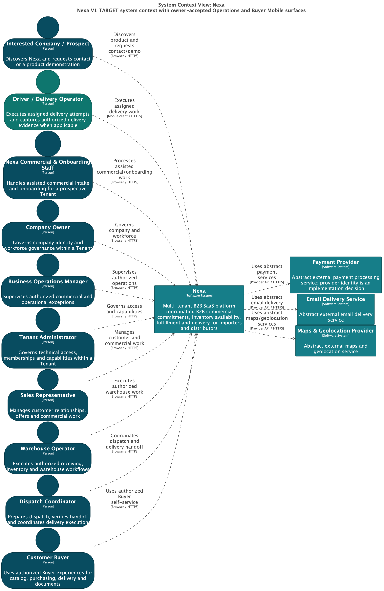

# 2.5.3.1 Software Architecture Context-Level Diagrams

El Context Diagram muestra a Nexa como una plataforma B2B SaaS multi-tenant.
La vista L1 no muestra bases de datos, frameworks, módulos ni Bounded
Contexts: muestra el sistema, sus actores y sus dependencias externas.

## Actores principales

| Actor | Interacción con Nexa |
| :--- | :--- |
| Interested Company / Prospect | Descubre Nexa y solicita una relación comercial |
| Nexa Commercial & Onboarding Staff | Atiende onboarding, elegibilidad y relación inicial |
| Company Owner | Administra la compañía y su relación con Nexa |
| Business Operations Manager | Supervisa operación, fulfillment y entrega |
| Tenant Administrator | Administra usuarios, membresías y capacidades del tenant |
| Sales Representative | Prepara, revisa y confirma compromisos comerciales |
| Warehouse Operator | Ejecuta disponibilidad, picking, packing y staging |
| Dispatch Coordinator | Coordina la salida y continuidad de entregas |
| Driver / Delivery Operator | Ejecuta handoff, intentos y evidencia de entrega |
| Customer Buyer | Solicita, acepta y recibe compromisos del comprador B2B |

Operations Mobile y Buyer Mobile son superficies de interacción para estos
actores en la proyección V1; no aparecen como nuevos actores ni como BCs.

## Sistemas externos abstractos

| Sistema externo | Uso previsto |
| :--- | :--- |
| Payment Provider | Intentos, confirmaciones, rechazos y reembolsos de pago |
| Email Delivery Service | Entrega de notificaciones de email |
| Maps & Geolocation Provider | Apertura autorizada de navegación y geolocalización puntual |

No se fija proveedor concreto ni se afirma una integración implementada por la
sola presencia de una dependencia abstracta.

## Export seleccionado

La imagen es la vista L1 V1 TARGET exportada desde la fuente semántica C4. El
sistema sigue siendo un solo Nexa; las dos superficies móviles permanecen
`TARGET / PLANNED / PROPOSED`. SVG, hash y fecha observada están en el
[Chapter 2 provenance register](../../../assets/chapter-2/provenance.md).

La imagen demuestra la selección y lectura de la vista arquitectónica. No
demuestra cliente nativo, runtime, aceptación de producto o preparación para
producción.
