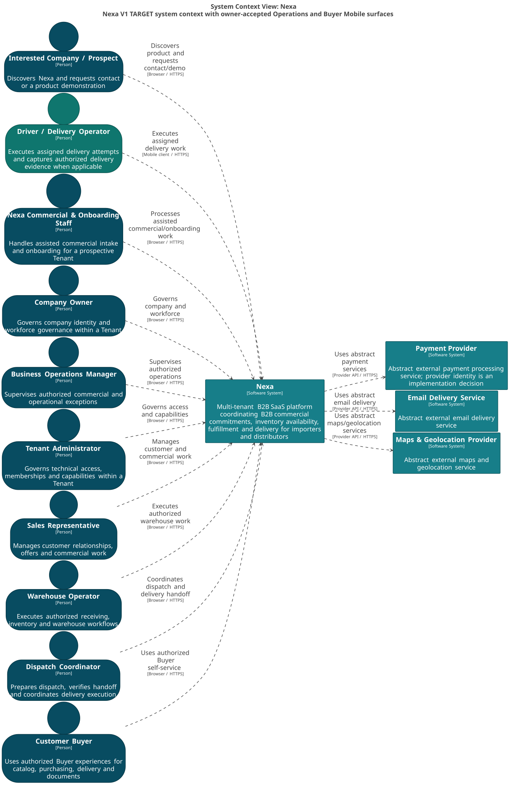

#### 2.5.3.1. Software Architecture Context Level Diagrams

La vista L1 sitúa Nexa, sus actores y sistemas externos. No muestra bases de
datos, frameworks, paquetes ni Bounded Contexts.

##### Actores principales

*Actores que interactúan con Nexa en la vista C4 L1.*

| Actor | Interacción |
| :--- | :--- |
| Interested Company Representative | Solicita una relación organizacional con Nexa. |
| Nexa Onboarding Staff | Evalúa y aprueba onboarding. |
| Tenant Workforce | Agrupa Company Owner, Tenant Administrator, ventas, warehouse, despacho y entrega. |
| Customer Buyer | Solicita y recibe compromisos B2B. |

##### Sistemas externos

*Dependencias externas representadas sin elegir un proveedor concreto.*

| Sistema | Relación con Nexa |
| :--- | :--- |
| Payment Provider | Resultado y procesamiento externo de pagos. |
| Email Delivery Service | Entrega de comunicaciones por email. |
| Maps & Geolocation Provider | Navegación y geolocalización autorizada. |

`Push Delivery Service` permanece Future/OPEN: no integra el L1 TARGET V1 ni
autoriza proveedor o canal push.

*Vista C4 L1: contexto del sistema Nexa.*

*Nota. Export canónico generado desde Blueprint Wave 3.*
