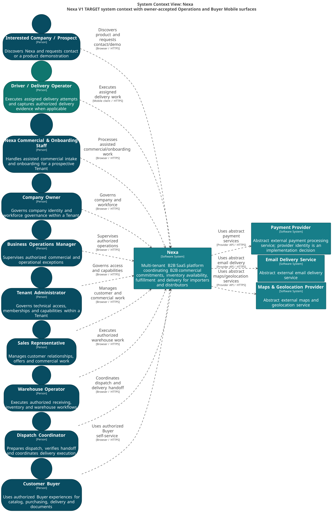

#### 2.5.3.1. Software Architecture Context Level Diagrams

La vista L1 sitúa Nexa, sus actores y sistemas externos. No muestra bases de
datos, frameworks, paquetes ni Bounded Contexts.

##### Actores principales

*Actores que interactúan con Nexa en la vista C4 L1.*

| Actor | Interacción |
| :--- | :--- |
| Interested Company / Prospect | Consulta la propuesta e inicia una relación organizacional con Nexa. |
| Nexa Commercial & Onboarding Staff | Evalúa y coordina el onboarding. |
| Company Owner | Comprende y supervisa el trabajo de su empresa dentro del alcance autorizado. |
| Business Operations Manager | Coordina excepciones y su seguimiento sin sustituir la autoridad del proceso responsable. |
| Tenant Administrator | Administra acceso y organización dentro de su autoridad. |
| Sales Representative | Gestiona el trabajo comercial autorizado con clientes. |
| Warehouse Operator | Registra recepción, preparación y hechos físicos de almacén. |
| Dispatch Coordinator | Coordina preparación, salida y handoff de despacho. |
| Driver / Delivery Operator | Ejecuta entregas asignadas y registra resultados y evidencia. |
| Customer Buyer | Solicita compromisos B2B y registra su recepción. |

Los actores internos pueden agruparse como Tenant Workforce para una lectura resumida, conservando sus responsabilidades y permisos diferenciados. La presencia de Driver en el contexto del sistema no acredita la aceptación de su recorrido Mobile.

##### Sistemas externos

*Dependencias externas representadas sin elegir un proveedor concreto.*

| Sistema | Relación con Nexa |
| :--- | :--- |
| Payment Provider | Resultado y procesamiento externo de pagos. |
| Email Delivery Service | Entrega de comunicaciones por email. |
| Maps & Geolocation Provider | Navegación y geolocalización autorizada. |

`Push Delivery Service` permanece Future/OPEN: no integra el L1 TARGET V1 ni
autoriza proveedor o canal push.

*Vista C4 L1: contexto del sistema Nexa.*

*Nota. Export canónico generado desde Blueprint Wave 3.*
