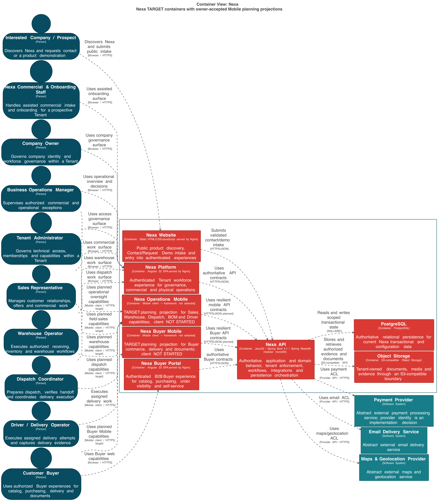

# 2.5.3.2 Software Architecture Container-Level Diagrams

El Container Diagram separa las superficies, la autoridad del API y los
stores. Un container C4 es una unidad ejecutable o almacenable dentro del
sistema; no equivale a un Bounded Context.

## Base AS-IS observada

| Elemento C4 | Fuente observada | Límite de evidencia |
| :--- | :--- | :--- |
| Nexa Website | Superficie pública presente en el conjunto Nexa. | No se afirma runtime ni despliegue. |
| Nexa Platform | Superficie de operación del workforce presente en el conjunto Nexa. | No se afirma runtime ni despliegue. |
| Nexa Buyer Portal | Superficie de autoservicio B2B presente en el conjunto Nexa. | No se afirma runtime ni despliegue. |
| Nexa API | Código y configuración modernos: autoridad de dominio, seguridad, workflows, integraciones y persistencia. | El código no prueba una instancia ejecutándose. |
| PostgreSQL | Dependencia y configuración local del API para persistencia transaccional. | No se afirma una base o datos runtime. |
| Object Storage | Configuración local y límite de adapter para documentos y media. | No se afirma proveedor ni bucket ejecutado. |

## Containers TARGET

El diseño TARGET agrega dos clientes planificados al conjunto anterior:

| Container | Estado y límite |
| :--- | :--- |
| Operations Mobile | `TARGET / PLANNED / PROPOSED`; consume contratos del API y no autoriza negocio |
| Buyer Mobile | `TARGET / PLANNED / PROPOSED`; proyecta el flujo del comprador y no es fuente de receipt/discrepancy |

No se agrega un backend Mobile separado. La autoridad transaccional, la
autorización, la idempotencia y los hechos confirmados permanecen en Nexa API.

## Tecnología y comunicación

| Elemento | Línea base | Contrato de frontera |
| :--- | :--- | :--- |
| Nexa API | `AS-IS source`: Java 25, Spring Boot 4.1.x, Spring Modulith | REST/OpenAPI, autorización, transacciones e integraciones |
| PostgreSQL | `AS-IS configuration / TARGET`: PostgreSQL compartido | Predicados y ownership lógico por Tenant/Workspace y contexto |
| Object Storage | `AS-IS configuration / TARGET`: S3-compatible | Ports/adapters y referencias autorizadas; no URL pública implícita |
| Website, Platform y Buyer Portal | Superficies de producto observadas | Consumen el API por diseño; no se afirma runtime ni autoridad duplicada |
| Operations Mobile y Buyer Mobile | Framework abierto bajo la decisión vigente | Clientes planificados; estado local no autoritativo |

Payment Provider, Email Delivery Service y Maps & Geolocation Provider
permanecen abstractos hasta que exista proveedor y prueba reproducible.

## Export seleccionado

La vista conserva seis elementos de base AS-IS/configuración y añade únicamente
los dos clientes móviles TARGET. La imagen se interpreta como export de
diseño desde la fuente semántica C4 y no como evidencia de ejecución.

La lectura C4 no afirma runtime Mobile, contrato API aceptado ni preparación
para producción.
