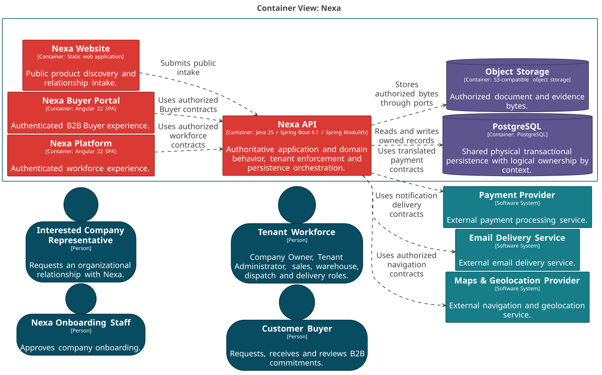

#### 2.5.3.2. Software Architecture Container Level Diagrams

La vista L2 separa superficies de producto, API y almacenamiento. Un container
C4 es una unidad ejecutable o de almacenamiento; no es un Bounded Context ni
un microservicio implícito.

##### Containers de Nexa

*Containers C4 y sus límites de responsabilidad.*

| Container | Responsabilidad | Límite |
| :--- | :--- | :--- |
| Nexa Website | Descubrimiento público e intake inicial. | No autoriza decisiones de negocio. |
| Nexa Platform | Experiencia del workforce autenticado. | Consume contratos autorizados del API. |
| Nexa Buyer Portal | Autoservicio B2B del Buyer. | Consume contratos autorizados del API. |
| Operations Mobile | Experiencia de campo para warehouse, despacho y entrega. | Consume contratos autorizados; conserva sólo estado local no autoritativo permitido. |
| Buyer Mobile | Experiencia móvil del Buyer para compra, seguimiento, recepción, discrepancia y tareas autorizadas. | Consume contratos autorizados; no duplica reglas ni autoridad de negocio. |
| Nexa API | Dominio, seguridad, orquestación y contratos. | Conserva la autoridad de negocio. |
| PostgreSQL | Persistencia transaccional física compartida. | Ownership lógico por contexto y Tenant/Workspace. |
| Object Storage | Bytes de documentos y evidencia. | Referencias y acceso autorizados. |

##### Tecnología y comunicación

*Línea base técnica y contratos de frontera.*

| Elemento | Tecnología | Contrato |
| :--- | :--- | :--- |
| Nexa API | Java 25, Spring Boot 4.1.x y Spring Modulith. | REST/OpenAPI, autorización y transacciones. |
| PostgreSQL | PostgreSQL compartido. | Predicados de Tenant/Workspace y ownership lógico. |
| Object Storage | S3-compatible. | Ports/adapters y referencias autorizadas. |
| Website, Platform y Buyer Portal | Aplicaciones web. | Sin autoridad de negocio duplicada. |
| Operations Mobile y Buyer Mobile | Mobile client; Android/Kotlin nativo y Flutter/Dart cross-platform son tracks evaluados, sin asignación uno-a-uno. | HTTPS contra contratos autorizados; revalidación servidor de identidad, Tenant/Workspace y Buyer Relationship según flujo. |

*Vista C4 L2: containers de Nexa.*

*Nota. Elaboración propia.*
