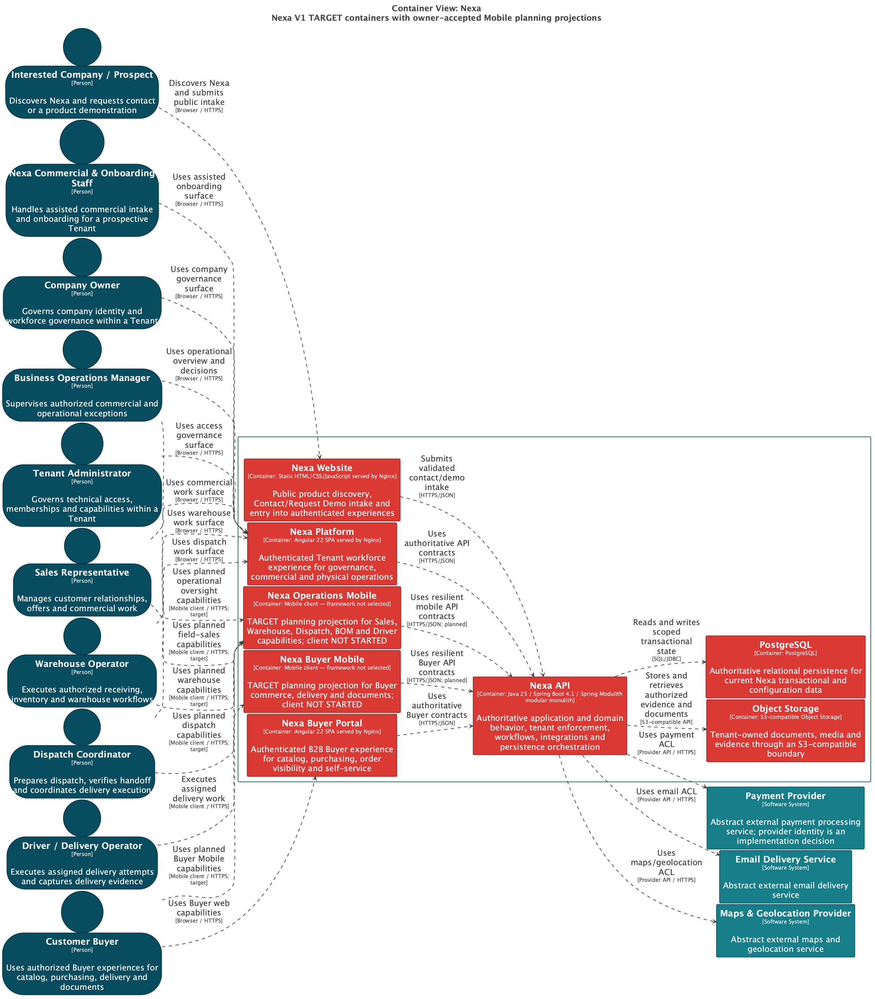

# 2.5.3.2 Software Architecture Container-Level Diagrams

El Container Diagram deberá representar los elementos ejecutables o almacenes
que componen Nexa:

| Container | Responsabilidad |
| --- | --- |
| Nexa Website | Descubrimiento público, contacto e ingreso. |
| Nexa Platform | Operación del workforce interno. |
| Nexa Buyer Portal | Autoservicio del comprador B2B. |
| Nexa API | Autoridad de dominio, seguridad, workflows, integraciones y persistencia. |
| PostgreSQL | Persistencia transaccional y configuración lógicamente aislada. |
| Object Storage | Bytes de documentos y media asociados a la operación. |

Operations Mobile y Buyer Mobile son containers V1 TARGET / PLANNED / PROPOSED.
Son clientes planificados para V1, no capacidades implementadas, y no se
separan en backends propios. El modular monolith del API mantiene la autoridad
transaccional y las superficies consumen sus contratos.

## Línea base tecnológica y de comunicación

| Container | Evidencia tecnológica u objetivo | Comunicación y límite |
| :--- | :--- | :--- |
| Nexa Website | Hay código HTML5/CSS3/vanilla JavaScript disponible | Descubrimiento y contacto públicos; sin autoridad Mobile |
| Nexa Platform | Superficie de producto existente; la versión debe citarse desde su repositorio | Workflows del workforce interno mediante contratos del API |
| Nexa Buyer Portal | Superficie de producto existente; la versión debe citarse desde su repositorio | Relación autorizada con el comprador mediante contratos del API |
| Nexa API | Línea base candidata Java 25, Spring Boot 4.1 y Spring Modulith | Contratos REST, autorización, transacciones e integraciones |
| PostgreSQL | Persistencia relacional compartida | Ownership lógico por contexto y acceso con alcance de tenant |
| Object Storage | Almacenamiento objetivo de bytes de documentos y evidencias | Referencias autorizadas; no se asume URL pública |
| Operations Mobile | Cliente objetivo; framework abierto bajo SPIKE-002 | Consume el API; el estado local no es autoritativo |
| Buyer Mobile | Cliente objetivo; framework abierto bajo SPIKE-002 | Consume el API; receipt/discrepancy siguen autorizados por servidor |

Payment Provider, Email Delivery Service y Maps & Geolocation Provider
permanecen abstractos hasta seleccionar y demostrar un proveedor.

## Estado de evidencia

### Export seleccionado

**Nota.** La vista L2 conserva un Nexa API modular y PostgreSQL/Object Storage
compartidos. Operations Mobile y Buyer Mobile aparecen como containers V1
TARGET planificados; no se presentan como implementación. La fuente, hash y
fecha del export están en el [registro de provenance](../../../assets/chapter-2/provenance.md).

La clasificación tecnológica de cada container sigue siendo `TARGET` salvo
cuando la tabla anterior marca evidencia AS-IS. Runtime Mobile, contrato API
aceptado y Product Acceptance permanecen `NOT EVIDENCED`.

El [registro de evidencia de arquitectura Mobile](../../../../delivery-checklists/mobile-architecture-evidence-register.md)
mantiene separados el cliente proyectado, el contrato del API y la prueba de
runtime.
