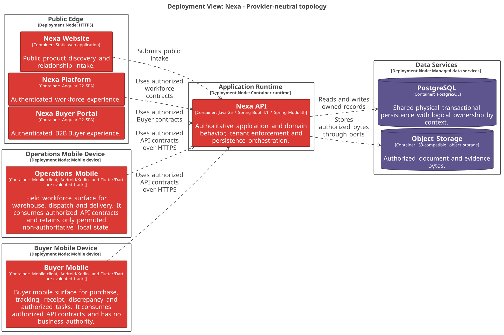

#### 2.5.3.3. Software Architecture Deployment Diagrams

La vista de despliegue representa nodos lógicos para clientes web, Nexa API y
servicios de datos. No representa Bounded Contexts, módulos internos ni una
base de datos por contexto.

##### Topología y límites

*Nodos lógicos y responsabilidad de cada límite de ejecución.*

| Nodo | Responsabilidad |
| :--- | :--- |
| Public Edge | Sirve Website, Platform y Buyer Portal mediante HTTPS. |
| Application Runtime | Ejecuta el Nexa API modular y conserva decisiones autorizadas. |
| Data Services | Conserva PostgreSQL y Object Storage como dependencias de datos. |
| External Services | Payment, email y mapas se integran mediante contratos explícitos. |

PostgreSQL compartido no implica una base de datos por Bounded Context o por
Tenant. Object Storage no implica URL pública para documentos o evidencia. Las
dependencias externas quedan detrás de adapters y no ingresan al Domain.

*Vista C4 Deployment: topología lógica de Nexa.*

*Nota. Elaboración propia.*
