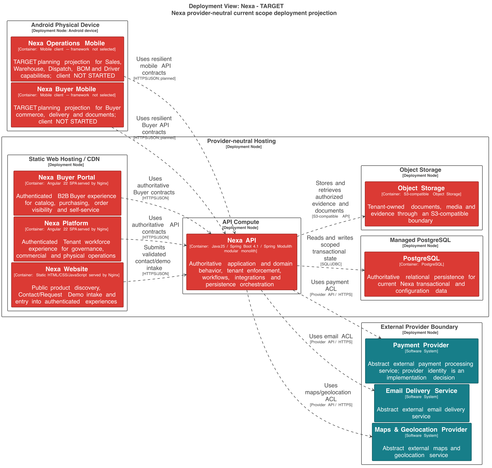

#### 2.5.3.3 Software Architecture Deployment Diagrams

El Deployment Diagram muestra nodos, límites y relaciones de runtime. No
representa Bounded Contexts, módulos internos ni una base de datos por contexto.

##### Purpose and evidence boundary

La vista sirve para explicar cómo un Nexa API modular, PostgreSQL, Object
Storage y clientes proyectados se relacionan en el diseño de runtime. La imagen
es una selección provider-neutral del diseño; no prueba deployment ejecutado,
build Mobile, secretos, backups, rollback, observabilidad ni preparación para
producción.

##### Lecturas de deployment

| Vista | Lectura permitida | Estado documentado |
| :--- | :--- | :--- |
| Local AS-IS | Fuente y configuración local identificables para Nexa API, PostgreSQL y Object Storage. | AS-IS acotado; la ejecución runtime no se afirma sin una instancia verificable. |
| TARGET | Operations Mobile y Buyer Mobile consumiendo Nexa API; servicios externos abstractos. | Diseño TARGET; no afirma runtime móvil. |
| Cloud/producción | Proveedor, red, secretos, backups, rollback, disponibilidad y observabilidad. | No afirmado por este informe. |

##### Topología y límites

- Nexa API conserva autorización, transacciones críticas, idempotencia y autoridad de negocio.
- El diseño y la configuración local asignan PostgreSQL compartido con ownership lógico por contexto; no se representa un database node por BC o por Tenant.
- El diseño asigna Object Storage para bytes de documentos y evidencias mediante referencias autorizadas; no se asume URL pública.
- Los clientes móviles son nodos clientes planificados, no nodos autoritativos ni backends separados.
- Payment Provider, Email Delivery Service y Maps & Geolocation Provider son dependencias abstractas hasta que exista selección y prueba reproducible.

##### Export seleccionado

**Interpretation.** El export muestra la relación entre clientes, Nexa API,
PostgreSQL, Object Storage y dependencias abstractas. La imagen es un export de
diseño y no demuestra un deployment ejecutado.
