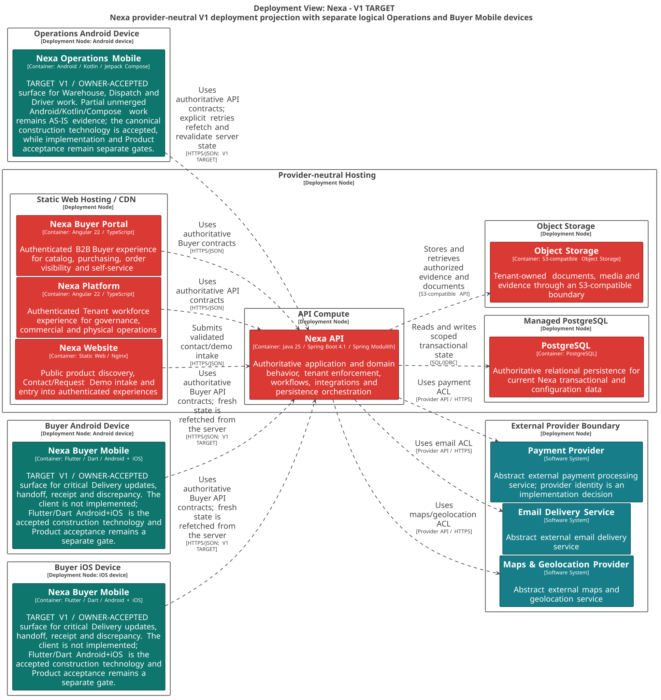

#### 2.5.3.3. Software Architecture Deployment Diagrams

La vista de despliegue representa nodos lógicos para clientes web, dispositivos
móviles, Nexa API y servicios de datos. No representa Bounded Contexts, módulos
internos ni una base de datos por contexto.

##### Topología y límites

*Nodos lógicos y responsabilidad de cada límite de ejecución.*

| Nodo | Responsabilidad |
| :--- | :--- |
| Public Edge | Sirve Website, Platform y Buyer Portal mediante HTTPS. |
| Operations Mobile Device | Ejecuta Operations Mobile instalado en dispositivo; usa HTTPS hacia Nexa API y conserva sólo estado local no autoritativo permitido. |
| Buyer Android Device | Ejecuta la misma instancia Container de Buyer Mobile en Android; usa HTTPS y revalida Buyer Relationship en servidor. |
| Buyer iOS Device | Ejecuta la misma instancia Container de Buyer Mobile en iOS; usa HTTPS y revalida Buyer Relationship en servidor. |
| Application Runtime | Ejecuta el Nexa API modular y conserva decisiones autorizadas. |
| Data Services | Conserva PostgreSQL y Object Storage como dependencias de datos. |
| External Services | Payment, email y mapas se integran mediante contratos explícitos. |

Los dispositivos Mobile quedan fuera de Public Edge: la aplicación se ejecuta
en cada dispositivo y consume HTTPS contra Nexa API. PostgreSQL compartido no
implica una base de datos por Bounded Context o por Tenant. Object Storage no
implica URL pública para documentos o evidencia. Las dependencias externas
quedan detrás de adapters y no ingresan al Domain.

*Vista C4 Deployment: topología lógica de Nexa.*

*Nota. Export canónico generado desde Blueprint Wave 3.*
