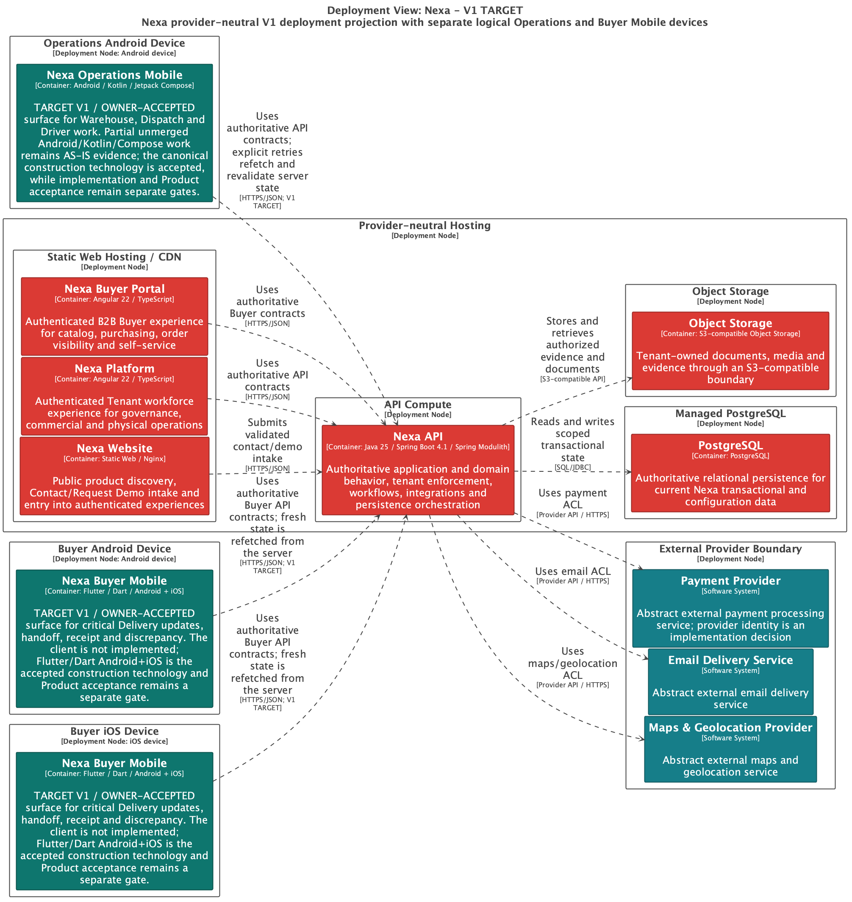

# 2.5.3.3 Software Architecture Deployment Diagrams

El Deployment Diagram muestra nodos, límites y relaciones de runtime. No
representa Bounded Contexts, módulos internos ni una base de datos por contexto.

## Purpose and evidence boundary

La vista sirve para explicar cómo un Nexa API modular, PostgreSQL compartido,
Object Storage y clientes proyectados colaboran en el runtime. La imagen es una
selección provider-neutral del diseño; no prueba deployment ejecutado, build
Mobile, secretos, backups, rollback, observabilidad ni production readiness.

## Lecturas de deployment

| Vista | Lectura permitida | Estado documentado |
| :--- | :--- | :--- |
| Local AS-IS | Nexa API, PostgreSQL, Object Storage y superficies existentes sólo con configuración y ejecución identificables. | AS-IS acotado; no se inventa una ejecución no registrada. |
| V1 TARGET | Operations Mobile y Buyer Mobile consumiendo Nexa API; servicios externos abstractos. | Diseño TARGET; no afirma runtime móvil. |
| Cloud/producción | Proveedor, red, secretos, backups, rollback, disponibilidad y observabilidad. | No afirmado por este informe. |

## Topología y límites

- Nexa API conserva autorización, transacciones críticas, idempotencia y autoridad de negocio.
- PostgreSQL es compartido físicamente y tiene ownership lógico por contexto; no se representa un database node por BC o por Tenant.
- Object Storage contiene bytes de documentos y evidencias mediante referencias autorizadas; no se asume URL pública.
- Los clientes móviles son nodos clientes planificados, no nodos autoritativos ni backends separados.
- Payment Provider, Email Delivery Service y Maps & Geolocation Provider son dependencias abstractas hasta que exista selección y prueba reproducible.

## Export seleccionado

**Interpretation.** El export muestra la relación entre clientes, Nexa API,
PostgreSQL, Object Storage y dependencias abstractas. La procedencia de SVG,
hash y fecha observada está en el [Chapter 2 provenance register](../../../assets/chapter-2/provenance.md).
