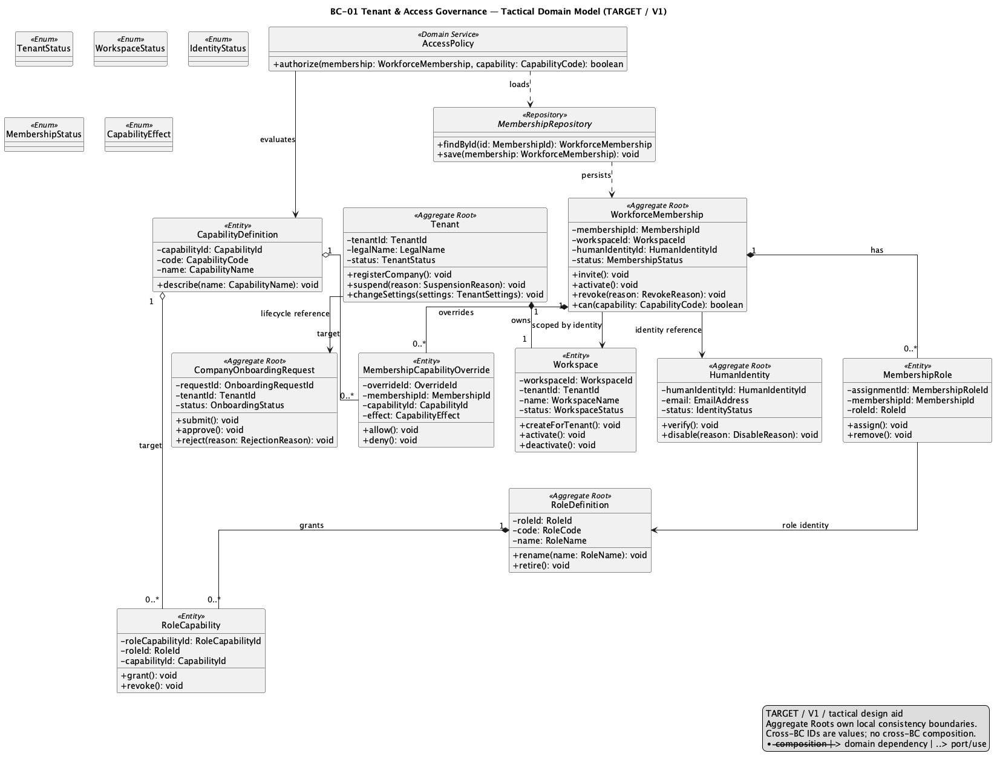
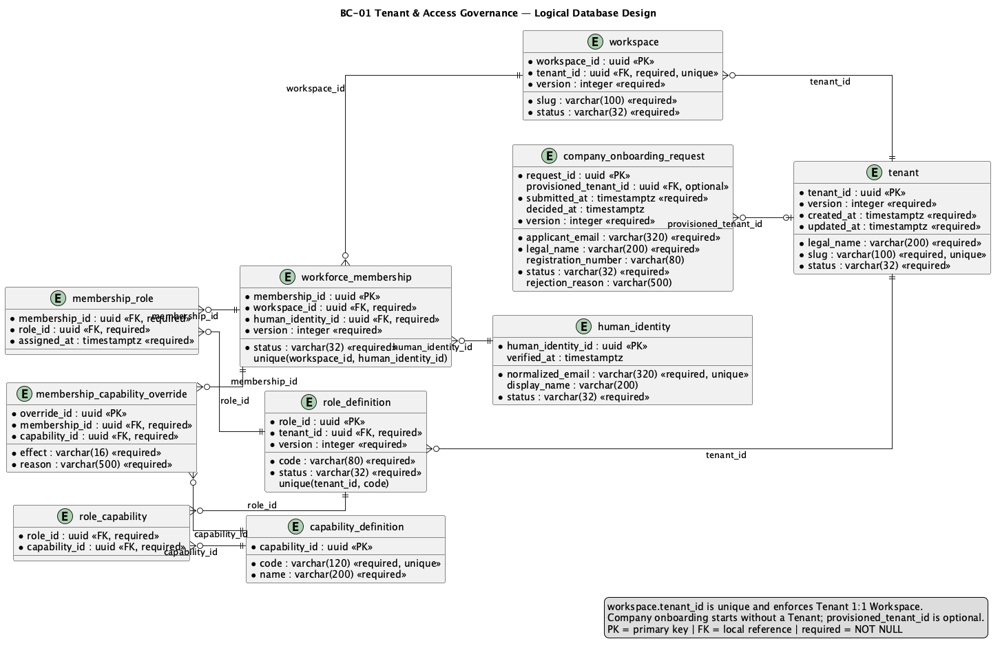

# 2.6.2. BC-01 — Tenant & Access Governance

`DOMAIN MODEL: TARGET / ACCEPTED`
`IMPLEMENTATION CROSSWALK: AS-IS VERIFIED / PARTIAL`

Canonical target: Blueprint `01-shared/domain/bounded-contexts/BC-01-tenant-access-governance/`.
The model owns tenant isolation, workspace identity, human identity linkage,
workforce membership, roles and capabilities. `Tenant` is not `Workspace`;
`HumanIdentity` is not `WorkforceMembership` or `BuyerRelationship`.

## 2.6.2.1 Domain Layer

| Aggregate/root | Boundary and invariant |
| :--- | :--- |
| `Tenant` | Lifecycle and isolation policy; one active Workspace and one active Company Owner in V1 |
| `HumanIdentity` | Global person identity; never duplicated per Tenant |
| `WorkforceMembership` | Tenant/workspace participation, status and capability context |
| `RoleDefinition` | Role lifecycle and capability assignment |
| `CompanyOnboardingRequest` | Intake and activation handoff; no access before Tenant lifecycle gate |

`Workspace` is a Tenant-owned entity with its own identity. Value objects are
`TenantId`, `WorkspaceId`, `MembershipId`, `CompanyInformation`, `AccessContext`
and `CapabilityCode`; `AccessEligibilityPolicy` is a domain service.
`TenantRepository` and `WorkforceMembershipRepository` persist roots. Target
invariants: missing scope fails closed, Tenant is the maximum isolation
boundary, V1 has one Workspace/active owner, and client-supplied tenant IDs do
not establish authorization.

## 2.6.2.2 Interface Layer

Target interface roles are onboarding, authentication/session, tenant access
and capability resolution. URI names are intentionally omitted until a
versioned contract is accepted. The API remains authoritative; Portal and
planned Mobile surfaces consume authorized projections. Security audit remains
distinct from BC-11 business traceability.

## 2.6.2.3 Application Layer

Target handlers coordinate onboarding submission, Tenant activation, access
evaluation, membership capability changes and ownership transfer. Each command
reconstructs Tenant/Workspace context server-side, applies authorization and
uses version/CAS or deterministic locking where an owner or membership race
matters. Local commit may publish a durable outbox fact; no new published event
is inferred here.

## 2.6.2.4 Infrastructure Layer

Target persistence is the shared PostgreSQL projection `tenant`, `workspace`,
`human_identity`, `company_onboarding_request`, `workforce_membership`,
`role_definition`, `capability_definition`, `membership_role` and
`membership_capability_override`, with tenant scope and constraints defined by
the canonical SQL. Repositories and authorization adapters are logical
ownership seams, not separate databases. Object Storage and Mobile are not
owned by this context.

AS-IS anchor: API `origin/main` contains `tenantaccessgovernance/iam` and
tenant-management documentation/classes. Classification: identity/session
and existing access paths `AS-IS VERIFIED`; full target onboarding,
single-owner orchestration and capability semantics `PARTIAL`; runtime parity
and complete target workflow `NOT EVIDENCED`.

## 2.6.2.5 Bounded Context Software Architecture Component Level Diagrams

The logical component family is `Nexa-API-IdentityTenantCustomer-TARGET`.
It groups API components for identity, tenant and customer concerns inside one
API container; it does not create an Identity container or a new BC.

The export is target design, traced to Structurizr in the [provenance
register](../../../../delivery-checklists/chapter-02-evidence-provenance.md). No component image proves
that an equivalent Java class or runtime deployment exists.

## 2.6.2.6 Bounded Context Software Architecture Code Level Diagrams

The code-level drawings below are target construction models, regenerated from
copied PlantUML sources. They are not source-code inventory.

### 2.6.2.6.1 Bounded Context Domain Layer Class Diagrams

Source: [domain-model.puml](../../../assets/chapter-2/tactical/BC-01/domain-model.puml).
Render integrity and source provenance are recorded in the Chapter 2 register.

### 2.6.2.6.2 Bounded Context Database Design Diagram

Source: [database-diagram.puml](../../../assets/chapter-2/tactical/BC-01/database-diagram.puml).
This is a logical ownership projection of shared PostgreSQL; it shows target
keys/constraints and tenant scope, not a physical BC database.

## Crosswalk and open evidence

| Concern | Classification | Evidence boundary |
| :--- | :--- | :--- |
| IAM/session and tenant access code | `AS-IS VERIFIED` | API `tenantaccessgovernance/iam` at `origin/main` |
| Target domain boundary and diagrams | `TARGET / ACCEPTED` | Blueprint tactical model, PlantUML and target SQL |
| Complete target onboarding/ownership implementation | `PARTIAL` | No claim beyond observed API classes |
| Mobile implementation, runtime and Product Acceptance | `NOT EVIDENCED` | Mobile remains a planned projection |
