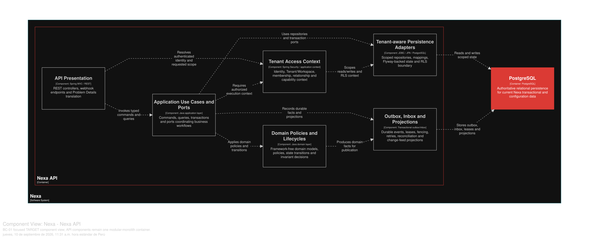

## 2.6. Tactical-Level Domain-Driven Design

Esta sección describe los once Bounded Contexts aceptados para Nexa. Operations
Mobile y Buyer Mobile son proyecciones de estos contextos compartidos; no crean
un contexto táctico propio ni modifican la autoridad del dominio.

*Bounded Contexts de Nexa*
| Código | Bounded Context |
| --- | --- |
| BC-01 | Tenant & Access Governance |
| BC-02 | Customer & Buyer Relationships |
| BC-03 | Catalog & Commercial Policy |
| BC-04 | Sales Commitment |
| BC-05 | Inventory Availability |
| BC-06 | Fulfillment & Delivery |
| BC-07 | Credit & Receivables |
| BC-08 | Payments |
| BC-09 | Business Documents |
| BC-10 | Notifications |
| BC-11 | Business Traceability |

Cada contexto presenta responsabilidades de Domain, Interface, Application e
Infrastructure, con diagramas de componentes, clases de dominio y persistencia.
Los diagramas son modelos académicos de diseño; la evidencia de ejecución exige
un artefacto y una verificación propios.

### 2.6.1. Bounded Context: Tenant & Access Governance

El modelo de BC-01 protege el aislamiento de Tenant, la identidad de Workspace,
el vínculo con Human Identity, la membresía de fuerza laboral, los roles y las
capacidades. `Tenant` no es `Workspace`; `HumanIdentity` no es
`WorkforceMembership` ni `BuyerRelationship`.

#### 2.6.1.1. Domain Layer

*Agregados y límites invariantes de BC-01.*
| Aggregate/root | Boundary and invariant |
| :--- | :--- |
| `Tenant` | Lifecycle and isolation policy; one active Workspace and one active Company Owner in initial scope |
| `HumanIdentity` | Global person identity; never duplicated per Tenant |
| `WorkforceMembership` | Tenant/workspace participation, status and capability context |
| `RoleDefinition` | Role lifecycle and capability assignment |
| `CompanyOnboardingRequest` | Intake and activation handoff; no access before Tenant lifecycle gate |

`Workspace` es una entidad propiedad de Tenant con identidad propia. Los value
objects son `TenantId`, `WorkspaceId`, `MembershipId`, `CompanyInformation`,
`AccessContext` y `CapabilityCode`; `AccessEligibilityPolicy` es un domain
service. `TenantRepository` y `WorkforceMembershipRepository` persisten roots.
Invariantes de diseño: si falta scope se falla cerrado, Tenant es el límite
máximo de aislamiento, el alcance actual tiene un Workspace/active owner y los
tenant IDs proporcionados por el cliente no establecen autorización.

#### 2.6.1.2. Interface Layer

La Interface Layer cubre onboarding, authentication/session, acceso Tenant y
resolución de capacidades. Los nombres de URI se omiten hasta contar con un
contrato versionado. La API permanece como autoridad; Portal y las superficies
Mobile planificadas consumen proyecciones autorizadas. Security Audit se
mantiene separado de BC-11 Business Traceability.

#### 2.6.1.3. Application Layer

La Application Layer coordina envío de onboarding, activación de Tenant,
evaluación de acceso, cambios de capacidades de membresía y transferencia de
propiedad. Cada Command reconstruye el contexto Tenant/Workspace en el
servidor, aplica autorización y usa version/CAS o bloqueo determinista cuando
importa una carrera de owner o membership. El commit local puede publicar un
hecho durable mediante outbox; aquí no se infiere un nuevo evento publicado.

#### 2.6.1.4. Infrastructure Layer

La Infrastructure Layer organiza la persistencia lógica en PostgreSQL compartido: `tenant`, `workspace`,
`human_identity`, `company_onboarding_request`, `workforce_membership`,
`role_definition`, `capability_definition`, `membership_role` and
`membership_capability_override`, con alcance Tenant y restricciones definidos
por el SQL canónico. Los Repository y adapters de autorización delimitan
propiedad lógica, no bases de datos separadas. Object Storage y Mobile no son
propiedad de este contexto.

#### 2.6.1.5. Bounded Context Software Architecture Component Level Diagrams

Las siguientes clases son especificaciones **TARGET** de construcción. Sus nombres
describen límites de responsabilidad; no afirman que todas existan en el código
actual ni definen nuevas rutas HTTP.

*Clases TARGET por capa de BC-01*

| Capa | Clase | Tipo | Responsabilidad y límite de consistencia |
| --- | --- | --- | --- |
| Interface | `OrganizationRegistrationController` | Controller | Recibe la solicitud pública de onboarding y la traduce a un comando; no concede acceso. |
| Interface | `TenantAccessController` | Controller | Expone una proyección de contexto y capacidades ya resuelta por el servidor; nunca acepta un Tenant como autoridad desde el cliente. |
| Interface | `AccessContextConsumer` | Consumer | Recibe una proyección autorizada para Platform, Portal o Mobile sin crear un contexto adicional. |
| Application | `SubmitCompanyOnboardingHandler` | Command handler | Persiste la solicitud y su idempotencia; el límite termina antes de activar Tenant o Membership. |
| Application | `ActivateTenantHandler` | Command handler | Activa Tenant, Workspace y la membresía inicial en una transacción local con outbox. |
| Application | `EvaluateAccessHandler` | Query/application service | Reconstruye Tenant, Workspace y Membership en el servidor y aplica la política de elegibilidad. |
| Application | `TransferCompanyOwnershipHandler` | Command handler | Usa CAS o bloqueo determinista para preservar un único Company Owner activo. |
| Infrastructure | `TenantRepositoryAdapter` | Repository implementation | Mapea `tenant` y `workspace` en PostgreSQL compartido con alcance Tenant. |
| Infrastructure | `WorkforceMembershipRepositoryAdapter` | Repository implementation | Persiste membresías, roles y capacidades sin convertirlas en un grafo de otros BC. |
| Infrastructure | `TransactionTenantScopePort` | Technical adapter | Establece y limpia el contexto Tenant/Workspace transaccional; ante ambigüedad falla cerrado. |
| Infrastructure | `AccessOutboxAdapter` | Outbox adapter | Conserva hechos comprometidos para entrega posterior al commit, bajo semántica al menos una vez. |

La vista C4 L3 **TARGET** muestra componentes conceptuales de este contexto dentro de Nexa API. No equivale a un Bounded Context adicional, una base de datos independiente ni una unidad de despliegue.

*Vista C4 L3 TARGET de BC-01 Tenant & Access Governance.*

*Nota.* Exportación vectorial desde una vista Structurizr DSL enfocada en BC-01 Tenant & Access Governance, dentro del único contenedor Nexa API. Es evidencia de diseño TARGET; no acredita implementación, runtime ni una unidad de despliegue independiente.

#### 2.6.1.6. Bounded Context Software Architecture Code Level Diagrams

Los diagramas de código presentan modelos de construcción del diseño. No son un
inventario de código fuente.

##### 2.6.1.6.1. Bounded Context Domain Layer Class Diagrams

*Modelo de dominio táctico de BC-01 Tenant & Access Governance.*

*Nota.* El diagrama se presenta como modelo de diseño, no como inventario de código.

##### 2.6.1.6.2. Bounded Context Database Design Diagram

*Proyección del diseño de base de datos de BC-01.*

*Nota.* Es una proyección de propiedad lógica en PostgreSQL compartido; muestra claves, restricciones y alcance Tenant, no una base de datos física por contexto.
